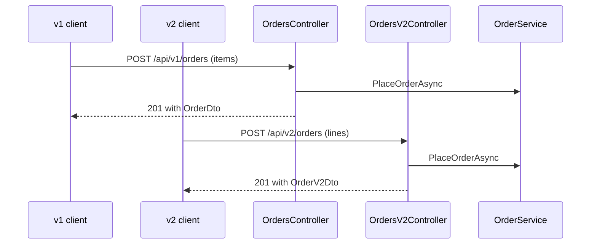

## Before you start

- [[backend.l2.breaking-changes]] — you can tell a breaking change from one that only adds; this lesson is about what to do when the break is the whole point.

## The situation

The team wants an order to come back with a total for each line and a total for the whole order. While they are at it, they want to rename `items` to `lines` and drop `customerId`, since the customer who places an order is the caller. The new shape is clearly better. But by the previous lesson, both edits break clients: the Flutter app's `createOrder` function, which places an order, sends its items under `items`, and some client somewhere may read `customerId`. Changing `/api/v1/orders` in place would break them the day it goes live. How do you publish the better shape without breaking the clients that already work?

## Core concepts

- **API versioning** — publishing a breaking change under a new version of the API, such as the URL prefix `/api/v2`, while the old version keeps answering exactly as before.
- The version prefix — the `v1` or `v2` segment at the start of the path; it names the version of the whole API the client is talking to.
- Retiring a version — removing an old version after telling its clients in advance on which date it will stop answering.

## How it works



In the situation above, the new shape does not replace `/api/v1/orders`. It is published beside it, under `/api/v2/orders`. A client that knows nothing about the change keeps sending `items` to `/api/v1/orders` and keeps getting the same `OrderDto` back. A client that wants line totals moves to `/api/v2/orders` when it is ready, and sends `lines`.

The diagram shows where the two versions part. Each version has its own controller and its own DTOs, because those are what decide the URL and the JSON shape. Both controllers then call the same `OrderService.PlaceOrderAsync`. Everything `PlaceOrderAsync` does to place an order, including saving the email that will be sent to the customer, is written once. A fix to those rules reaches both versions at the same time.

The `v2` in the path is a version of the whole API, not of one order or one resource. `/api/v2/orders/5` is order 5 read through version 2, not a second edition of order 5. A version does not have to repeat every endpoint, though. In Đơn Hàng, version 2 has exactly two endpoints so far, both for orders.

Keeping two versions has a cost. Each version is code the team runs, tests and fixes, so a team usually retires an old version once its clients have moved. It announces a date to the old version's clients, and removes the version only after that date.

## In the Đơn Hàng system

The v2 shapes sit at the end of the DTO file, below the v1 records they replace for v2 clients:

```csharp file=DonHang.Api/Dtos.cs tag=stage-2 lines=23-29
// lesson: backend.l2.api-versioning
// The /api/v2/orders shape. Breaking for a v1 client: `items` is now `lines`
// (each with its own total) and `customerId` is gone — the caller is the
// customer. v1's OrderDto above stays exactly as it was.
public sealed record OrderLineV2Dto(int ProductId, int Quantity, int UnitPriceVnd, int LineTotalVnd);

public sealed record OrderV2Dto(int Id, string Status, DateTimeOffset PlacedAt, List<OrderLineV2Dto> Lines, int TotalVnd);
```

`OrderV2Dto` has `Lines` and `TotalVnd` where `OrderDto` has `CustomerId` and `Items`. Nothing in `OrderDto` was edited, so a v1 client sees the same fields it always did.

The v2 controller is a separate class, whose `[Route("api/v2/orders")]` attribute puts its endpoints under `/api/v2/orders`:

```csharp file=DonHang.Api/Controllers/V2/OrdersV2Controller.cs tag=stage-2 lines=13-37
[ApiController]
[Route("api/v2/orders")]
public sealed class OrdersV2Controller(
    OrderService orderService,
    IOrderRepository repository,
    ICustomerRepository customers,
    IAuthorizationService authorization) : ControllerBase
{
    [Authorize]
    [HttpPost]
    public async Task<ActionResult<OrderV2Dto>> Create(
        CreateOrderV2Request request,
        [FromHeader(Name = "Idempotency-Key")] string? idempotencyKey)
    {
        var subject = User.FindFirstValue("sub");
        var customer = subject is null ? null : await customers.FindByIdentitySubjectAsync(subject);
        if (customer is null) return Forbid();

        var items = request.Lines
            .Select(l => new OrderItem { ProductId = l.ProductId, Quantity = l.Quantity, UnitPriceVnd = l.UnitPriceVnd })
            .ToList();

        var (order, created) = await orderService.PlaceOrderAsync(customer.Id, items, idempotencyKey);
        if (created) OrderMetrics.OrdersPlaced.Inc();
        return CreatedAtAction(nameof(Get), new { id = order.Id }, ToDto(order));
```

The constructor asks for the same four services as the v1 `OrdersController`. The lines that find the calling customer, read the `Idempotency-Key` header and count the order do what v1 does too, and belong to other lessons. What matters here is the middle: `Create` reads a `CreateOrderV2Request`, the v2 request DTO, and turns each line of `request.Lines` into an `OrderItem`, the item type from `DonHang.Domain` that `OrderService` takes, and calls `orderService.PlaceOrderAsync`, the same call v1's `Create` makes with `request.Items`. Apart from reading `Lines` instead of `Items`, the other difference is `ToDto`: it builds an `OrderV2Dto` and adds up the line totals. `CreatedAtAction` then answers `201` pointing at `Get`, the v2 read endpoint further down, just as v1 does.

This class has two endpoints: `POST /api/v2/orders` and `GET /api/v2/orders/{id}`. There is no `/api/v2/products`, and listing, cancelling or shipping orders exists only under `/api/v1`. A v2 client calls those there. The Flutter app still sends every API request to `/api/v1`.

## Beginners often think…

- **"Every change, even adding a field, needs a new version."** → Actually only a breaking change needs one. A change that only adds leaves every v1 client working, and every extra version is more code to run and test. You notice this when you copy a whole controller just to add one field that no client would have missed.
- **"Once v2 exists, v1 can be removed straight away."** → Actually removing v1 is itself a breaking change for every client still on it, and the Flutter app still sends every API request to `/api/v1`. v1 goes only after a date its clients were told about. You notice this when the app's product and order pages all fail to load the day `/api/v1` disappears.

## Try it (3 minutes)

1. From the Đơn Hàng project's root folder, start the example system with `scripts/up.sh`.
2. For each of these three paths, run `curl -s -o /dev/null -w '%{http_code}\n' http://localhost:8080` followed by the path: `/api/v2/orders/1`, `/api/v2/products`, `/api/v1/products`. `curl` sends an HTTP request from the terminal; `localhost:8080` is port 8080 on your own machine, where `scripts/up.sh` makes Đơn Hàng answer. `-s` hides progress output, `-o /dev/null` throws the body away and `-w '%{http_code}\n'` prints only the status code.
3. Read each status code as "this endpoint exists or not".

Expected result: `401` for `/api/v2/orders/1`, `404` for `/api/v2/products` and `200` for `/api/v1/products`. The `401` means the v2 order endpoint exists but wants a signed-in caller; the `404` means version 2 has no product endpoint at all, so products are still read through `/api/v1`.

## Connections

- [[backend.l2.breaking-changes]] — the test that decides whether a change needs a new version at all.
- [[backend.l2.openapi-contract]] — how a client finds out which endpoints each version has, from a document generated from the code.
- [[design.l1.the-service-layer]] — the layer both versions share, which is why the business rules exist only once.

## Five-line summary

1. When a breaking change cannot be avoided, publish it under a new version such as `/api/v2` and leave `/api/v1` unchanged.
2. The version in the URL names a version of the whole API, not of one resource or one record.
3. In Đơn Hàng both versions call the same `OrderService`; only the controller and the DTOs differ.
4. Version 2 has only two endpoints, `POST /api/v2/orders` and `GET /api/v2/orders/{id}`; everything else stays under `/api/v1`.
5. Every kept version costs running and testing, so an old one is retired on a date announced to its clients.
