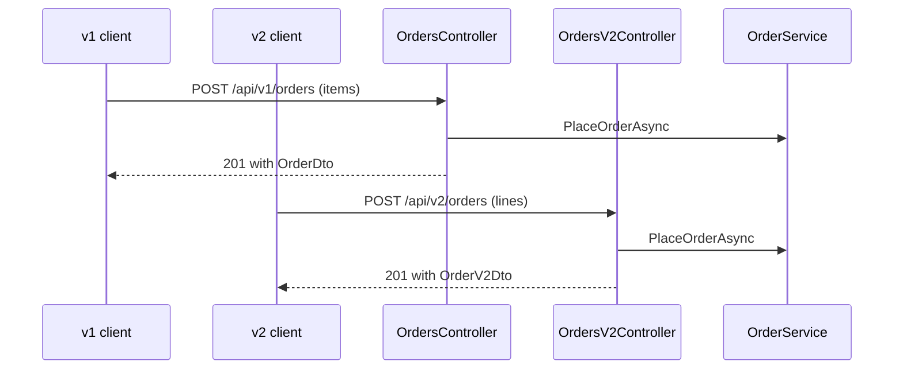

## Bạn cần biết trước

- [[backend.l2.breaking-changes]] — bạn phân biệt được breaking change với thay đổi chỉ thêm vào; bài này nói về việc phải làm gì khi chính sự phá vỡ là điều bạn cần.

## Tình huống

Team muốn mỗi đơn hàng trả về kèm tổng tiền của từng dòng và tổng tiền cả đơn. Nhân tiện, team muốn đổi tên `items` thành `lines` và bỏ `customerId`, vì khách đặt đơn chính là người gọi. Hình dạng mới rõ ràng tốt hơn. Nhưng theo bài trước, cả hai thay đổi đều làm hỏng client: hàm `createOrder` của app Flutter, hàm dùng để đặt đơn, gửi các món hàng dưới key `items`, và ở đâu đó có thể có client đang đọc `customerId`. Sửa thẳng `/api/v1/orders` sẽ làm hỏng họ ngay ngày thay đổi chạy thật. Làm sao phát hành hình dạng tốt hơn mà không làm hỏng các client đang chạy tốt?

## Khái niệm cốt lõi

- **API versioning** (phát hành thay đổi phá vỡ dưới một version mới của API trong khi version cũ vẫn chạy) — đưa một breaking change ra dưới một version mới của API, ví dụ tiền tố URL `/api/v2`, trong khi version cũ vẫn trả lời y hệt như trước.
- Tiền tố version — đoạn `v1` hay `v2` ở đầu đường dẫn. Nó gọi tên version của cả API mà client đang nói chuyện.
- Cho một version nghỉ hưu — gỡ bỏ version cũ sau khi đã báo trước cho các client của nó ngày nó ngừng trả lời.

## Cơ chế hoạt động



Trong tình huống trên, hình dạng mới không thay thế `/api/v1/orders`. Nó được phát hành bên cạnh, dưới `/api/v2/orders`. Client không biết gì về thay đổi vẫn gửi `items` tới `/api/v1/orders` và vẫn nhận lại đúng `OrderDto` như cũ. Client nào muốn có tổng từng dòng thì chuyển sang `/api/v2/orders` khi sẵn sàng, và gửi `lines`.

Sơ đồ cho thấy hai version tách nhau ở đâu. Mỗi version có controller riêng và DTO riêng, vì chính chúng quyết định URL và hình dạng JSON. Sau đó cả hai controller đều gọi cùng `OrderService.PlaceOrderAsync`. Mọi thứ `PlaceOrderAsync` làm để đặt một đơn, kể cả lưu email sẽ gửi cho khách, chỉ được viết một lần. Sửa các quy tắc đó thì cả hai version cùng được sửa một lúc.

`v2` trong đường dẫn là version của cả API, không phải của một đơn hàng hay một resource. `/api/v2/orders/5` là đơn 5 được đọc qua version 2, không phải bản thứ hai của đơn 5. Tuy vậy, một version không bắt buộc phải lặp lại mọi endpoint. Trong Đơn Hàng, version 2 tới giờ có đúng hai endpoint, cả hai đều cho đơn hàng.

Giữ hai version có cái giá của nó. Mỗi version là code team phải chạy, test và sửa, nên thường thì team cho version cũ nghỉ hưu khi các client của nó đã chuyển đi. Team báo một ngày cho các client của version cũ, và chỉ gỡ version đó sau ngày ấy.

## Trong hệ thống Đơn Hàng

Các hình dạng v2 nằm cuối file DTO, bên dưới những record v1 mà chúng thay thế cho client v2:

```csharp file=DonHang.Api/Dtos.cs tag=stage-2 lines=23-29
// lesson: backend.l2.api-versioning
// The /api/v2/orders shape. Breaking for a v1 client: `items` is now `lines`
// (each with its own total) and `customerId` is gone — the caller is the
// customer. v1's OrderDto above stays exactly as it was.
public sealed record OrderLineV2Dto(int ProductId, int Quantity, int UnitPriceVnd, int LineTotalVnd);

public sealed record OrderV2Dto(int Id, string Status, DateTimeOffset PlacedAt, List<OrderLineV2Dto> Lines, int TotalVnd);
```

`OrderV2Dto` có `Lines` và `TotalVnd` ở chỗ `OrderDto` có `CustomerId` và `Items`. Không có gì trong `OrderDto` bị sửa, nên client v1 vẫn thấy đúng những field nó luôn thấy.

Controller v2 là một class riêng, có attribute `[Route("api/v2/orders")]` đặt các endpoint của nó dưới `/api/v2/orders`:

```csharp file=DonHang.Api/Controllers/V2/OrdersV2Controller.cs tag=stage-2 lines=13-37
[ApiController]
[Route("api/v2/orders")]
public sealed class OrdersV2Controller(
    OrderService orderService,
    IOrderRepository repository,
    ICustomerRepository customers,
    IAuthorizationService authorization) : ControllerBase
{
    [Authorize]
    [HttpPost]
    public async Task<ActionResult<OrderV2Dto>> Create(
        CreateOrderV2Request request,
        [FromHeader(Name = "Idempotency-Key")] string? idempotencyKey)
    {
        var subject = User.FindFirstValue("sub");
        var customer = subject is null ? null : await customers.FindByIdentitySubjectAsync(subject);
        if (customer is null) return Forbid();

        var items = request.Lines
            .Select(l => new OrderItem { ProductId = l.ProductId, Quantity = l.Quantity, UnitPriceVnd = l.UnitPriceVnd })
            .ToList();

        var (order, created) = await orderService.PlaceOrderAsync(customer.Id, items, idempotencyKey);
        if (created) OrderMetrics.OrdersPlaced.Inc();
        return CreatedAtAction(nameof(Get), new { id = order.Id }, ToDto(order));
```

Constructor đòi đúng bốn service giống `OrdersController` của v1. Các dòng tìm khách đang gọi, đọc header `Idempotency-Key` và đếm đơn cũng làm y như v1, và thuộc về các bài khác. Điều cần xem là phần giữa: `Create` đọc một `CreateOrderV2Request`, DTO request của v2, biến mỗi dòng trong `request.Lines` thành một `OrderItem`, kiểu món hàng của `DonHang.Domain` mà `OrderService` nhận, rồi gọi `orderService.PlaceOrderAsync`, đúng lời gọi mà `Create` của v1 thực hiện với `request.Items`. Ngoài chuyện đọc `Lines` thay vì `Items`, khác biệt còn lại là `ToDto`: nó dựng một `OrderV2Dto` và cộng tổng các dòng. Sau đó `CreatedAtAction` trả `201` trỏ tới `Get`, endpoint đọc của v2 nằm phía dưới, giống hệt v1.

Class này có hai endpoint: `POST /api/v2/orders` và `GET /api/v2/orders/{id}`. Không có `/api/v2/products`, còn liệt kê, hủy hay giao đơn chỉ có dưới `/api/v1`. Client v2 gọi những endpoint đó ở `/api/v1`. App Flutter vẫn gửi mọi request API tới `/api/v1`.

## Người mới hay nghĩ rằng…

- **"Thay đổi nào cũng cần version mới, kể cả thêm một field."** → Thực ra chỉ breaking change mới cần. Thay đổi chỉ thêm vào vẫn giữ mọi client v1 chạy bình thường, còn mỗi version thêm là thêm code phải chạy và test. Bạn sẽ nhận ra khi thấy mình chép nguyên một controller chỉ để thêm một field mà không client nào thiếu nó cả.
- **"Có v2 rồi thì gỡ v1 được ngay."** → Thực ra gỡ v1 tự nó là một breaking change với mọi client còn dùng nó, và app Flutter vẫn gửi mọi request API tới `/api/v1`. v1 chỉ đi sau một ngày đã báo cho các client của nó. Bạn sẽ nhận ra khi các trang sản phẩm và đơn hàng của app đồng loạt không tải được vào đúng ngày `/api/v1` biến mất.

## Thử ngay (3 phút)

1. Từ thư mục gốc của dự án Đơn Hàng, khởi động hệ thống ví dụ bằng `scripts/up.sh`.
2. Với mỗi đường dẫn trong ba đường dẫn sau, chạy `curl -s -o /dev/null -w '%{http_code}\n' http://localhost:8080` rồi nối đường dẫn vào: `/api/v2/orders/1`, `/api/v2/products`, `/api/v1/products`. `curl` gửi một HTTP request từ terminal, còn `localhost:8080` là cổng 8080 trên chính máy bạn, nơi `scripts/up.sh` cho Đơn Hàng trả lời. `-s` ẩn phần hiển thị tiến trình, `-o /dev/null` bỏ body đi và `-w '%{http_code}\n'` chỉ in status code.
3. Đọc mỗi status code như câu trả lời "endpoint này có tồn tại hay không".

Kết quả mong đợi: `401` cho `/api/v2/orders/1`, `404` cho `/api/v2/products` và `200` cho `/api/v1/products`. `401` nghĩa là endpoint đơn hàng của v2 có tồn tại nhưng đòi người gọi đã đăng nhập. `404` nghĩa là version 2 hoàn toàn không có endpoint sản phẩm, nên sản phẩm vẫn được đọc qua `/api/v1`.

## Liên hệ

- [[backend.l2.breaking-changes]] — phép kiểm tra quyết định một thay đổi có cần version mới hay không.
- [[backend.l2.openapi-contract]] — cách client biết mỗi version có những endpoint nào, từ một tài liệu sinh ra từ code.
- [[design.l1.the-service-layer]] — layer mà cả hai version dùng chung, lý do các quy tắc nghiệp vụ chỉ tồn tại một lần.

## Tóm tắt 5 dòng

1. Khi không tránh được breaking change, phát hành nó dưới một version mới như `/api/v2` và giữ nguyên `/api/v1`.
2. Version trong URL gọi tên một version của cả API, không phải của một resource hay một bản ghi.
3. Trong Đơn Hàng cả hai version gọi cùng `OrderService`; chỉ controller và DTO là khác.
4. Version 2 chỉ có hai endpoint, `POST /api/v2/orders` và `GET /api/v2/orders/{id}`; mọi thứ khác vẫn ở `/api/v1`.
5. Mỗi version giữ lại đều tốn công chạy và test, nên version cũ nghỉ hưu vào một ngày đã báo trước cho client.
