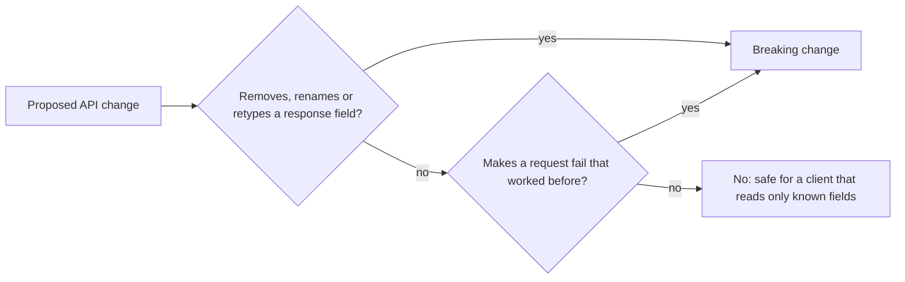

## Before you start

- [[backend.l1.dtos-and-serialization]] — you know `ProductDto` decides the JSON field names a client sees, and that `PriceVnd` goes out as `priceVnd`.
- [[frontend.l1.fetching-with-http-package]] — you know `Product.fromJson` in `DonHang.App` reads a product's JSON by key name, and throws when a key is missing.

## The situation

A teammate opens a pull request that renames `PriceVnd` in `ProductDto` to `Price`, because "the currency is obvious from the value". The number does not change: product 1 still costs `1250000`. The API builds, and `GET /api/v1/products` still answers `200` with every product in it. The code review looks easy — nothing is deleted, nothing is recalculated. Yet the Flutter app in `DonHang.App`, which nobody touched, would stop showing products the moment this change goes live. Which changes to an API break a client that already works, and which ones are safe?

## Core concepts

- What a client can see — the URLs, the name and type of each response field, and which request fields must be sent; a client can build on any of these.
- **breaking change** — a change to the API after which a request or response that an existing client relies on no longer works as before, such as a renamed response field.
- A change that only adds — for example an extra field in a response; it removes or changes nothing a client already reads.
- A client that reads only what it knows — a client that looks up the fields it needs by name and never touches any other field in the response.

## How it works



Start from what the client depends on, not from what the server changed. In the situation above, the app depends on three names and three types: `id` as a number, `name` as text and `priceVnd` as a number. Renaming `PriceVnd` to `Price` changes the JSON name to `price`, so the app no longer finds `priceVnd`. The value is still there, under a name the app never looks for. That is a breaking change, even though no number moved.

The diagram asks two questions. The first is about responses: removing a field, renaming it, or changing its type all take away something a client may read. Changing `priceVnd` from the number `1250000` to the text `"1250000"` breaks the app just as a rename does, because it expects a number.

The second question is about requests: a request that used to succeed must still succeed. Making an optional request field required fails that test, because every client that never sent the field is now rejected.

If both answers are no, as when a change only adds a field, nothing a client reads by name and type has gone. Adding a field to a response leaves every existing name and type in place, so a client that reads only the fields it knows keeps working and simply never reads the new one.

The limit of this check is that the server only sees requests, never the code that reads its responses. It cannot tell which fields a client uses, so a change counts as breaking if any existing client could rely on what it removes or changes.

## In the Đơn Hàng system

On the API side, the DTO file decides what a client sees. These are the shapes the product and order endpoints answer in at this tag:

```csharp file=DonHang.Api/Dtos.cs tag=stage-1 lines=5-9
public sealed record ProductDto(int Id, string Name, int PriceVnd);

public sealed record OrderItemDto(int ProductId, int Quantity, int UnitPriceVnd);

public sealed record OrderDto(int Id, int CustomerId, string Status, DateTimeOffset PlacedAt, List<OrderItemDto> Items);
```

Each property name here becomes a JSON field name in camelCase, so these names are part of what a client sees. Renaming a property changes what a client sees, even when it looks like a tidy-up inside C#.

On the client side, the app reads those names back:

```dart file=DonHang.App/lib/models.dart tag=stage-1 lines=3-15
class Product {
  final int id;
  final String name;
  final int priceVnd;

  Product({required this.id, required this.name, required this.priceVnd});

  factory Product.fromJson(Map<String, dynamic> json) => Product(
        id: json['id'] as int,
        name: json['name'] as String,
        priceVnd: json['priceVnd'] as int,
      );
}
```

`Product.fromJson` looks up each value by its key. After the rename, `json['priceVnd']` finds no such key and gives `null`, and `null as int` throws. `ApiClient.fetchProducts` builds the list with this method, so one failing product makes the whole call fail.

The same file also shows why an added field is harmless here. `POST /api/v1/orders` answers with an `OrderDto`, five fields, but `OrderResult.fromJson` further down `models.dart` reads `json['id'] as int` and `json['status'] as String` and nothing else. The app already ignores `customerId`, `placedAt` and `items`, so one more field would be ignored the same way.

## Beginners often think…

- **"Renaming a field is safe as long as its value stays the same."** → Actually a client finds a value by its name, so a new name means the old one is simply missing. `Product.fromJson` reads `json['priceVnd']`, gets `null` after a rename, and throws. You notice this when the app shows an error for data that looks perfectly fine when you request it yourself from a terminal.
- **"Adding a field to a response breaks every client."** → Actually a client that reads only the fields it knows never looks at the new one. `OrderResult.fromJson` already skips three of the five fields in an `OrderDto`. You notice this when you add a field, run the app, and nothing changes on screen.

## Try it (3 minutes)

1. From the Đơn Hàng project's root folder, start the example system with `scripts/up.sh`, then run `curl -s http://localhost:8080/api/v1/products/1` (`curl` sends a GET request to that URL and prints the response body; `-s` hides its progress output). Note each field name and whether its value is a number or text.
2. Compare the result with `Product.fromJson` above, then decide for each proposed change to `ProductDto` whether the app breaks: (a) add a property `Stock`; (b) rename `PriceVnd` to `Price`; (c) make `PriceVnd` a `string` holding the same digits.

Expected result: `{"id":1,"name":"Bàn phím cơ","priceVnd":1250000}` — three fields, `id` and `priceVnd` as numbers without quotes and `name` as text, exactly the keys and types `fromJson` reads.

<details><summary>Suggested answer</summary>

(a) only adds: the response gains a `stock` field that `fromJson` never reads, so this app keeps working. (b) breaks it: the JSON field becomes `price`, `json['priceVnd']` is `null`, and the cast throws. (c) breaks it too: the value arrives as text, and a text value cannot be cast to `int`. Even (a) is only known to be safe for this client — the server cannot see how other clients read the response.

</details>

## Connections

- [[backend.l1.dtos-and-serialization]] — the DTO whose property names this lesson treats as a promise to clients.
- [[frontend.l1.fetching-with-http-package]] — the client-side reader that fails when a promised name disappears.
- [[backend.l2.api-versioning]] — what to do when a breaking change cannot be avoided: publish it under a new version.
- [[backend.l2.openapi-contract]] — what a client can see, written down as a document generated from the code.

## Five-line summary

1. A change breaks a client when a request that worked now fails, or a response loses or changes something the client reads.
2. Removing, renaming or retyping a response field is breaking, even when the value itself stays the same.
3. `Product.fromJson` reads `priceVnd` by name, so renaming it makes the app fail although the price never changed.
4. Adding a response field only adds: a client that reads only known fields, like `OrderResult.fromJson`, ignores it.
5. The server cannot see which fields each client reads, so anything an existing client could rely on counts.
