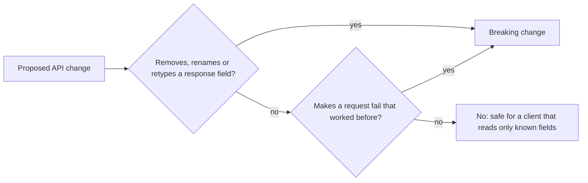

## Bạn cần biết trước

- [[backend.l1.dtos-and-serialization]] — bạn đã biết `ProductDto` quyết định tên các field JSON mà client thấy, và `PriceVnd` đi ra ngoài thành `priceVnd`.
- [[frontend.l1.fetching-with-http-package]] — bạn đã biết `Product.fromJson` trong `DonHang.App` đọc JSON của sản phẩm theo tên key, và ném lỗi khi thiếu key.

## Tình huống

Một đồng nghiệp mở pull request đổi tên `PriceVnd` trong `ProductDto` thành `Price`, với lý do "nhìn giá trị là biết đơn vị tiền rồi". Con số không đổi: sản phẩm 1 vẫn có giá `1250000`. API build được, và `GET /api/v1/products` vẫn trả `200` với đủ mọi sản phẩm. Code review trông rất nhẹ nhàng: không xóa gì, không tính lại gì. Vậy mà app Flutter trong `DonHang.App`, thứ không ai đụng tới, sẽ thôi hiện sản phẩm ngay khi thay đổi này chạy thật. Thay đổi nào ở API làm hỏng một client đang chạy tốt, và thay đổi nào thì an toàn?

## Khái niệm cốt lõi

- Những gì client thấy được — các URL, tên và kiểu của từng field trong response, và những field nào của request bắt buộc phải gửi. Client có thể dựa vào bất kỳ thứ nào trong số này.
- **breaking change** (thay đổi API khiến một request hay response mà client đang dựa vào không còn chạy như trước) — một thay đổi ở API mà sau đó một request hay response client đang dựa vào không còn chạy như trước, chẳng hạn một field của response bị đổi tên.
- Thay đổi chỉ thêm vào — ví dụ thêm một field vào response. Nó không bỏ, cũng không đổi thứ gì client đang đọc.
- Client chỉ đọc những gì nó biết — client tra các field nó cần theo tên và không hề động tới field nào khác trong response.

## Cơ chế hoạt động



Hãy bắt đầu từ thứ client phụ thuộc vào, không phải từ thứ server vừa đổi. Trong tình huống trên, app phụ thuộc vào ba cái tên và ba kiểu: `id` là số, `name` là chuỗi và `priceVnd` là số. Đổi `PriceVnd` thành `Price` làm tên trong JSON thành `price`, nên app không còn tìm thấy `priceVnd`. Giá trị vẫn nằm đó, chỉ là dưới một cái tên app không bao giờ tìm tới. Đó là breaking change, dù không con số nào xê dịch.

Sơ đồ đặt ra hai câu hỏi. Câu đầu về response: bỏ một field, đổi tên nó, hay đổi kiểu của nó đều lấy đi thứ client có thể đang đọc. Đổi `priceVnd` từ số `1250000` sang chuỗi `"1250000"` cũng làm hỏng app y như đổi tên, vì app chờ một con số.

Câu thứ hai về request: request trước đây thành công thì bây giờ vẫn phải thành công. Biến một field không bắt buộc của request thành bắt buộc là trượt phép thử này, vì mọi client chưa từng gửi field đó giờ đều bị từ chối.

Nếu cả hai câu đều trả lời không, như khi thay đổi chỉ thêm một field, thì không có gì mà client đọc theo tên và kiểu bị mất đi. Thêm một field vào response giữ nguyên mọi tên và kiểu đang có, nên client chỉ đọc những field nó biết vẫn chạy bình thường và đơn giản là không bao giờ đọc field mới.

Giới hạn của phép kiểm tra này là server chỉ thấy request, không bao giờ thấy đoạn code đọc response của nó. Server không biết client dùng những field nào, nên một thay đổi bị tính là breaking nếu bất kỳ client đang có nào có thể dựa vào thứ nó bỏ đi hay thay đổi.

## Trong hệ thống Đơn Hàng

Ở phía API, file DTO quyết định client thấy gì. Đây là các hình dạng mà endpoint sản phẩm và đơn hàng dùng để trả lời ở tag này:

```csharp file=DonHang.Api/Dtos.cs tag=stage-1 lines=5-9
public sealed record ProductDto(int Id, string Name, int PriceVnd);

public sealed record OrderItemDto(int ProductId, int Quantity, int UnitPriceVnd);

public sealed record OrderDto(int Id, int CustomerId, string Status, DateTimeOffset PlacedAt, List<OrderItemDto> Items);
```

Mỗi tên property ở đây trở thành một tên field JSON theo camelCase, nên những cái tên này là một phần của thứ client thấy. Đổi tên một property là thay đổi thứ client thấy, kể cả khi bên trong C# nó trông chỉ như dọn dẹp cho gọn.

Ở phía client, app đọc lại chính những cái tên đó:

```dart file=DonHang.App/lib/models.dart tag=stage-1 lines=3-15
class Product {
  final int id;
  final String name;
  final int priceVnd;

  Product({required this.id, required this.name, required this.priceVnd});

  factory Product.fromJson(Map<String, dynamic> json) => Product(
        id: json['id'] as int,
        name: json['name'] as String,
        priceVnd: json['priceVnd'] as int,
      );
}
```

`Product.fromJson` tra từng giá trị theo key của nó. Sau khi đổi tên, `json['priceVnd']` không tìm thấy key đó và trả về `null`, rồi `null as int` ném lỗi. `ApiClient.fetchProducts` dựng danh sách bằng method này, nên chỉ một sản phẩm lỗi là cả lời gọi thất bại.

Cũng file này cho thấy vì sao thêm field thì vô hại ở đây. `POST /api/v1/orders` trả về một `OrderDto` có năm field, nhưng `OrderResult.fromJson` ở phía dưới `models.dart` chỉ đọc `json['id'] as int` và `json['status'] as String`, ngoài ra không gì khác. App vốn đã bỏ qua `customerId`, `placedAt` và `items`, nên thêm một field nữa cũng sẽ bị bỏ qua y như vậy.

## Người mới hay nghĩ rằng…

- **"Đổi tên field thì an toàn, miễn giá trị giữ nguyên."** → Thực ra client tìm giá trị theo tên, nên tên mới đồng nghĩa với tên cũ biến mất. `Product.fromJson` đọc `json['priceVnd']`, nhận `null` sau khi đổi tên, và ném lỗi. Bạn sẽ nhận ra khi app báo lỗi với dữ liệu mà bạn tự gọi từ terminal thì thấy hoàn toàn bình thường.
- **"Thêm field vào response là làm hỏng mọi client."** → Thực ra client chỉ đọc những field nó biết sẽ không bao giờ nhìn tới field mới. `OrderResult.fromJson` vốn đã bỏ qua ba trong năm field của một `OrderDto`. Bạn sẽ nhận ra khi thêm một field, chạy app, và không có gì trên màn hình thay đổi.

## Thử ngay (3 phút)

1. Từ thư mục gốc của dự án Đơn Hàng, khởi động hệ thống ví dụ bằng `scripts/up.sh`, rồi chạy `curl -s http://localhost:8080/api/v1/products/1` (`curl` gửi một request GET tới URL đó và in body của response ra, `-s` ẩn phần hiển thị tiến trình). Ghi lại tên từng field và giá trị của nó là số hay chuỗi.
2. So kết quả với `Product.fromJson` ở trên, rồi quyết định với từng thay đổi đề xuất cho `ProductDto` xem app có hỏng không: (a) thêm property `Stock`, (b) đổi tên `PriceVnd` thành `Price`, (c) đổi `PriceVnd` sang `string` chứa đúng các chữ số cũ.

Kết quả mong đợi: `{"id":1,"name":"Bàn phím cơ","priceVnd":1250000}` — ba field, `id` và `priceVnd` là số không có dấu ngoặc kép, còn `name` là chuỗi, đúng những key và kiểu mà `fromJson` đọc.

<details><summary>Gợi ý đáp án</summary>

(a) chỉ thêm vào: response có thêm field `stock` mà `fromJson` không bao giờ đọc, nên app này vẫn chạy. (b) làm hỏng app: field JSON thành `price`, `json['priceVnd']` là `null`, và phép ép kiểu ném lỗi. (c) cũng làm hỏng app: giá trị tới dưới dạng chuỗi, mà chuỗi thì không ép sang `int` được. Ngay cả (a) cũng chỉ chắc là an toàn với client này — server không thấy được các client khác đọc response ra sao.

</details>

## Liên hệ

- [[backend.l1.dtos-and-serialization]] — DTO mà bài này coi tên các property của nó là một lời hứa với client.
- [[frontend.l1.fetching-with-http-package]] — phía client đọc dữ liệu, và hỏng khi một cái tên đã hứa biến mất.
- [[backend.l2.api-versioning]] — phải làm gì khi không tránh được breaking change: phát hành nó dưới một version mới.
- [[backend.l2.openapi-contract]] — những gì client thấy được, viết thành một tài liệu sinh ra từ chính code.

## Tóm tắt 5 dòng

1. Một thay đổi làm hỏng client khi request từng chạy nay thất bại, hoặc response mất hay đổi thứ client đang đọc.
2. Bỏ, đổi tên hay đổi kiểu một field của response là breaking, kể cả khi bản thân giá trị giữ nguyên.
3. `Product.fromJson` đọc `priceVnd` theo tên, nên đổi tên nó làm app hỏng dù giá không hề đổi.
4. Thêm field vào response chỉ là thêm vào: client chỉ đọc field nó biết, như `OrderResult.fromJson`, sẽ bỏ qua nó.
5. Server không thấy mỗi client đọc field nào, nên mọi thứ một client đang có có thể dựa vào đều tính.
