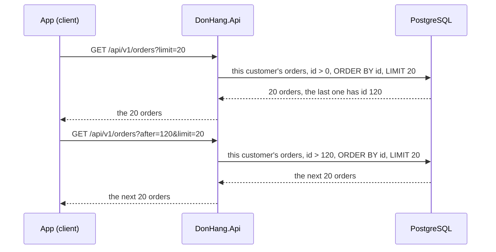

## Before you start

- [[backend.l2.offset-pagination]] — you know `limit` and `offset` cut one page from rows sorted by `id`, and that a row added or removed between two requests shifts the rows after it.
- [[foundation.l1.sql-index-intro]] — you know an index lets PostgreSQL find rows without reading every row, and that a primary key gets an index by itself.

## The situation

You browse the cheap products two at a time. `GET /api/v1/products?maxPriceVnd=500000&limit=2&offset=0` returns products 2 and 5; `maxPriceVnd` keeps only products that cost at most that price, and the filtering lesson shows how. While you look at them, a staff member raises the price of product 2 to 950,000. You ask for the next page with `offset=2` and get an empty array. Yet product 8, at 280,000, still costs less than 500,000, and you never saw it. Every request answered `200`, so why did the second page lose a product, and how could the request say "give me what comes after the last one I saw" instead?

## Core concepts

- position counting — an `offset` is a count of rows from the start of the list, and the server counts again from the start on every request, over the rows as they are at that moment.
- **cursor pagination** — pagination that asks for the rows after the last one the client saw, such as `?after=120&limit=20`, instead of skipping a count of rows.
- the cursor value — the sort-column value of the last row the client received, here an order `id`, sent back as `after` to get the next page.
- next page only — a cursor says where to continue, not which page number you are on, so the client can move forward but cannot jump straight to page 50.

## How it works



In the situation above, page 1 counted two rows from the start: products 2 and 5. Then product 2 left the list, because it no longer costs less than 500,000. The list is now 5, 8. `offset=2` skips both, so page 2 is empty and product 8 is never shown. An insert before your position does the opposite and shows a row twice.

Cursor pagination does not count. The client remembers the `id` of the last row it received and sends it as `after`. The API asks PostgreSQL for this customer's orders with a greater `id`, in `id` order, up to `limit`. The first request has no `after`, so the server uses 0, which every `id` is greater than.

A product list with a cursor would return product 8 for "after `id` 5", whatever happened to product 2. Đơn Hàng's product list still uses offset; only the order list uses a cursor.

The cursor also helps PostgreSQL. The kind of index PostgreSQL creates by default, including the one behind a primary key, keeps a column's values in sorted order. With such an index on the sort column, PostgreSQL can find the cursor value and read the next values from there. A large `OFFSET` still makes PostgreSQL produce every skipped row and throw it away, so page 500 costs more than page 1.

The price is that a cursor only knows "after this row". The client cannot jump to page 50 without reading the pages before it. That fits a list the user scrolls through better than numbered page links.

## In the Đơn Hàng system

At `stage-2` the product list still pages with `offset`, while the order list takes `after` instead:

```csharp file=DonHang.Api/Controllers/OrdersController.cs tag=stage-2 lines=99-115
    // lesson: backend.l1.efcore-n-plus-one
    // lesson: backend.l2.cursor-pagination
    // GET /api/v1/orders?after=120&limit=20: the signed-in customer's orders
    // with an id greater than `after`, sorted by id. The client sends the last
    // id it received as the next `after`.
    [Authorize]
    [HttpGet]
    public async Task<ActionResult<List<OrderSummaryDto>>> List(
        [FromQuery, Range(0, int.MaxValue)] int after = 0,
        [FromQuery, Range(1, MaxPageSize)] int limit = 20)
    {
        var customer = await CurrentCustomerAsync();
        if (customer is null) return Forbid();

        var orders = await repository.ListByCustomerAsync(customer.Id, after, limit);
        return Ok(orders.Select(o => new OrderSummaryDto(o.Id, o.Status, o.CustomerName)).ToList());
    }
```

`after` and `limit` are query parameters with the same kind of `Range` checks as the product list, so a negative `after` or a `limit` over 100 gets `400`. A missing `after` is `0`, and since every order `id` is greater than 0, that request returns the first page. `[Authorize]` and `CurrentCustomerAsync()` limit the list to the signed-in customer's own orders; a caller with no customer record gets `403` from `Forbid()`. The page itself comes from the repository.

```csharp file=DonHang.Infrastructure/EfOrderRepository.cs tag=stage-2 lines=18-29
    // lesson: backend.l2.cursor-pagination
    // lesson: backend.l2.projection-queries
    // One customer's orders after the cursor, in id order, one page at a time.
    // The Select puts only three columns in the SQL; reading o.Customer inside
    // it makes EF Core write the JOIN, so no Include is needed.
    public Task<List<OrderSummary>> ListByCustomerAsync(int customerId, int afterId, int limit) =>
        db.Orders
            .Where(o => o.CustomerId == customerId && o.Id > afterId)
            .OrderBy(o => o.Id)
            .Take(limit)
            .Select(o => new OrderSummary(o.Id, o.Status, o.Customer!.FullName))
            .ToListAsync();
```

Look at `o.Id > afterId` inside `Where`: that comparison is the cursor. It sits next to the customer check, so the page starts after the last order the client saw. There is `Take(limit)` but no `Skip`: nothing is counted. `OrderBy(o => o.Id)` is still needed, because "after" only means something in a fixed order. `id` is the primary key, so it is unique: the row after a given `id` is never ambiguous. The `Select` line builds an `OrderSummary` with three fields; for paging, only `Where`, `OrderBy` and `Take` matter.

## Beginners often think…

- **"Cursor pagination is only a speed trick; it returns exactly the same pages as offset pagination."** → Actually the pages differ as soon as rows before your position change between requests. Offset counts again from the start and shifts; a cursor continues after a known row. You notice this when an offset-paged list shows a row twice or loses one while someone else is changing data, and the cursor-paged list does not.
- **"A cursor means the server remembers where each client's last page ended."** → Actually the server keeps nothing. The cursor is a plain value, the last `id`, that the client sends back in the URL. Each request is a new, separate query. You notice this in `ListByCustomerAsync`: it takes `afterId` as an ordinary `int` parameter and holds no state between calls.

## Try it (3 minutes)

1. After starting Đơn Hàng with `scripts/up.sh`, run `scripts/backend/efcore-sql.sh` from the Đơn Hàng root folder. It signs in as customer 3, asks for `GET /api/v1/orders?after=5&limit=20`, then prints the SQL EF Core sent for it.
2. Look at the JSON array on the second line, then at the `WHERE` and `LIMIT` lines of the SQL.

Expected result: the array holds orders 6 and 7 only. Customer 3 also owns order 5, but `after=5` asks for orders after it. The SQL contains `o.id > @afterId`, `ORDER BY o.id` and `LIMIT @p`, and it has no `OFFSET` anywhere. EF Core sends the numbers separately, so `@afterId` holds 5 and `@p` holds 20. The log line above the SQL lists them as `@afterId='?'` and `@p='?'`: EF Core hides the values in its log, so the array of orders 6 and 7 is your proof of the 5.

<details><summary>Suggested answer</summary>

`after=5` became `@afterId` in the SQL, so PostgreSQL returned only this customer's orders with an `id` greater than 5, in `id` order. Order 5 was not skipped by counting; it failed the comparison. With no `OFFSET` in the statement, there are no skipped rows for PostgreSQL to produce and throw away.

</details>

## Connections

- [[backend.l2.offset-pagination]] — the problem this lesson fixes: offset pages that count from the start on every request.
- [[foundation.l1.sql-index-intro]] — prerequisite: an index on the sort column is what lets PostgreSQL start reading at the cursor instead of at the first row.
- [[backend.l2.filtering-with-query-parameters]] — the next lesson: a filter like `maxPriceVnd` from the situation, added to the same query before the page is cut.

## Five-line summary

1. A cursor page asks for rows after the last one the client saw, so changes to rows already passed do not shift the next page.
2. An offset is counted again from the start on each request, so an insert or delete before your position repeats or skips a row.
3. Đơn Hàng's order list takes `?after=<last id>&limit=20` and filters `o.Id > afterId` in `id` order, with no `Skip`.
4. With an index on the sort column, PostgreSQL starts reading at the cursor, while a large `OFFSET` produces and discards every skipped row.
5. A cursor moves only to the next page and cannot jump to page 50, which suits a scrolled list better than numbered pages.
