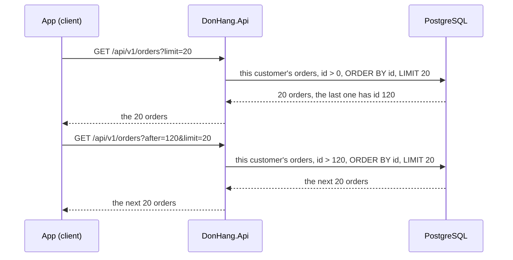

## Bạn cần biết trước

- [[backend.l2.offset-pagination]] — bạn đã biết `limit` và `offset` cắt một trang từ các dòng sắp xếp theo `id`, và một dòng được thêm hoặc bị xóa giữa hai request sẽ làm các dòng phía sau dịch chỗ.
- [[foundation.l1.sql-index-intro]] — bạn đã biết index giúp PostgreSQL tìm dòng mà không phải đọc mọi dòng, và primary key tự có index.

## Tình huống

Bạn xem các sản phẩm rẻ, mỗi lần hai sản phẩm. `GET /api/v1/products?maxPriceVnd=500000&limit=2&offset=0` trả về sản phẩm 2 và 5. `maxPriceVnd` chỉ giữ các sản phẩm có giá tối đa bằng mức đó, bài về lọc dữ liệu sẽ nói cách làm. Trong lúc bạn đang xem, một nhân viên nâng giá sản phẩm 2 lên 950.000. Bạn xin trang tiếp bằng `offset=2` và nhận một mảng rỗng. Thế nhưng sản phẩm 8, giá 280.000, vẫn rẻ hơn 500.000, và bạn chưa hề thấy nó. Request nào cũng trả `200`, vậy vì sao trang hai mất một sản phẩm, và làm sao để request nói được "cho tôi những gì đứng sau cái cuối cùng tôi đã thấy"?

## Khái niệm cốt lõi

- đếm vị trí — `offset` là số dòng đếm từ đầu danh sách, và mỗi request server lại đếm từ đầu, trên các dòng đúng như chúng đang có lúc đó.
- **cursor pagination** — phân trang bằng cách hỏi các dòng sau dòng cuối client đã thấy, như `?after=120&limit=20`, thay vì bỏ qua một số dòng.
- giá trị cursor — giá trị cột sắp xếp của dòng cuối client nhận được, ở đây là `id` của đơn hàng, được gửi lại dưới dạng `after` để lấy trang kế.
- chỉ có trang kế — cursor nói chỗ để đi tiếp, không nói bạn đang ở trang số mấy, nên client đi tới được nhưng không nhảy thẳng sang trang 50 được.

## Cơ chế hoạt động



Trong tình huống trên, trang 1 đếm hai dòng từ đầu: sản phẩm 2 và 5. Rồi sản phẩm 2 rời khỏi danh sách, vì giá của nó không còn dưới 500.000. Danh sách giờ là 5, 8. `offset=2` bỏ qua cả hai, nên trang 2 rỗng và sản phẩm 8 không bao giờ hiện ra. Thêm một dòng trước vị trí của bạn thì ngược lại, một dòng sẽ hiện hai lần.

Cursor pagination không đếm. Client nhớ `id` của dòng cuối nó nhận được và gửi lại dưới dạng `after`. API hỏi PostgreSQL các đơn của khách này có `id` lớn hơn, theo thứ tự `id`, tối đa `limit` dòng. Request đầu tiên không có `after`, nên server dùng 0, và `id` nào cũng lớn hơn 0.

Nếu danh sách sản phẩm dùng cursor, hỏi "sau `id` 5" sẽ trả về sản phẩm 8, dù sản phẩm 2 có ra sao. Danh sách sản phẩm của Đơn Hàng vẫn dùng offset, chỉ danh sách đơn hàng dùng cursor.

Cursor còn giúp cả PostgreSQL. Loại index PostgreSQL tạo mặc định, kể cả index đứng sau primary key, giữ giá trị của cột theo thứ tự đã sắp xếp. Có index như vậy trên cột sắp xếp, PostgreSQL tìm được giá trị cursor rồi đọc các giá trị kế tiếp từ đó. Một `OFFSET` lớn thì vẫn bắt PostgreSQL tạo ra mọi dòng bị bỏ qua rồi vứt đi, nên trang 500 tốn hơn trang 1.

Cái giá phải trả là cursor chỉ biết "sau dòng này". Client không nhảy sang trang 50 được nếu không đọc qua các trang trước đó. Điều này hợp với danh sách người dùng kéo xuống hơn là danh sách có liên kết số trang.

## Trong hệ thống Đơn Hàng

Ở `stage-2`, danh sách sản phẩm vẫn phân trang bằng `offset`, còn danh sách đơn hàng nhận `after`:

```csharp file=DonHang.Api/Controllers/OrdersController.cs tag=stage-2 lines=99-115
    // lesson: backend.l1.efcore-n-plus-one
    // lesson: backend.l2.cursor-pagination
    // GET /api/v1/orders?after=120&limit=20: the signed-in customer's orders
    // with an id greater than `after`, sorted by id. The client sends the last
    // id it received as the next `after`.
    [Authorize]
    [HttpGet]
    public async Task<ActionResult<List<OrderSummaryDto>>> List(
        [FromQuery, Range(0, int.MaxValue)] int after = 0,
        [FromQuery, Range(1, MaxPageSize)] int limit = 20)
    {
        var customer = await CurrentCustomerAsync();
        if (customer is null) return Forbid();

        var orders = await repository.ListByCustomerAsync(customer.Id, after, limit);
        return Ok(orders.Select(o => new OrderSummaryDto(o.Id, o.Status, o.CustomerName)).ToList());
    }
```

`after` và `limit` là query parameter với cùng kiểu kiểm tra `Range` như danh sách sản phẩm, nên `after` âm hoặc `limit` quá 100 nhận `400`. Thiếu `after` thì nó là `0`, và vì `id` đơn hàng nào cũng lớn hơn 0, request đó trả về trang đầu. `[Authorize]` và `CurrentCustomerAsync()` giới hạn danh sách trong các đơn của chính khách đang đăng nhập. Người gọi không có bản ghi khách hàng nhận `403` từ `Forbid()`. Còn bản thân trang dữ liệu do repository lấy.

```csharp file=DonHang.Infrastructure/EfOrderRepository.cs tag=stage-2 lines=18-29
    // lesson: backend.l2.cursor-pagination
    // lesson: backend.l2.projection-queries
    // One customer's orders after the cursor, in id order, one page at a time.
    // The Select puts only three columns in the SQL; reading o.Customer inside
    // it makes EF Core write the JOIN, so no Include is needed.
    public Task<List<OrderSummary>> ListByCustomerAsync(int customerId, int afterId, int limit) =>
        db.Orders
            .Where(o => o.CustomerId == customerId && o.Id > afterId)
            .OrderBy(o => o.Id)
            .Take(limit)
            .Select(o => new OrderSummary(o.Id, o.Status, o.Customer!.FullName))
            .ToListAsync();
```

Nhìn `o.Id > afterId` trong `Where`: phép so sánh đó chính là cursor. Nó đứng cạnh điều kiện theo khách hàng, nên trang bắt đầu ngay sau đơn cuối client đã thấy. Có `Take(limit)` nhưng không có `Skip`: không có gì phải đếm. Vẫn cần `OrderBy(o => o.Id)`, vì "sau" chỉ có nghĩa khi thứ tự cố định. `id` là primary key nên là duy nhất: dòng đứng sau một `id` cho trước không bao giờ mơ hồ. Dòng `Select` dựng một `OrderSummary` gồm ba trường. Với chuyện phân trang, chỉ `Where`, `OrderBy` và `Take` là quan trọng.

## Người mới hay nghĩ rằng…

- **"Cursor pagination chỉ là mẹo tăng tốc, nó trả về đúng những trang giống hệt phân trang offset."** → Thực ra các trang khác nhau ngay khi các dòng trước vị trí của bạn thay đổi giữa hai request. Offset đếm lại từ đầu nên bị dịch, còn cursor đi tiếp sau một dòng đã biết. Bạn sẽ nhận ra khi một danh sách phân trang offset hiện một dòng hai lần hoặc mất một dòng trong lúc có người khác đang sửa dữ liệu, còn danh sách dùng cursor thì không.
- **"Cursor nghĩa là server nhớ trang cuối của từng client kết thúc ở đâu."** → Thực ra server không giữ gì cả. Cursor là một giá trị bình thường, `id` cuối cùng, được client gửi lại trong URL. Mỗi request là một câu truy vấn mới, tách biệt. Bạn sẽ nhận ra điều này trong `ListByCustomerAsync`: nó nhận `afterId` như một tham số `int` thông thường và không giữ trạng thái nào giữa các lần gọi.

## Thử ngay (3 phút)

1. Sau khi khởi động Đơn Hàng bằng `scripts/up.sh`, chạy `scripts/backend/efcore-sql.sh` từ thư mục gốc của Đơn Hàng. Script đăng nhập bằng khách hàng 3, gọi `GET /api/v1/orders?after=5&limit=20`, rồi in ra câu SQL mà EF Core đã gửi cho request đó.
2. Xem mảng JSON ở dòng thứ hai, rồi xem các dòng `WHERE` và `LIMIT` của câu SQL.

Kết quả mong đợi: mảng chỉ có đơn 6 và 7. Khách hàng 3 cũng có đơn 5, nhưng `after=5` hỏi các đơn đứng sau nó. Câu SQL có `o.id > @afterId`, `ORDER BY o.id` và `LIMIT @p`, và không có `OFFSET` ở đâu cả. EF Core gửi các con số riêng, nên `@afterId` mang giá trị 5 và `@p` mang giá trị 20. Dòng log phía trên câu SQL ghi chúng là `@afterId='?'` và `@p='?'`: EF Core giấu giá trị trong log, nên mảng gồm đơn 6 và 7 chính là bằng chứng cho con số 5.

<details><summary>Gợi ý đáp án</summary>

`after=5` trở thành `@afterId` trong câu SQL, nên PostgreSQL chỉ trả các đơn của khách này có `id` lớn hơn 5, theo thứ tự `id`. Đơn 5 không bị bỏ qua do đếm, nó trượt ở phép so sánh. Câu lệnh không có `OFFSET`, nên không có dòng bị bỏ qua nào để PostgreSQL phải tạo ra rồi vứt đi.

</details>

## Liên hệ

- [[backend.l2.offset-pagination]] — vấn đề bài này sửa: trang offset đếm lại từ đầu ở mỗi request.
- [[foundation.l1.sql-index-intro]] — bài cần học trước: index trên cột sắp xếp là thứ cho phép PostgreSQL bắt đầu đọc ngay tại cursor thay vì từ dòng đầu tiên.
- [[backend.l2.filtering-with-query-parameters]] — bài kế tiếp: một bộ lọc như `maxPriceVnd` trong tình huống, được thêm vào cùng câu truy vấn trước khi cắt trang.

## Tóm tắt 5 dòng

1. Trang cursor hỏi các dòng sau dòng cuối client đã thấy, nên thay đổi ở những dòng đã đi qua không làm trang kế bị dịch.
2. Offset được đếm lại từ đầu ở mỗi request, nên thêm hoặc xóa một dòng trước vị trí của bạn sẽ làm lặp hoặc sót dòng.
3. Danh sách đơn hàng của Đơn Hàng nhận `?after=<last id>&limit=20` và lọc `o.Id > afterId` theo thứ tự `id`, không có `Skip`.
4. Với index trên cột sắp xếp, PostgreSQL bắt đầu đọc tại cursor, còn `OFFSET` lớn phải tạo ra rồi bỏ đi mọi dòng bị bỏ qua.
5. Cursor chỉ đi sang trang kế, không nhảy được tới trang 50, nên hợp với danh sách kéo xuống hơn là danh sách đánh số trang.
