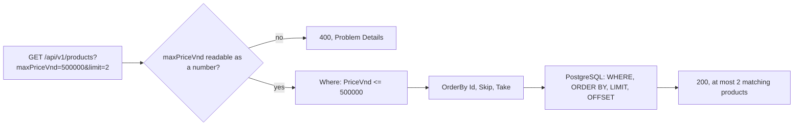

## Before you start

- [[backend.l2.offset-pagination]] — you know `GET /api/v1/products` reads `limit` and `offset` from query parameters, and that EF Core turns `Skip` and `Take` into `OFFSET` and `LIMIT`.

## The situation

The product screen in the app gets a new switch: "Under 500,000 VND". A teammate sketches two backend changes. Option one is a new endpoint, `GET /api/v1/products/cheap`; option two is to keep `GET /api/v1/products`, load every product, and drop the expensive ones in C# before answering. Both would work today with eight products. But next month someone will want "under 1,000,000", and the month after, cheap products in one category. Where should a filter live, so the API does not grow a new endpoint per wish and the database does the narrowing?

## Core concepts

- filter — a condition that narrows a collection to the rows that match it; here, products whose price is at most a given number.
- filter as a query parameter — the filter travels as a query parameter on the collection's own URL, such as `?maxPriceVnd=500000`; the path still names the product collection, and the parameter only narrows what comes back.
- filter in the query — the condition is added to the database query with `Where` before the query runs, so PostgreSQL returns only matching rows.
- filter, then page — the filter decides which rows qualify, and `limit` and `offset` cut the page from the rows that are left.

## How it works



In the situation above, the switch becomes one more query parameter on the URL the app already calls: `GET /api/v1/products?maxPriceVnd=500000`. There is still one product collection. The parameter is an option on the request, just like `limit` and `offset`, so "under 1,000,000" is `maxPriceVnd=1000000`, not a new endpoint.

Before `List()` runs, ASP.NET Core reads `maxPriceVnd` as the type the parameter declares, a number. If the text cannot be read that way, such as `maxPriceVnd=abc`, the same automatic check that refuses an out-of-range `limit` answers `400` with a Problem Details body, and `List()` never starts. A query parameter the endpoint does not declare, such as `colour=red`, is simply ignored.

When the value is a number, `List()` adds `Where` to the query. A LINQ chain only describes a query, so the condition becomes part of the one SQL statement, as a `WHERE` clause. PostgreSQL compares prices and returns only matching rows. The server never loads the expensive products at all.

Then the page is cut. `OrderBy`, `Skip` and `Take` come after `Where` in the same chain, so `OFFSET` and `LIMIT` count only rows that passed the filter. With `maxPriceVnd=500000&limit=2&offset=1`, the page skips the first cheap product and returns the second and third cheap products, not the second and third products overall. The answer is `200` with at most `limit` matching products.

## In the Đơn Hàng system

The filter sits in the same method as the page:

```csharp file=DonHang.Api/Controllers/ProductsController.cs tag=stage-2 lines=23-45
    [HttpGet]
    public async Task<ActionResult<List<ProductDto>>> List(
        [FromQuery, Range(1, MaxPageSize)] int limit = 20,
        [FromQuery, Range(0, int.MaxValue)] int offset = 0,
        [FromQuery] int? maxPriceVnd = null)
    {
        IQueryable<Product> query = db.Products;

        // lesson: backend.l2.filtering-with-query-parameters
        // Added to the query before it runs, so PostgreSQL filters, not C#.
        if (maxPriceVnd is not null)
        {
            query = query.Where(p => p.PriceVnd <= maxPriceVnd);
        }

        var page = await query
            .OrderBy(p => p.Id)
            .Skip(offset)
            .Take(limit)
            .Select(p => new ProductDto(p.Id, p.Name, p.PriceVnd))
            .ToListAsync();
        return Ok(page);
    }
```

`int? maxPriceVnd = null` makes the filter optional. The `?` after `int` lets the parameter hold "no value", so a request without `maxPriceVnd` leaves it `null` and gets every product, page by page. The `if` adds `Where` only when a price was sent. A second optional filter would be a second `if` with its own `Where`, and EF Core would put both conditions in the same SQL `WHERE`.

`query` starts as `db.Products` and is reassigned, not run. `query.Where(...)` returns a longer description of the same query, and the page is built on top of it. Nothing reaches PostgreSQL until `ToListAsync()`. EF Core then logs one SQL statement in which `WHERE p.price_vnd <= @maxPriceVnd` comes before `ORDER BY p.id` and `LIMIT ... OFFSET ...`, with the values sent as placeholders as in the offset lesson: the filter comes first.

## Beginners often think…

- **"Each filter needs its own endpoint, like `/api/v1/products/cheap`."** → Actually a filter narrows the same collection, so it belongs on the collection's URL as a query parameter. One endpoint per filter multiplies quickly and does not combine: each copy repeats the paging code, and "cheap" plus another condition needs yet another endpoint. You notice this when the controller fills with near-copies of `List()` that differ in one `Where`.
- **"Loading all products and filtering them in C# is fine, because the product list is small."** → Actually the cost grows with the table, not with the result: the server reads and turns into objects every product before throwing most away. If instead SQL cuts the page and C# filters that page, paging breaks too. `offset` then counts rows the C# filter later drops. You notice this when a filtered page returns fewer rows than `limit` even though more matching products exist.

## Try it (3 minutes)

1. With Đơn Hàng started by `scripts/up.sh`, run `curl "http://localhost:8080/api/v1/products?maxPriceVnd=500000"`.
2. Run `curl -i "http://localhost:8080/api/v1/products?maxPriceVnd=abc"`.
3. Run `curl "http://localhost:8080/api/v1/products?maxPriceVnd=500000&limit=2&offset=1"`.

Expected result: the first returns products 2, 5 and 8, the three that cost at most 500,000. The second returns `400 Bad Request` with a Problem Details body whose `errors` entry for `maxPriceVnd` says the value `abc` is not valid. The third returns products 5 and 8: the page skipped one matching product, not one product overall.

<details><summary>Suggested answer</summary>

In step 1, `Where` narrowed the eight products to three before the default page of 20 was cut. In step 2, `abc` could not become an `int`, so ASP.NET Core answered `400` before `List()` ran. In step 3, `OFFSET 1` skipped product 2, the first cheap one, because the filter came first in the SQL.

</details>

## Connections

- [[backend.l2.offset-pagination]] — prerequisite: the page this lesson cuts from filtered rows instead of from the whole table.
- [[backend.l2.cursor-pagination]] — the same order of steps with a cursor: `ListByCustomerAsync` narrows to one customer's orders in `Where` before `Take` cuts the page.
- [[backend.l1.querying-with-linq]] — why `query.Where(...)` runs in PostgreSQL: a LINQ chain is only a description until something asks for the list.

## Five-line summary

1. A filter is a query parameter on the collection's own URL, such as `?maxPriceVnd=500000`, not a new endpoint per condition.
2. The endpoint adds the filter with `Where` before the query runs, so PostgreSQL returns only matching rows.
3. A filter value that cannot be read as the declared type gets `400` with Problem Details before `List()` runs.
4. A query parameter the endpoint does not declare is ignored.
5. Filter first, then page: `OFFSET` and `LIMIT` count only the rows that passed the filter.
