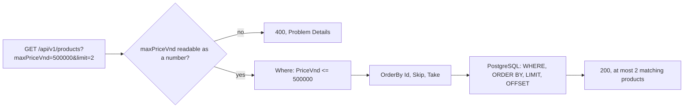

## Bạn cần biết trước

- [[backend.l2.offset-pagination]] — bạn đã biết `GET /api/v1/products` đọc `limit` và `offset` từ query parameter, và EF Core biến `Skip` với `Take` thành `OFFSET` và `LIMIT`.

## Tình huống

Màn hình sản phẩm trong app có thêm một công tắc: "Dưới 500.000 VND". Một đồng nghiệp phác ra hai hướng sửa backend. Hướng thứ nhất là một endpoint mới, `GET /api/v1/products/cheap`. Hướng thứ hai là giữ `GET /api/v1/products`, nạp mọi sản phẩm, rồi bỏ các món đắt bằng C# trước khi trả lời. Với tám sản phẩm hiện nay, cả hai đều chạy. Nhưng tháng sau sẽ có người muốn "dưới 1.000.000", tháng sau nữa lại muốn sản phẩm rẻ trong một nhóm hàng. Bộ lọc nên nằm ở đâu để API không mọc thêm một endpoint cho mỗi mong muốn, và để database làm việc thu hẹp?

## Khái niệm cốt lõi

- bộ lọc — một điều kiện thu hẹp collection về những dòng khớp với nó, ở đây là các sản phẩm có giá tối đa bằng một con số cho trước.
- bộ lọc dưới dạng query parameter — bộ lọc đi theo dạng query parameter trên chính URL của collection, như `?maxPriceVnd=500000`. Path vẫn chỉ collection sản phẩm, còn tham số chỉ thu hẹp những gì được trả về.
- bộ lọc nằm trong câu truy vấn — điều kiện được thêm vào câu truy vấn database bằng `Where` trước khi câu truy vấn chạy, nên PostgreSQL chỉ trả các dòng khớp.
- lọc trước, cắt trang sau — bộ lọc quyết định dòng nào đủ điều kiện, rồi `limit` và `offset` cắt trang từ những dòng còn lại.

## Cơ chế hoạt động



Trong tình huống trên, công tắc trở thành thêm một query parameter trên URL mà app vốn đang gọi: `GET /api/v1/products?maxPriceVnd=500000`. Vẫn chỉ có một collection sản phẩm. Tham số là một tùy chọn của request, giống hệt `limit` và `offset`, nên "dưới 1.000.000" là `maxPriceVnd=1000000`, không phải một endpoint mới.

Trước khi `List()` chạy, ASP.NET Core đọc `maxPriceVnd` theo kiểu mà tham số khai báo, tức là một con số. Nếu đoạn chữ không đọc được như vậy, ví dụ `maxPriceVnd=abc`, chính phép kiểm tra tự động từng từ chối `limit` ngoài khoảng sẽ trả `400` kèm body Problem Details, và `List()` không bao giờ bắt đầu. Query parameter mà endpoint không khai báo, như `colour=red`, đơn giản là bị bỏ qua.

Khi giá trị là số, `List()` thêm `Where` vào câu truy vấn. Chuỗi LINQ chỉ mô tả câu truy vấn, nên điều kiện trở thành một phần của đúng một câu SQL, dưới dạng mệnh đề `WHERE`. PostgreSQL so giá và chỉ trả các dòng khớp. Server không hề nạp các sản phẩm đắt.

Sau đó mới cắt trang. `OrderBy`, `Skip` và `Take` đứng sau `Where` trong cùng chuỗi, nên `OFFSET` và `LIMIT` chỉ đếm những dòng đã qua bộ lọc. Với `maxPriceVnd=500000&limit=2&offset=1`, trang bỏ qua sản phẩm rẻ đầu tiên và trả sản phẩm rẻ thứ hai và thứ ba, không phải sản phẩm thứ hai và thứ ba của cả danh sách. Câu trả lời là `200` kèm tối đa `limit` sản phẩm khớp.

## Trong hệ thống Đơn Hàng

Bộ lọc nằm trong cùng method với phần cắt trang:

```csharp file=DonHang.Api/Controllers/ProductsController.cs tag=stage-2 lines=23-45
    [HttpGet]
    public async Task<ActionResult<List<ProductDto>>> List(
        [FromQuery, Range(1, MaxPageSize)] int limit = 20,
        [FromQuery, Range(0, int.MaxValue)] int offset = 0,
        [FromQuery] int? maxPriceVnd = null)
    {
        IQueryable<Product> query = db.Products;

        // lesson: backend.l2.filtering-with-query-parameters
        // Added to the query before it runs, so PostgreSQL filters, not C#.
        if (maxPriceVnd is not null)
        {
            query = query.Where(p => p.PriceVnd <= maxPriceVnd);
        }

        var page = await query
            .OrderBy(p => p.Id)
            .Skip(offset)
            .Take(limit)
            .Select(p => new ProductDto(p.Id, p.Name, p.PriceVnd))
            .ToListAsync();
        return Ok(page);
    }
```

`int? maxPriceVnd = null` khiến bộ lọc thành tùy chọn. Dấu `?` sau `int` cho phép tham số mang "không có giá trị", nên request không gửi `maxPriceVnd` sẽ để nó là `null` và nhận mọi sản phẩm, từng trang một. Câu `if` chỉ thêm `Where` khi có gửi giá. Một bộ lọc tùy chọn thứ hai sẽ là một `if` thứ hai với `Where` riêng, và EF Core sẽ đặt cả hai điều kiện vào cùng một mệnh đề SQL `WHERE`.

`query` bắt đầu là `db.Products` và được gán lại, chứ chưa chạy. `query.Where(...)` trả về một bản mô tả dài hơn của cùng câu truy vấn, và phần cắt trang được dựng tiếp lên đó. Không gì tới PostgreSQL cho tới `ToListAsync()`. Lúc đó EF Core ghi log một câu SQL trong đó `WHERE p.price_vnd <= @maxPriceVnd` đứng trước `ORDER BY p.id` và `LIMIT ... OFFSET ...`, các giá trị được gửi dưới dạng chỗ giữ chỗ như ở bài offset: bộ lọc đi trước.

## Người mới hay nghĩ rằng…

- **"Mỗi bộ lọc cần một endpoint riêng, như `/api/v1/products/cheap`."** → Thực ra bộ lọc thu hẹp chính collection đó, nên nó thuộc về URL của collection dưới dạng query parameter. Mỗi bộ lọc một endpoint thì số endpoint tăng nhanh và không kết hợp được: bản nào cũng lặp lại code phân trang, và "rẻ" cộng thêm một điều kiện khác lại cần thêm một endpoint nữa. Bạn sẽ nhận ra khi controller đầy những bản gần giống `List()`, chỉ khác nhau một dòng `Where`.
- **"Nạp mọi sản phẩm rồi lọc bằng C# cũng được, vì danh sách sản phẩm nhỏ."** → Thực ra chi phí lớn dần theo bảng chứ không theo kết quả: server đọc và dựng object cho mọi sản phẩm rồi mới vứt phần lớn đi. Còn nếu SQL cắt trang rồi C# mới lọc trang đó, phân trang cũng hỏng. Khi đó `offset` đếm cả những dòng mà bộ lọc C# sau đó bỏ đi. Bạn sẽ nhận ra khi một trang đã lọc trả về ít dòng hơn `limit` dù vẫn còn sản phẩm khớp.

## Thử ngay (3 phút)

1. Sau khi khởi động Đơn Hàng bằng `scripts/up.sh`, chạy `curl "http://localhost:8080/api/v1/products?maxPriceVnd=500000"`.
2. Chạy `curl -i "http://localhost:8080/api/v1/products?maxPriceVnd=abc"`.
3. Chạy `curl "http://localhost:8080/api/v1/products?maxPriceVnd=500000&limit=2&offset=1"`.

Kết quả mong đợi: lệnh đầu trả sản phẩm 2, 5 và 8, ba sản phẩm có giá tối đa 500.000. Lệnh thứ hai trả `400 Bad Request` kèm body Problem Details, trong đó mục `errors` cho `maxPriceVnd` nói giá trị `abc` không hợp lệ. Lệnh thứ ba trả sản phẩm 5 và 8: trang đã bỏ qua một sản phẩm khớp, không phải một sản phẩm bất kỳ.

<details><summary>Gợi ý đáp án</summary>

Ở bước 1, `Where` thu hẹp tám sản phẩm xuống còn ba trước khi trang mặc định 20 dòng được cắt. Ở bước 2, `abc` không chuyển được thành `int`, nên ASP.NET Core trả `400` trước khi `List()` chạy. Ở bước 3, `OFFSET 1` bỏ qua sản phẩm 2, sản phẩm rẻ đầu tiên, vì bộ lọc đứng trước trong câu SQL.

</details>

## Liên hệ

- [[backend.l2.offset-pagination]] — bài cần học trước: trang mà bài này cắt từ các dòng đã lọc thay vì từ cả bảng.
- [[backend.l2.cursor-pagination]] — cùng thứ tự các bước nhưng với cursor: `ListByCustomerAsync` thu hẹp về các đơn của một khách trong `Where` trước khi `Take` cắt trang.
- [[backend.l1.querying-with-linq]] — lý do `query.Where(...)` chạy trong PostgreSQL: chuỗi LINQ chỉ là bản mô tả cho tới khi có thứ đòi danh sách.

## Tóm tắt 5 dòng

1. Bộ lọc là một query parameter trên chính URL của collection, như `?maxPriceVnd=500000`, không phải một endpoint mới cho mỗi điều kiện.
2. Endpoint thêm bộ lọc bằng `Where` trước khi câu truy vấn chạy, nên PostgreSQL chỉ trả các dòng khớp.
3. Giá trị lọc không đọc được theo kiểu đã khai báo sẽ nhận `400` kèm Problem Details trước khi `List()` chạy.
4. Query parameter mà endpoint không khai báo sẽ bị bỏ qua.
5. Lọc trước, cắt trang sau: `OFFSET` và `LIMIT` chỉ đếm những dòng đã qua bộ lọc.
