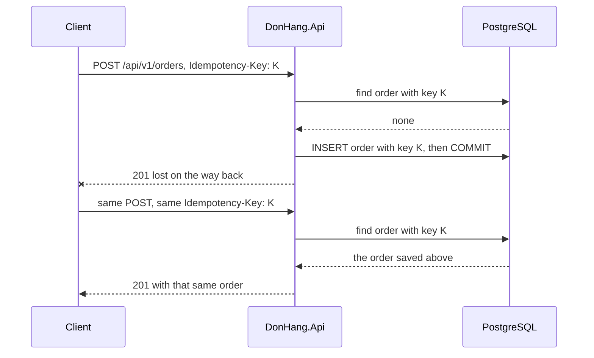

## Before you start

- [[backend.l1.creating-a-resource]] — you know `POST /api/v1/orders` answers `201` with the new order, and that the same `POST` sent twice creates two orders. This lesson makes the second send safe.
- [[foundation.l1.transaction-intro]] — you know a transaction keeps a group of writes together: all of them are saved, or none. This lesson relies on that to keep a key and its order together.

## The situation

You are writing a client that places orders on Đơn Hàng with `POST /api/v1/orders`. On a slow connection the request leaves, the client waits up to a time limit it set for itself, and then gives up with a timeout error, unable to tell whether the order went through. The request may have been lost on the way, or the API may have saved the order and only its answer was lost. If the client sends the same `POST` again and the first one did arrive, the customer now has two identical orders. How can a client send a `POST` again after a timeout and still end up with exactly one order?

## Core concepts

- **idempotency key** — a unique value the client creates once for each order it means to place and sends with every attempt at that order, so the server can recognise a retry and answer with the order the first attempt created.
- `Idempotency-Key` header — the request header in which Đơn Hàng's clients send that value; it is optional, and a `POST` without it creates an order every time, as before.
- unique index on the key — the index on `orders.idempotency_key` that refuses a second row with a key already in the table, so two requests with one key can never both save an order.

## How it works



In the situation above, the client makes a new random value before the first attempt, long enough that two clients will not make the same one in practice. That value is the idempotency key, and it goes in the `Idempotency-Key` header of the first attempt and of every retry.

The API first looks for an order that already carries this key. On the first attempt there is none, so it creates the order and saves the key in the order's own row, in the same `INSERT`. The answer is then lost.

The retry carries the same key, so the lookup now finds the saved order, and the API returns it instead of creating a new one. A correct client never sends a key another customer already used; if a faulty or dishonest one does, the API refuses it with `400` instead of returning that customer's order.

The lookup alone is not enough. Two retries can arrive at the same moment, both look, both find nothing, and both try to insert. So the key sits in the same row and transaction as the order, under a unique index, and the index lets only one of the two `INSERT`s through.

The other `INSERT` fails and its whole transaction is discarded. Đơn Hàng's exception-handling middleware answers it with `409` (Conflict), saying the same request is already being processed. When the client retries after that, the lookup finds the order and returns it.

`PUT` and `DELETE` need none of this: they are idempotent by definition. `POST` is not, and the key is what makes it safe to retry.

## In the Đơn Hàng system

`OrdersController.Create` reads the header with `[FromHeader(Name = "Idempotency-Key")]` and passes it, or `null` when it is absent, to `OrderService.PlaceOrderAsync`:

```csharp file=DonHang.Domain/OrderService.cs tag=stage-2 lines=10-34
    // lesson: backend.l2.idempotent-endpoints
    // A retry that repeats an Idempotency-Key gets back the order that key
    // created, with Created = false. The key is saved in the order's own row,
    // by the same INSERT, so the unique index on it stops two concurrent
    // retries creating two.
    public async Task<(Order Order, bool Created)> PlaceOrderAsync(int customerId, List<OrderItem> items, string? idempotencyKey = null)
    {
        if (idempotencyKey is not null)
        {
            var earlier = await repository.FindByIdempotencyKeyAsync(idempotencyKey);
            if (earlier is not null && earlier.CustomerId != customerId)
                throw new ArgumentException("this Idempotency-Key was already used by another customer");
            if (earlier is not null) return (earlier, Created: false);
        }

        var order = new Order(customerId, items, DateTimeOffset.UtcNow) { IdempotencyKey = idempotencyKey };
        await repository.AddAsync(order);

        // lesson: backend.l2.database-job-queue
        // The notifier only adds a pending email job next to the order; this one
        // SaveChangesAsync then writes both in one transaction, or neither.
        notifier.Send(order, "order placed");
        await repository.SaveChangesAsync();
        return (order, Created: true);
    }
```

Look at the two `return` lines. A retry leaves at `return (earlier, Created: false)` before anything is written, so the controller answers `201` with the earlier order: the same `id`, status and items the first attempt got (`placedAt` can differ in its last digit, because the database keeps the time with fewer digits than the first answer shows). `Created` does not change the status code; both cases answer `201`. A first attempt reaches `new Order(...)`, where the key becomes part of the order itself, and the one `SaveChangesAsync` call writes the order row with its key, its items and any other row added before that call in a single transaction. The `notifier` line belongs to a later lesson and can be skipped here. The `ArgumentException` for another customer's key is what the exception-handling middleware answers with `400`.

In `DonHangDbContext`, where the ORM is told how `Order` maps to the `orders` table, `e` is what configures `Order` there and `o` stands for one order: these lines name the key's column and put a unique index on it.

```csharp file=DonHang.Infrastructure/DonHangDbContext.cs tag=stage-2 lines=55-59
            // lesson: backend.l2.idempotent-endpoints
            // Unique, so two requests with the same key cannot both insert an
            // order; PostgreSQL allows any number of rows where the key is null.
            e.Property(o => o.IdempotencyKey).HasColumnName("idempotency_key");
            e.HasIndex(o => o.IdempotencyKey).IsUnique();
```

`IsUnique()` is what turns two simultaneous (concurrent) retries into one order. Without it, both `INSERT`s would succeed. The comment explains why requests without the header still work: every order placed without a key stores `null`, and PostgreSQL does not count those as duplicates.

## Beginners often think…

- **"Retrying a failed POST is always safe, because a request that failed did nothing."** → Actually a timeout only tells the client that no answer arrived, because the answer can be lost after the server has already saved the order. Without a key, the retry is a second, separate order. You notice this when a customer on a slow connection finds two identical orders placed a few seconds apart.
- **"The server can spot a duplicate order by comparing the items, so the client does not need to send anything extra."** → Actually a customer can place the same order twice on purpose, such as the same product again the next morning, and the items are identical in both cases. Only the client knows whether a request is a retry of one order or a new one, and the key is how it says so. You notice this when a rule that refuses matching items also refuses a customer's genuine second order.

## Try it (3 minutes)

1. With the example system running (`scripts/up.sh`), run `scripts/backend/idempotent-order.sh`. It signs in as customer 1, makes one key and sends the same `POST /api/v1/orders` twice with it.
2. Compare the two JSON bodies it prints, then read its last line. Judge by the two `"id"` values: the line before the last one prints `yes` whatever the ids are, because of a bug in the script.

Expected result: both attempts answer `201`, both bodies carry the same `"id"` value, and the last line reads `orders customer 1 gained from the two requests: 1`.

## Connections

- [[backend.l1.creating-a-resource]] — the fix for the problem that lesson ends on: a `POST` sent twice creates two resources.
- [[foundation.l1.transaction-intro]] — the transaction idea applied here: the key and the order are saved together or not at all.
- [[backend.l2.optimistic-concurrency]] — a neighbouring answer from the same stage to two requests racing each other, this time on an update rather than an insert.

## Five-line summary

1. An idempotency key lets a client retry a `POST` after a timeout and still end up with exactly one order.
2. A client that times out cannot tell whether its `POST` created the order, so a blind retry can create a second one.
3. The client creates one key per intended order and sends it in `Idempotency-Key`; a retry with it gets the first order back.
4. The key is saved in the order's row, in the same transaction, under a unique index, so simultaneous retries cannot both insert.
5. `PUT` and `DELETE` are idempotent by definition and need no key; the key is what makes a `POST` safe to retry.
