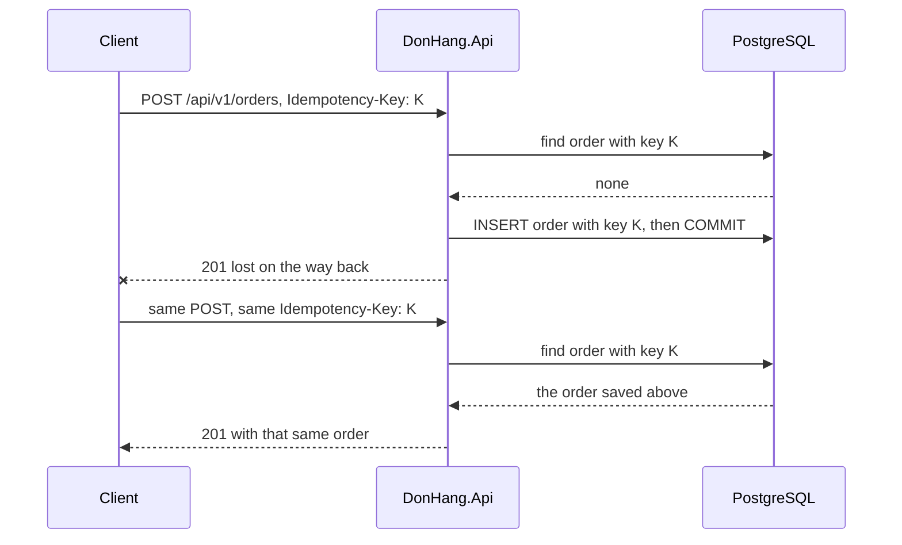

## Bạn cần biết trước

- [[backend.l1.creating-a-resource]] — bạn biết `POST /api/v1/orders` trả `201` kèm đơn mới, và cùng một `POST` gửi hai lần sẽ tạo hai đơn. Bài này làm cho lần gửi thứ hai trở nên an toàn.
- [[foundation.l1.transaction-intro]] — bạn biết một giao dịch giữ một nhóm thao tác ghi đi cùng nhau: hoặc lưu hết, hoặc không lưu gì. Bài này dựa vào đó để giữ key và đơn của nó đi cùng nhau.

## Tình huống

Bạn đang viết một client đặt đơn trên Đơn Hàng bằng `POST /api/v1/orders`. Mạng chậm, request đã đi, client chờ tới giới hạn thời gian nó tự đặt rồi bỏ cuộc với lỗi timeout, không biết đơn đã được tạo hay chưa. Có thể request đã mất trên đường đi, cũng có thể API đã lưu đơn và chỉ câu trả lời bị mất. Nếu client gửi lại đúng `POST` đó trong khi lần đầu thật ra đã tới nơi, khách sẽ có hai đơn giống hệt nhau. Làm sao để client gửi lại `POST` sau khi timeout mà vẫn chỉ có đúng một đơn?

## Khái niệm cốt lõi

- **idempotency key** (giá trị duy nhất client gửi kèm request để server nhận ra lần gửi lại và trả kết quả lần đầu) — giá trị client tạo một lần cho mỗi đơn nó định đặt và gửi kèm mọi lần thử của đơn đó, để server nhận ra lần gửi lại và trả về đơn mà lần thử đầu đã tạo.
- Header `Idempotency-Key` — header của request mà các client của Đơn Hàng dùng để gửi giá trị đó. Header này không bắt buộc, `POST` không có nó thì lần nào cũng tạo đơn mới như trước.
- Unique index trên key — index trên `orders.idempotency_key`, từ chối dòng thứ hai mang một key đã có trong bảng, nên hai request cùng một key không bao giờ cùng lưu được đơn.

## Cơ chế hoạt động



Trong tình huống trên, client tạo một giá trị ngẫu nhiên mới trước lần thử đầu, đủ dài để trên thực tế hai client không tạo trùng nhau. Giá trị đó là idempotency key, và nó nằm trong header `Idempotency-Key` của lần thử đầu lẫn mọi lần gửi lại.

Trước tiên API tìm xem đã có đơn nào mang key này chưa. Ở lần thử đầu thì chưa, nên API tạo đơn và lưu key ngay trong dòng của đơn, bằng cùng câu `INSERT`. Sau đó câu trả lời bị mất.

Lần gửi lại mang đúng key cũ, nên lần tra cứu này tìm thấy đơn đã lưu, và API trả về đơn đó thay vì tạo đơn mới. Một client đúng đắn không bao giờ gửi key mà khách khác đã dùng. Nếu một client lỗi hoặc gian dối làm vậy, API từ chối bằng `400` chứ không trả về đơn của khách kia.

Chỉ tra cứu thôi thì chưa đủ. Hai lần gửi lại có thể tới cùng lúc, cả hai cùng tìm, cùng không thấy gì, và cùng thử `INSERT`. Vì thế key nằm trong cùng dòng và cùng giao dịch với đơn, dưới một unique index, và index này chỉ cho một trong hai câu `INSERT` đi qua.

Câu `INSERT` còn lại thất bại và cả giao dịch của nó bị hủy. Middleware xử lý exception của Đơn Hàng trả lời request đó bằng `409` (Conflict), báo rằng cùng request này đang được xử lý. Khi client gửi lại sau đó, lần tra cứu tìm thấy đơn và trả nó về.

`PUT` và `DELETE` không cần những thứ này: theo định nghĩa chúng là idempotent. `POST` thì không, và key chính là thứ giúp gửi lại `POST` an toàn.

## Trong hệ thống Đơn Hàng

`OrdersController.Create` đọc header bằng `[FromHeader(Name = "Idempotency-Key")]` rồi chuyển nó, hoặc `null` khi không có, cho `OrderService.PlaceOrderAsync`:

```csharp file=DonHang.Domain/OrderService.cs tag=stage-2 lines=10-34
    // lesson: backend.l2.idempotent-endpoints
    // A retry that repeats an Idempotency-Key gets back the order that key
    // created, with Created = false. The key is saved in the order's own row,
    // by the same INSERT, so the unique index on it stops two concurrent
    // retries creating two.
    public async Task<(Order Order, bool Created)> PlaceOrderAsync(int customerId, List<OrderItem> items, string? idempotencyKey = null)
    {
        if (idempotencyKey is not null)
        {
            var earlier = await repository.FindByIdempotencyKeyAsync(idempotencyKey);
            if (earlier is not null && earlier.CustomerId != customerId)
                throw new ArgumentException("this Idempotency-Key was already used by another customer");
            if (earlier is not null) return (earlier, Created: false);
        }

        var order = new Order(customerId, items, DateTimeOffset.UtcNow) { IdempotencyKey = idempotencyKey };
        await repository.AddAsync(order);

        // lesson: backend.l2.database-job-queue
        // The notifier only adds a pending email job next to the order; this one
        // SaveChangesAsync then writes both in one transaction, or neither.
        notifier.Send(order, "order placed");
        await repository.SaveChangesAsync();
        return (order, Created: true);
    }
```

Hãy nhìn hai dòng `return`. Lần gửi lại thoát ở `return (earlier, Created: false)` trước khi ghi bất cứ gì, nên controller trả `201` kèm đơn cũ: cùng `id`, trạng thái và các món hàng mà lần thử đầu nhận được (`placedAt` có thể lệch ở chữ số cuối, vì database giữ thời gian với ít chữ số hơn câu trả lời đầu tiên). `Created` không làm đổi status code, cả hai trường hợp đều trả `201`. Lần thử đầu đi tới `new Order(...)`, nơi key trở thành một phần của chính đơn hàng, và lời gọi `SaveChangesAsync` duy nhất ghi dòng đơn cùng key, các món hàng và mọi dòng khác được thêm trước lời gọi đó trong một giao dịch. Dòng `notifier` thuộc về một bài sau, ở đây bạn có thể bỏ qua. `ArgumentException` dành cho key của khách khác được middleware xử lý exception trả lời bằng `400`.

Trong `DonHangDbContext`, nơi ORM được cho biết `Order` ánh xạ sang bảng `orders` như thế nào, `e` là thứ cấu hình `Order` ở đó còn `o` đại diện cho một đơn: các dòng này đặt tên cột cho key và đặt unique index lên nó.

```csharp file=DonHang.Infrastructure/DonHangDbContext.cs tag=stage-2 lines=55-59
            // lesson: backend.l2.idempotent-endpoints
            // Unique, so two requests with the same key cannot both insert an
            // order; PostgreSQL allows any number of rows where the key is null.
            e.Property(o => o.IdempotencyKey).HasColumnName("idempotency_key");
            e.HasIndex(o => o.IdempotencyKey).IsUnique();
```

`IsUnique()` là thứ biến hai lần gửi lại đồng thời (concurrent) thành một đơn duy nhất. Thiếu nó, cả hai câu `INSERT` đều thành công. Comment giải thích vì sao request không có header vẫn chạy: mọi đơn đặt không kèm key đều lưu `null`, và PostgreSQL không coi các giá trị đó là trùng nhau.

## Người mới hay nghĩ rằng…

- **"Gửi lại một POST bị lỗi lúc nào cũng an toàn, vì request đã lỗi thì chưa làm gì cả."** → Thực ra timeout chỉ cho client biết là không có câu trả lời nào về, vì câu trả lời có thể mất sau khi server đã lưu đơn. Không có key, lần gửi lại là một đơn thứ hai, riêng biệt. Bạn sẽ nhận ra khi một khách dùng mạng chậm thấy hai đơn giống hệt nhau, đặt cách nhau vài giây.
- **"Server có thể nhận ra đơn trùng bằng cách so các món hàng, nên client không cần gửi thêm gì."** → Thực ra khách có thể cố ý đặt cùng một đơn hai lần, chẳng hạn mua lại đúng sản phẩm đó vào sáng hôm sau, và các món hàng giống hệt nhau trong cả hai trường hợp. Chỉ client biết một request là lần gửi lại của một đơn hay là đơn mới, và key là cách nó nói ra điều đó. Bạn sẽ nhận ra khi một quy tắc từ chối các món hàng trùng khớp cũng từ chối luôn đơn thứ hai thật của khách.

## Thử ngay (3 phút)

1. Khi hệ thống ví dụ đang chạy (`scripts/up.sh`), chạy `scripts/backend/idempotent-order.sh`. Script đăng nhập bằng khách số 1, tạo một key và gửi cùng một `POST /api/v1/orders` hai lần với key đó.
2. So sánh hai body JSON mà script in ra, rồi đọc dòng cuối. Hãy dựa vào hai giá trị `"id"`: dòng ngay trước dòng cuối luôn in `yes` bất kể hai id là gì, do một lỗi trong script.

Kết quả mong đợi: cả hai lần đều trả `201`, cả hai body mang cùng một giá trị `"id"`, và dòng cuối là `orders customer 1 gained from the two requests: 1`.

## Liên hệ

- [[backend.l1.creating-a-resource]] — cách sửa cho vấn đề mà bài đó kết thúc: một `POST` gửi hai lần tạo ra hai resource.
- [[foundation.l1.transaction-intro]] — ý tưởng giao dịch được áp dụng ở đây: key và đơn được lưu cùng nhau hoặc không cái nào được lưu.
- [[backend.l2.optimistic-concurrency]] — lời giải láng giềng cùng giai đoạn cho hai request tranh nhau, lần này là khi cập nhật chứ không phải khi thêm mới.

## Tóm tắt 5 dòng

1. Idempotency key cho phép client gửi lại một `POST` sau khi timeout mà vẫn chỉ có đúng một đơn.
2. Client bị timeout không biết `POST` của mình đã tạo đơn hay chưa, nên gửi lại mù quáng có thể tạo đơn thứ hai.
3. Client tạo một key cho mỗi đơn định đặt và gửi trong `Idempotency-Key`. Lần gửi lại với key đó nhận lại đơn đầu tiên.
4. Key được lưu trong dòng của đơn, cùng giao dịch, dưới unique index, nên các lần gửi lại đồng thời không thể cùng thêm đơn.
5. `PUT` và `DELETE` theo định nghĩa là idempotent và không cần key. Key là thứ làm cho gửi lại `POST` trở nên an toàn.
