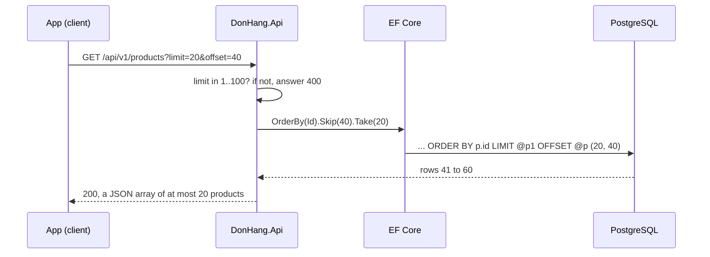

## Before you start

- [[backend.l1.get-and-status-codes]] — you know `GET /api/v1/products` answers `200` with a JSON array of every product; this lesson changes how many products that array holds.
- [[backend.l1.querying-with-linq]] — you know `.OrderBy(...)` and friends only extend a query, and EF Core turns the whole chain into one SQL statement when it runs.

## The situation

At `stage-1`, `GET /api/v1/products` sent back every row of the `products` table. That looks harmless with eight seeded products, but picture the shop with 50,000. The product screen in the app shows 20 at a time, yet every time someone opens it, the API reads 50,000 rows from PostgreSQL, turns each into JSON and sends them all over the network. The app then throws away all but 20. Nothing is broken, but the answer grows with the table, and so does the wait. How can the app ask for just the 20 products it will show, and get the right 20 each time?

## Core concepts

- **pagination** — returning a large collection one page at a time, with the client asking for the next page when it needs it; in the situation above, one page is the 20 products the screen shows.
- **query parameter** — a `name=value` pair after the `?` in a URL, such as `limit=20`, that the server reads as an option for the request; here the path still points at the product collection, and `limit` and `offset` choose which part of it comes back.
- `limit` and `offset` — the two query parameters of offset pages: `limit` is how many rows one page holds, and `offset` is how many rows to skip before the page starts.
- a fixed order — pages only fit together if every request sorts the rows the same way, on a column where no two rows share a value, such as the primary key `id`.
- a cap on `limit` — the largest page size the endpoint accepts; anything larger is refused, so no request can ask for the whole table.

## How it works



In the situation above, the app wants the third page of 20 products. It says so in the URL: `limit=20` asks for 20 rows and `offset=40` skips the first 40, the two pages it already showed. In the diagram, `@p1` and `@p` stand for those two numbers.

Before anything touches the database, `DonHang.Api` checks `limit`. A value outside 1 to 100 gets `400` and `List()` never runs. Inside that range, `List()` builds a query with `OrderBy`, `Skip` and `Take`. Because a LINQ chain only describes a query, nothing has run yet. When `List()` finally asks for the list, EF Core translates the whole chain into one SQL statement. `Skip` becomes `OFFSET` and `Take` becomes `LIMIT`, so PostgreSQL itself picks out rows 41 to 60 and sends only those 20.

The `ORDER BY` is not decoration. SQL does not promise any row order unless you ask for one. Without it, PostgreSQL may return the same rows in a different order on the next query, and "skip 40" would then skip a different 40. Page 2 and page 3 could share a product, or a product could fall between them and never appear. Sorting on `id`, which is unique, gives every row exactly one position, so each `offset` lands on the same row every time the data has not changed. If a row is added or removed between two page requests, the rows after it shift, and a page can still repeat or miss a product.

## In the Đơn Hàng system

The endpoint declares the page as parameters of `List()`:

```csharp file=DonHang.Api/Controllers/ProductsController.cs tag=stage-2 lines=17-29
    private const int MaxPageSize = 100;

    // lesson: backend.l2.offset-pagination
    // GET /api/v1/products?limit=20&offset=40. A `limit` outside 1..100 is
    // refused with 400, so no request can ask for the whole table at once.
    // Sorting by the unique id keeps every page in the same, fixed order.
    [HttpGet]
    public async Task<ActionResult<List<ProductDto>>> List(
        [FromQuery, Range(1, MaxPageSize)] int limit = 20,
        [FromQuery, Range(0, int.MaxValue)] int offset = 0,
        [FromQuery] int? maxPriceVnd = null)
    {
        IQueryable<Product> query = db.Products;
```

`[FromQuery]` tells ASP.NET Core to fill each parameter from the query parameters in the URL, so `?limit=20&offset=40` fills `limit` and `offset`. The `= 20` and `= 0` are what a request gets when it leaves them out. Ignore `maxPriceVnd` for now; it belongs to the lesson on filtering.

`Range(1, MaxPageSize)` is the cap. ASP.NET Core checks attributes like `Range` on each parameter, and `[ApiController]` on the class (just above this excerpt) makes it answer `400` itself when one fails, before `List()` starts. So a `limit` of `101` gets a Problem Details body whose `errors` entry names `limit` and says why it failed. The same kind of check refuses a negative `offset`. The endpoint does not quietly shrink `101` to 100; it refuses it, so the client learns its request was wrong.

```csharp file=DonHang.Api/Controllers/ProductsController.cs tag=stage-2 lines=38-44
        var page = await query
            .OrderBy(p => p.Id)
            .Skip(offset)
            .Take(limit)
            .Select(p => new ProductDto(p.Id, p.Name, p.PriceVnd))
            .ToListAsync();
        return Ok(page);
```

Read the chain in order: sort by `Id`, skip `offset` rows, keep `limit` rows, build a `ProductDto` from each. `ToListAsync()` is the moment the query runs. EF Core logs this call as SQL ending in `ORDER BY p.id LIMIT @p1 OFFSET @p`: `@p1` and `@p` are placeholders, and EF Core sends the values of `limit` and `offset` alongside the statement. The order matters: sorting comes first, so skipping and taking happen on a list whose order is fixed.

## Beginners often think…

- **"Pagination is the app's job; the API can return everything and the app shows 20 at a time."** → Actually the cost is paid before the app sees anything: PostgreSQL reads every row, the API turns every row into JSON, and the network carries all of it. Hiding rows on the screen saves none of that. You notice this when the product screen gets slower every month while it still shows the same 20 items.
- **"Without an ORDER BY, the database returns rows in the order they were inserted, so pages are stable anyway."** → Actually SQL leaves the order undefined without `ORDER BY`, and PostgreSQL is free to return rows in whatever order is cheapest at that moment. After updates or on a larger table, that order can change between two requests. You notice this when a user reports the same product on page 2 and page 3, and you cannot reproduce it on your machine.

## Try it (3 minutes)

1. Start the lab with `scripts/up.sh` from the Đơn Hàng root folder and wait for your prompt to return.
2. Run `curl "http://localhost:8080/api/v1/products?limit=3&offset=2"`. Keep the quotes: without them the shell reads `&` as the end of the command.
3. Run `curl -i "http://localhost:8080/api/v1/products?limit=101"`.

Expected result: the first request returns a JSON array of three products with `id` 3, 4 and 5, because two rows were skipped and three kept. The second returns `400 Bad Request` with a Problem Details body whose `errors` entry for `limit` says it must be between 1 and 100.

<details><summary>Suggested answer</summary>

With `offset=2`, PostgreSQL skips the products with `id` 1 and 2 in `id` order, then `limit=3` keeps the next three: 3, 4 and 5. The `101` never reaches `List()`: the `Range(1, MaxPageSize)` check fails first, so ASP.NET Core answers `400` and names the `limit` parameter in the body.

</details>

## Connections

- [[backend.l1.querying-with-linq]] — prerequisite: `Skip` and `Take` are two more steps in the same deferred LINQ chain that becomes one SQL statement.
- [[backend.l2.cursor-pagination]] — the fix for the problem in this lesson's pages when rows are added or removed between two requests.
- [[backend.l2.filtering-with-query-parameters]] — the same query-string idea one step further: `maxPriceVnd` decides which rows qualify before the page is cut.

## Five-line summary

1. Pagination returns a collection one page at a time, so the response stays the same size however large the table grows.
2. Offset pages use two query parameters: `limit` for the page size and `offset` for how many rows to skip first.
3. EF Core turns `.Skip(offset).Take(limit)` into `OFFSET` and `LIMIT`, so PostgreSQL sends only the page.
4. Pages need `ORDER BY` on a unique column such as `id`; without it, two pages can overlap or miss a row.
5. `ProductsController` accepts a `limit` of 1 to 100 and answers `400` to anything else instead of returning the whole table.
