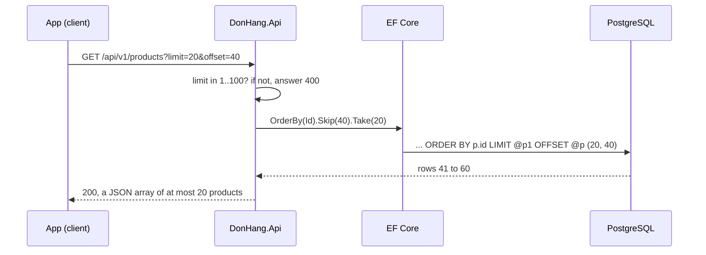

## Bạn cần biết trước

- [[backend.l1.get-and-status-codes]] — bạn đã biết `GET /api/v1/products` trả `200` kèm một mảng JSON chứa mọi sản phẩm. Bài này thay đổi số sản phẩm nằm trong mảng đó.
- [[backend.l1.querying-with-linq]] — bạn đã biết `.OrderBy(...)` và các method cùng loại chỉ nối dài câu truy vấn, và EF Core dịch cả chuỗi thành một câu SQL khi nó chạy.

## Tình huống

Ở `stage-1`, `GET /api/v1/products` gửi về mọi dòng của bảng `products`. Với tám sản phẩm có sẵn thì chuyện đó trông vô hại, nhưng hãy hình dung cửa hàng có 50.000 sản phẩm. Màn hình sản phẩm trong app mỗi lần chỉ hiện 20 sản phẩm, vậy mà mỗi khi có người mở nó, API lại đọc 50.000 dòng từ PostgreSQL, biến từng dòng thành JSON rồi gửi hết qua mạng. Sau đó app vứt đi tất cả, chỉ giữ 20. Không có gì hỏng, nhưng câu trả lời lớn dần theo bảng, và thời gian chờ cũng vậy. Làm sao để app chỉ xin đúng 20 sản phẩm nó sẽ hiện, và lần nào cũng nhận đúng 20 sản phẩm đó?

## Khái niệm cốt lõi

- **phân trang** (pagination) — trả một collection lớn theo từng trang, client xin trang tiếp theo khi cần. Trong tình huống trên, một trang là 20 sản phẩm màn hình hiện ra.
- **query parameter** — một cặp `name=value` sau dấu `?` trong URL, như `limit=20`, mà server đọc như một tùy chọn cho request. Ở đây path vẫn trỏ tới collection sản phẩm, còn `limit` và `offset` chọn phần nào của nó được trả về.
- `limit` và `offset` — hai query parameter của kiểu phân trang offset: `limit` là số dòng một trang chứa, `offset` là số dòng cần bỏ qua trước khi trang bắt đầu.
- một thứ tự cố định — các trang chỉ khớp với nhau nếu request nào cũng sắp xếp các dòng giống hệt nhau, trên một cột không có hai dòng nào trùng giá trị, như primary key `id`.
- một trần cho `limit` — cỡ trang lớn nhất endpoint chấp nhận. Lớn hơn thì bị từ chối, nên không request nào xin được cả bảng.

## Cơ chế hoạt động



Trong tình huống trên, app muốn trang thứ ba gồm 20 sản phẩm. Nó nói điều đó ngay trong URL: `limit=20` xin 20 dòng, `offset=40` bỏ qua 40 dòng đầu, tức hai trang đã hiện. Trong sơ đồ, `@p1` và `@p` là chỗ đứng cho hai con số đó.

Trước khi đụng tới database, `DonHang.Api` kiểm tra `limit`. Giá trị nằm ngoài khoảng 1 đến 100 nhận `400` và `List()` không bao giờ chạy. Trong khoảng đó, `List()` dựng một câu truy vấn với `OrderBy`, `Skip` và `Take`. Vì chuỗi LINQ chỉ mô tả câu truy vấn, lúc này chưa có gì chạy cả. Khi `List()` thật sự đòi danh sách, EF Core dịch cả chuỗi thành một câu SQL. `Skip` thành `OFFSET`, `Take` thành `LIMIT`, nên chính PostgreSQL chọn ra các dòng 41 đến 60 và chỉ gửi 20 dòng đó.

`ORDER BY` không phải để trang trí. SQL không hứa thứ tự dòng nào trừ khi bạn yêu cầu. Thiếu nó, lần truy vấn sau PostgreSQL có thể trả cùng những dòng đó theo thứ tự khác, và "bỏ qua 40" khi đó sẽ bỏ qua 40 dòng khác. Trang 2 và trang 3 có thể có chung một sản phẩm, hoặc một sản phẩm rơi vào khe giữa hai trang và không bao giờ xuất hiện. Sắp xếp theo `id`, vốn là duy nhất, cho mỗi dòng đúng một vị trí, nên mỗi `offset` rơi vào cùng một dòng mỗi lần, miễn là dữ liệu không đổi. Nếu có dòng được thêm hoặc bị xóa giữa hai request lấy trang, các dòng phía sau sẽ dịch chỗ, và một trang vẫn có thể lặp hoặc sót một sản phẩm.

## Trong hệ thống Đơn Hàng

Endpoint khai báo trang dưới dạng các tham số của `List()`:

```csharp file=DonHang.Api/Controllers/ProductsController.cs tag=stage-2 lines=17-29
    private const int MaxPageSize = 100;

    // lesson: backend.l2.offset-pagination
    // GET /api/v1/products?limit=20&offset=40. A `limit` outside 1..100 is
    // refused with 400, so no request can ask for the whole table at once.
    // Sorting by the unique id keeps every page in the same, fixed order.
    [HttpGet]
    public async Task<ActionResult<List<ProductDto>>> List(
        [FromQuery, Range(1, MaxPageSize)] int limit = 20,
        [FromQuery, Range(0, int.MaxValue)] int offset = 0,
        [FromQuery] int? maxPriceVnd = null)
    {
        IQueryable<Product> query = db.Products;
```

`[FromQuery]` bảo ASP.NET Core điền từng tham số từ các query parameter trong URL, nên `?limit=20&offset=40` điền vào `limit` và `offset`. `= 20` và `= 0` là giá trị request nhận được khi bỏ trống chúng. Tạm bỏ qua `maxPriceVnd`, nó thuộc về bài lọc dữ liệu.

`Range(1, MaxPageSize)` chính là cái trần. ASP.NET Core kiểm tra các attribute như `Range` trên từng tham số, và `[ApiController]` trên class (ngay phía trên đoạn trích này) khiến nó tự trả `400` khi một kiểm tra thất bại, trước khi `List()` bắt đầu. Vì vậy `limit` bằng `101` nhận một body Problem Details có mục `errors` nêu tên `limit` và lý do thất bại. Kiểu kiểm tra tương tự cũng từ chối `offset` âm. Endpoint không lặng lẽ thu `101` về 100 mà từ chối hẳn, để client biết request của mình sai.

```csharp file=DonHang.Api/Controllers/ProductsController.cs tag=stage-2 lines=38-44
        var page = await query
            .OrderBy(p => p.Id)
            .Skip(offset)
            .Take(limit)
            .Select(p => new ProductDto(p.Id, p.Name, p.PriceVnd))
            .ToListAsync();
        return Ok(page);
```

Đọc chuỗi theo thứ tự: sắp xếp theo `Id`, bỏ qua `offset` dòng, giữ `limit` dòng, dựng một `ProductDto` từ mỗi dòng. `ToListAsync()` là lúc câu truy vấn chạy. EF Core ghi log lời gọi này dưới dạng SQL kết thúc bằng `ORDER BY p.id LIMIT @p1 OFFSET @p`: `@p1` và `@p` là chỗ giữ chỗ, còn giá trị của `limit` và `offset` được EF Core gửi kèm câu lệnh. Thứ tự ở đây quan trọng: sắp xếp đi trước, nên bỏ qua và lấy dòng diễn ra trên một danh sách có thứ tự cố định.

## Người mới hay nghĩ rằng…

- **"Phân trang là việc của app. API cứ trả hết, app hiện 20 cái mỗi lần là được."** → Thực ra chi phí đã phải trả trước khi app thấy gì: PostgreSQL đọc mọi dòng, API biến mọi dòng thành JSON, và mạng chở hết chỗ đó. Giấu bớt dòng trên màn hình không tiết kiệm được chút nào. Bạn sẽ nhận ra khi màn hình sản phẩm chậm dần theo từng tháng, dù nó vẫn chỉ hiện đúng 20 món.
- **"Không có ORDER BY thì database trả dòng theo thứ tự thêm vào, nên các trang vẫn ổn định."** → Thực ra SQL để thứ tự không xác định khi thiếu `ORDER BY`, và PostgreSQL được tự do trả dòng theo thứ tự nào rẻ nhất lúc đó. Sau vài lần update, hoặc khi bảng lớn hơn, thứ tự đó có thể đổi giữa hai request. Bạn sẽ nhận ra khi người dùng báo cùng một sản phẩm xuất hiện ở cả trang 2 lẫn trang 3, còn bạn thì không tái hiện được trên máy mình.

## Thử ngay (3 phút)

1. Khởi động lab bằng `scripts/up.sh` từ thư mục gốc của Đơn Hàng và chờ tới khi dấu nhắc lệnh hiện lại.
2. Chạy `curl "http://localhost:8080/api/v1/products?limit=3&offset=2"`. Giữ nguyên dấu ngoặc kép: thiếu chúng, shell sẽ hiểu `&` là chỗ kết thúc lệnh.
3. Chạy `curl -i "http://localhost:8080/api/v1/products?limit=101"`.

Kết quả mong đợi: request đầu trả một mảng JSON gồm ba sản phẩm có `id` 3, 4 và 5, vì hai dòng bị bỏ qua và ba dòng được giữ. Request thứ hai trả `400 Bad Request` kèm body Problem Details, trong đó mục `errors` cho `limit` nói giá trị phải nằm trong khoảng 1 đến 100.

<details><summary>Gợi ý đáp án</summary>

Với `offset=2`, PostgreSQL bỏ qua các sản phẩm có `id` 1 và 2 theo thứ tự `id`, rồi `limit=3` giữ ba sản phẩm kế tiếp: 3, 4 và 5. Giá trị `101` không bao giờ tới được `List()`: kiểm tra `Range(1, MaxPageSize)` thất bại trước, nên ASP.NET Core trả `400` và nêu tên tham số `limit` trong body.

</details>

## Liên hệ

- [[backend.l1.querying-with-linq]] — bài cần học trước: `Skip` và `Take` là thêm hai bước trong cùng chuỗi LINQ trì hoãn, rồi trở thành một câu SQL.
- [[backend.l2.cursor-pagination]] — cách sửa vấn đề của các trang trong bài này khi có dòng được thêm hoặc bị xóa giữa hai request.
- [[backend.l2.filtering-with-query-parameters]] — cùng ý tưởng query parameter, đi thêm một bước: `maxPriceVnd` quyết định dòng nào đủ điều kiện trước khi trang được cắt.

## Tóm tắt 5 dòng

1. Phân trang trả một collection theo từng trang, nên câu trả lời giữ nguyên cỡ dù bảng lớn tới đâu.
2. Trang offset dùng hai query parameter: `limit` cho cỡ trang và `offset` cho số dòng cần bỏ qua trước.
3. EF Core biến `.Skip(offset).Take(limit)` thành `OFFSET` và `LIMIT`, nên PostgreSQL chỉ gửi đúng trang đó.
4. Các trang cần `ORDER BY` trên một cột duy nhất như `id`, thiếu nó thì hai trang có thể trùng hoặc sót dòng.
5. `ProductsController` nhận `limit` từ 1 đến 100 và trả `400` cho mọi giá trị khác, thay vì trả cả bảng.
