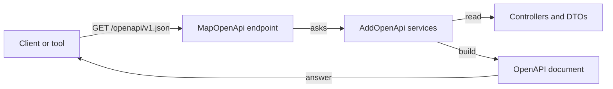

## Before you start

- [[backend.l2.api-versioning]] — you know Đơn Hàng answers under both `/api/v1` and `/api/v2`, and that version 2 has only two order endpoints; this lesson is about how a client finds that out.

## The situation

A partner shop wants to place orders from its own script. Before writing a line, its developer asks you three things: which endpoints exist, which fields each one takes and returns, and what is under `/api/v2`. You could write the answer on a wiki page. But the day someone renames a DTO property, as in the breaking-changes lesson, that page would still show the old name, and nothing would warn anyone. The partner would build against a description that is no longer true. How can a client learn the exact shape of the API from something that cannot drift away from the code?

## Core concepts

- **OpenAPI** — a standard, machine-readable format, written in JSON or YAML (another text format for the same kind of data), that describes an API's endpoints, their parameters, and the shapes of their requests and responses.
- An OpenAPI document — one file in that format describing one API; in Đơn Hàng, it is what `GET /openapi/v1.json` answers with.
- The document name — the name the document is registered under in `Program.cs`, `v1` unless you choose another, which becomes part of the document's URL.

## How it works



Nobody writes the OpenAPI document of Đơn Hàng. In the situation above, the answer to the partner's questions is built by the API itself, with ASP.NET Core 10. `AddOpenApi` comes from the `Microsoft.AspNetCore.OpenApi` package, a library `DonHang.Api` already references, and registers the services that build the document. `MapOpenApi` adds the endpoint that serves it, by default at `/openapi/v1.json`. Each time a request reaches that endpoint, those services look at the controllers, their routes and parameters, and the DTOs they read and return, and build the document from them.

Because the document is built from the code, it changes when the code changes: a renamed field or a new endpoint cannot be forgotten. Rename `PriceVnd` in `ProductDto`, rebuild, and the document shows the new field name. It describes what the code declares, the request bodies and the success response types of each endpoint, so a client reads those shapes instead of guessing them from a few example responses. Tools can read it too, because it is a standard format rather than prose.

The `v1` in `/openapi/v1.json` is the name of the document, not the `/api/v1` prefix of the URLs. `AddOpenApi()` with no arguments registers one document named `v1`, and that name goes into its URL. The name happens to match Đơn Hàng's first URL prefix, but the one document describes every endpoint, both versions included. The Try it section shows `/api/v2/orders` listed inside `v1.json`.

## In the Đơn Hàng system

The document is switched on with one line in `Program.cs`:

```csharp file=DonHang.Api/Program.cs tag=stage-2 lines=69-73
// lesson: backend.l2.openapi-contract
// Builds an OpenAPI document from the controllers and DTOs while the app
// runs; MapOpenApi below serves it at /openapi/v1.json. "v1" is the
// document's name, not the /api/v1 prefix of the URLs it describes.
builder.Services.AddOpenApi();
```

`AddOpenApi()` registers the document. `app.MapOpenApi()` serves it; it sits further down, right after `app.MapControllers()`, the line that maps the controllers' endpoints. Some apps serve the document only while developing, by wrapping `MapOpenApi` in a check of which environment the app runs in; the starting project that ASP.NET Core generates for a new Web API does that. Đơn Hàng has no such check, so every running copy of the API serves its document, where partners can read it. Caddy, Đơn Hàng's reverse proxy on `localhost:8080`, passes `/openapi/*` on to the API as it does `/api/v1/*`.

This script fetches the document and lists the paths it describes:

```bash file=scripts/backend/openapi-document.sh tag=stage-2 lines=1-20
#!/usr/bin/env bash
# Fetch the OpenAPI document DonHang.Api builds from its own code, and list the endpoints it describes.
set -euo pipefail
# Everything below runs inside the lab box; this line puts it there.
[ -f /.dockerenv ] || exec "$(dirname "$0")/../lab-run.sh" "$0" "$@"

document=$(mktemp)
trap 'rm -f "$document"' EXIT

echo "GET /openapi/v1.json:"
curl -sS -o "$document" -w '  %{http_code}, %{content_type}\n' http://localhost:8080/openapi/v1.json
echo

echo "the start of the document:"
head -n 11 "$document"
echo

# Each path is a key four spaces in; each method under it is a key six spaces in.
echo "every path and method it describes:"
grep -E '^    "/|^      "(get|post|put|patch|delete)"' "$document" | sed -E 's/"//g; s/: *[{].*$//'
```

```text output=true
GET /openapi/v1.json:
  200, application/json;charset=utf-8

the start of the document:
...
every path and method it describes:
    /api/v1/orders
      post
      get
    /api/v1/orders/{id}
      get
    /api/v1/orders/{id}/cancel
      patch
    /api/v1/orders/{id}/ship
      patch
    /api/v1/products
      get
    /api/v1/products/{id}
      get
      patch
    /api/v2/orders
      post
    /api/v2/orders/{id}
      get
```

Its first lines move it into the lab box, the prepared container that `scripts/up.sh` starts, so nothing extra is needed. It then uses `curl`, a command-line tool that sends an HTTP request, to save the document to a temporary file, prints its first lines (left out here, marked `...`), and keeps only the lines that name a path or an HTTP method. The answer is `200` with a JSON body, the machine-readable format this lesson is about. Every endpoint of both versions is there, and nobody listed them by hand: they came from the controllers.

## Beginners often think…

- **"An OpenAPI document is written by hand and has to be kept in sync with the code separately."** → Actually, in Đơn Hàng the document is built from the controllers and DTOs each time someone asks for it, so a renamed field or new endpoint cannot be left out. A hand-written file is possible, but it can go stale. You notice this when you add an endpoint and it appears in `/openapi/v1.json` without anyone editing a document.
- **"OpenAPI is a web page for people to click through the endpoints."** → Actually it is a data format, written so that programs can read it, though people can too; pages that let people browse an API are built on top of it by other tools. Đơn Hàng serves only the JSON. You notice this when you open `/openapi/v1.json` and see plain JSON, with no buttons or forms.

## Try it (3 minutes)

1. From the Đơn Hàng project's root folder, start the example system with `scripts/up.sh`, then run `scripts/backend/openapi-document.sh`.
2. Find the two `/api/v2` paths in the list the script prints, and note which document URL the script fetched them from.
3. Run `curl -s http://localhost:8080/openapi/v1.json | grep -A 4 '"ProductDto": {'` to see where the fields of `ProductDto` sit in the document; `grep -A 4` prints the matching line and the 4 lines after it.

Expected result: `200, application/json;charset=utf-8`, then the same list of paths as above, ending with `/api/v2/orders` (`post`) and `/api/v2/orders/{id}` (`get`). They sit in `/openapi/v1.json`: the `v1` names the document, not the URL prefix of what it describes. Step 3 prints `"ProductDto": {`, then `"required": [` and the three names `"id"`, `"name"` and `"priceVnd"`, the same field names a client reads, each property name with its first letter lowercased. The `required` list names the fields that are always present.

## Connections

- [[backend.l2.api-versioning]] — the two versions this one document describes side by side.
- [[backend.l2.breaking-changes]] — the field names and types a client relies on, which this document makes visible to every client.
- [[backend.l1.dtos-and-serialization]] — the DTOs the document's request and response shapes are built from.

## Five-line summary

1. An OpenAPI document describes an API's endpoints, parameters and request and response shapes in a standard JSON or YAML format.
2. In ASP.NET Core 10, `MapOpenApi` serves the document, and the services `AddOpenApi` registers build it from controllers and DTOs on each request.
3. By default the document is served at `/openapi/v1.json`; Đơn Hàng serves it in every environment, through Caddy.
4. Because it is generated from the code, the document changes with the code, so clients read the shapes it declares instead of guessing.
5. The `v1` in `/openapi/v1.json` names the document; Đơn Hàng's one document lists both `/api/v1` and `/api/v2`.
