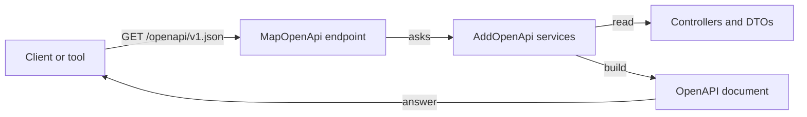

## Bạn cần biết trước

- [[backend.l2.api-versioning]] — bạn đã biết Đơn Hàng trả lời dưới cả `/api/v1` lẫn `/api/v2`, và version 2 chỉ có hai endpoint đơn hàng; bài này nói về cách một client tự tìm ra điều đó.

## Tình huống

Một cửa hàng đối tác muốn đặt đơn từ script riêng của họ. Trước khi viết dòng nào, developer bên đó hỏi bạn ba điều: có những endpoint nào, mỗi endpoint nhận và trả về những field nào, và dưới `/api/v2` có gì. Bạn có thể viết câu trả lời lên một trang wiki. Nhưng hôm nào có người đổi tên một property trong DTO, như ở bài về breaking change, trang đó vẫn hiện tên cũ và chẳng có gì cảnh báo ai. Đối tác sẽ viết code theo một bản mô tả không còn đúng. Làm sao client biết chính xác hình dạng của API từ một thứ không thể lệch khỏi code?

## Khái niệm cốt lõi

- **OpenAPI** (định dạng chuẩn, máy đọc được, mô tả endpoint, tham số và hình dạng request/response của một API) — một định dạng chuẩn mà máy đọc được, viết bằng JSON hoặc YAML (một định dạng văn bản khác cho cùng loại dữ liệu), mô tả các endpoint của một API, tham số của chúng, và hình dạng request, response của chúng.
- Tài liệu OpenAPI — một file theo định dạng đó, mô tả một API. Trong Đơn Hàng, đó là thứ `GET /openapi/v1.json` trả về.
- Tên tài liệu — cái tên mà tài liệu được đăng ký trong `Program.cs`, mặc định là `v1` nếu bạn không chọn tên khác, và nó trở thành một phần URL của tài liệu.

## Cơ chế hoạt động



Không ai viết tài liệu OpenAPI của Đơn Hàng cả. Trong tình huống trên, câu trả lời cho các câu hỏi của đối tác do chính API dựng ra, bằng ASP.NET Core 10. `AddOpenApi` đến từ package `Microsoft.AspNetCore.OpenApi`, một thư viện mà `DonHang.Api` đã tham chiếu sẵn, và nó đăng ký các service dựng tài liệu. `MapOpenApi` thêm endpoint phục vụ tài liệu đó, mặc định ở `/openapi/v1.json`. Mỗi lần có request tới endpoint này, các service đó xem xét các controller, route và tham số của chúng, cùng các DTO chúng đọc vào và trả ra, rồi dựng tài liệu từ đó.

Vì tài liệu được dựng từ code, nó thay đổi khi code thay đổi: một field bị đổi tên hay một endpoint mới không thể bị bỏ sót. Đổi tên `PriceVnd` trong `ProductDto`, build lại, và tài liệu hiện tên field mới. Nó mô tả những gì code khai báo, tức body của request và kiểu response thành công của mỗi endpoint, nên client đọc các hình dạng đó thay vì đoán chúng từ vài response mẫu. Công cụ cũng đọc được nó, vì đây là một định dạng chuẩn chứ không phải văn xuôi.

`v1` trong `/openapi/v1.json` là tên của tài liệu, không phải tiền tố `/api/v1` của các URL. `AddOpenApi()` không truyền đối số sẽ đăng ký một tài liệu tên `v1`, và cái tên đó đi vào URL của nó. Tên này tình cờ trùng với tiền tố URL đầu tiên của Đơn Hàng, nhưng một tài liệu ấy mô tả mọi endpoint, gồm cả hai version. Phần Thử ngay cho thấy `/api/v2/orders` nằm ngay trong `v1.json`.

## Trong hệ thống Đơn Hàng

Tài liệu được bật bằng một dòng trong `Program.cs`:

```csharp file=DonHang.Api/Program.cs tag=stage-2 lines=69-73
// lesson: backend.l2.openapi-contract
// Builds an OpenAPI document from the controllers and DTOs while the app
// runs; MapOpenApi below serves it at /openapi/v1.json. "v1" is the
// document's name, not the /api/v1 prefix of the URLs it describes.
builder.Services.AddOpenApi();
```

`AddOpenApi()` đăng ký tài liệu. `app.MapOpenApi()` phục vụ nó, và dòng này nằm phía dưới, ngay sau `app.MapControllers()`, dòng map các endpoint của controller. Có những app chỉ phục vụ tài liệu lúc đang phát triển, bằng cách bọc `MapOpenApi` trong một phép kiểm tra xem app đang chạy ở môi trường nào. Project khởi đầu mà ASP.NET Core sinh ra cho một Web API mới làm đúng như vậy. Đơn Hàng không có phép kiểm tra đó, nên mọi bản API đang chạy đều phục vụ tài liệu của nó, để đối tác đọc được. Caddy, reverse proxy của Đơn Hàng ở `localhost:8080`, chuyển `/openapi/*` tới API y như với `/api/v1/*`.

Script này tải tài liệu về và liệt kê các đường dẫn nó mô tả:

```bash file=scripts/backend/openapi-document.sh tag=stage-2 lines=1-20
#!/usr/bin/env bash
# Fetch the OpenAPI document DonHang.Api builds from its own code, and list the endpoints it describes.
set -euo pipefail
# Everything below runs inside the lab box; this line puts it there.
[ -f /.dockerenv ] || exec "$(dirname "$0")/../lab-run.sh" "$0" "$@"

document=$(mktemp)
trap 'rm -f "$document"' EXIT

echo "GET /openapi/v1.json:"
curl -sS -o "$document" -w '  %{http_code}, %{content_type}\n' http://localhost:8080/openapi/v1.json
echo

echo "the start of the document:"
head -n 11 "$document"
echo

# Each path is a key four spaces in; each method under it is a key six spaces in.
echo "every path and method it describes:"
grep -E '^    "/|^      "(get|post|put|patch|delete)"' "$document" | sed -E 's/"//g; s/: *[{].*$//'
```

```text output=true
GET /openapi/v1.json:
  200, application/json;charset=utf-8

the start of the document:
...
every path and method it describes:
    /api/v1/orders
      post
      get
    /api/v1/orders/{id}
      get
    /api/v1/orders/{id}/cancel
      patch
    /api/v1/orders/{id}/ship
      patch
    /api/v1/products
      get
    /api/v1/products/{id}
      get
      patch
    /api/v2/orders
      post
    /api/v2/orders/{id}
      get
```

Mấy dòng đầu của script đưa nó vào lab box, container chuẩn bị sẵn mà `scripts/up.sh` khởi động, nên bạn không cần làm gì thêm. Sau đó nó dùng `curl`, một công cụ dòng lệnh gửi HTTP request, để lưu tài liệu vào một file tạm, in mấy dòng đầu (lược đi ở đây, đánh dấu `...`), và chỉ giữ lại những dòng nêu một đường dẫn hay một HTTP method. Câu trả lời là `200` với body JSON, đúng định dạng máy đọc được mà bài này nói tới. Mọi endpoint của cả hai version đều có mặt, và không ai liệt kê chúng bằng tay: chúng đến từ các controller.

## Người mới hay nghĩ rằng…

- **"Tài liệu OpenAPI được viết tay và phải tự tay giữ cho khớp với code."** → Thực ra, trong Đơn Hàng tài liệu được dựng từ controller và DTO mỗi lần có người hỏi tới nó, nên một field đổi tên hay endpoint mới không thể bị bỏ sót. Viết tay một file thì vẫn làm được, nhưng nó có thể lỗi thời. Bạn sẽ nhận ra khi thêm một endpoint và thấy nó hiện trong `/openapi/v1.json` mà không ai sửa tài liệu nào.
- **"OpenAPI là một trang web để người ta bấm thử từng endpoint."** → Thực ra nó là một định dạng dữ liệu, viết ra để chương trình đọc được, dù người cũng đọc được. Các trang cho người duyệt API là do công cụ khác dựng lên từ nó. Đơn Hàng chỉ phục vụ bản JSON. Bạn sẽ nhận ra khi mở `/openapi/v1.json` và chỉ thấy JSON thuần, không nút bấm hay form nào.

## Thử ngay (3 phút)

1. Từ thư mục gốc của dự án Đơn Hàng, khởi động hệ thống ví dụ bằng `scripts/up.sh`, rồi chạy `scripts/backend/openapi-document.sh`.
2. Tìm hai đường dẫn `/api/v2` trong danh sách script in ra, và ghi lại script đã lấy chúng từ URL tài liệu nào.
3. Chạy `curl -s http://localhost:8080/openapi/v1.json | grep -A 4 '"ProductDto": {'` để xem các field của `ProductDto` nằm ở đâu trong tài liệu. `grep -A 4` in dòng khớp và 4 dòng ngay sau nó.

Kết quả mong đợi: `200, application/json;charset=utf-8`, rồi đúng danh sách đường dẫn như trên, kết thúc bằng `/api/v2/orders` (`post`) và `/api/v2/orders/{id}` (`get`). Chúng nằm trong `/openapi/v1.json`: `v1` là tên tài liệu, không phải tiền tố URL của những gì nó mô tả. Bước 3 in ra `"ProductDto": {`, rồi `"required": [` và ba tên `"id"`, `"name"`, `"priceVnd"`, đúng những tên field mà client đọc, tức tên property với chữ cái đầu viết thường. Danh sách `required` nêu các field luôn có mặt.

## Liên hệ

- [[backend.l2.api-versioning]] — hai version mà một tài liệu này mô tả song song.
- [[backend.l2.breaking-changes]] — những tên và kiểu field mà client dựa vào, được tài liệu này phơi ra cho mọi client thấy.
- [[backend.l1.dtos-and-serialization]] — các DTO mà hình dạng request và response trong tài liệu được dựng từ đó.

## Tóm tắt 5 dòng

1. Tài liệu OpenAPI mô tả endpoint, tham số và hình dạng request, response của một API theo định dạng chuẩn JSON hoặc YAML.
2. Trong ASP.NET Core 10, `MapOpenApi` phục vụ tài liệu, còn các service do `AddOpenApi` đăng ký dựng nó từ controller và DTO ở mỗi request.
3. Mặc định tài liệu được phục vụ ở `/openapi/v1.json`; Đơn Hàng phục vụ nó ở mọi môi trường, qua Caddy.
4. Vì được sinh từ code, tài liệu đổi theo code, nên client đọc các hình dạng nó khai báo thay vì đoán.
5. `v1` trong `/openapi/v1.json` là tên tài liệu; một tài liệu duy nhất của Đơn Hàng liệt kê cả `/api/v1` lẫn `/api/v2`.
