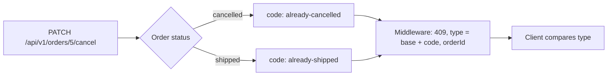

## Before you start

- [[backend.l1.errors-and-problem-details]] — you know the Problem Details fields and that `type` names the kind of problem while `detail` names this one occurrence.
- [[backend.l1.choosing-an-error-status]] — you know `409` means the request names something real that conflicts with its current state.

## The situation

You're adding a cancel button to the Đơn Hàng client. At stage-2 the API finally refuses to cancel an order that has shipped: `PATCH /api/v1/orders/{id}/cancel` answers `409`. It also answers `409` when the order is already cancelled, for example when the customer taps cancel again on a screen opened before the first cancel went through. You want different reactions: for the repeat, quietly show the order as cancelled; for a shipped order, tell the customer it is too late. Both responses have the same status code and the same `title`, "Order status does not allow this". What in the body tells your code which of the two happened?

## Core concepts

- Member — RFC 9457's word for a field of the Problem Details JSON body; `type`, `title`, `status`, `detail` and `instance` are its standard members; this lesson does not use `instance`.
- `type` — the member holding a string written like a web address, such as `https://donhang.local/problems/already-shipped`, that names the kind of problem; a client compares it as text and should not open it automatically.
- Problem type — one kind of problem, such as "this order is already cancelled", identified by one `type` value that every occurrence of that kind repeats.
- `about:blank` — the `type` value a client assumes when the member is absent, meaning the problem says nothing beyond its status code.
- Extension member — a member an API adds beside the standard ones, such as `orderId`, carrying data about this occurrence.

## How it works



In the situation above, the order's current status decides the outcome. An order that is already cancelled and an order that has shipped both stop the cancel, but each names its reason with its own short code. The middleware turns either one into a `409` and builds `type` from a fixed base, `https://donhang.local/problems/`, plus that code. So the two responses differ in `type`, which ends in `already-cancelled` or in `already-shipped`, and in the human-readable `detail`; `type` is the one meant for code to compare.

RFC 9457 makes `type` the primary identifier of a problem type: a client tells problems apart by `type`, not by reading the text. The `title` is advisory, a short summary for a human reader. Here it is even identical for both problems, so comparing it would not work at all. The `detail` changes with every order id, and the RFC says clients should not parse it for information.

When a response has no `type` at all, RFC 9457 says to treat it as `about:blank`. That value tells the client only what the status code already says. The middleware passes no `type` when it answers a `KeyNotFoundException` with `404` or an `ArgumentException` with `400`, because a missing order or an invalid argument needs nothing more specific.

The body also carries `orderId`, an extension member. The RFC lets a problem type add members like this, and requires a client to ignore any extension it does not recognise. An older client that only knows the standard members still reads the body correctly.

## In the Đơn Hàng system

```csharp file=DonHang.Domain/Entities.cs tag=stage-2 lines=82-88
    // lesson: design.l2.domain-model
    public void Cancel()
    {
        if (Status == "cancelled") throw new OrderStatusException(Id, "already-cancelled", $"order {Id} is already cancelled");
        if (Status == "shipped") throw new OrderStatusException(Id, "already-shipped", $"order {Id} has already shipped");
        Status = "cancelled";
    }
```

`Order.Cancel()` checks the two statuses that make cancelling impossible and throws `OrderStatusException` for each. The second argument is the code, `already-cancelled` or `already-shipped`; the third is the message that ends up in `detail`. Notice that nothing here mentions HTTP or `409`: `DonHang.Domain` holds `Order` and its rules, and choosing the HTTP answer is left to the middleware.

```csharp file=DonHang.Api/Middleware/ExceptionHandlingMiddleware.cs tag=stage-2 lines=34-41
        // lesson: design.l2.domain-model
        // The domain says which rule was broken (ex.Code); only here does that become HTTP.
        catch (OrderStatusException ex)
        {
            logger.LogWarning(ex, "order {OrderId} cannot change status: {Code}", ex.OrderId, ex.Code);
            await WriteProblemAsync(context, StatusCodes.Status409Conflict, "Order status does not allow this", ex.Message,
                type: ProblemTypeBase + ex.Code, orderId: ex.OrderId);
        }
```

This is where the code becomes HTTP. `WriteProblemAsync` writes the body: status `409`, the same `title` for every `OrderStatusException`, `ex.Message` as `detail`, then `type` and `orderId`. `type` carries the code, appended to `ProblemTypeBase`, a constant at the top of the file holding `https://donhang.local/problems/`. `orderId: ex.OrderId` adds the order id as the `orderId` extension member. The `catch` blocks for `KeyNotFoundException` (`404`) and `ArgumentException` (`400`) pass no `type`, so their bodies omit it.

## Beginners often think…

- **"A client should compare the `title` text to tell one error from another."** → Actually `title` is a human-readable summary, and two different problem types may share one, as both cancel refusals here do; `type` is the identifier RFC 9457 tells clients to use. You notice this when your client shows "too late, it has shipped" to a customer whose order was already cancelled, because both bodies had the same `title`.
- **"Two errors with the same status code are the same error."** → Actually the status code only names the class of failure, such as a conflict with the resource's current state; many different problems fit one status, and `type` says which one this is. You notice this when a single `409` branch in your client handles a repeated cancel and a shipped order the same way, and one of the two messages is wrong.

## Try it (3 minutes)

1. Open `DonHang.Domain/Entities.cs` at `stage-2` and read `Ship()`, just below `Cancel()`.
2. Work out which code it throws when staff try to ship an order whose status is still `new`, then build the `type` the middleware sends for it.

Expected result: `Ship()` throws `OrderStatusException` with the code `not-paid`, so the response is `409` with `type` `https://donhang.local/problems/not-paid`. The test `ShipOrder_StaffAndNewOrder_Returns409NotPaid` in `OrdersApiTests.cs`, which calls the API end to end, checks exactly this value.

<details><summary>Suggested answer</summary>

An order in `new` is neither `cancelled` nor `shipped`, so `Ship()` reaches its third check, `Status != "paid"`, and throws with the code `not-paid`. The middleware appends that code to `https://donhang.local/problems/`. A client that already handles `already-cancelled` and `already-shipped` sees a third `type` under the same `409` and can react to it separately.

</details>

## Connections

- [[backend.l1.errors-and-problem-details]] — the body shape this lesson builds on; here `type` stops being optional decoration and becomes what a client branches on.
- [[backend.l1.choosing-an-error-status]] — chose `409` for a conflict with the current state; this lesson tells apart the different conflicts inside that one status.
- [[design.l2.domain-model]] — explains why `Order` itself refuses the change and only names a code, leaving HTTP to the middleware.
- [[frontend.l2.server-errors-in-forms]] — the client side: how `DonHang.App` reads these bodies and falls back to `about:blank`.

## Five-line summary

1. A client tells two problems apart by the Problem Details `type`, not by `title` or `detail`, even when both share one status code.
2. RFC 9457 makes `type` the primary identifier of a problem type; `title` is only an advisory summary for humans.
3. A body with no `type` is read as `about:blank`: the problem means nothing beyond its status code.
4. Cancelling an already cancelled or a shipped order both answer `409`, with `type` ending in `already-cancelled` or `already-shipped`.
5. Extension members such as `orderId` carry extra data, and a client must ignore any extension it does not recognise.
