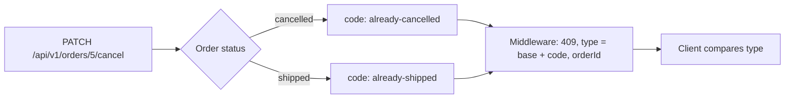

## Bạn cần biết trước

- [[backend.l1.errors-and-problem-details]] — bạn biết các field của Problem Details, và biết `type` gọi tên loại vấn đề còn `detail` nói về đúng lần xảy ra này.
- [[backend.l1.choosing-an-error-status]] — bạn biết `409` nghĩa là request nhắm tới một thứ có thật nhưng xung đột với trạng thái hiện tại của nó.

## Tình huống

Bạn đang thêm nút hủy đơn vào client Đơn Hàng. Tới stage-2, API cuối cùng cũng từ chối hủy một đơn đã giao: `PATCH /api/v1/orders/{id}/cancel` trả `409`. Nó cũng trả `409` khi đơn đã bị hủy rồi, chẳng hạn khi khách bấm hủy lần nữa trên một màn hình mở từ trước lúc lần hủy đầu hoàn tất. Bạn muốn phản ứng khác nhau: với lần lặp lại, lặng lẽ hiện đơn là đã hủy. Với đơn đã giao, báo khách là đã quá muộn. Cả hai response có cùng status code và cùng `title`, "Order status does not allow this". Thứ gì trong body cho code của bạn biết chuyện nào đã xảy ra?

## Khái niệm cốt lõi

- Member — cách RFC 9457 gọi một field của body JSON Problem Details. `type`, `title`, `status`, `detail` và `instance` là các member chuẩn, bài này không dùng `instance`.
- `type` — member chứa một chuỗi viết giống địa chỉ web, ví dụ `https://donhang.local/problems/already-shipped`, dùng để gọi tên loại vấn đề. Client so sánh nó như văn bản và không nên tự động mở nó.
- Problem type — một loại vấn đề, ví dụ "đơn này đã bị hủy rồi", được định danh bằng một giá trị `type` mà mọi lần xảy ra loại đó đều lặp lại.
- `about:blank` — giá trị `type` mà client ngầm hiểu khi member này vắng mặt, nghĩa là vấn đề không nói gì thêm ngoài status code.
- Extension member — member mà API thêm vào bên cạnh các member chuẩn, ví dụ `orderId`, mang dữ liệu về lần xảy ra này.

## Cơ chế hoạt động



Trong tình huống trên, trạng thái hiện tại của đơn quyết định kết quả. Đơn đã hủy và đơn đã giao đều chặn lệnh hủy, nhưng mỗi trường hợp gọi tên lý do bằng một mã ngắn riêng. Middleware biến cả hai thành `409` và ghép `type` từ một phần gốc cố định, `https://donhang.local/problems/`, với mã đó. Vì vậy hai response khác nhau ở `type`, kết thúc bằng `already-cancelled` hoặc `already-shipped`, và ở `detail` dành cho người đọc. Trong hai cái đó, `type` mới là thứ để code so sánh.

RFC 9457 coi `type` là định danh chính của một problem type: client phân biệt các vấn đề bằng `type`, không phải bằng cách đọc chữ. `title` chỉ để tham khảo, là câu tóm tắt ngắn cho người đọc. Ở đây nó còn giống hệt nhau cho cả hai vấn đề, nên so sánh nó hoàn toàn vô ích. `detail` đổi theo từng id đơn, và RFC nói client không nên phân tích nó để lấy thông tin.

Khi response không có `type`, RFC 9457 bảo hãy coi nó là `about:blank`. Giá trị này chỉ cho client biết đúng điều status code đã nói. Middleware không truyền `type` khi trả `404` cho `KeyNotFoundException` hay `400` cho `ArgumentException`, vì đơn không tồn tại hay tham số sai không cần gì cụ thể hơn.

Body còn mang `orderId`, một extension member. RFC cho phép một problem type thêm member như vậy, và bắt buộc client bỏ qua mọi extension nó không nhận ra. Một client cũ chỉ biết các member chuẩn vẫn đọc body đúng.

## Trong hệ thống Đơn Hàng

```csharp file=DonHang.Domain/Entities.cs tag=stage-2 lines=82-88
    // lesson: design.l2.domain-model
    public void Cancel()
    {
        if (Status == "cancelled") throw new OrderStatusException(Id, "already-cancelled", $"order {Id} is already cancelled");
        if (Status == "shipped") throw new OrderStatusException(Id, "already-shipped", $"order {Id} has already shipped");
        Status = "cancelled";
    }
```

`Order.Cancel()` kiểm tra hai trạng thái khiến việc hủy không thể xảy ra, và ném `OrderStatusException` cho mỗi trạng thái. Tham số thứ hai là mã, `already-cancelled` hoặc `already-shipped`. Tham số thứ ba là message, thứ sẽ nằm trong `detail`. Để ý rằng ở đây không có gì nhắc tới HTTP hay `409`: `DonHang.Domain` chứa `Order` và các quy tắc của nó, còn chọn câu trả lời HTTP là việc của middleware.

```csharp file=DonHang.Api/Middleware/ExceptionHandlingMiddleware.cs tag=stage-2 lines=34-41
        // lesson: design.l2.domain-model
        // The domain says which rule was broken (ex.Code); only here does that become HTTP.
        catch (OrderStatusException ex)
        {
            logger.LogWarning(ex, "order {OrderId} cannot change status: {Code}", ex.OrderId, ex.Code);
            await WriteProblemAsync(context, StatusCodes.Status409Conflict, "Order status does not allow this", ex.Message,
                type: ProblemTypeBase + ex.Code, orderId: ex.OrderId);
        }
```

Đây là chỗ mã lỗi trở thành HTTP. `WriteProblemAsync` ghi body: status `409`, cùng một `title` cho mọi `OrderStatusException`, `ex.Message` làm `detail`, rồi tới `type` và `orderId`. `type` mang mã lỗi, ghép sau `ProblemTypeBase`, một hằng số ở đầu file giữ `https://donhang.local/problems/`. `orderId: ex.OrderId` thêm id đơn thành extension member `orderId`. Các khối `catch` cho `KeyNotFoundException` (`404`) và `ArgumentException` (`400`) không truyền `type`, nên body của chúng không có field này.

## Người mới hay nghĩ rằng…

- **"Client nên so sánh chữ trong `title` để phân biệt lỗi này với lỗi kia."** → Thực ra `title` là câu tóm tắt cho người đọc, và hai problem type khác nhau có thể dùng chung một `title`, như hai lần từ chối hủy ở đây. `type` mới là định danh RFC 9457 bảo client dùng. Bạn sẽ nhận ra khi client báo "quá muộn, đơn đã giao" cho một khách mà đơn chỉ là đã bị hủy từ trước, vì hai body có cùng `title`.
- **"Hai lỗi cùng status code là cùng một lỗi."** → Thực ra status code chỉ gọi tên nhóm lỗi, ví dụ xung đột với trạng thái hiện tại của resource. Nhiều vấn đề khác nhau cùng rơi vào một status, và `type` cho biết đó là vấn đề nào. Bạn sẽ nhận ra khi một nhánh `409` duy nhất trong client xử lý lần hủy lặp lại và đơn đã giao như nhau, và một trong hai thông báo bị sai.

## Thử ngay (3 phút)

1. Mở `DonHang.Domain/Entities.cs` ở `stage-2` và đọc `Ship()`, ngay bên dưới `Cancel()`.
2. Tìm xem nó ném mã nào khi nhân viên giao một đơn còn ở trạng thái `new`, rồi ghép `type` mà middleware gửi cho trường hợp đó.

Kết quả mong đợi: `Ship()` ném `OrderStatusException` với mã `not-paid`, nên response là `409` với `type` là `https://donhang.local/problems/not-paid`. Test `ShipOrder_StaffAndNewOrder_Returns409NotPaid` trong `OrdersApiTests.cs`, gọi API từ đầu tới cuối, kiểm tra đúng giá trị này.

<details><summary>Gợi ý đáp án</summary>

Đơn ở `new` không phải `cancelled` cũng không phải `shipped`, nên `Ship()` đi tới lần kiểm tra thứ ba, `Status != "paid"`, và ném với mã `not-paid`. Middleware ghép mã đó sau `https://donhang.local/problems/`. Một client đã xử lý `already-cancelled` và `already-shipped` sẽ thấy `type` thứ ba dưới cùng status `409`, và có thể phản ứng riêng cho nó.

</details>

## Liên hệ

- [[backend.l1.errors-and-problem-details]] — hình dạng body mà bài này dựa vào. Ở đây `type` thôi là phần trang trí tùy chọn và trở thành thứ client rẽ nhánh theo.
- [[backend.l1.choosing-an-error-status]] — đã chọn `409` cho xung đột với trạng thái hiện tại. Bài này phân biệt các xung đột khác nhau bên trong cùng status đó.
- [[design.l2.domain-model]] — giải thích vì sao chính `Order` từ chối thay đổi và chỉ gọi tên một mã, để phần HTTP cho middleware.
- [[frontend.l2.server-errors-in-forms]] — phía client: `DonHang.App` đọc các body này ra sao và quay về `about:blank` khi thiếu `type`.

## Tóm tắt 5 dòng

1. Client phân biệt hai vấn đề bằng `type` của Problem Details, không phải bằng `title` hay `detail`, kể cả khi cả hai cùng một status code.
2. RFC 9457 coi `type` là định danh chính của một problem type, còn `title` chỉ là câu tóm tắt tham khảo cho người đọc.
3. Body không có `type` được hiểu là `about:blank`: vấn đề không có ý nghĩa gì ngoài status code.
4. Hủy một đơn đã hủy hay một đơn đã giao đều trả `409`, với `type` kết thúc bằng `already-cancelled` hoặc `already-shipped`.
5. Extension member như `orderId` mang thêm dữ liệu, và client phải bỏ qua mọi extension nó không nhận ra.
