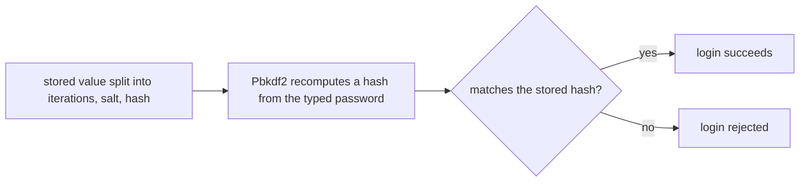

## Before you start

- [[backend.l1.migrations]] — you know a schema change is a versioned, code-tracked file, applied with a command instead of by hand.
- [[backend.l1.validating-input]] — you know application code can check something a database constraint alone can't.

## The situation

Reviewing the `customers` table, you notice `password_hash` holds values like `100000.O2f9fsgGbhEWCCvJt94ESw==.lGj6tWAPiYl3FebBpbmiwRu8dlVIlOM3rDaGDfs+KNw=` — nothing that looks like a password. `POST /api/v1/auth/login` checks a submitted password against this value through `PasswordHasher.Verify`; once the customer's row is found, that comparison is what decides whether the login succeeds. A teammate asks why the API doesn't just store the password directly, or encrypt it so it could be decrypted back if support ever needed to see it. What does storing this value instead actually buy the API, and what would it cost to give that up?

## Core concepts

- **authentication** — answering "who is making this request"; a login endpoint's job is to check that the email and password submitted really belong to the account they claim.
- **password hash** — a one-way transformation of a password, stored instead of the password itself; checking a login recomputes the same transformation and compares results, never the password itself.
- salt — a random value mixed into the password before hashing, unique per computed hash, stored alongside it.
- iteration count — how many times the transformation repeats; a higher count makes computing one hash slower, on purpose.

## How it works



In the situation above, `PasswordHasher.Verify` is what `POST /api/v1/auth/login` calls once the customer's row is found. It never compares the typed password directly against the stored value; instead, it splits the stored string into its iteration count, salt, and hash, exactly as the diagram's `A` shows. It then runs `Rfc2898DeriveBytes.Pbkdf2` — the one-way transformation itself — again on the password just typed, using that same salt and iteration count (`B`). The recomputed hash and the stored hash are then compared (`C`): a match means the password was right and the login succeeds (`D`); anything else and the login is rejected (`E`) — the typed password is never compared against a stored password, because no stored password exists.

The comparison itself uses `CryptographicOperations.FixedTimeEquals`, not `==` — a comparison whose duration depends on the length of the two byte sequences, not on their contents. An ordinary comparison can stop at the first byte that differs, so its duration could hint how many leading bytes of the two hashes matched; this one can't.

What storing a hash buys is this: anyone who reads the `password_hash` column — through a leak, a backup, or a curious admin — still doesn't have a single password. Storing this way costs something too: nothing computes the password back from a hash. Someone holding a leaked hash can only guess a password and hash it again to see if it matches, which this app's 100,000 iterations — the number at the front of the stored string — make slow, one guess at a time. If a customer forgets their password, the API can only issue a new one — it can never recover and show the old one, because nothing here ever kept it.

## In the Đơn Hàng system

`PasswordHasher` is the whole mechanism — `Hash` for producing a stored value, `Verify` for checking one:

```csharp file=DonHang.Domain/PasswordHasher.cs tag=stage-1 lines=7-31
public static class PasswordHasher
{
    private const int SaltSize = 16;
    private const int HashSize = 32;
    private const int Iterations = 100_000;

    public static string Hash(string password)
    {
        var salt = RandomNumberGenerator.GetBytes(SaltSize);
        var hash = Rfc2898DeriveBytes.Pbkdf2(password, salt, Iterations, HashAlgorithmName.SHA256, HashSize);
        return $"{Iterations}.{Convert.ToBase64String(salt)}.{Convert.ToBase64String(hash)}";
    }

    public static bool Verify(string password, string stored)
    {
        var parts = stored.Split('.');
        if (parts.Length != 3) return false;

        var iterations = int.Parse(parts[0]);
        var salt = Convert.FromBase64String(parts[1]);
        var expected = Convert.FromBase64String(parts[2]);
        var actual = Rfc2898DeriveBytes.Pbkdf2(password, salt, iterations, HashAlgorithmName.SHA256, expected.Length);
        return CryptographicOperations.FixedTimeEquals(actual, expected);
    }
}
```

`Hash` generates a fresh random salt with `RandomNumberGenerator.GetBytes` every time it runs, so calling it twice with the identical password produces two different stored strings — the salt, not the password, is what makes them differ. `HashAlgorithmName.SHA256` picks the inner function `Pbkdf2` repeats, and the `Convert` calls on both sides only turn bytes into text and back — the salt is the part that matters here. `Verify` is the only one of the two this app's own code ever calls, from `AuthController.Login`; there's no registration endpoint yet that would call `Hash` for a new customer.

`customers.password_hash` exists because of a real migration, not a hand-edited column — the first schema change after the baseline `InitialCreate` migration:

```csharp file=DonHang.Infrastructure/Migrations/20260923154700_AddPasswordHashToCustomers.cs tag=stage-1 lines=11-27
        protected override void Up(MigrationBuilder migrationBuilder)
        {
            migrationBuilder.AddColumn<string>(
                name: "password_hash",
                table: "customers",
                type: "text",
                nullable: true);

            // lesson: backend.l1.hashing-passwords
            // The 5 seeded customers (db/seed.sql) predate this column. Every
            // one gets the same obviously-fake dev password so the login
            // lesson has someone to sign in as: "donhang-dev-password".
            migrationBuilder.Sql(
                "UPDATE customers SET password_hash = " +
                "'100000.O2f9fsgGbhEWCCvJt94ESw==.lGj6tWAPiYl3FebBpbmiwRu8dlVIlOM3rDaGDfs+KNw=' " +
                "WHERE id IN (1, 2, 3, 4, 5);");
        }
```

This `UPDATE` sets the exact same stored string for all five seeded customers at once — one literal value, not five separate calls to `Hash`. That's a shortcut for seed data, not what a real registration would produce: five independent `Hash` calls, even for the same password, would each pick their own random salt and never match each other.

## Beginners often think…

- **"Encrypting a password, so it can be decrypted later, is just as safe as hashing it."** → Actually encryption is reversible by design — whoever holds the secret that undoes it can recover the original password, so a leaked database plus that leaked secret means every password is exposed. A hash has nothing that reverses it; even the API itself can't compute the password back from what it once hashed. You notice this when asked "can we look up what a customer's password was" — with hashing, the honest answer is no, only a reset is possible.
- **"Storing the password as typed is fine as long as nobody knows which column it sits in."** → Actually a hard-to-guess column name doesn't change what's inside it: anyone who reads that column — a leak, a curious admin, a backup file — reads every password directly. A hash doesn't hand the original password to whoever reads it; recovering it means guessing, one slow hash at a time.

## Try it (3 minutes)

1. From the Đơn Hàng project's root folder, with the example system running (`scripts/up.sh`), read two seeded customers' stored hashes: `docker exec donhang-db psql -U donhang -d donhang -c "select id, password_hash from customers where id in (1, 2);"`.
2. Compare the two rows.

Expected result: both rows show the exact same `password_hash` string.

Does this mean `PasswordHasher.Hash` produces the same output for the same password every time?

<details><summary>Suggested answer</summary>

No. `Hash` calls `RandomNumberGenerator.GetBytes` for a fresh salt on every call, so two independent calls with the identical password would produce two different stored strings. These two rows match only because the migration set the same literal value for both ids in one `UPDATE` — a shortcut for seed data, not two separate calls to `Hash`.

</details>

## Connections

- [[backend.l1.migrations]] — the same kind of versioned schema change, now adding a column instead of a table.
- [[backend.l1.validating-input]] — another place application code does something a database column alone can't.
- [[backend.l1.sessions-vs-tokens]] — the next lesson, on what happens right after this check succeeds.

## Five-line summary

1. A password is never stored as typed; `PasswordHasher.Hash` turns it into a one-way password hash instead.
2. `PasswordHasher.Verify` rehashes the typed password with the stored salt and iteration count, then compares results — never the passwords themselves.
3. A fresh random salt on every `Hash` call means the same password hashes differently each time it's hashed.
4. `customers.password_hash` exists through a real migration; its five seeded values come from one literal `UPDATE`, not five separate `Hash` calls.
5. Hashing has no reverse: a forgotten password can only be reset, never recovered and shown back to the customer.
