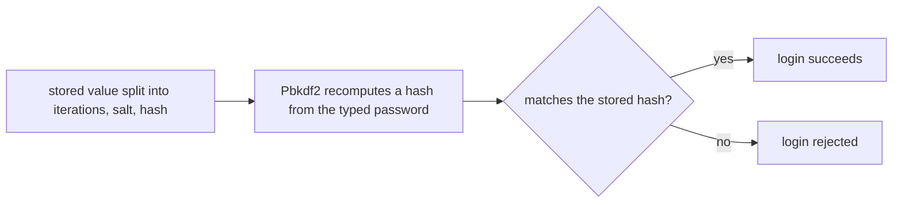

## Bạn cần biết trước

- [[backend.l1.migrations]] — bạn biết một thay đổi schema là một file có phiên bản, được theo dõi trong code, áp dụng bằng lệnh chứ không sửa tay.
- [[backend.l1.validating-input]] — bạn biết code ứng dụng có thể kiểm tra những thứ mà riêng một ràng buộc của database không làm được.

## Tình huống

Xem lại bảng `customers`, bạn thấy cột `password_hash` chứa những giá trị như `100000.O2f9fsgGbhEWCCvJt94ESw==.lGj6tWAPiYl3FebBpbmiwRu8dlVIlOM3rDaGDfs+KNw=` — chẳng có gì giống một mật khẩu. `POST /api/v1/auth/login` kiểm tra mật khẩu người dùng gửi lên với giá trị này qua `PasswordHasher.Verify`; một khi đã tìm thấy dòng của customer, chính phép so sánh đó quyết định đăng nhập có thành công hay không. Một đồng nghiệp hỏi sao API không lưu thẳng mật khẩu, hoặc mã hóa nó để khi cần, bộ phận hỗ trợ có thể giải mã ra xem. Lưu giá trị này thay vào đó thực sự đem lại gì cho API, và bỏ nó đi thì mất gì?

## Khái niệm cốt lõi

- **xác thực** (authentication) — trả lời câu hỏi "ai đang gửi request này"; nhiệm vụ của một endpoint đăng nhập là kiểm tra email và mật khẩu gửi lên có thật sự thuộc về tài khoản mà chúng tự nhận hay không.
- **password hash** (kết quả biến đổi một chiều từ mật khẩu, lưu thay cho mật khẩu gốc, không đảo ngược được) — được lưu thay cho chính mật khẩu; khi kiểm tra đăng nhập, hệ thống tính lại đúng phép biến đổi đó rồi so kết quả, không bao giờ so chính mật khẩu.
- salt — một giá trị ngẫu nhiên trộn vào mật khẩu trước khi hash, riêng cho mỗi lần tính hash, lưu ngay bên cạnh hash.
- iteration count — số lần phép biến đổi được lặp lại; con số càng cao thì tính một hash càng chậm, và đó là cố ý.

## Cơ chế hoạt động



Ở tình huống trên, `PasswordHasher.Verify` là thứ `POST /api/v1/auth/login` gọi sau khi đã tìm thấy dòng của customer. Nó không bao giờ so thẳng mật khẩu vừa gõ với giá trị đã lưu. Thay vào đó, nó tách chuỗi đã lưu thành iteration count, salt và hash, đúng như ô `A` trong sơ đồ. Rồi nó chạy lại `Rfc2898DeriveBytes.Pbkdf2` — chính là phép biến đổi một chiều — trên mật khẩu vừa gõ, dùng đúng salt và iteration count đó (`B`). Sau đó hash vừa tính được so với hash đã lưu (`C`): khớp nghĩa là mật khẩu đúng và đăng nhập thành công (`D`), còn lại thì đăng nhập bị từ chối (`E`). Mật khẩu vừa gõ không bao giờ được so với một mật khẩu đã lưu, vì chẳng có mật khẩu nào được lưu cả.

Bản thân phép so sánh dùng `CryptographicOperations.FixedTimeEquals`, không phải kiểu so từng byte thông thường. Thời gian nó chạy phụ thuộc vào độ dài của hai dãy byte, không phụ thuộc vào nội dung. Một phép so sánh thông thường có thể dừng ngay ở byte khác nhau đầu tiên, nên thời gian chạy có thể để lộ bao nhiêu byte đầu của hai hash trùng nhau; phép so sánh này thì không.

Lưu hash đem lại điều này: ai đọc được cột `password_hash` — qua một vụ lộ dữ liệu, một bản backup, hay một admin tò mò — vẫn không có trong tay mật khẩu nào. Cách lưu này cũng có cái giá: không gì tính ngược được mật khẩu từ một hash. Người cầm một hash bị lộ chỉ có thể đoán một mật khẩu rồi hash lại xem có khớp không, và 100.000 vòng lặp của app này — con số đứng đầu chuỗi đã lưu — khiến mỗi lượt đoán chậm đi. Nếu customer quên mật khẩu, API chỉ có thể cấp một mật khẩu mới — nó không bao giờ khôi phục và hiện lại mật khẩu cũ được, vì ở đây chưa từng có gì giữ nó.

## Trong hệ thống Đơn Hàng

`PasswordHasher` là toàn bộ cơ chế — `Hash` để tạo ra giá trị lưu trữ, `Verify` để kiểm tra:

```csharp file=DonHang.Domain/PasswordHasher.cs tag=stage-1 lines=7-31
public static class PasswordHasher
{
    private const int SaltSize = 16;
    private const int HashSize = 32;
    private const int Iterations = 100_000;

    public static string Hash(string password)
    {
        var salt = RandomNumberGenerator.GetBytes(SaltSize);
        var hash = Rfc2898DeriveBytes.Pbkdf2(password, salt, Iterations, HashAlgorithmName.SHA256, HashSize);
        return $"{Iterations}.{Convert.ToBase64String(salt)}.{Convert.ToBase64String(hash)}";
    }

    public static bool Verify(string password, string stored)
    {
        var parts = stored.Split('.');
        if (parts.Length != 3) return false;

        var iterations = int.Parse(parts[0]);
        var salt = Convert.FromBase64String(parts[1]);
        var expected = Convert.FromBase64String(parts[2]);
        var actual = Rfc2898DeriveBytes.Pbkdf2(password, salt, iterations, HashAlgorithmName.SHA256, expected.Length);
        return CryptographicOperations.FixedTimeEquals(actual, expected);
    }
}
```

Mỗi lần chạy, `Hash` tạo một salt ngẫu nhiên mới bằng `RandomNumberGenerator.GetBytes`, nên gọi nó hai lần với cùng một mật khẩu sẽ ra hai chuỗi lưu trữ khác nhau — chính salt, không phải mật khẩu, làm chúng khác nhau. `HashAlgorithmName.SHA256` chọn hàm bên trong mà `Pbkdf2` lặp lại, còn các lệnh `Convert` ở cả hai phía chỉ đổi byte thành chữ và ngược lại — phần quan trọng ở đây là salt. Trong code của app này, chỉ `Verify` được gọi, từ `AuthController.Login`; chưa có endpoint đăng ký nào gọi `Hash` cho một customer mới.

`customers.password_hash` có mặt nhờ một migration thật, không phải một cột sửa tay — đây là thay đổi schema đầu tiên sau migration nền `InitialCreate`:

```csharp file=DonHang.Infrastructure/Migrations/20260923154700_AddPasswordHashToCustomers.cs tag=stage-1 lines=11-27
        protected override void Up(MigrationBuilder migrationBuilder)
        {
            migrationBuilder.AddColumn<string>(
                name: "password_hash",
                table: "customers",
                type: "text",
                nullable: true);

            // lesson: backend.l1.hashing-passwords
            // The 5 seeded customers (db/seed.sql) predate this column. Every
            // one gets the same obviously-fake dev password so the login
            // lesson has someone to sign in as: "donhang-dev-password".
            migrationBuilder.Sql(
                "UPDATE customers SET password_hash = " +
                "'100000.O2f9fsgGbhEWCCvJt94ESw==.lGj6tWAPiYl3FebBpbmiwRu8dlVIlOM3rDaGDfs+KNw=' " +
                "WHERE id IN (1, 2, 3, 4, 5);");
        }
```

Câu `UPDATE` này ghi đúng cùng một chuỗi cho cả năm customer có sẵn trong dữ liệu mẫu — một giá trị literal, không phải năm lần gọi `Hash` riêng. Đó là lối tắt cho dữ liệu mẫu, không phải thứ một lượt đăng ký thật tạo ra: năm lần gọi `Hash` độc lập, dù cùng một mật khẩu, sẽ mỗi lần chọn một salt ngẫu nhiên riêng và không bao giờ trùng nhau.

## Người mới hay nghĩ rằng…

- **"Mã hóa mật khẩu để sau này giải mã lại được thì cũng an toàn ngang với hash nó."** → Thực ra mã hóa vốn được thiết kế để đảo ngược — ai giữ giá trị dùng để giải mã thì khôi phục được mật khẩu gốc, nên database bị lộ cộng với giá trị đó bị lộ là mọi mật khẩu đều lộ. Một hash không có gì đảo ngược được nó; ngay cả chính API cũng không tính ngược được mật khẩu từ thứ nó đã hash. Bạn sẽ nhận ra khi có người hỏi "mình tra được mật khẩu của customer này là gì không" — với hash, câu trả lời thật là không, chỉ có thể đặt lại.
- **"Lưu mật khẩu nguyên văn cũng được, miễn không ai biết nó nằm ở cột nào."** → Thực ra một tên cột khó đoán không đổi được thứ nằm bên trong: ai đọc được cột đó — qua một vụ lộ dữ liệu, một admin tò mò, một file backup — đọc thẳng được mọi mật khẩu. Một hash không trao mật khẩu gốc cho người đọc nó; muốn lấy lại thì chỉ còn cách đoán, từng lượt hash chậm một.

## Thử ngay (3 phút)

1. Từ thư mục gốc của dự án Đơn Hàng, với hệ thống ví dụ đang chạy (`scripts/up.sh`), đọc hash đã lưu của hai customer có sẵn: `docker exec donhang-db psql -U donhang -d donhang -c "select id, password_hash from customers where id in (1, 2);"`.
2. So sánh hai dòng.

Kết quả mong đợi: cả hai dòng hiện đúng cùng một chuỗi `password_hash`.

Vậy có phải `PasswordHasher.Hash` luôn cho cùng một kết quả với cùng một mật khẩu?

<details><summary>Gợi ý đáp án</summary>

Không. Mỗi lần được gọi, `Hash` gọi `RandomNumberGenerator.GetBytes` để lấy một salt mới, nên hai lần gọi độc lập với cùng một mật khẩu sẽ ra hai chuỗi lưu trữ khác nhau. Hai dòng này trùng nhau chỉ vì migration ghi cùng một giá trị literal cho cả hai id trong một câu `UPDATE` — lối tắt cho dữ liệu mẫu, không phải hai lần gọi `Hash` riêng.

</details>

## Liên hệ

- [[backend.l1.migrations]] — cùng kiểu thay đổi schema có phiên bản, lần này thêm một cột thay vì một bảng.
- [[backend.l1.validating-input]] — một chỗ khác mà code ứng dụng làm được điều riêng một cột database không làm được.
- [[backend.l1.sessions-vs-tokens]] — bài kế tiếp, về chuyện xảy ra ngay sau khi phép kiểm tra này thành công.

## Tóm tắt 5 dòng

1. Mật khẩu không bao giờ được lưu nguyên văn; `PasswordHasher.Hash` biến nó thành một password hash một chiều.
2. `PasswordHasher.Verify` hash lại mật khẩu vừa gõ với salt và iteration count đã lưu, rồi so kết quả — không bao giờ so chính các mật khẩu.
3. Salt ngẫu nhiên mới ở mỗi lần gọi `Hash` khiến cùng một mật khẩu cho ra hash khác nhau mỗi lần.
4. `customers.password_hash` có mặt nhờ một migration thật; năm giá trị mẫu tới từ một câu `UPDATE` literal, không phải năm lần gọi `Hash`.
5. Hash không đảo ngược được: mật khẩu bị quên chỉ có thể đặt lại, không bao giờ khôi phục và hiện lại cho customer.
