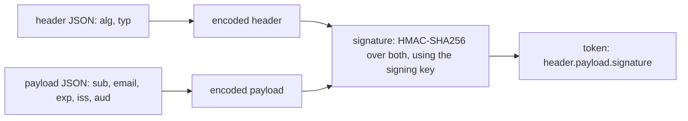

## Before you start

- [[backend.l1.sessions-vs-tokens]] — you know `POST /api/v1/auth/login` hands back a signed token and saves nothing, and that the API reads its signing key at startup.

## The situation

The token `POST /api/v1/auth/login` hands back looks like noise, but it contains exactly two dots. Cut out the part between them and decode it, and plain text comes back: `{"sub":"1","email":"anh.tran@example.com","exp":1790327977,"iss":"donhang-api","aud":"donhang-app"}`. That is who you are, readable by anyone holding the token — no key needed. So what stops someone from changing `"sub":"1"` to `"sub":"2"`, putting the token back together, and calling `GET /api/v1/orders` as customer 2?

## Core concepts

- **JWT (JSON Web Token)** — a token that says who the caller is and can be checked without the server storing anything; a signed JWT like the ones Đơn Hàng issues has three dot-separated parts — header, payload, signature.
- claim — one named fact inside the payload, such as `sub` (which customer), `exp` (when the token stops being accepted) or `iss` (who issued it).
- Base64url — the text encoding each of the first two parts uses: it makes JSON safe to put in a URL or a header, and anyone can reverse it.
- signature — the third part: raw bytes computed from the first two with the API's signing key, then Base64url-encoded like the others; changing a single character of the header or payload makes it no longer match.

## How it works



A token starts as two small pieces of JSON. The header says what the token is — `"typ":"JWT"` — and how it is signed: `"alg":"HS256"`. HS256 is short for HMAC-SHA256, a calculation that takes some text and a key and produces a fixed-size result: the same text and key always give the same result, and without the key it is not practically possible to produce it. The payload holds the claims: `sub` is the customer's id, `email` their address, `exp` the moment the token expires, written as the number of seconds since 1 January 1970 (UTC), and `iss` and `aud` name who issued it and who it is meant for.

Each piece is then encoded with Base64url. That turns JSON into text that can travel in a URL or a header without breaking it, and it is fully reversible — which is why the situation's decoding worked. Encoding hides nothing; encrypting would mean scrambling the text so that only someone holding a key could turn it back, and these tokens do not do that.

The signature is what protects the token. The API runs HMAC-SHA256 over the encoded header and payload together, using its signing key, and appends the result as the third part. When a token comes back, the API recomputes that signature from the first two parts it received and compares. Change `"sub":"1"` to `"sub":"2"` and the recomputed signature no longer matches the one attached, so the token is rejected. Computing a matching signature for the new payload would need the signing key, which only the API holds.

So the payload is readable by anyone, and the signature is what nobody but the API can produce.

## In the Đơn Hàng system

`JwtTokenService.IssueToken` builds and signs every token the API hands out — `AuthController.Login` calls it only after `PasswordHasher.Verify` has accepted the password:

```csharp file=DonHang.Api/JwtTokenService.cs tag=stage-1 lines=11-33
public sealed class JwtTokenService(IConfiguration configuration)
{
    public string IssueToken(int customerId, string email)
    {
        var key = new SymmetricSecurityKey(Encoding.UTF8.GetBytes(configuration["Jwt:SigningKey"]!));
        var credentials = new SigningCredentials(key, SecurityAlgorithms.HmacSha256);

        var claims = new[]
        {
            new Claim(JwtRegisteredClaimNames.Sub, customerId.ToString()),
            new Claim(JwtRegisteredClaimNames.Email, email),
        };

        var token = new JwtSecurityToken(
            issuer: configuration["Jwt:Issuer"],
            audience: configuration["Jwt:Audience"],
            claims: claims,
            expires: DateTime.UtcNow.AddHours(8),
            signingCredentials: credentials);

        return new JwtSecurityTokenHandler().WriteToken(token);
    }
}
```

`configuration["Jwt:SigningKey"]` is the signing key the previous lesson traced to the `Jwt__SigningKey` environment variable — the double underscore in the variable's name stands for the colon. `SymmetricSecurityKey(Encoding.UTF8.GetBytes(...))` turns that key's text into bytes; "symmetric" means the same key both signs a token and checks it. `SecurityAlgorithms.HmacSha256` is what becomes `"alg":"HS256"` in the header. The two `Claim` lines become `sub` and `email`, the issuer and audience come from the API's `appsettings.json` (`donhang-api`, `donhang-app`), and `expires` becomes `exp`, eight hours ahead.

`WriteToken` does the encoding and signing and returns the finished `header.payload.signature` string — the same string `AuthController.Login` returns as the `token` field, and nothing about it is saved.

## Beginners often think…

- **"A JWT's payload is encrypted, so its claims can't be read without the API's signing key."** → Actually the payload is only Base64url-encoded, and decoding needs no key at all. The signing key is used to sign, not to hide. You notice this the first time you decode a token with `base64 -d` and see your own email in plain text — which is also why a payload should hold nothing that must stay hidden from whoever gets hold of the token.
- **"Anyone who can read a JWT's payload could also produce a valid one, since both just need the same JSON."** → Actually the JSON is the easy part; the signature is computed from it with a key only the API holds. A token with an edited payload keeps the old signature, which no longer matches. You notice this when a request carrying a token with `"sub"` changed gets `401`.

## Try it (3 minutes)

1. From the Đơn Hàng project's root folder, with the example system running (`scripts/up.sh`), log in: `curl -s -X POST http://localhost:8080/api/v1/auth/login -H "Content-Type: application/json" -d '{"email": "anh.tran@example.com", "password": "donhang-dev-password"}'`. Copy the value of the `token` field.
2. Decode the header: `echo "<token>" | cut -d. -f1 | tr '_-' '/+' | base64 -d`, with the copied value in place of `<token>`. The `tr` turns the two characters Base64url uses in place of `/` and `+` back into plain Base64.
3. Decode the payload the same way, with `-f2` instead of `-f1`.

Expected result: step 2 prints `{"alg":"HS256","typ":"JWT"}` and step 3 prints your claims — `sub`, `email`, `exp`, `iss`, `aud`. If `base64` still complains about invalid input, the part is missing its `=` padding: add `=` to the end until its length is a multiple of 4.

The third part, `-f3`, does not decode into anything readable. Why not, and why does that not matter to the API?

<details><summary>Suggested answer</summary>

The third part is the signature: Base64url-encoded raw bytes produced by HMAC-SHA256, not encoded JSON — so `base64 -d` either rejects it or prints unreadable bytes; there is no text to recover. The API never needs to read it as text. It recomputes the signature from the first two parts it received, using its signing key, and only checks whether the two results are equal — which is exactly what fails when someone edits the payload.

</details>

## Connections

- [[backend.l1.sessions-vs-tokens]] — the token model this lesson opens up: why nothing is stored, now with what the token actually holds.
- [[backend.l1.hashing-passwords]] — the check that runs right before `IssueToken`, and another computation used for proof rather than for hiding.
- [[backend.l1.validating-a-jwt]] — the next lesson, which checks the signature and expiry this lesson produces on every request.

## Five-line summary

1. A signed JWT is three Base64url parts separated by dots: a header, a payload of claims, and a signature.
2. The payload is encoded, not encrypted — anyone holding the token can read its claims.
3. The signature is HMAC-SHA256 over the header and payload with the API's signing key; only the API can produce it.
4. Editing any claim keeps the old signature, which no longer matches, so the API rejects the token.
5. `JwtTokenService.IssueToken` sets `sub`, `email`, issuer, audience and an eight-hour `exp`, then signs and returns the token.
