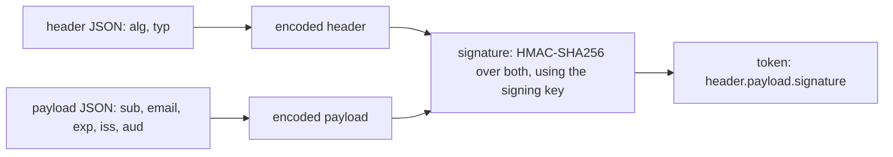

## Bạn cần biết trước

- [[backend.l1.sessions-vs-tokens]] — bạn biết `POST /api/v1/auth/login` trả về một token đã ký mà không lưu gì, và API đọc signing key của nó lúc khởi động.

## Tình huống

Token mà `POST /api/v1/auth/login` trả về trông như một chuỗi ký tự vô nghĩa, nhưng trong đó có đúng hai dấu chấm. Cắt phần nằm giữa hai dấu chấm ra rồi giải mã, bạn nhận lại văn bản thường: `{"sub":"1","email":"anh.tran@example.com","exp":1790327977,"iss":"donhang-api","aud":"donhang-app"}`. Đó là thông tin bạn là ai, và ai cầm token cũng đọc được — không cần key nào. Vậy điều gì ngăn một người sửa `"sub":"1"` thành `"sub":"2"`, ghép token lại, rồi gọi `GET /api/v1/orders` với tư cách customer 2?

## Khái niệm cốt lõi

- **JWT (JSON Web Token)** (token tự chứa thông tin (header.payload.signature); server không cần lưu gì để kiểm nó) — token cho biết người gọi là ai và kiểm tra được mà server không phải lưu gì. Một JWT đã ký, như loại Đơn Hàng phát hành, gồm ba phần ngăn cách bởi dấu chấm — header, payload, signature.
- claim — một thông tin có tên nằm trong payload, ví dụ `sub` (customer nào), `exp` (lúc token hết được chấp nhận) hoặc `iss` (ai phát hành token).
- Base64url — cách mã hóa văn bản mà hai phần đầu dùng: nó giúp JSON đặt vào URL hay header mà không gây lỗi, và ai cũng đảo ngược được.
- signature — phần thứ ba, tức chữ ký: các byte thô được tính từ hai phần đầu bằng signing key của API, rồi mã hóa Base64url như hai phần kia. Chỉ cần đổi một ký tự trong header hay payload là chữ ký không còn khớp.

## Cơ chế hoạt động



Ban đầu, token chỉ là hai mẩu JSON nhỏ. Header cho biết đây là gì — `"typ":"JWT"` — và được ký theo cách nào: `"alg":"HS256"`. HS256 là viết tắt của HMAC-SHA256, một phép tính nhận vào một đoạn văn bản và một key rồi cho ra kết quả có kích thước cố định. Cùng văn bản và cùng key luôn cho cùng kết quả, còn không có key thì trên thực tế không tạo ra được kết quả đó. Payload chứa các claim: `sub` là id của customer, `email` là địa chỉ email, `exp` là thời điểm token hết hạn, ghi bằng số giây tính từ ngày 1 tháng 1 năm 1970 (UTC), còn `iss` và `aud` cho biết ai phát hành token và token dành cho ai.

Sau đó mỗi phần được mã hóa bằng Base64url. Bước này biến JSON thành văn bản đi được trong URL hay header mà không làm hỏng chúng, và đảo ngược được hoàn toàn — đó là lý do phép giải mã ở tình huống trên thành công. Mã hóa kiểu này không che giấu gì cả. Mã hóa bí mật (encrypt) mới là xáo trộn văn bản để chỉ người có key mới khôi phục được, và các token này không làm điều đó.

Thứ bảo vệ token là chữ ký. API chạy HMAC-SHA256 trên header và payload đã mã hóa, dùng signing key của mình, rồi gắn kết quả vào làm phần thứ ba. Khi token được gửi lại, API tính lại chữ ký từ hai phần đầu nhận được rồi so sánh. Đổi `"sub":"1"` thành `"sub":"2"` thì chữ ký tính lại không còn khớp với chữ ký đi kèm, nên token bị từ chối. Muốn tính ra chữ ký khớp với payload mới thì phải có signing key, mà chỉ API giữ key đó.

Tóm lại, payload thì ai cũng đọc được, còn chữ ký thì không ai ngoài API tạo ra được.

## Trong hệ thống Đơn Hàng

`JwtTokenService.IssueToken` dựng và ký mọi token API trả ra — `AuthController.Login` chỉ gọi nó sau khi `PasswordHasher.Verify` đã chấp nhận mật khẩu:

```csharp file=DonHang.Api/JwtTokenService.cs tag=stage-1 lines=11-33
public sealed class JwtTokenService(IConfiguration configuration)
{
    public string IssueToken(int customerId, string email)
    {
        var key = new SymmetricSecurityKey(Encoding.UTF8.GetBytes(configuration["Jwt:SigningKey"]!));
        var credentials = new SigningCredentials(key, SecurityAlgorithms.HmacSha256);

        var claims = new[]
        {
            new Claim(JwtRegisteredClaimNames.Sub, customerId.ToString()),
            new Claim(JwtRegisteredClaimNames.Email, email),
        };

        var token = new JwtSecurityToken(
            issuer: configuration["Jwt:Issuer"],
            audience: configuration["Jwt:Audience"],
            claims: claims,
            expires: DateTime.UtcNow.AddHours(8),
            signingCredentials: credentials);

        return new JwtSecurityTokenHandler().WriteToken(token);
    }
}
```

`configuration["Jwt:SigningKey"]` là signing key mà bài trước đã lần ra tới environment variable `Jwt__SigningKey` — hai dấu gạch dưới trong tên biến thay cho dấu hai chấm. `SymmetricSecurityKey(Encoding.UTF8.GetBytes(...))` chuyển văn bản của key thành byte. "Symmetric" (đối xứng) nghĩa là cùng một key vừa dùng để ký token vừa dùng để kiểm tra nó. `SecurityAlgorithms.HmacSha256` chính là thứ trở thành `"alg":"HS256"` trong header.

Phần còn lại là payload. Hai dòng `Claim` trở thành `sub` và `email`, issuer và audience lấy từ `appsettings.json` của API (`donhang-api`, `donhang-app`), còn `expires` trở thành `exp`, tức tám giờ sau thời điểm phát hành.

`WriteToken` làm phần mã hóa và ký, rồi trả về chuỗi `header.payload.signature` hoàn chỉnh — cũng chính là chuỗi `AuthController.Login` trả về trong trường `token`, và không có gì về nó được lưu lại.

## Người mới hay nghĩ rằng…

- **"Payload của JWT đã được mã hóa bí mật, nên không có signing key của API thì không đọc được các claim."** → Thực ra payload chỉ được mã hóa Base64url, và giải mã không cần key nào. Signing key dùng để ký, không phải để che giấu. Bạn sẽ nhận ra khi lần đầu giải mã một token bằng `base64 -d` và thấy email của mình hiện ra dạng văn bản thường — đó cũng là lý do payload không nên chứa thứ gì phải giữ kín với bất kỳ ai cầm được token.
- **"Ai đọc được payload của JWT thì cũng tạo được một JWT hợp lệ, vì cả hai chỉ cần cùng một đoạn JSON."** → Thực ra JSON là phần dễ, còn chữ ký được tính từ JSON đó bằng một key chỉ API giữ. Token bị sửa payload vẫn mang chữ ký cũ, và chữ ký đó không còn khớp. Bạn sẽ nhận ra khi một request tới `GET /api/v1/orders` mang token đã đổi `"sub"` nhận về `401`.

## Thử ngay (3 phút)

1. Từ thư mục gốc của dự án Đơn Hàng, với hệ thống ví dụ đang chạy (`scripts/up.sh`), đăng nhập: `curl -s -X POST http://localhost:8080/api/v1/auth/login -H "Content-Type: application/json" -d '{"email": "anh.tran@example.com", "password": "donhang-dev-password"}'`. Chép giá trị của trường `token`.
2. Giải mã header: `echo "<token>" | cut -d. -f1 | tr '_-' '/+' | base64 -d`, thay `<token>` bằng giá trị vừa chép. `cut -d. -f1` cắt token tại các dấu chấm và giữ phần đầu tiên. `tr` đổi hai ký tự mà Base64url dùng thay cho `/` và `+` về lại dạng Base64 thường mà `base64 -d` đọc được.
3. Giải mã payload theo cách tương tự, dùng `-f2` thay cho `-f1`.

Kết quả mong đợi: bước 2 in ra `{"alg":"HS256","typ":"JWT"}` và bước 3 in ra các claim của bạn — `sub`, `email`, `exp`, `iss`, `aud`. Nếu `base64` báo đầu vào không hợp lệ, tức phần đó thiếu ký tự đệm `=`: chạy lại lệnh nhưng bỏ `| base64 -d`, chép phần được in ra, rồi thử `echo "<part>=" | base64 -d` và, nếu vẫn lỗi, `echo "<part>==" | base64 -d`.

Phần thứ ba, `-f3`, không giải mã ra thứ gì đọc được. Vì sao vậy, và vì sao điều đó không quan trọng với API?

<details><summary>Gợi ý đáp án</summary>

Phần thứ ba là chữ ký: các byte thô do HMAC-SHA256 tạo ra rồi mã hóa Base64url, không phải JSON đã mã hóa — nên `base64 -d` hoặc từ chối, hoặc in ra các byte không đọc được. Không có văn bản nào để khôi phục. API cũng không bao giờ cần đọc nó như văn bản. API tính lại chữ ký từ hai phần đầu nhận được bằng signing key của mình, rồi chỉ kiểm tra hai kết quả có bằng nhau không — đúng bước sẽ thất bại khi ai đó sửa payload.

</details>

## Liên hệ

- [[backend.l1.sessions-vs-tokens]] — mô hình token mà bài này mở ra xem bên trong: vì sao không cần lưu gì, giờ kèm theo token thực sự chứa những gì.
- [[backend.l1.hashing-passwords]] — bước kiểm tra chạy ngay trước `IssueToken`, và là một phép tính khác dùng để chứng minh chứ không để che giấu.
- [[backend.l1.validating-a-jwt]] — bài kế tiếp, kiểm tra chữ ký và hạn dùng mà bài này tạo ra, ở mọi request.

## Tóm tắt 5 dòng

1. Một JWT đã ký gồm ba phần Base64url ngăn cách bởi dấu chấm: header, payload chứa các claim, và chữ ký.
2. Payload chỉ được mã hóa Base64url, không được mã hóa bí mật — ai cầm token cũng đọc được các claim.
3. Chữ ký là HMAC-SHA256 trên header và payload, dùng signing key của API, và chỉ API tạo ra được nó.
4. Sửa bất kỳ claim nào thì token vẫn mang chữ ký cũ, chữ ký đó không còn khớp, nên API từ chối token.
5. `JwtTokenService.IssueToken` đặt `sub`, `email`, issuer, audience và `exp` tám giờ, rồi ký và trả về token.
