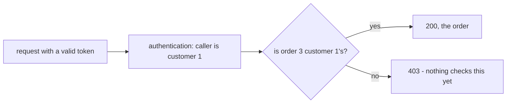

## Before you start

- [[backend.l1.validating-a-jwt]] — you know `UseAuthentication` turns a valid Bearer token into an identified caller, and that `[Authorize]` turns away a request with none.
- [[backend.l1.choosing-an-error-status]] — you know `400`, `404` and `409` each answer a different question about a failing request.

## The situation

You log in as customer 1 and call `GET /api/v1/orders/3` with your token. The answer is `200`, and the body starts `{"id":3,"customerId":2,...}` — someone else's order, their items and prices included. Nothing about the token was wrong: it was signed by the API, not expired, and it said exactly who you are. The API knew it was talking to customer 1 and handed over customer 2's order anyway. Knowing who is asking was never the problem here. What question did nobody ask?

## Core concepts

- **authorization** — answering "is this caller, already identified, allowed to do this?"; it is asked after authentication, and the answer can differ per endpoint and per resource.
- `403 Forbidden` — the status meaning "I know who you are, and I won't do this for you"; unlike `401`, which a fresh login can fix. When the refusal is about ownership, a new token for the same customer still names the same customer, so it changes nothing.
- ownership check — the simplest form of authorization: compare the resource's owner, such as an order's `customerId`, with the caller's `sub` — the field in the token that holds the caller's customer id.

## How it works



Two questions stand between a request and the data it asks for, and they are asked in order. The first is authentication: who is this? In the situation, `UseAuthentication` answered it correctly — customer 1, from `sub`. The previous lesson was entirely about this question: on an endpoint marked `[Authorize]`, a request that fails it gets `401`.

The second question is authorization: now that the API knows who this is, may they have this particular thing? It can only be asked after the first, because it needs the caller's identity as input. For `GET /api/v1/orders/3`, the honest answer is no: order 3 belongs to customer 2. The right response would be `403` — the token is fine, the caller is known, and the refusal is about this order, not about who they are.

Authentication happens once per request, in the middleware, the same way for every endpoint. An ownership check cannot be done once: whether customer 1 may read order 3 depends on order 3, so each endpoint that touches someone's data has to ask it for that data. In the diagram, a match leads to `OK`, `200` with the order; `F` is where `403` belongs — and at stage-1, nothing in Đơn Hàng checks it, so `GET /api/v1/orders/3` goes straight to `200`.

## In the Đơn Hàng system

`OrdersController.Get` is where the missing question should be asked:

```csharp file=DonHang.Api/Controllers/OrdersController.cs tag=stage-1 lines=30-36
    [HttpGet("{id:int}")]
    public async Task<ActionResult<OrderDto>> Get(int id)
    {
        var order = await repository.FindAsync(id);
        if (order is null) return NotFound();
        return Ok(ToDto(order));
    }
```

It finds the order by id and returns it. There is no `[Authorize]`, so it does not even require a caller, and nothing compares `order.CustomerId` with the caller's `sub`. An ownership check here would need `[Authorize]` first, so that there is always a caller to compare with. Then, after the `NotFound()` line, it would do exactly that comparison and answer `403` when they differ — that code does not exist yet, so this describes what should happen, not what happens today.

`List`, a few lines further down, already answers the question in a different way:

```csharp file=DonHang.Api/Controllers/OrdersController.cs tag=stage-1 lines=49-56
    [Authorize]
    [HttpGet]
    public async Task<ActionResult<List<OrderSummaryDto>>> List()
    {
        var customerId = int.Parse(User.FindFirstValue(JwtRegisteredClaimNames.Sub)!);
        var orders = await repository.ListByCustomerAsync(customerId);
        return Ok(orders.Select(o => new OrderSummaryDto(o.Id, o.Status, o.Customer!.FullName)).ToList());
    }
```

It never looks up an order by an id the client chose. It takes the caller's id from `sub` and asks the repository only for that customer's orders, so another customer's order can never come back from it. The caller's identity decides which data is fetched, instead of being checked against data already fetched.

## Beginners often think…

- **"If a request has a valid token, it should be allowed to do anything any logged-in customer can do."** → Actually a valid token only answers who the caller is; whether they may touch a particular order is a separate answer, one per resource. You notice this when customer 1, with a perfectly valid token, reads customer 2's order through `GET /api/v1/orders/3`.
- **"Authorization is the same check as authentication, just run a second time."** → Actually authentication checks the token and is the same for every endpoint; an ownership check compares the caller with the thing being asked for, so it needs the data and differs per endpoint. You notice this when customer 1's token passes authentication identically for order 1 and order 3, yet only order 1 should come back.

## Try it (3 minutes)

1. From the Đơn Hàng project's root folder, with the example system running (`scripts/up.sh`), log in as customer 1: `curl -s -X POST http://localhost:8080/api/v1/auth/login -H "Content-Type: application/json" -d '{"email": "anh.tran@example.com", "password": "donhang-dev-password"}'`. Copy the value of the `token` field.
2. Call `curl -s -i http://localhost:8080/api/v1/orders/3 -H "Authorization: Bearer <token>"`, with the copied value in place of `<token>` (`-i` prints the status line too).
3. Call `curl -s http://localhost:8080/api/v1/orders -H "Authorization: Bearer <token>"`.

Expected result: step 2 answers `200` with `"customerId":2` — another customer's order. Step 3 lists only customer 1's own orders — every entry carries the same `customerName`, and order 3 is not among them.

Which of the two endpoints asked the authorization question, and how?

<details><summary>Suggested answer</summary>

Only `List`. It never let the client pick an order: it read the caller's id from the token and fetched just that customer's orders, so the answer to "may you see this?" was built into what it fetched. `Get` fetched whatever id the client sent and returned it without comparing the order's `customerId` with the caller — the check that would have produced `403`.

</details>

## Connections

- [[backend.l1.validating-a-jwt]] — the first question, authentication, which this lesson's second question depends on.
- [[backend.l1.choosing-an-error-status]] — `403` joins `400`, `404` and `409`: another status for another kind of failure.
- [[backend.l1.efcore-n-plus-one]] — where `List` and `ListByCustomerAsync` were added, now read for what they keep out rather than how they query.

## Five-line summary

1. Authentication asks who the caller is; authorization then asks whether that caller may do this particular thing.
2. `403` means the caller is known and still refused; `401` means the caller is not known at all.
3. An ownership check depends on the data, so each endpoint that touches someone's data has to make it for that data.
4. At stage-1, `OrdersController.Get` never compares the order's `customerId` with the caller, so any caller reads any order.
5. `List` asks the question by construction: it fetches only the caller's own orders, using `sub`.
