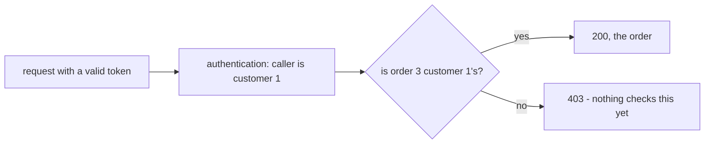

## Bạn cần biết trước

- [[backend.l1.validating-a-jwt]] — bạn biết `UseAuthentication` biến một Bearer token hợp lệ thành một người gọi đã xác định, và `[Authorize]` chặn request không có người gọi nào.
- [[backend.l1.choosing-an-error-status]] — bạn biết `400`, `404` và `409` mỗi cái trả lời một câu hỏi khác nhau về một request thất bại.

## Tình huống

Bạn đăng nhập là customer 1 rồi gọi `GET /api/v1/orders/3` kèm token của mình. Câu trả lời là `200`, và body mở đầu bằng `{"id":3,"customerId":2,...}` — order của người khác, có cả các món hàng và giá. Token không có gì sai: nó do API ký, chưa hết hạn, và nói đúng bạn là ai. API biết nó đang nói chuyện với customer 1 mà vẫn đưa ra order của customer 2. Biết ai đang hỏi chưa bao giờ là vấn đề ở đây. Câu hỏi nào đã không ai đặt ra?

## Khái niệm cốt lõi

- **phân quyền** (authorization) — trả lời câu hỏi "người gọi này, đã được xác định rồi, có được làm việc này không?"; nó được hỏi sau xác thực, và câu trả lời có thể khác nhau theo từng endpoint và từng resource.
- `403 Forbidden` — status nghĩa là "tôi biết bạn là ai, và tôi sẽ không làm việc này cho bạn"; khác với `401`, thứ mà đăng nhập lại có thể sửa được. Khi lời từ chối là về quyền sở hữu, một token mới của cùng customer vẫn chỉ ra đúng customer đó, nên chẳng thay đổi gì.
- kiểm tra quyền sở hữu — dạng phân quyền đơn giản nhất: so chủ của resource, như `customerId` của một order, với `sub` của người gọi — field trong token chứa id customer của người gọi.

## Cơ chế hoạt động



Giữa một request và dữ liệu nó xin là hai câu hỏi, được hỏi theo thứ tự. Câu đầu tiên là xác thực: đây là ai? Ở tình huống trên, `UseAuthentication` đã trả lời đúng — customer 1, lấy từ `sub`. Bài trước chỉ xoay quanh câu hỏi này: với endpoint có `[Authorize]`, request trượt câu hỏi này nhận `401`.

Câu thứ hai là phân quyền: giờ API đã biết đây là ai, người này có được lấy thứ cụ thể này không? Nó chỉ có thể được hỏi sau câu đầu, vì nó cần danh tính người gọi làm đầu vào. Với `GET /api/v1/orders/3`, câu trả lời thật là không: order 3 thuộc customer 2. Response đúng lẽ ra là `403` — token ổn, đã biết người gọi, và lời từ chối là về order này, không phải về việc họ là ai.

Xác thực diễn ra một lần mỗi request, trong middleware, giống nhau cho mọi endpoint. Kiểm tra quyền sở hữu thì không làm một lần được: customer 1 có được đọc order 3 hay không phụ thuộc vào chính order 3, nên mỗi endpoint đụng tới dữ liệu của ai đó đều phải hỏi câu này cho dữ liệu đó. Trong sơ đồ, khớp thì dẫn tới `OK`, `200` kèm order; `F` là chỗ của `403` — và ở stage-1, không gì trong Đơn Hàng kiểm tra điều này, nên `GET /api/v1/orders/3` đi thẳng tới `200`.

## Trong hệ thống Đơn Hàng

`OrdersController.Get` là nơi câu hỏi còn thiếu lẽ ra phải được đặt ra:

```csharp file=DonHang.Api/Controllers/OrdersController.cs tag=stage-1 lines=30-36
    [HttpGet("{id:int}")]
    public async Task<ActionResult<OrderDto>> Get(int id)
    {
        var order = await repository.FindAsync(id);
        if (order is null) return NotFound();
        return Ok(ToDto(order));
    }
```

Nó tìm order theo id rồi trả về. Không có `[Authorize]`, nên nó thậm chí không đòi phải có người gọi, và không gì so `order.CustomerId` với `sub` của người gọi. Một bước kiểm tra quyền sở hữu ở đây trước hết cần `[Authorize]`, để lúc nào cũng có người gọi mà so. Rồi sau dòng `NotFound()`, nó sẽ làm đúng phép so đó và trả `403` khi hai giá trị khác nhau — code đó chưa tồn tại, nên đây là mô tả điều lẽ ra phải xảy ra, không phải điều đang xảy ra hôm nay.

`List`, thấp hơn vài dòng, đã trả lời câu hỏi này theo lối khác:

```csharp file=DonHang.Api/Controllers/OrdersController.cs tag=stage-1 lines=49-56
    [Authorize]
    [HttpGet]
    public async Task<ActionResult<List<OrderSummaryDto>>> List()
    {
        var customerId = int.Parse(User.FindFirstValue(JwtRegisteredClaimNames.Sub)!);
        var orders = await repository.ListByCustomerAsync(customerId);
        return Ok(orders.Select(o => new OrderSummaryDto(o.Id, o.Status, o.Customer!.FullName)).ToList());
    }
```

Nó không bao giờ tra order theo một id do client chọn. Nó lấy id người gọi từ `sub` và chỉ xin repository các order của customer đó, nên order của customer khác không bao giờ có thể lọt ra từ đây. Danh tính người gọi quyết định dữ liệu nào được lấy, thay vì được đem so với dữ liệu đã lấy rồi.

## Người mới hay nghĩ rằng…

- **"Nếu request có token hợp lệ, nó nên được làm mọi việc mà bất kỳ customer đã đăng nhập nào cũng làm được."** → Thực ra token hợp lệ chỉ trả lời người gọi là ai; họ có được đụng vào một order cụ thể hay không là một câu trả lời riêng, cho từng resource. Bạn sẽ nhận ra khi customer 1, với một token hoàn toàn hợp lệ, đọc được order của customer 2 qua `GET /api/v1/orders/3`.
- **"Phân quyền cũng là bước kiểm tra như xác thực, chỉ chạy thêm lần nữa."** → Thực ra xác thực kiểm tra token và giống nhau cho mọi endpoint; kiểm tra quyền sở hữu so người gọi với thứ đang được xin, nên nó cần dữ liệu và khác nhau theo từng endpoint. Bạn sẽ nhận ra khi token của customer 1 qua bước xác thực y hệt nhau với order 1 và order 3, vậy mà chỉ order 1 lẽ ra được trả về.

## Thử ngay (3 phút)

1. Từ thư mục gốc của dự án Đơn Hàng, với hệ thống ví dụ đang chạy (`scripts/up.sh`), đăng nhập là customer 1: `curl -s -X POST http://localhost:8080/api/v1/auth/login -H "Content-Type: application/json" -d '{"email": "anh.tran@example.com", "password": "donhang-dev-password"}'`. Copy giá trị của field `token`.
2. Gọi `curl -s -i http://localhost:8080/api/v1/orders/3 -H "Authorization: Bearer <token>"`, thay `<token>` bằng giá trị đã copy (`-i` in cả dòng status).
3. Gọi `curl -s http://localhost:8080/api/v1/orders -H "Authorization: Bearer <token>"`.

Kết quả mong đợi: bước 2 trả `200` kèm `"customerId":2` — order của một customer khác. Bước 3 chỉ liệt kê các order của chính customer 1 — mọi mục đều có cùng `customerName`, và order 3 không nằm trong đó.

Trong hai endpoint, cái nào đã đặt câu hỏi phân quyền, và đặt bằng cách nào?

<details><summary>Gợi ý đáp án</summary>

Chỉ `List`. Nó không bao giờ để client chọn order: nó đọc id người gọi từ token rồi chỉ lấy các order của customer đó, nên câu trả lời cho "bạn có được xem cái này không?" đã nằm sẵn trong thứ nó lấy ra. `Get` lấy bất cứ id nào client gửi và trả về mà không so `customerId` của order với người gọi — đúng phép kiểm tra lẽ ra đã tạo ra `403`.

</details>

## Liên hệ

- [[backend.l1.validating-a-jwt]] — câu hỏi thứ nhất, xác thực, thứ mà câu hỏi thứ hai của bài này phụ thuộc vào.
- [[backend.l1.choosing-an-error-status]] — `403` nhập hội cùng `400`, `404` và `409`: thêm một status cho thêm một kiểu thất bại.
- [[backend.l1.efcore-n-plus-one]] — nơi `List` và `ListByCustomerAsync` được thêm vào, giờ đọc lại để xem chúng chặn gì ở ngoài thay vì chúng query ra sao.

## Tóm tắt 5 dòng

1. Xác thực hỏi người gọi là ai; phân quyền sau đó hỏi người gọi đó có được làm việc cụ thể này không.
2. `403` nghĩa là đã biết người gọi mà vẫn từ chối; `401` nghĩa là hoàn toàn chưa biết người gọi.
3. Kiểm tra quyền sở hữu phụ thuộc vào dữ liệu, nên mỗi endpoint đụng tới dữ liệu của ai đó phải tự kiểm tra cho dữ liệu đó.
4. Ở stage-1, `OrdersController.Get` không bao giờ so `customerId` của order với người gọi, nên người gọi nào cũng đọc được mọi order.
5. `List` trả lời câu hỏi bằng chính cách nó được viết: chỉ lấy order của chính người gọi, dựa vào `sub`.
