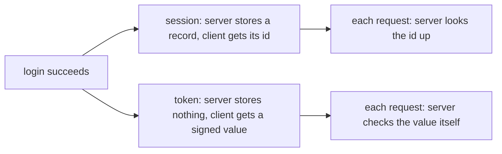

## Before you start

- [[backend.l1.hashing-passwords]] — you know how `POST /api/v1/auth/login` checks a password against a stored hash.
- [[foundation.l1.cookies-and-state]] — you know a cookie can carry an identifier while the state it points to stays on the server.

## The situation

You log in as `anh.tran@example.com` and `POST /api/v1/auth/login` answers with a single field, `{"token":"..."}`. Nothing else changes: no new row appears in any table, `customers` has no "logged in" column, and there is no table of logins at all. Yet every later request that sends that value in an `Authorization: Bearer ...` header is recognized as that customer — even after the API process restarts. In the cookies lesson, the lab recognized you by `sid=dev-session-1`, an id pointing at something the server kept. Who remembers that you're logged in here, if the server keeps nothing?

## Core concepts

- **session** — a record the server keeps for each logged-in client, found again on every request through an id the client sends back, usually in a cookie.
- token-based login — the server hands the client a self-contained, signed value saying who it is; the client sends that value on every request, and the server checks the value itself instead of looking anything up.
- expiry — the moment a login stops being accepted on its own, without anyone ending it.

## How it works



Both models start from the same moment: a password check has just succeeded. What differs is who holds the proof afterwards.

With a session, the server writes a record — "this id belongs to customer 1" — and gives the client only the id, usually in a cookie. On every later request the server takes the id and looks the record up. The id itself means nothing; the record is the proof. That is the `sid=dev-session-1` shape from the cookies lesson.

With a token, the server writes nothing. It hands the client a value that already says who the client is, signed so that the server can tell whether it made that value itself. On every later request the server checks the signature and the expiry, and reads who the caller is straight from the value. The value is the proof.

Each choice has a cost. A session store grows with every logged-in client and has to be reachable from every copy of the API that answers requests. A token needs no store, but because the server keeps nothing, it also has nothing to delete: a token stays valid until it expires, even if you would like to end that login sooner.

## In the Đơn Hàng system

`AuthController.Login` is the whole login step:

```csharp file=DonHang.Api/Controllers/AuthController.cs tag=stage-1 lines=13-24
    [HttpPost("login")]
    public async Task<ActionResult<LoginResponse>> Login(LoginRequest request)
    {
        var customer = await db.Customers.FirstOrDefaultAsync(c => c.Email == request.Email);
        if (customer?.PasswordHash is null || !PasswordHasher.Verify(request.Password, customer.PasswordHash))
        {
            return Unauthorized();
        }

        var token = tokenService.IssueToken(customer.Id, customer.Email);
        return Ok(new LoginResponse(token));
    }
```

Read it for what is missing. After `PasswordHasher.Verify` succeeds, nothing is added to `db` and nothing is saved: the method issues a token and returns it. The API keeps no record of who is logged in, so any copy of the API that can check the token's signature can recognize the caller — and a restarted API recognizes the same token it issued before the restart. The token also carries its own end: `JwtTokenService` sets it to expire eight hours after it was issued, and this app has no code that can end one earlier. What sits inside the token, and how it is signed, is the next lesson.

## Beginners often think…

- **"A cookie always means session-based auth; a token is always sent some other way."** → Actually a cookie is only a way to carry a value back to the server; it can carry a session id or a whole token, and a session id could travel in a header instead. What makes a login session-based is whether the server looks a record up, not how the value travels. You notice this when you meet an app that keeps a token in a cookie and still stores nothing on the server.
- **"Token-based auth is strictly better than session-based auth, so no real system still uses sessions."** → Actually each gives something up: a session can be ended at once by deleting its record, while a token keeps working until it expires. When ending a login immediately matters more than avoiding a store, sessions are the simpler fit. You notice this the first time someone asks for "log this account out everywhere, right now" in an app like this one, where nothing on the server can do it.

## Try it (3 minutes)

1. From the Đơn Hàng project's root folder, with the example system running (`scripts/up.sh`), run step 1 of [[backend.l1.creating-a-resource]]'s Try it to log in and copy the token.
2. Call `curl -sS -o /dev/null -w "%{http_code}\n" http://localhost:8080/api/v1/orders -H "Authorization: Bearer <token>"`.
3. Restart only the API: `docker compose restart api`. Wait a few seconds, then repeat step 2 with the same token.

Expected result: `200` both times — the restarted API accepts the token it issued before the restart.

If this API kept sessions in its own memory instead, what would step 3 print?

<details><summary>Suggested answer</summary>

Most likely `401`. A session record kept in the API's memory disappears when the process restarts, so the id the client sends back would point at nothing, and the client would have to log in again. The token survives because nothing about it lived in the API: the restarted process only needs the same signing key to check it.

</details>

## Connections

- [[backend.l1.hashing-passwords]] — the password check that runs just before either model takes over.
- [[foundation.l1.cookies-and-state]] — the session model at the HTTP level, one layer down.
- [[backend.l1.issuing-a-jwt]] — the next lesson, which opens the token this lesson treats as a sealed value.

## Five-line summary

1. A session is a record the server keeps; a token is a signed value the client keeps — the question is who holds the proof.
2. With sessions, every request's id is looked up; with tokens, every request's value is checked by the server itself.
3. A session store grows with logged-in clients; a token needs no store but stays valid until it expires.
4. `AuthController.Login` issues a token and saves nothing, so a restarted API still accepts a token issued before the restart.
5. A cookie is just a way to carry a value; it can carry a session id or a token.
