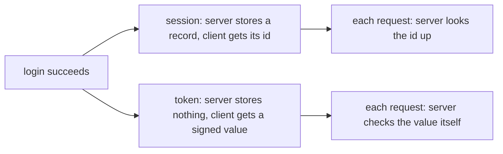

## Bạn cần biết trước

- [[backend.l1.hashing-passwords]] — bạn biết `POST /api/v1/auth/login` kiểm tra mật khẩu với một hash đã lưu ra sao.
- [[foundation.l1.cookies-and-state]] — bạn biết một cookie có thể mang một mã định danh, còn trạng thái mà mã đó trỏ tới vẫn nằm trên server.

## Tình huống

Bạn đăng nhập bằng `anh.tran@example.com` và `POST /api/v1/auth/login` trả về đúng một trường, `{"token":"..."}`. Ngoài ra không có gì thay đổi: không bảng nào có thêm dòng mới, `customers` không có cột "đang đăng nhập", và cũng chẳng có bảng nào ghi các lượt đăng nhập. Thế nhưng mọi request sau đó gửi giá trị này trong header `Authorization: Bearer ...` đều được nhận ra là customer đó, kể cả khi process API đã khởi động lại. `Bearer` chỉ là nhãn báo phần theo sau là một token. Ở bài về cookie, lab nhận ra bạn qua `sid=dev-session-1`, một id trỏ tới thứ mà server giữ lại. Còn ở đây, nếu server không giữ gì, thì ai nhớ bạn đã đăng nhập?

## Khái niệm cốt lõi

- **session** (trạng thái đăng nhập server lưu lại, được tham chiếu qua id trong cookie ở các request sau) — một bản ghi server giữ cho mỗi client đã đăng nhập, được tìm lại ở mỗi request nhờ một id mà client gửi kèm, thường nằm trong cookie.
- đăng nhập bằng token — server trao cho client một giá trị tự chứa, đã ký (đánh dấu bằng một key chỉ server giữ, để sau này server nhận ra giá trị đó do chính mình tạo), cho biết client là ai. Client gửi giá trị đó ở mọi request, và server tự kiểm tra chính giá trị đó thay vì đi tra cứu ở đâu.
- thời hạn — thời điểm một lượt đăng nhập tự hết được chấp nhận, không cần ai chủ động kết thúc nó.

## Cơ chế hoạt động



Cả hai mô hình bắt đầu từ cùng một thời điểm: phép kiểm tra mật khẩu vừa thành công. Chỗ khác nhau là sau đó ai giữ bằng chứng.

Với session, server ghi một bản ghi — "id này thuộc về customer 1" — và chỉ đưa cho client cái id, thường nằm trong cookie. Ở mỗi request sau, server lấy id đó ra và tra bản ghi. Tự thân cái id không mang ý nghĩa gì, bản ghi mới là bằng chứng. Đó chính là dạng `sid=dev-session-1` trong bài về cookie.

Với token, server không ghi gì cả. Nó trao cho client một giá trị đã tự nói client là ai, được ký bằng một key chỉ server giữ — signing key của nó — để sau này server phân biệt được giá trị đó có phải do chính mình tạo ra hay không. Ở mỗi request sau, server kiểm tra chữ ký và thời hạn, rồi đọc thẳng từ giá trị đó xem người gọi là ai. Giá trị chính là bằng chứng.

Lựa chọn nào cũng có cái giá. Kho lưu session phình ra theo từng client đăng nhập. Và khi có nhiều bản API chạy song song để chia nhau request, bản nào có thể nhận request của một client cũng phải truy cập được bản ghi của client đó. Token không cần kho lưu, nhưng vì server không giữ gì nên cũng chẳng có gì để xóa: muốn kết thúc một token trước khi nó hết hạn, server phải có thêm một thứ — chẳng hạn danh sách các token đã bị kết thúc để đối chiếu ở mỗi request — mà đó lại đúng là loại kho lưu mà token vốn muốn tránh.

## Trong hệ thống Đơn Hàng

`AuthController.Login` là toàn bộ bước đăng nhập:

```csharp file=DonHang.Api/Controllers/AuthController.cs tag=stage-1 lines=13-24
    [HttpPost("login")]
    public async Task<ActionResult<LoginResponse>> Login(LoginRequest request)
    {
        var customer = await db.Customers.FirstOrDefaultAsync(c => c.Email == request.Email);
        if (customer?.PasswordHash is null || !PasswordHasher.Verify(request.Password, customer.PasswordHash))
        {
            return Unauthorized();
        }

        var token = tokenService.IssueToken(customer.Id, customer.Email);
        return Ok(new LoginResponse(token));
    }
```

Hãy đọc đoạn này để tìm thứ còn thiếu. Sau khi `PasswordHasher.Verify` thành công, không có gì được thêm vào `db` và không có gì được lưu: method này cấp một token rồi trả nó về.

Signing key không được tạo ra bên trong process API: lúc khởi động, API đọc nó từ biến môi trường `Jwt__SigningKey` (cái tên gợi ý định dạng token mà bài sau sẽ mở ra), biến này được đặt bên ngoài code của API khi hệ thống ví dụ khởi động.

Đây là lý do cái giá khi chạy nhiều bản API nêu ở mục 4 không áp dụng ở đây: vì API không giữ bản ghi nào về ai đang đăng nhập, bất kỳ bản API nào khởi động với cùng key đó đều nhận ra được người gọi — và một API vừa khởi động lại vẫn nhận ra token nó đã cấp trước lúc khởi động lại.

Token cũng tự mang theo thời điểm kết thúc của mình: bên trong `IssueToken` (đoạn code này không được trình bày ở đây), token được đặt hết hạn tám giờ sau lúc cấp, và app này không có đoạn code nào kết thúc token sớm hơn được. Bên trong token có gì, và nó được ký ra sao, là chuyện của bài sau.

## Người mới hay nghĩ rằng…

- **"Cookie thì luôn là xác thực bằng session, còn token thì luôn được gửi theo đường khác."** → Thực ra cookie chỉ là phương tiện mang một giá trị quay lại server. Nó có thể mang một session id hoặc cả một token, và session id cũng có thể đi trong header. Thứ khiến một lượt đăng nhập dựa trên session là server có tra một bản ghi hay không, chứ không phải giá trị đi đường nào. Bạn sẽ nhận ra khi gặp một app giữ token trong cookie mà vẫn không lưu gì trên server.
- **"Xác thực bằng token lúc nào cũng tốt hơn session, nên hệ thống thật chẳng còn ai dùng session."** → Thực ra mỗi bên đều phải đánh đổi: một session có thể bị kết thúc ngay bằng cách xóa bản ghi của nó, còn một token vẫn dùng được tới khi hết hạn, trừ khi server thêm một thứ để đối chiếu. Khi kết thúc đăng nhập ngay lập tức quan trọng hơn chuyện tránh kho lưu, session là lựa chọn đơn giản hơn. Bạn sẽ nhận ra lần đầu có người yêu cầu "đăng xuất tài khoản này ở mọi nơi, ngay bây giờ" trong một app như app này, nơi không có đoạn code nào trên server làm được điều đó.

## Thử ngay (3 phút)

1. Từ thư mục gốc của dự án Đơn Hàng, với hệ thống ví dụ đang chạy (`scripts/up.sh`), đăng nhập: `curl -s -X POST http://localhost:8080/api/v1/auth/login -H "Content-Type: application/json" -d '{"email": "anh.tran@example.com", "password": "donhang-dev-password"}'`. Chép giá trị của trường `token` trong response.
2. Gọi `curl -sS -o /dev/null -w "%{http_code}\n" http://localhost:8080/api/v1/orders -H "Authorization: Bearer <token>"`, thay `<token>` bằng giá trị vừa chép — lệnh chỉ in ra status code. Bỏ phần `-H ...` đi thì nó in ra `401`.
3. Chỉ khởi động lại process API, để database vẫn chạy: `docker compose restart api` (`api` là tên hệ thống ví dụ đặt cho process API). Đợi vài giây rồi lặp lại bước 2 với cùng token. Nếu nó in ra `502` thì API vẫn đang khởi động — đợi thêm vài giây rồi chạy lại.

Kết quả mong đợi: cả hai lần đều ra `200` — API sau khi khởi động lại vẫn chấp nhận token nó đã cấp trước đó.

Nếu API này giữ session trong bộ nhớ của chính nó, bước 3 sẽ in ra gì?

<details><summary>Gợi ý đáp án</summary>

Nhiều khả năng là `401`. Bản ghi session nằm trong bộ nhớ của API sẽ mất khi process khởi động lại, nên id client gửi lên sẽ chẳng trỏ tới đâu, và client phải đăng nhập lại. Token sống sót vì không có gì về nó nằm trong API: process vừa khởi động lại chỉ cần đúng signing key đó để kiểm tra nó.

</details>

## Liên hệ

- [[backend.l1.hashing-passwords]] — phép kiểm tra mật khẩu chạy ngay trước khi một trong hai mô hình tiếp quản.
- [[foundation.l1.cookies-and-state]] — mô hình session ở tầng HTTP, thấp hơn một lớp.
- [[backend.l1.issuing-a-jwt]] — bài kế tiếp, mở ra token mà bài này coi như một giá trị niêm phong.

## Tóm tắt 5 dòng

1. Session là bản ghi server giữ, token là giá trị đã ký client giữ — câu hỏi là ai cầm bằng chứng.
2. Với session, id ở mỗi request được đem đi tra, còn với token, giá trị ở mỗi request được chính server kiểm tra.
3. Kho lưu session phình theo số client đăng nhập, còn token không cần kho lưu, nhưng muốn kết thúc sớm thì rốt cuộc vẫn phải lưu một thứ.
4. `AuthController.Login` cấp token mà không lưu gì, nên API khởi động lại vẫn chấp nhận token cấp trước đó.
5. Cookie chỉ là phương tiện mang giá trị, nó có thể mang session id hoặc token.
