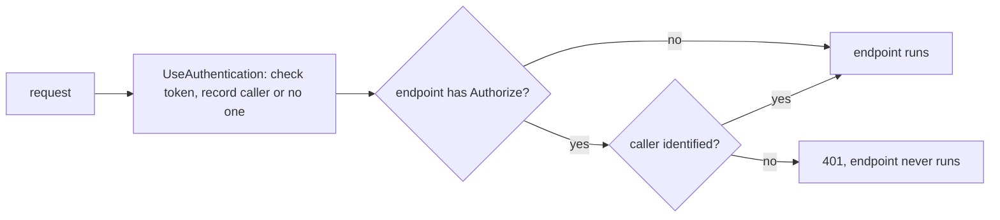

## Before you start

- [[backend.l1.issuing-a-jwt]] — you know a JWT carries claims such as `sub` and `exp`, and a signature only the API's signing key can produce.
- [[backend.l1.middleware-pipeline]] — you know middleware runs in the order `Program.cs` registers it, and that a middleware can short-circuit the rest of the pipeline.

## The situation

You call `GET /api/v1/orders` three times. With no `Authorization` header at all, the answer is `401`. With a made-up token, `abc.def.ghi`, it is `401` again, but the response now carries `WWW-Authenticate: Bearer error="invalid_token"`. With the token from logging in, it is `200` and your orders. Then you send that same made-up token to `GET /api/v1/orders/1` — and get `200`, the order, as if the token were fine: the same bad token is rejected by one endpoint and ignored by the other. What actually decides whether a request is turned away?

## Core concepts

- `UseAuthentication` — the middleware that reads the `Authorization: Bearer` header, checks the token, and records who the caller is — or that no valid caller was found. It turns nothing away on its own.
- `[Authorize]` — an attribute on an endpoint saying "only a caller the API has identified may run this".
- `UseAuthorization` — the middleware that, for an `[Authorize]` endpoint, short-circuits with `401` when `UseAuthentication` identified no one.
- `401 Unauthorized` — the status meaning "the API does not know who is asking": no token, or a token it could not accept.

## How it works



In the situation above, every request passes through `UseAuthentication` first. It looks for an `Authorization: Bearer` header. If there is one, it checks the token the way the previous lesson described: the signature has to match what the signing key produces, the issuer and audience have to be `donhang-api` and `donhang-app`, and `exp` must not have passed — the check allows a few minutes of leeway for clock differences, so a token just past `exp` can still pass. If all of that holds, the request now carries a caller: the customer named in `sub`. If the header is missing or the token fails any check, the request simply carries no caller. Nothing is rejected yet.

The rejecting happens one step later, in `UseAuthorization`, and only for an endpoint marked `[Authorize]`. There, a request with no identified caller is short-circuited: the answer is `401`, and the endpoint's code never runs. `GET /api/v1/orders` is marked, so the made-up token gets `401`. `GET /api/v1/orders/1` is not marked, so the same token passes straight through to the endpoint, which never asks who the caller is.

An expired token fails the same way as a forged one. Its signature can be perfectly valid — the API really did issue it — but once `exp` is more than a few minutes in the past, the check fails and the response says so: `error_description="The token expired at '...'"`.

## In the Đơn Hàng system

`Program.cs` tells `UseAuthentication` what a valid token looks like:

```csharp file=DonHang.Api/Program.cs tag=stage-1 lines=23-42
var signingKey = builder.Configuration["Jwt:SigningKey"]
    ?? throw new InvalidOperationException("Jwt:SigningKey is not set");
builder.Services.AddAuthentication(JwtBearerDefaults.AuthenticationScheme)
    .AddJwtBearer(options =>
    {
        // Keep claim types exactly as issued ("sub", not the ClaimTypes.NameIdentifier
        // URI ASP.NET Core maps them to by default) so OrdersController reads the
        // same JwtRegisteredClaimNames.Sub that JwtTokenService wrote.
        options.MapInboundClaims = false;
        options.TokenValidationParameters = new TokenValidationParameters
        {
            ValidateIssuer = true,
            ValidIssuer = builder.Configuration["Jwt:Issuer"],
            ValidateAudience = true,
            ValidAudience = builder.Configuration["Jwt:Audience"],
            ValidateIssuerSigningKey = true,
            IssuerSigningKey = new SymmetricSecurityKey(Encoding.UTF8.GetBytes(signingKey)),
            ValidateLifetime = true,
        };
    });
```

`ValidateIssuer`, `ValidateAudience` and `ValidateLifetime` name the issuer, audience and `exp` checks. The signature is checked against `IssuerSigningKey`, built from the same `Jwt:SigningKey` that `JwtTokenService` signs with, so only tokens signed with that key can pass.

Which endpoints actually require a caller is decided in the controllers:

```csharp file=DonHang.Api/Controllers/OrdersController.cs tag=stage-1 lines=49-56
    [Authorize]
    [HttpGet]
    public async Task<ActionResult<List<OrderSummaryDto>>> List()
    {
        var customerId = int.Parse(User.FindFirstValue(JwtRegisteredClaimNames.Sub)!);
        var orders = await repository.ListByCustomerAsync(customerId);
        return Ok(orders.Select(o => new OrderSummaryDto(o.Id, o.Status, o.Customer!.FullName)).ToList());
    }
```

Because of `[Authorize]`, by the time `List` runs there is always a caller, so reading `sub` from `User` is safe. `Get`, a few lines above it in the same file, has no `[Authorize]` — which is why the situation's made-up token reached it and got an order back.

## Beginners often think…

- **"A JWT that's expired still works as long as the signature is valid."** → Actually the signature only proves the API issued the token; `ValidateLifetime` separately checks `exp`, and a token well past it is rejected even though every byte is genuine. You notice this when a token that worked this morning starts returning `401` with `The token expired at ...` in the `WWW-Authenticate` header.
- **"401 and 403 both mean roughly 'not allowed', so either one is fine for a missing or invalid token."** → Actually `401` says the API does not know who is asking; the client's fix is to log in again and send a valid token. `403` says the API knows who is asking and still refuses, so sending the same caller's token again changes nothing. You notice this when a client that treats every `401` as "log in again" stops working the moment an endpoint answers `403` for a caller it has already identified.

## Try it (3 minutes)

1. From the Đơn Hàng project's root folder, with the example system running (`scripts/up.sh`), call `curl -s -i http://localhost:8080/api/v1/orders` with no token.
2. Call it again with a made-up token: add `-H "Authorization: Bearer abc.def.ghi"`.
3. Send the same made-up token to `http://localhost:8080/api/v1/orders/1`.

Expected result: step 1 answers `401` with `WWW-Authenticate: Bearer`; step 2 answers `401` with `WWW-Authenticate: Bearer error="invalid_token"`; step 3 answers `200` with order 1. curl prints the header name as `Www-Authenticate`; header names are not case-sensitive.

Why does step 3 succeed with a token that step 2 rejected?

<details><summary>Suggested answer</summary>

`UseAuthentication` handled the made-up token the same way both times: it failed the checks, and the request carried no caller. The difference is the endpoint. `List` is marked `[Authorize]`, so `UseAuthorization` short-circuited with `401`. `Get` is not marked, so nothing required a caller and the endpoint ran — it never looked at the token at all.

</details>

## Connections

- [[backend.l1.issuing-a-jwt]] — the token this lesson checks: the same signing key, issuer, audience and `exp`, now read instead of written.
- [[backend.l1.middleware-pipeline]] — `UseAuthorization` short-circuiting is that lesson's short-circuit, applied to requests without a caller.
- [[backend.l1.protecting-an-endpoint]] — the next lesson: `403`, for a caller the API has identified but will not serve.

## Five-line summary

1. `UseAuthentication` checks the Bearer token's signature, issuer, audience and expiry, and records a caller or no caller — it rejects nothing itself.
2. `UseAuthorization` short-circuits an `[Authorize]` endpoint with `401` when no caller was identified, before the endpoint runs.
3. An endpoint without `[Authorize]` runs whatever token is sent, valid or not.
4. An expired token is rejected even with a valid signature, because `ValidateLifetime` checks `exp` separately.
5. `401` means "who are you?", fixed by logging in again; `403` means "I know you, and no".
