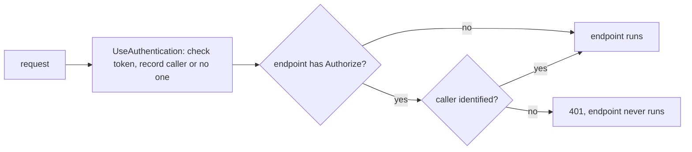

## Bạn cần biết trước

- [[backend.l1.issuing-a-jwt]] — bạn biết một JWT mang các claim như `sub` và `exp`, cùng một chữ ký mà chỉ signing key của API tạo ra được.
- [[backend.l1.middleware-pipeline]] — bạn biết middleware chạy theo đúng thứ tự `Program.cs` đăng ký, và một middleware có thể short-circuit phần còn lại của pipeline.

## Tình huống

Bạn gọi `GET /api/v1/orders` ba lần. Không có header `Authorization` nào, câu trả lời là `401`. Với một token bịa ra, `abc.def.ghi`, lại là `401`, nhưng header `WWW-Authenticate` giờ thêm `error="invalid_token"` sau `Bearer`. Với token lấy từ lúc đăng nhập, câu trả lời là `200` kèm các order của bạn. Rồi bạn gửi đúng token bịa đó tới `GET /api/v1/orders/1` — và nhận `200`, trả về order, như thể token không có vấn đề gì: cùng một token hỏng bị endpoint này từ chối còn endpoint kia lờ đi. Thật ra điều gì quyết định một request có bị chặn lại hay không?

## Khái niệm cốt lõi

- `UseAuthentication` — middleware đọc header `Authorization: Bearer`, kiểm tra token, rồi ghi nhận người gọi là ai — hoặc ghi nhận là không tìm thấy người gọi hợp lệ nào. Tự nó không chặn request nào.
- `[Authorize]` — một attribute gắn lên endpoint, nói rằng "chỉ người gọi mà API đã xác định được mới được chạy cái này".
- `UseAuthorization` — middleware, với endpoint có `[Authorize]`, sẽ short-circuit bằng `401` khi `UseAuthentication` không xác định được ai.
- `401 Unauthorized` — status nghĩa là "API không biết ai đang hỏi": không có token, hoặc có token nhưng API không chấp nhận được. Nó đi kèm header `WWW-Authenticate` cho biết API muốn loại thông tin xác thực nào — `Bearer`, tức là token — và thêm `error="invalid_token"` khi có gửi token nhưng bị từ chối.

## Cơ chế hoạt động



Ở tình huống trên, mọi request đều đi qua `UseAuthentication` trước. Client gửi JWT trong header `Authorization: Bearer <token>`, nên đó là chỗ nó tìm. Nếu có token, nó kiểm tra chữ ký bằng signing key, issuer và audience so với `donhang-api` và `donhang-app`, và `exp` — có vài phút dung sai cho chênh lệch đồng hồ, nên token vừa quá `exp` một chút vẫn có thể qua. Nếu tất cả đều ổn, request giờ mang theo một người gọi: customer có tên trong `sub`. Nếu thiếu header hoặc token trượt bất kỳ bước kiểm tra nào, request đơn giản là không mang người gọi nào. Chưa có gì bị từ chối cả.

Việc từ chối xảy ra ở bước sau, trong `UseAuthorization`, và chỉ với endpoint có `[Authorize]`. Ở đó, request không có người gọi đã xác định sẽ bị short-circuit: câu trả lời là `401`, và code của endpoint không bao giờ chạy. `GET /api/v1/orders` có đánh dấu, nên token bịa nhận `401`. `GET /api/v1/orders/1` không có, nên cùng token đó đi thẳng tới endpoint, nơi không hề hỏi người gọi là ai.

Token hết hạn thất bại theo đúng cách một token giả thất bại. Chữ ký của nó có thể hoàn toàn hợp lệ — API thật sự đã cấp nó — nhưng một khi `exp` đã lùi quá vài phút, bước kiểm tra thất bại và response nói rõ điều đó: `error_description="The token expired at '...'"`.

## Trong hệ thống Đơn Hàng

`Program.cs` đăng ký những gì `UseAuthentication` sẽ kiểm tra. `AddAuthentication(JwtBearerDefaults.AuthenticationScheme)` chọn Bearer token làm cách xác định người gọi, còn `AddJwtBearer` mô tả một token hợp lệ trông thế nào; bản thân `app.UseAuthentication()` và `app.UseAuthorization()` được thêm ở phía dưới, theo đúng thứ tự đó:

```csharp file=DonHang.Api/Program.cs tag=stage-1 lines=23-42
var signingKey = builder.Configuration["Jwt:SigningKey"]
    ?? throw new InvalidOperationException("Jwt:SigningKey is not set");
builder.Services.AddAuthentication(JwtBearerDefaults.AuthenticationScheme)
    .AddJwtBearer(options =>
    {
        // Keep claim types exactly as issued ("sub", not the ClaimTypes.NameIdentifier
        // URI ASP.NET Core maps them to by default) so OrdersController reads the
        // same JwtRegisteredClaimNames.Sub that JwtTokenService wrote.
        options.MapInboundClaims = false;
        options.TokenValidationParameters = new TokenValidationParameters
        {
            ValidateIssuer = true,
            ValidIssuer = builder.Configuration["Jwt:Issuer"],
            ValidateAudience = true,
            ValidAudience = builder.Configuration["Jwt:Audience"],
            ValidateIssuerSigningKey = true,
            IssuerSigningKey = new SymmetricSecurityKey(Encoding.UTF8.GetBytes(signingKey)),
            ValidateLifetime = true,
        };
    });
```

`MapInboundClaims = false` chỉ giữ nguyên tên claim như `sub` lúc được cấp. `ValidateIssuer`, `ValidateAudience` và `ValidateLifetime` là các bước kiểm tra issuer, audience và `exp`, so với các giá trị `Jwt:Issuer` và `Jwt:Audience` là `donhang-api` và `donhang-app`. Chữ ký được kiểm tra bằng `IssuerSigningKey`, dựng từ đúng `Jwt:SigningKey` mà `JwtTokenService` dùng để ký, nên chỉ token được ký bằng key đó mới qua được.

Endpoint nào thật sự đòi phải có người gọi thì do controller quyết định:

```csharp file=DonHang.Api/Controllers/OrdersController.cs tag=stage-1 lines=49-56
    [Authorize]
    [HttpGet]
    public async Task<ActionResult<List<OrderSummaryDto>>> List()
    {
        var customerId = int.Parse(User.FindFirstValue(JwtRegisteredClaimNames.Sub)!);
        var orders = await repository.ListByCustomerAsync(customerId);
        return Ok(orders.Select(o => new OrderSummaryDto(o.Id, o.Status, o.Customer!.FullName)).ToList());
    }
```

`List` trả lời `GET /api/v1/orders`. Nhờ `[Authorize]`, lúc nó chạy thì luôn có người gọi, và `User` chính là người gọi đó, nên đọc `sub` từ nó là an toàn. `Get`, thứ trả lời `GET /api/v1/orders/1` và nằm cao hơn vài dòng trong cùng file, không có `[Authorize]` — vì vậy token bịa ở tình huống tới được nó và lấy về được một order.

## Người mới hay nghĩ rằng…

- **"JWT đã hết hạn vẫn dùng được miễn là chữ ký hợp lệ."** → Thực ra chữ ký chỉ chứng minh API đã cấp token; `ValidateLifetime` kiểm tra `exp` riêng, và token đã quá hạn một khoảng bị từ chối dù từng byte đều là thật. Bạn sẽ nhận ra khi một token còn chạy tốt sáng nay bắt đầu trả `401` kèm `The token expired at ...` trong header `WWW-Authenticate`.
- **"401 và 403 đều đại khái nghĩa là 'không được phép', nên dùng cái nào cho token thiếu hay hỏng cũng được."** → Thực ra `401` nói API không biết ai đang hỏi; cách client sửa là đăng nhập lại và gửi token hợp lệ. `403` nói API biết ai đang hỏi mà vẫn từ chối, nên gửi lại token của cùng người gọi đó cũng không thay đổi gì. Bạn sẽ nhận ra khi một API trả `403` cho token hết hạn: một client chỉ đưa người dùng về đăng nhập khi gặp `401` sẽ không bao giờ đưa họ về đó, và mọi lời gọi cứ tiếp tục thất bại.

## Thử ngay (3 phút)

1. Từ thư mục gốc của dự án Đơn Hàng, với hệ thống ví dụ đang chạy (`scripts/up.sh`), gọi `curl -s -i http://localhost:8080/api/v1/orders` không kèm token (`-i` in cả header của response).
2. Gọi lại với một token bịa: thêm `-H "Authorization: Bearer abc.def.ghi"`.
3. Gửi đúng token bịa đó tới `http://localhost:8080/api/v1/orders/1`.

Kết quả mong đợi: bước 1 trả `401` kèm `WWW-Authenticate: Bearer`; bước 2 trả `401` kèm `WWW-Authenticate: Bearer error="invalid_token"`; bước 3 trả `200` kèm order 1. curl in tên header là `Www-Authenticate`; tên header không phân biệt hoa thường.

Vì sao bước 3 thành công với một token mà bước 2 đã từ chối?

<details><summary>Gợi ý đáp án</summary>

`UseAuthentication` xử lý token bịa giống hệt nhau ở cả hai lần: token trượt các bước kiểm tra, và request không mang người gọi nào. Khác biệt nằm ở endpoint. `List` có `[Authorize]`, nên `UseAuthorization` short-circuit bằng `401`. `Get` không có, nên không gì đòi phải có người gọi và endpoint cứ thế chạy — nó chẳng hề nhìn tới token.

</details>

## Liên hệ

- [[backend.l1.issuing-a-jwt]] — chính token bài này kiểm tra: cùng signing key, issuer, audience và `exp`, giờ là đọc thay vì viết.
- [[backend.l1.middleware-pipeline]] — việc `UseAuthorization` short-circuit chính là short-circuit của bài đó, áp dụng cho request không có người gọi.
- [[backend.l1.protecting-an-endpoint]] — bài kế tiếp: `403`, dành cho người gọi mà API đã xác định nhưng không phục vụ.

## Tóm tắt 5 dòng

1. `UseAuthentication` kiểm tra chữ ký, issuer, audience và hạn dùng của Bearer token, rồi ghi nhận có hay không có người gọi — tự nó không từ chối gì.
2. `UseAuthorization` short-circuit một endpoint có `[Authorize]` bằng `401` khi không xác định được người gọi, trước khi endpoint chạy.
3. Trong Đơn Hàng, endpoint không có `[Authorize]` vẫn chạy với bất kỳ token nào được gửi, hợp lệ hay không.
4. Token hết hạn bị từ chối dù chữ ký hợp lệ, vì `ValidateLifetime` kiểm tra `exp` riêng.
5. `401` nghĩa là "bạn là ai?", sửa bằng cách đăng nhập lại; `403` nghĩa là "tôi biết bạn, và không".
