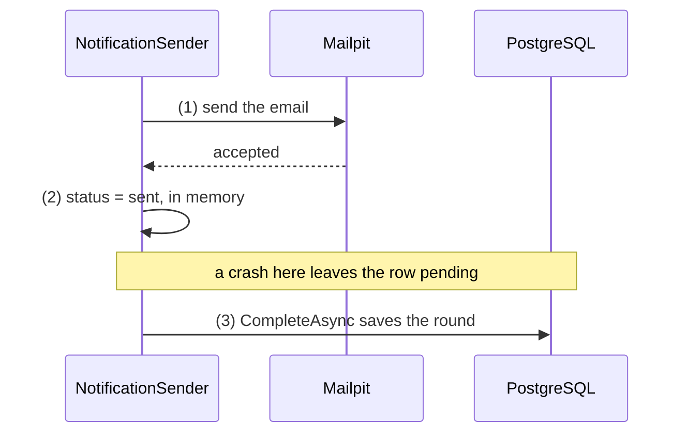

## Before you start

- [[backend.l2.retry-with-backoff]] — you know a failed send keeps the row `pending` for a later retry, and each tick starts one round, which takes up to 10 due rows, sends each, then saves them all at once.
- [[backend.l2.idempotent-endpoints]] — you know a client that times out cannot tell whether its `POST` created the order, and an `Idempotency-Key` makes the retry safe.

## The situation

A customer places order 57. A few seconds later, Mailpit, the stand-in for a real mail server, shows its "order placed" email. A moment after Mailpit accepted it, the `api` container is killed, before the round had saved anything. The container starts again, the sender runs its first round, and Mailpit now shows the same email twice, and a real customer would get both. No send threw and no row is `failed`, yet one email arrived twice. Could the sender save `sent` first, and is there any order of the two steps that sends every email exactly once?

## Core concepts

- **at-least-once** — a guarantee that a job is done one or more times: it is never lost, but it is sometimes repeated.
- **at-most-once** — a guarantee that a job is done zero or one time: it is never repeated, but it is sometimes lost.
- exactly once — what you would like: every job done one time, never zero and never two; for an email, no order of the steps can promise it.
- `CompleteAsync` — the call at the end of a round that saves every row the round changed, including each `status` set to `sent`.

## How it works



In the situation above, the `api` stopped between step (1) and step (3). Step (2) only changes the row in memory; nothing reaches PostgreSQL until step (3). Mailpit already had the email, but PostgreSQL still said `pending`, because `sent` only reaches the table when the round saves. After the restart, the sender took the row again and sent it again. The gap also covers the whole round: a crash late in a round repeats every email the round had already sent.

A retry can cause the same thing without any crash. A send can fail after the mail server has already accepted the email, for example when its answer does not arrive before the sender stops waiting. The sender cannot tell "never arrived" from "arrived, answer lost", just like a client whose `POST` timed out. So the send counts as failed, and its retry delivers a second copy.

This is at-least-once: an email job is never lost, but it can run more than once. Now swap the steps: save `sent` first, then send. A crash between them leaves a row that says `sent` for an email that never left, and the sender only takes `pending` rows. That is at-most-once: never twice, but sometimes never.

No order gives exactly once. That would need the send and the status change to succeed or fail together, as one transaction. A transaction only covers what PostgreSQL stores, and the mail server cannot take part in it. Whichever step comes first, there is a moment when one is done and the other is not.

## In the Đơn Hàng system

The method that sends one email:

```csharp file=DonHang.Api/Jobs/NotificationSender.cs tag=stage-2 lines=61-81
    // lesson: backend.l2.at-least-once-jobs
    // The order matters: (1) send the email, (2) mark the row sent, (3) save
    // it in CompleteAsync. A crash after (1) and before (3) leaves the row
    // pending, so the email goes out again: at least once, never lost.
    private async Task SendOneAsync(IEmailSender email, Notification notification, CancellationToken stoppingToken)
    {
        try
        {
            var customer = notification.Order!.Customer!;
            await email.SendAsync(customer.Email, $"Order {notification.OrderId}: {notification.Subject}",
                $"Hello {customer.FullName}, this is about your order {notification.OrderId}: {notification.Subject}.",
                stoppingToken);
            notification.Status = "sent";
            notification.SentAt = DateTimeOffset.UtcNow;
            logger.LogInformation("Sent notification {NotificationId} for order {OrderId}", notification.Id, notification.OrderId);
        }
        catch (Exception ex) when (!stoppingToken.IsCancellationRequested)
        {
            RecordFailure(notification, ex);
        }
    }
```

Step (1) is the `await email.SendAsync(...)` call. Step (2) is the two lines after it, which only change the `Notification` object in memory. If `SendAsync` throws while the app is not shutting down, the `catch` hands the row to `RecordFailure` even when the email did arrive, and it keeps the row `pending` for a later retry unless this was its fifth attempt. During a shutdown the exception is not caught, the round ends without `CompleteAsync`, and the row stays `pending`.

Step (3) happens one level up, once per round:

```csharp file=DonHang.Api/Jobs/NotificationSender.cs tag=stage-2 lines=47-59
    private async Task SendDueAsync(CancellationToken stoppingToken)
    {
        using var scope = scopeFactory.CreateScope();
        var queue = scope.ServiceProvider.GetRequiredService<NotificationQueue>();
        var email = scope.ServiceProvider.GetRequiredService<IEmailSender>();

        var due = await queue.ClaimDueAsync(BatchSize, stoppingToken);
        foreach (var notification in due)
        {
            await SendOneAsync(email, notification, stoppingToken);
        }
        await queue.CompleteAsync(stoppingToken);
    }
```

`ClaimDueAsync` takes up to `BatchSize` (10) due `pending` rows for this round. The round runs in one transaction: `ClaimDueAsync` opens it and `CompleteAsync` commits it. Committing makes the transaction's changes permanent; rolling back throws them all away, and PostgreSQL rolls back by itself if the process dies before the commit. `CompleteAsync` runs only after the `foreach` has tried every row. Until then, every `sent` exists only in memory. That is the window in which a crash sends emails twice.

Đơn Hàng accepts this. A duplicate "order placed" email is a small annoyance; a lost one leaves a customer without news of an order. When a repeat would do real harm, such as taking a payment twice, the job must be idempotent. One way is to send a key the receiver checks, as `Idempotency-Key` does for orders: the receiver recognises the repeat and does nothing the second time.

## Beginners often think…

- **"Putting the send and the status update in one database transaction makes the email go out exactly once."** → Actually at stage-2 the round already runs inside one transaction, as the previous section showed. If the process dies before the commit, PostgreSQL rolls the transaction back and the row stays `pending`, but nothing can take back an email Mailpit already accepted. You notice this when a customer gets a duplicate even though every change to `notifications` is in a transaction.
- **"Marking the row as sent before sending is the safer order, because then nothing is ever sent twice."** → Actually it swaps a duplicate for a loss. A crash after the save and before the send leaves a `sent` row, which the sender never takes again, so that email is gone for good. You notice this when a customer says no email came, the row shows `sent` with a `sent_at`, and Mailpit has nothing for that order.

## Try it (3 minutes)

1. Open `DonHang.Api/Jobs/NotificationSender.cs` in the example repository at `stage-2`, and find steps (1), (2) and (3) from the comment above `SendOneAsync`.
2. For one `pending` job, decide how many emails the customer ends up with if the `api` process is killed at each of these moments, and it then starts again: (a) before step (1) starts, (b) after step (1) and before step (3), (c) after step (3).
3. Then say which moment changes, and how, if the code saved `sent` before sending.

Expected result: an answer for each moment, and one for the swapped code.

<details><summary>Suggested answer</summary>

(a) One email: the row is still `pending`, so the sender sends it after the restart. (b) Two emails: Mailpit already has one, the row is still `pending`, and the sender sends it again. (c) One email: the row is saved as `sent` and never taken again. With `sent` saved first, the dangerous moment turns the other way round: a crash between the save and the send leaves the customer with zero emails.

</details>

## Connections

- [[backend.l2.retry-with-backoff]] — prerequisite: the retry that makes every job at-least-once, and one more path to a duplicate.
- [[backend.l2.idempotent-endpoints]] — the same problem one layer up: a client retrying a `POST`, fixed with a key the receiver checks.
- [[backend.l2.skip-locked-claiming]] — the next lesson: what changes when several copies of the `api` send from the same table.
- [[backend.l2.database-job-queue]] — the table whose `status` column this lesson saves after sending.

## Five-line summary

1. An email job that sends first and saves `sent` afterwards is at-least-once: never lost, but sometimes sent twice.
2. A crash after the send and before `CompleteAsync` saves the round leaves the row `pending`, so the restarted sender sends it again.
3. A send that fails after the mail server accepted the email still counts as failed, and its retry can deliver a second copy.
4. Saving `sent` before sending makes the job at-most-once, and no order gives exactly once across Mailpit and PostgreSQL.
5. Đơn Hàng accepts a rare duplicate email; a job whose repeat does harm must be idempotent, with a key the receiver checks.
