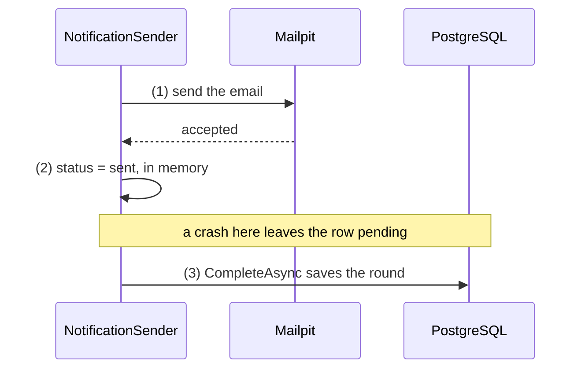

## Bạn cần biết trước

- [[backend.l2.retry-with-backoff]] — bạn biết một lần gửi thất bại giữ dòng ở `pending` để thử lại sau, và mỗi nhịp bắt đầu một vòng: lấy tối đa 10 dòng tới hạn, gửi từng dòng, rồi lưu tất cả một lần.
- [[backend.l2.idempotent-endpoints]] — bạn biết một client bị timeout không thể biết `POST` của nó đã tạo đơn hay chưa, và `Idempotency-Key` làm cho lần gửi lại trở nên an toàn.

## Tình huống

Một khách đặt đơn 57. Vài giây sau, Mailpit, thứ đứng thay cho một mail server thật, hiện email "order placed" của đơn đó. Ngay sau khi Mailpit nhận email, container `api` bị kill, trước khi vòng gửi kịp lưu gì. Container chạy lại, bộ gửi chạy vòng đầu tiên, và giờ Mailpit hiện cùng một email hai lần, còn một khách thật sẽ nhận cả hai. Không lần gửi nào ném exception, không dòng nào `failed`, vậy mà một email đã tới hai lần. Bộ gửi có nên lưu `sent` trước không, và có thứ tự nào của hai bước giúp mỗi email đi đúng một lần không?

## Khái niệm cốt lõi

- **at-least-once** (bảo đảm việc được làm một hoặc nhiều lần: không bao giờ mất, nhưng đôi khi bị lặp) — job được làm một lần trở lên: không bao giờ mất, nhưng đôi khi bị lặp lại.
- **at-most-once** (bảo đảm việc được làm không quá một lần: không bao giờ lặp, nhưng đôi khi bị mất) — job được làm không lần nào hoặc đúng một lần: không bao giờ lặp, nhưng đôi khi bị mất.
- đúng một lần (exactly once) — điều ai cũng muốn: mỗi job làm đúng một lần, không phải không lần và không phải hai lần. Với email, không thứ tự bước nào hứa được điều này.
- `CompleteAsync` — lời gọi ở cuối vòng, lưu mọi dòng mà vòng đó đã đổi, kể cả từng `status` được đặt thành `sent`.

## Cơ chế hoạt động



Trong tình huống trên, `api` dừng giữa bước (1) và bước (3). Bước (2) chỉ đổi dòng trong bộ nhớ, chưa có gì tới PostgreSQL cho tới bước (3). Mailpit đã có email, nhưng PostgreSQL vẫn ghi `pending`, vì `sent` chỉ vào bảng khi vòng gửi được lưu. Sau khi khởi động lại, bộ gửi lấy dòng đó lần nữa và gửi lần nữa. Khoảng hở này còn phủ cả vòng: sập ở cuối một vòng sẽ lặp lại mọi email vòng đó đã gửi.

Thử lại cũng gây ra đúng chuyện này mà không cần sập. Một lần gửi có thể thất bại sau khi mail server đã nhận email, chẳng hạn khi câu trả lời của server không tới kịp trước lúc bộ gửi thôi chờ. Bộ gửi không phân biệt được "chưa từng tới" với "đã tới nhưng mất câu trả lời", y như một client có `POST` bị timeout. Nên lần gửi đó bị tính là thất bại, và lần thử lại gửi thêm một bản thứ hai.

Đây là at-least-once: job email không bao giờ mất, nhưng có thể chạy nhiều hơn một lần. Giờ hãy đảo hai bước: lưu `sent` trước, rồi mới gửi. Sập ở giữa sẽ để lại một dòng ghi `sent` cho một email chưa từng đi, mà bộ gửi thì chỉ lấy dòng `pending`. Đó là at-most-once: không bao giờ hai lần, nhưng đôi khi không lần nào.

Không thứ tự nào cho ra đúng một lần. Muốn vậy, việc gửi và việc đổi trạng thái phải cùng thành công hoặc cùng thất bại, như một giao dịch. Nhưng giao dịch chỉ bao những gì PostgreSQL lưu, còn mail server không thể tham gia vào đó. Bước nào đi trước thì cũng có một khoảnh khắc bước này đã xong còn bước kia thì chưa.

## Trong hệ thống Đơn Hàng

Method gửi một email:

```csharp file=DonHang.Api/Jobs/NotificationSender.cs tag=stage-2 lines=61-81
    // lesson: backend.l2.at-least-once-jobs
    // The order matters: (1) send the email, (2) mark the row sent, (3) save
    // it in CompleteAsync. A crash after (1) and before (3) leaves the row
    // pending, so the email goes out again: at least once, never lost.
    private async Task SendOneAsync(IEmailSender email, Notification notification, CancellationToken stoppingToken)
    {
        try
        {
            var customer = notification.Order!.Customer!;
            await email.SendAsync(customer.Email, $"Order {notification.OrderId}: {notification.Subject}",
                $"Hello {customer.FullName}, this is about your order {notification.OrderId}: {notification.Subject}.",
                stoppingToken);
            notification.Status = "sent";
            notification.SentAt = DateTimeOffset.UtcNow;
            logger.LogInformation("Sent notification {NotificationId} for order {OrderId}", notification.Id, notification.OrderId);
        }
        catch (Exception ex) when (!stoppingToken.IsCancellationRequested)
        {
            RecordFailure(notification, ex);
        }
    }
```

Bước (1) là lời gọi `await email.SendAsync(...)`. Bước (2) là hai dòng ngay sau nó, chỉ đổi object `Notification` trong bộ nhớ. Nếu `SendAsync` ném exception khi app không đang tắt, khối `catch` chuyển dòng cho `RecordFailure` kể cả khi email thật ra đã tới, và nó giữ dòng ở `pending` để thử lại sau, trừ khi đây là lần thử thứ năm. Khi app đang tắt, exception không bị bắt, vòng gửi kết thúc mà không qua `CompleteAsync`, và dòng vẫn ở `pending`.

Bước (3) nằm ở tầng trên, mỗi vòng một lần:

```csharp file=DonHang.Api/Jobs/NotificationSender.cs tag=stage-2 lines=47-59
    private async Task SendDueAsync(CancellationToken stoppingToken)
    {
        using var scope = scopeFactory.CreateScope();
        var queue = scope.ServiceProvider.GetRequiredService<NotificationQueue>();
        var email = scope.ServiceProvider.GetRequiredService<IEmailSender>();

        var due = await queue.ClaimDueAsync(BatchSize, stoppingToken);
        foreach (var notification in due)
        {
            await SendOneAsync(email, notification, stoppingToken);
        }
        await queue.CompleteAsync(stoppingToken);
    }
```

`ClaimDueAsync` lấy tối đa `BatchSize` (10) dòng `pending` đã tới hạn cho vòng này. Cả vòng chạy trong một giao dịch: `ClaimDueAsync` mở nó và `CompleteAsync` commit nó. Commit làm các thay đổi của giao dịch thành vĩnh viễn, còn rollback bỏ hết chúng đi, và PostgreSQL tự rollback nếu process chết trước lúc commit. `CompleteAsync` chỉ chạy sau khi vòng `foreach` đã thử hết mọi dòng. Trước lúc đó, mọi `sent` chỉ tồn tại trong bộ nhớ. Đó chính là khoảng hở mà một lần sập làm email đi hai lần.

Đơn Hàng chấp nhận điều này. Một email "order placed" bị lặp chỉ gây phiền chút ít, còn một email bị mất thì để khách không có tin gì về đơn của mình. Khi việc lặp lại gây hại thật, như trừ tiền hai lần, job phải idempotent. Một cách là gửi kèm một khóa mà bên nhận kiểm tra, như `Idempotency-Key` làm với đơn hàng: bên nhận nhận ra lần lặp và lần thứ hai không làm gì cả.

## Người mới hay nghĩ rằng…

- **"Đặt việc gửi và việc cập nhật trạng thái trong một giao dịch database thì email sẽ đi đúng một lần."** → Thực ra ở stage-2, vòng gửi vốn đã chạy trong một giao dịch, như mục trước đã cho thấy. Nếu process chết trước lúc commit, PostgreSQL rollback giao dịch và dòng vẫn `pending`, nhưng không gì lấy lại được một email Mailpit đã nhận. Bạn sẽ nhận ra khi một khách nhận email lặp dù mọi thay đổi trên `notifications` đều nằm trong giao dịch.
- **"Đánh dấu dòng là đã gửi trước khi gửi là thứ tự an toàn hơn, vì khi đó không gì bị gửi hai lần."** → Thực ra nó đổi một email lặp lấy một email mất. Sập sau lúc lưu và trước lúc gửi sẽ để lại một dòng `sent` mà bộ gửi không bao giờ lấy lại, nên email đó mất hẳn. Bạn sẽ nhận ra khi một khách nói không nhận được email nào, dòng thì ghi `sent` kèm `sent_at`, còn Mailpit không có gì cho đơn đó.

## Thử ngay (3 phút)

1. Mở `DonHang.Api/Jobs/NotificationSender.cs` trong repo ví dụ ở `stage-2`, và tìm các bước (1), (2), (3) trong comment phía trên `SendOneAsync`.
2. Với một job `pending`, hãy xác định khách sẽ nhận bao nhiêu email nếu process `api` bị kill ở từng thời điểm dưới đây rồi chạy lại: (a) trước khi bước (1) bắt đầu, (b) sau bước (1) và trước bước (3), (c) sau bước (3).
3. Rồi cho biết thời điểm nào đổi khác, và đổi thế nào, nếu code lưu `sent` trước khi gửi.

Kết quả mong đợi: một câu trả lời cho từng thời điểm, và một câu cho phiên bản code đảo thứ tự.

<details><summary>Gợi ý đáp án</summary>

(a) Một email: dòng vẫn `pending`, nên bộ gửi gửi nó sau khi khởi động lại. (b) Hai email: Mailpit đã có một bản, dòng vẫn `pending`, và bộ gửi gửi lại lần nữa. (c) Một email: dòng đã được lưu là `sent` và không bao giờ bị lấy lại. Khi lưu `sent` trước, thời điểm nguy hiểm đổi chiều: sập giữa lúc lưu và lúc gửi làm khách không nhận được email nào.

</details>

## Liên hệ

- [[backend.l2.retry-with-backoff]] — điều kiện tiên quyết: cơ chế thử lại khiến mọi job thành at-least-once, và thêm một đường nữa dẫn tới email lặp.
- [[backend.l2.idempotent-endpoints]] — cùng vấn đề ở tầng trên: một client gửi lại `POST`, được giải bằng một khóa mà bên nhận kiểm tra.
- [[backend.l2.skip-locked-claiming]] — bài tiếp theo: điều gì thay đổi khi nhiều bản `api` cùng gửi từ một bảng.
- [[backend.l2.database-job-queue]] — bảng có cột `status` mà bài này lưu sau khi gửi.

## Tóm tắt 5 dòng

1. Job email gửi trước rồi mới lưu `sent` là at-least-once: không bao giờ mất, nhưng đôi khi bị gửi hai lần.
2. Sập sau lúc gửi và trước khi `CompleteAsync` lưu vòng đó sẽ để dòng ở `pending`, nên bộ gửi sau khi khởi động lại gửi nó lần nữa.
3. Lần gửi thất bại sau khi mail server đã nhận email vẫn bị tính là thất bại, và lần thử lại có thể gửi thêm một bản.
4. Lưu `sent` trước khi gửi làm job thành at-most-once, và không thứ tự nào cho ra đúng một lần giữa Mailpit và PostgreSQL.
5. Đơn Hàng chấp nhận thỉnh thoảng lặp email, còn job mà lặp lại sẽ gây hại thì phải idempotent, với một khóa bên nhận kiểm tra.
