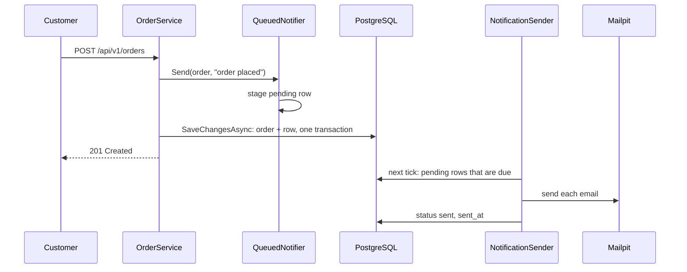

## Before you start

- [[backend.l2.hosted-services]] — you know `NotificationSender` wakes every 2 seconds inside the `api` process and does one round of work with a fresh `DonHangDbContext`.
- [[backend.l1.saving-changes]] — you know `AddAsync` only stages an entity, and one `SaveChangesAsync` writes every staged change in one transaction, all or nothing.

## The situation

You now have a loop that runs beside the requests. But the loop still needs to know which emails to send, and the request still has to tell it. The simplest idea is a list in memory: the request adds "email order 42", the loop takes it. Then someone deploys a new version of the API while three emails are waiting in that list. The process stops, the list is gone, and three customers never hear about their orders, with nothing recording that they were due. Where should the request put "this email must be sent" so that it survives a restart, and so that it exists exactly when the order does?

## Core concepts

- **job queue** — a durable list of work waiting to be done, from which background code takes one item at a time.
- `notifications` — the table that holds one row per message about an order; from stage-2 each row is also a job, with a `status` of `pending`, `sent` or `failed`.
- `INotifier` — the interface `OrderService` calls to announce an order event; at stage-1 its `Send` took `order.Id` and ran after `SaveChangesAsync`.
- `QueuedNotifier` — the class behind `INotifier` at stage-2; its `Send` sends nothing, it only adds a `pending` row for the order.
- Mailpit — the fake mail server that runs as the `mailpit` container next to `api`; it accepts every email the API sends and delivers none, and shows what arrived.

## How it works



In the situation above, the place that survives a restart is PostgreSQL. At stage-2 the `notifications` table is Đơn Hàng's job queue: each row with `status` `pending` is one email still to send.

When a customer places an order, `OrderService.PlaceOrderAsync` stages the new order, then calls `notifier.Send`. Behind `INotifier` is now `QueuedNotifier`, which adds a `notifications` row with `status` `pending` to the same `DonHangDbContext`, and returns. Only then does `SaveChangesAsync` run, once, for both. They are written in one transaction, so either the order and its email job are both saved, or neither is. So every order placed from stage-2 on has its email job, and no job exists without its order.

The request answers `201 Created` right after that save. It has not contacted the mail server at all.

`NotificationSender` is the only code that takes work from this queue. On each tick, one wake of its 2-second timer, it reads the `pending` rows that are due. A row is due when its `next_attempt_at` is not in the future, and a new job gets the current time, so it is due at once. It sends each email to Mailpit and sets `status` to `sent` together with `sent_at`.

Because every job is a row, a restart of the API loses nothing. A row that was still `pending` when the process stopped is still `pending` in PostgreSQL, and the sender picks it up in its first rounds after the start.

The cost is a short delay. The sender only looks for work when its timer wakes it, so an email goes out a few seconds after the order, not at the same moment.

## In the Đơn Hàng system

The end of `PlaceOrderAsync` at stage-2:

```csharp file=DonHang.Domain/OrderService.cs tag=stage-2 lines=25-33
        var order = new Order(customerId, items, DateTimeOffset.UtcNow) { IdempotencyKey = idempotencyKey };
        await repository.AddAsync(order);

        // lesson: backend.l2.database-job-queue
        // The notifier only adds a pending email job next to the order; this one
        // SaveChangesAsync then writes both in one transaction, or neither.
        notifier.Send(order, "order placed");
        await repository.SaveChangesAsync();
        return (order, Created: true);
```

Compare it with stage-1, where `SaveChangesAsync` came first and `Send` second. Now `Send` comes before the save, and it receives the `Order` itself, not `order.Id`. At that moment the order has no id yet: PostgreSQL assigns it during the `INSERT`. `CancelOrderAsync` and `ShipOrderAsync` follow the same order: notify, then save.

This is all `Send` does now:

```csharp file=DonHang.Infrastructure/QueuedNotifier.cs tag=stage-2 lines=9-24
public sealed class QueuedNotifier(DonHangDbContext db) : INotifier
{
    public void Send(Order order, string subject)
    {
        var now = DateTimeOffset.UtcNow;
        db.Notifications.Add(new Notification
        {
            Order = order, // EF Core fills in order_id when it saves both
            Channel = "email",
            Subject = subject,
            Status = "pending",
            CreatedAt = now,
            NextAttemptAt = now,
        });
    }
}
```

`db.Notifications.Add` only stages the row, like `AddAsync` stages the order. `DonHangDbContext` is scoped, so within one request `QueuedNotifier` and the order repository hold the same instance, and one `SaveChangesAsync` writes both. `NextAttemptAt = now` makes the job due at once. `Order = order` links the row to the order object; during the save, EF Core inserts the order first and uses its new id as the row's `order_id`.

On the other side, a round in `NotificationSender` reads the due `pending` rows. For each one, `SendOneAsync` sends the email and then sets `notification.Status = "sent"` and `notification.SentAt`, and the round saves those changes at its end.

## Beginners often think…

- **"Keeping pending emails in a list in memory works just as well as a table, and it is faster."** → Actually a list lives in the `api` process and dies with it; a row in `notifications` survives a restart, a deploy or a crash. A table also lets anyone see what is waiting. You notice this when a deploy happens right after a busy minute: with a table, the emails still go out after the start; with a list, they are silently lost.
- **"Saving the order and adding the email job in two separate `SaveChangesAsync` calls is just as safe."** → Actually two calls are two transactions. If the process stops between them, the order is saved and its job is not, so that customer never gets an email. You notice this when an order placed at stage-2 exists in `orders` with no row in `notifications` for it, which one `SaveChangesAsync` makes impossible.
- **"When the order response comes back, the email has already been sent."** → Actually the response only means the job was saved as `pending`. The email goes out on the sender's next tick, a few seconds later. You notice this when the script in "Try it" reports `sent after the response came back: yes`.

## Try it (3 minutes)

1. With the example system running (`scripts/up.sh`), run `scripts/backend/order-email.sh` from the root folder of the example repository. It places an order as customer 1, shows its row in `notifications`, waits for the sender, then asks Mailpit what arrived.
2. Read its four blocks of output from top to bottom: the response, the job row, the row after the sender's round, and what Mailpit received.

Expected result: the script prints `-> 201`, then `email | order placed`, the job row's channel and subject, then `status after the sender's next round: sent` and `sent after the response came back: yes`. The last block shows the email Mailpit received, sent `to: anh.tran@example.com` with a subject `Order <your order id>: order placed`.

## Connections

- [[backend.l2.hosted-services]] — prerequisite: the loop that takes jobs from this queue.
- [[backend.l1.saving-changes]] — prerequisite: the one transaction around every staged change, which is what keeps the order and its job together.
- [[backend.l2.retry-with-backoff]] — the next problem: what the sender does with a job whose email fails.
- [[design.l3.outbox-pattern]] — a later lesson that builds on saving work as a row.

## Five-line summary

1. Saving the email job as a `notifications` row in the order's own transaction means an email job is never lost and never without its order.
2. `QueuedNotifier.Send` only stages a `pending` row; the single `SaveChangesAsync` in `PlaceOrderAsync` writes the order and the job together.
3. The request answers without contacting the mail server; `NotificationSender` is the only code that takes jobs from the table.
4. Each tick, the sender reads due `pending` rows, emails Mailpit, and sets `status` to `sent` with `sent_at`.
5. Jobs survive an API restart, and each email goes out a few seconds after its order, on the sender's next tick.
