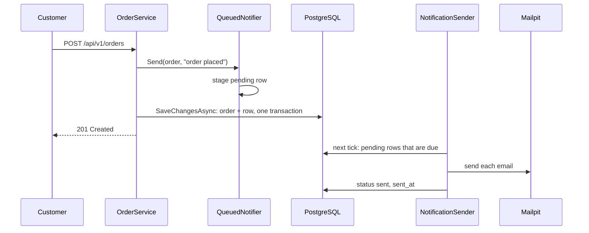

## Bạn cần biết trước

- [[backend.l2.hosted-services]] — bạn biết `NotificationSender` thức dậy mỗi 2 giây bên trong process `api` và làm một vòng việc với một `DonHangDbContext` mới.
- [[backend.l1.saving-changes]] — bạn biết `AddAsync` chỉ đánh dấu entity chờ lưu, và một lần `SaveChangesAsync` ghi mọi thay đổi đang chờ trong một giao dịch, được cả hoặc không gì cả.

## Tình huống

Giờ bạn đã có một vòng lặp chạy song song với request. Nhưng vòng lặp vẫn cần biết phải gửi email nào, và request vẫn phải báo cho nó. Ý tưởng đơn giản nhất là một danh sách trong bộ nhớ: request thêm "gửi email đơn 42", vòng lặp lấy ra. Rồi có người deploy bản API mới đúng lúc ba email đang chờ trong danh sách đó. Process dừng, danh sách mất, và ba khách không bao giờ nhận được tin về đơn của mình, mà không có gì ghi lại rằng lẽ ra họ phải nhận. Request nên đặt điều "email này phải được gửi" ở đâu để nó sống sót qua một lần khởi động lại, và để nó tồn tại đúng khi đơn tồn tại?

## Khái niệm cốt lõi

- **hàng đợi job** (job queue) — danh sách việc đang chờ làm, được lưu bền, nơi code chạy nền lấy từng việc ra xử lý.
- `notifications` — bảng chứa mỗi thông báo về một đơn thành một dòng; từ stage-2, mỗi dòng còn là một job, với `status` là `pending`, `sent` hoặc `failed`.
- `INotifier` — interface mà `OrderService` gọi để báo một sự kiện của đơn; ở stage-1, `Send` của nó nhận `order.Id` và chạy sau `SaveChangesAsync`.
- `QueuedNotifier` — class đứng sau `INotifier` ở stage-2; `Send` của nó không gửi gì, chỉ thêm một dòng `pending` cho đơn.
- Mailpit — mail server giả chạy thành container `mailpit` cạnh `api`; nó nhận mọi email API gửi tới, không chuyển đi email nào, và cho xem những gì đã tới.

## Cơ chế hoạt động



Trong tình huống trên, nơi sống sót qua một lần khởi động lại là PostgreSQL. Ở stage-2, bảng `notifications` là hàng đợi job của Đơn Hàng: mỗi dòng có `status` là `pending` là một email còn phải gửi.

Khi khách đặt đơn, `OrderService.PlaceOrderAsync` đánh dấu đơn mới chờ lưu, rồi gọi `notifier.Send`. Đứng sau `INotifier` giờ là `QueuedNotifier`, class này thêm một dòng `notifications` có `status` là `pending` vào cùng `DonHangDbContext` đó, rồi trả về. Chỉ sau đó `SaveChangesAsync` mới chạy, một lần, cho cả hai. Chúng được ghi trong một giao dịch, nên hoặc cả đơn lẫn job email đều được lưu, hoặc không cái nào. Vậy mọi đơn đặt từ stage-2 trở đi đều có job email của nó, và không job nào tồn tại mà thiếu đơn.

Request trả `201 Created` ngay sau lần lưu đó. Nó hoàn toàn không liên lạc với mail server.

`NotificationSender` là đoạn code duy nhất lấy việc từ hàng đợi này. Mỗi nhịp, tức mỗi lần bộ đếm 2 giây đánh thức nó, nó đọc các dòng `pending` đã tới hạn. Một dòng tới hạn khi `next_attempt_at` của nó không nằm ở tương lai, và job mới được gán thời điểm hiện tại, nên tới hạn ngay. Nó gửi từng email tới Mailpit rồi đặt `status` thành `sent` cùng với `sent_at`.

Vì mỗi job là một dòng, khởi động lại API không làm mất gì. Dòng còn `pending` lúc process dừng vẫn `pending` trong PostgreSQL, và bộ gửi lấy nó ra trong mấy vòng đầu sau khi khởi động.

Cái giá là một chút chậm trễ. Bộ gửi chỉ tìm việc khi bộ đếm đánh thức nó, nên email đi ra vài giây sau đơn, không phải cùng lúc.

## Trong hệ thống Đơn Hàng

Phần cuối của `PlaceOrderAsync` ở stage-2:

```csharp file=DonHang.Domain/OrderService.cs tag=stage-2 lines=25-33
        var order = new Order(customerId, items, DateTimeOffset.UtcNow) { IdempotencyKey = idempotencyKey };
        await repository.AddAsync(order);

        // lesson: backend.l2.database-job-queue
        // The notifier only adds a pending email job next to the order; this one
        // SaveChangesAsync then writes both in one transaction, or neither.
        notifier.Send(order, "order placed");
        await repository.SaveChangesAsync();
        return (order, Created: true);
```

Hãy so với stage-1, khi `SaveChangesAsync` đứng trước còn `Send` đứng sau. Giờ `Send` đứng trước lần lưu, và nó nhận chính `Order`, không nhận `order.Id`. Lúc đó đơn chưa có id: PostgreSQL cấp id trong lúc `INSERT`. `CancelOrderAsync` và `ShipOrderAsync` cũng theo đúng thứ tự này: báo trước, lưu sau.

Đây là toàn bộ những gì `Send` làm bây giờ:

```csharp file=DonHang.Infrastructure/QueuedNotifier.cs tag=stage-2 lines=9-24
public sealed class QueuedNotifier(DonHangDbContext db) : INotifier
{
    public void Send(Order order, string subject)
    {
        var now = DateTimeOffset.UtcNow;
        db.Notifications.Add(new Notification
        {
            Order = order, // EF Core fills in order_id when it saves both
            Channel = "email",
            Subject = subject,
            Status = "pending",
            CreatedAt = now,
            NextAttemptAt = now,
        });
    }
}
```

`db.Notifications.Add` chỉ đánh dấu dòng chờ lưu, giống như `AddAsync` làm với đơn. `DonHangDbContext` là scoped, nên trong một request `QueuedNotifier` và repository của đơn giữ cùng một instance, và một lần `SaveChangesAsync` ghi cả hai. `NextAttemptAt = now` làm job tới hạn ngay. `Order = order` nối dòng với object đơn; trong lúc lưu, EF Core insert đơn trước rồi dùng id mới của nó làm `order_id` cho dòng.

Ở phía bên kia, một vòng của `NotificationSender` đọc các dòng `pending` đã tới hạn. Với từng dòng, `SendOneAsync` gửi email rồi đặt `notification.Status = "sent"` và `notification.SentAt`, và vòng đó lưu các thay đổi này khi kết thúc.

## Người mới hay nghĩ rằng…

- **"Giữ các email đang chờ trong một danh sách trong bộ nhớ cũng tốt như một bảng, mà còn nhanh hơn."** → Thực ra danh sách sống trong process `api` và chết cùng nó; một dòng trong `notifications` sống sót qua lần khởi động lại, lần deploy hay lần sập. Bảng còn cho ai cũng xem được việc gì đang chờ. Bạn sẽ nhận ra khi có một lần deploy ngay sau một phút đông khách: với bảng, email vẫn đi sau khi khởi động; với danh sách, chúng mất mà không ai hay.
- **"Lưu đơn và thêm job email bằng hai lần `SaveChangesAsync` riêng cũng an toàn y như vậy."** → Thực ra hai lần gọi là hai giao dịch. Nếu process dừng giữa hai lần, đơn đã lưu còn job thì không, nên khách đó không bao giờ nhận email. Bạn sẽ nhận ra khi một đơn đặt ở stage-2 có trong `orders` mà không có dòng nào trong `notifications`, điều mà một lần `SaveChangesAsync` khiến không thể xảy ra.
- **"Khi response đặt đơn trả về thì email đã được gửi rồi."** → Thực ra response chỉ có nghĩa là job đã được lưu ở trạng thái `pending`. Email đi ra ở nhịp kế tiếp của bộ gửi, vài giây sau. Bạn sẽ nhận ra khi script trong "Thử ngay" báo `sent after the response came back: yes`.

## Thử ngay (3 phút)

1. Khi hệ thống ví dụ đang chạy (`scripts/up.sh`), chạy `scripts/backend/order-email.sh` từ thư mục gốc của repo ví dụ. Script đặt một đơn với tư cách khách 1, cho xem dòng của đơn đó trong `notifications`, chờ bộ gửi, rồi hỏi Mailpit đã nhận được gì.
2. Đọc bốn khối output của nó từ trên xuống: response, dòng job, dòng đó sau vòng của bộ gửi, và những gì Mailpit nhận được.

Kết quả mong đợi: script in ra `-> 201`, rồi `email | order placed`, tức channel và subject của dòng job, rồi `status after the sender's next round: sent` và `sent after the response came back: yes`. Khối cuối cho thấy email Mailpit nhận được, gửi `to: anh.tran@example.com` với subject `Order <id đơn của bạn>: order placed`.

## Liên hệ

- [[backend.l2.hosted-services]] — điều kiện tiên quyết: vòng lặp lấy job từ hàng đợi này.
- [[backend.l1.saving-changes]] — điều kiện tiên quyết: một giao dịch bao quanh mọi thay đổi đang chờ, chính là thứ giữ đơn và job của nó đi cùng nhau.
- [[backend.l2.retry-with-backoff]] — vấn đề tiếp theo: bộ gửi làm gì với một job gửi email thất bại.
- [[design.l3.outbox-pattern]] — một bài sau, xây tiếp trên ý lưu việc cần làm thành một dòng.

## Tóm tắt 5 dòng

1. Lưu job email thành một dòng `notifications` trong chính giao dịch của đơn nghĩa là job email không bao giờ mất và không bao giờ thiếu đơn.
2. `QueuedNotifier.Send` chỉ đánh dấu một dòng `pending` chờ lưu; một lần `SaveChangesAsync` trong `PlaceOrderAsync` ghi đơn và job cùng nhau.
3. Request trả lời mà không liên lạc mail server; `NotificationSender` là đoạn code duy nhất lấy job từ bảng.
4. Mỗi nhịp, bộ gửi đọc các dòng `pending` đã tới hạn, gửi email tới Mailpit, và đặt `status` thành `sent` kèm `sent_at`.
5. Job sống sót qua lần khởi động lại API, và mỗi email đi ra vài giây sau đơn của nó, ở nhịp kế tiếp của bộ gửi.
