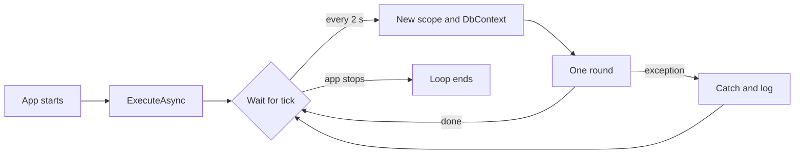

## Before you start

- [[backend.l2.work-outside-the-request]] — you know the order email should be sent by code outside any request, so the response does not wait for the mail server.
- [[design.l1.service-lifetimes]] — you know a singleton lives for the whole app, a scoped object lives for one request, and a `DonHangDbContext` must not be shared across requests.
- [[backend.l1.hosting-and-program-cs]] — you know `Program.cs` registers services on `builder.Services`, and `app.Run()` starts the app that serves requests.

## The situation

The previous lesson ended with a plan: the order request only records that an email is due, and some other code sends it later. But every piece of code you have written in `DonHang.Api` so far runs because a request arrived. A controller method runs when its route matches; nothing runs it at two in the morning when no customer is online. The email code needs the opposite: it must run on its own, all the time, whether requests come or not. It also needs a `DonHangDbContext` to read the database, and so far you have only received one per request. Where does such code live in Đơn Hàng, and who starts it?

## Core concepts

- **hosted service** — a class the ASP.NET Core host starts together with the app and stops when the app shuts down, used to run background work; the host is the object that `app.Run()` starts, which also runs Kestrel.
- `BackgroundService` — a base class for a hosted service: you override one method, `ExecuteAsync`, and the host runs it once, for the life of the app.
- `CancellationToken` — a value passed into a method that tells it when to give up; the one `ExecuteAsync` receives is signalled when the app shuts down.
- `PeriodicTimer` — a .NET timer you await in a loop: each await finishes at the next tick, and no thread is held while it waits.
- `IServiceScopeFactory` — a singleton service that creates a new scope each time you call `CreateScope()`, so code outside a request can still get scoped objects such as `DonHangDbContext`.

## How it works



In the situation above, the code that sends emails is `NotificationSender`, a hosted service in `DonHang.Api/Jobs/`. It derives from `BackgroundService`, and `Program.cs` registers it with `AddHostedService<NotificationSender>()`. When the app starts, the host calls its `ExecuteAsync`. That method runs in the same process that serves requests, beside them, not in a separate program.

`ExecuteAsync` is one loop. It waits on a `PeriodicTimer` set to 2 seconds. The wait is asynchronous: no thread is blocked while it waits. At each tick it does one round of work, then waits again.

The host creates the hosted service once and keeps it for the whole life of the app, like a singleton. That is why `NotificationSender` must not take a `DonHangDbContext` in its constructor: one `DbContext` would then live for days and serve every round. Instead, it takes `IServiceScopeFactory`. Each round creates a new scope, asks it for the objects it needs, and disposes the scope at the end of the round, together with that round's `DbContext`.

A round can fail: the database may be restarting, or the mail server may be down. By default, an exception that escapes `ExecuteAsync` stops the whole app, requests included. So each round runs inside a `try`, and the `catch` logs the error and lets the loop wait for the next tick.

When the app shuts down, the `CancellationToken` of `ExecuteAsync` is signalled. The wait on the timer ends with a cancellation, a round in progress gets the same token so the calls that take it can stop early, and the loop stops instead of starting new work.

## In the Đơn Hàng system

`Program.cs` registers the hosted service with one line, `builder.Services.AddHostedService<NotificationSender>();`, right after `AddScoped<OrderService>()`. The class itself starts like this: `NotificationSender(IServiceScopeFactory scopeFactory, ILogger<NotificationSender> logger) : BackgroundService`, with `Tick` set to `TimeSpan.FromSeconds(2)`. Here is its `ExecuteAsync`:

```csharp file=DonHang.Api/Jobs/NotificationSender.cs tag=stage-2 lines=21-39
    // lesson: backend.l2.hosted-services
    // stoppingToken is signalled when the app shuts down: the timer stops
    // waiting and the loop ends. An exception that escaped this method would
    // stop the whole app, so each round catches and logs its own errors.
    protected override async Task ExecuteAsync(CancellationToken stoppingToken)
    {
        using var timer = new PeriodicTimer(Tick);
        while (await timer.WaitForNextTickAsync(stoppingToken))
        {
            try
            {
                await SendDueAsync(stoppingToken);
            }
            catch (Exception ex) when (!stoppingToken.IsCancellationRequested)
            {
                logger.LogError(ex, "Sending notifications failed; trying again in {TickSeconds} s", Tick.TotalSeconds);
            }
        }
    }
```

`WaitForNextTickAsync(stoppingToken)` is the wait in the diagram. `stoppingToken` also goes into `SendDueAsync`, which is how a round in progress learns that the app is stopping. When the token is signalled, a call that takes it, such as `WaitForNextTickAsync`, stops by throwing an `OperationCanceledException`. Look at the `when` on the `catch`: it catches everything except an exception during shutdown. At shutdown the cancellation is allowed out, and the loop ends instead of logging it as a failure. Letting it out is harmless, because the app is already stopping.

Each round starts in `SendDueAsync`:

```csharp file=DonHang.Api/Jobs/NotificationSender.cs tag=stage-2 lines=47-59
    private async Task SendDueAsync(CancellationToken stoppingToken)
    {
        using var scope = scopeFactory.CreateScope();
        var queue = scope.ServiceProvider.GetRequiredService<NotificationQueue>();
        var email = scope.ServiceProvider.GetRequiredService<IEmailSender>();

        var due = await queue.ClaimDueAsync(BatchSize, stoppingToken);
        foreach (var notification in due)
        {
            await SendOneAsync(email, notification, stoppingToken);
        }
        await queue.CompleteAsync(stoppingToken);
    }
```

`using var scope` makes the scope live until the method returns. `NotificationQueue` is registered as scoped and takes a `DonHangDbContext`, so each round gets a fresh one from this scope, and the `using` disposes both when the round ends. What `ClaimDueAsync` reads, what a round sends, and the `IEmailSender`, `BatchSize` and `SendOneAsync` it uses, are the next lessons.

## Beginners often think…

- **"A background service runs as a separate program next to the API."** → Actually a hosted service such as `NotificationSender` runs inside the `api` process, started by the same host that runs Kestrel. There is no other container and no other program. You notice this when its log lines appear in `docker compose logs api`, and when stopping the `api` container also stops the emails.
- **"The background service can take `DonHangDbContext` in its constructor, just like a controller does."** → Actually a controller is created for each request, while the hosted service is created once. A `DbContext` taken in its constructor would be one object for the life of the app, the bug the service-lifetimes lesson warned about. You notice this at start-up: the lab sets `ASPNETCORE_ENVIRONMENT` to `Development`, where the DI container checks lifetimes when the app is built, and the app refuses to start, with an error that a scoped service cannot be used from a singleton.
- **"If the background loop throws, only the loop stops and the API keeps serving requests."** → Actually, by default, an exception that escapes `ExecuteAsync` makes the host stop the whole app. That is why each round catches its own errors. You notice this when one unhandled error in the loop leaves the `api` container stopped, with the host's error in its last log lines.

## Try it (3 minutes)

1. With the example system running (`scripts/up.sh`), run `scripts/backend/order-email.sh` from the root folder of the example repository. It places an order and waits for its email.
2. Then run `docker compose logs api | grep NotificationSender` in the same folder.

Expected result: the script prints `status after the sender's next round: sent`. The log search shows lines prefixed with `donhang-api`, the same container that answered the order, each with `"Category":"DonHang.Api.Jobs.NotificationSender"` and a message such as `Sent notification 30 for order 1`, with your own numbers.

## Connections

- [[backend.l2.work-outside-the-request]] — prerequisite: the problem this class is the home for, email work that must not run inside a request.
- [[design.l1.service-lifetimes]] — the same lifetime rules one step further: a hosted service is a singleton, so it creates its own scopes.
- [[backend.l2.database-job-queue]] — the next lesson: what one round reads from the `notifications` table and sends.
- [[backend.l2.retry-with-backoff]] — what the rest of `NotificationSender` does when sending one email fails.

## Five-line summary

1. A hosted service is code the host starts with the app and stops at shutdown, running beside the requests in the same process.
2. `NotificationSender` derives from `BackgroundService`; `AddHostedService` registers it, and the host runs its `ExecuteAsync` loop once for the app's life.
3. The loop awaits a 2-second `PeriodicTimer`, holding no thread while it waits, and stops when the shutdown token is signalled.
4. Created once like a singleton, it keeps no `DonHangDbContext`; each round creates a scope with `IServiceScopeFactory` for a fresh one.
5. An exception escaping `ExecuteAsync` stops the whole app by default, so each round catches and logs its own errors.
