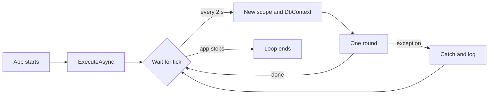

## Bạn cần biết trước

- [[backend.l2.work-outside-the-request]] — bạn biết email đơn hàng nên do code nằm ngoài mọi request gửi, để response không phải chờ mail server.
- [[design.l1.service-lifetimes]] — bạn biết singleton sống suốt đời app, object scoped sống trong một request, và một `DonHangDbContext` không được dùng chung giữa các request.
- [[backend.l1.hosting-and-program-cs]] — bạn biết `Program.cs` đăng ký service trên `builder.Services`, và `app.Run()` khởi động app phục vụ request.

## Tình huống

Bài trước kết thúc bằng một kế hoạch: request đặt đơn chỉ ghi lại rằng có một email cần gửi, còn một đoạn code khác gửi nó sau. Nhưng mọi đoạn code bạn viết trong `DonHang.Api` tới giờ đều chạy vì có một request tới. Method của controller chạy khi route của nó khớp; lúc hai giờ sáng không có khách nào online thì chẳng gì chạy nó cả. Code gửi email cần điều ngược lại: nó phải tự chạy, lúc nào cũng chạy, dù có request hay không. Nó còn cần một `DonHangDbContext` để đọc database, mà tới giờ bạn chỉ nhận được mỗi request một cái. Trong Đơn Hàng, code như vậy nằm ở đâu, và ai khởi động nó?

## Khái niệm cốt lõi

- **hosted service** (lớp được host ASP.NET Core khởi động cùng app và dừng khi app tắt, dùng để chạy việc nền) — class được host ASP.NET Core khởi động cùng app và dừng khi app tắt, dùng để chạy việc nền; host là object mà `app.Run()` khởi động, cũng là thứ chạy Kestrel.
- `BackgroundService` — class cơ sở cho một hosted service: bạn override đúng một method là `ExecuteAsync`, và host chạy nó một lần, suốt đời app.
- `CancellationToken` — một giá trị truyền vào method để báo cho nó biết khi nào phải bỏ dở; cái mà `ExecuteAsync` nhận được sẽ phát tín hiệu khi app tắt.
- `PeriodicTimer` — bộ đếm giờ của .NET mà bạn await trong một vòng lặp: mỗi lần await kết thúc ở nhịp kế tiếp, và không thread nào bị giữ trong lúc chờ.
- `IServiceScopeFactory` — một service singleton tạo scope mới mỗi lần bạn gọi `CreateScope()`, để code nằm ngoài request vẫn lấy được object scoped như `DonHangDbContext`.

## Cơ chế hoạt động



Trong tình huống trên, code gửi email là `NotificationSender`, một hosted service trong `DonHang.Api/Jobs/`. Nó kế thừa `BackgroundService`, và `Program.cs` đăng ký nó bằng `AddHostedService<NotificationSender>()`. Khi app khởi động, host gọi `ExecuteAsync` của nó. Method đó chạy trong chính process đang phục vụ request, song song với chúng, không phải trong một chương trình riêng.

`ExecuteAsync` là một vòng lặp. Nó chờ một `PeriodicTimer` đặt 2 giây. Việc chờ là bất đồng bộ: không thread nào bị chặn trong lúc chờ. Mỗi nhịp, nó làm một vòng việc, rồi lại chờ.

Host tạo hosted service một lần và giữ nó suốt đời app, giống một singleton. Vì thế `NotificationSender` không được nhận `DonHangDbContext` qua constructor: khi đó một `DbContext` sẽ sống nhiều ngày và phục vụ mọi vòng. Thay vào đó, nó nhận `IServiceScopeFactory`. Mỗi vòng tạo một scope mới, xin scope đó những object cần dùng, rồi dispose scope ở cuối vòng, kéo theo `DbContext` của vòng đó.

Một vòng có thể lỗi: database có thể đang khởi động lại, hoặc mail server có thể đang sập. Mặc định, exception thoát khỏi `ExecuteAsync` sẽ dừng cả app, kể cả phần phục vụ request. Nên mỗi vòng chạy trong một `try`, và `catch` ghi log lỗi rồi để vòng lặp chờ nhịp kế tiếp.

Khi app tắt, `CancellationToken` của `ExecuteAsync` phát tín hiệu. Việc chờ bộ đếm kết thúc bằng một lệnh hủy, vòng đang chạy nhận cùng token đó nên các lời gọi dùng nó có thể dừng sớm, và vòng lặp kết thúc thay vì bắt đầu việc mới.

## Trong hệ thống Đơn Hàng

`Program.cs` đăng ký hosted service bằng một dòng, `builder.Services.AddHostedService<NotificationSender>();`, ngay sau `AddScoped<OrderService>()`. Class này mở đầu như sau: `NotificationSender(IServiceScopeFactory scopeFactory, ILogger<NotificationSender> logger) : BackgroundService`, với `Tick` đặt bằng `TimeSpan.FromSeconds(2)`. Đây là `ExecuteAsync` của nó:

```csharp file=DonHang.Api/Jobs/NotificationSender.cs tag=stage-2 lines=21-39
    // lesson: backend.l2.hosted-services
    // stoppingToken is signalled when the app shuts down: the timer stops
    // waiting and the loop ends. An exception that escaped this method would
    // stop the whole app, so each round catches and logs its own errors.
    protected override async Task ExecuteAsync(CancellationToken stoppingToken)
    {
        using var timer = new PeriodicTimer(Tick);
        while (await timer.WaitForNextTickAsync(stoppingToken))
        {
            try
            {
                await SendDueAsync(stoppingToken);
            }
            catch (Exception ex) when (!stoppingToken.IsCancellationRequested)
            {
                logger.LogError(ex, "Sending notifications failed; trying again in {TickSeconds} s", Tick.TotalSeconds);
            }
        }
    }
```

`WaitForNextTickAsync(stoppingToken)` là bước chờ trong sơ đồ. `stoppingToken` cũng được truyền vào `SendDueAsync`, nhờ vậy vòng đang chạy biết app đang dừng. Khi token phát tín hiệu, lời gọi nhận nó, như `WaitForNextTickAsync`, dừng bằng cách ném `OperationCanceledException`. Hãy nhìn `when` trên `catch`: nó bắt mọi thứ trừ exception xảy ra lúc tắt. Lúc tắt, lệnh hủy được cho thoát ra, và vòng lặp kết thúc thay vì ghi nó thành lỗi. Cho nó thoát ra không hại gì, vì app vốn đang dừng.

Mỗi vòng bắt đầu ở `SendDueAsync`:

```csharp file=DonHang.Api/Jobs/NotificationSender.cs tag=stage-2 lines=47-59
    private async Task SendDueAsync(CancellationToken stoppingToken)
    {
        using var scope = scopeFactory.CreateScope();
        var queue = scope.ServiceProvider.GetRequiredService<NotificationQueue>();
        var email = scope.ServiceProvider.GetRequiredService<IEmailSender>();

        var due = await queue.ClaimDueAsync(BatchSize, stoppingToken);
        foreach (var notification in due)
        {
            await SendOneAsync(email, notification, stoppingToken);
        }
        await queue.CompleteAsync(stoppingToken);
    }
```

`using var scope` giữ scope sống tới khi method trả về. `NotificationQueue` được đăng ký là scoped và nhận một `DonHangDbContext`, nên mỗi vòng có một cái mới từ scope này, và `using` dispose cả hai khi vòng kết thúc. `ClaimDueAsync` đọc gì, một vòng gửi gì, cùng `IEmailSender`, `BatchSize` và `SendOneAsync` mà nó dùng, là chuyện của các bài sau.

## Người mới hay nghĩ rằng…

- **"Background service chạy thành một chương trình riêng cạnh API."** → Thực ra một hosted service như `NotificationSender` chạy bên trong process `api`, do chính host chạy Kestrel khởi động. Không có container nào khác, cũng không có chương trình nào khác. Bạn sẽ nhận ra khi log của nó xuất hiện trong `docker compose logs api`, và khi dừng container `api` thì email cũng ngừng gửi.
- **"Background service có thể nhận `DonHangDbContext` qua constructor, giống như controller."** → Thực ra controller được tạo cho mỗi request, còn hosted service chỉ được tạo một lần. Một `DbContext` nhận qua constructor sẽ là một object duy nhất suốt đời app, đúng cái lỗi mà bài service lifetime đã cảnh báo. Bạn sẽ nhận ra ngay lúc khởi động: lab đặt `ASPNETCORE_ENVIRONMENT` là `Development`, nơi DI container kiểm tra lifetime khi app được build, và app từ chối khởi động với lỗi báo không dùng được service scoped từ một singleton.
- **"Nếu vòng lặp nền ném exception, chỉ vòng lặp dừng, còn API vẫn phục vụ request."** → Thực ra, mặc định, exception thoát khỏi `ExecuteAsync` khiến host dừng cả app. Vì thế mỗi vòng tự bắt lỗi của mình. Bạn sẽ nhận ra khi chỉ một lỗi không ai bắt trong vòng lặp cũng làm container `api` dừng hẳn, với lỗi của host nằm ở mấy dòng log cuối.

## Thử ngay (3 phút)

1. Khi hệ thống ví dụ đang chạy (`scripts/up.sh`), chạy `scripts/backend/order-email.sh` từ thư mục gốc của repo ví dụ. Script đặt một đơn và chờ email của nó.
2. Sau đó chạy `docker compose logs api | grep NotificationSender` trong cùng thư mục.

Kết quả mong đợi: script in ra `status after the sender's next round: sent`. Kết quả tìm log có các dòng bắt đầu bằng `donhang-api`, đúng container đã trả lời đơn, mỗi dòng có `"Category":"DonHang.Api.Jobs.NotificationSender"` và thông điệp như `Sent notification 30 for order 1`, với số của riêng bạn.

## Liên hệ

- [[backend.l2.work-outside-the-request]] — điều kiện tiên quyết: vấn đề mà class này là chỗ giải quyết, việc gửi email không được chạy trong request.
- [[design.l1.service-lifetimes]] — cùng quy tắc lifetime, đi thêm một bước: hosted service là singleton, nên nó tự tạo scope của mình.
- [[backend.l2.database-job-queue]] — bài tiếp theo: một vòng đọc gì từ bảng `notifications` và gửi gì.
- [[backend.l2.retry-with-backoff]] — phần còn lại của `NotificationSender` làm gì khi gửi một email thất bại.

## Tóm tắt 5 dòng

1. Hosted service là code được host khởi động cùng app và dừng khi app tắt, chạy song song với request trong cùng process.
2. `NotificationSender` kế thừa `BackgroundService`; `AddHostedService` đăng ký nó, và host chạy vòng lặp `ExecuteAsync` một lần suốt đời app.
3. Vòng lặp await một `PeriodicTimer` 2 giây, không giữ thread nào lúc chờ, và dừng khi token tắt app phát tín hiệu.
4. Được tạo một lần như singleton, nó không giữ `DonHangDbContext`; mỗi vòng tạo scope bằng `IServiceScopeFactory` để có một cái mới.
5. Mặc định, exception thoát khỏi `ExecuteAsync` dừng cả app, nên mỗi vòng tự bắt và ghi log lỗi của mình.
