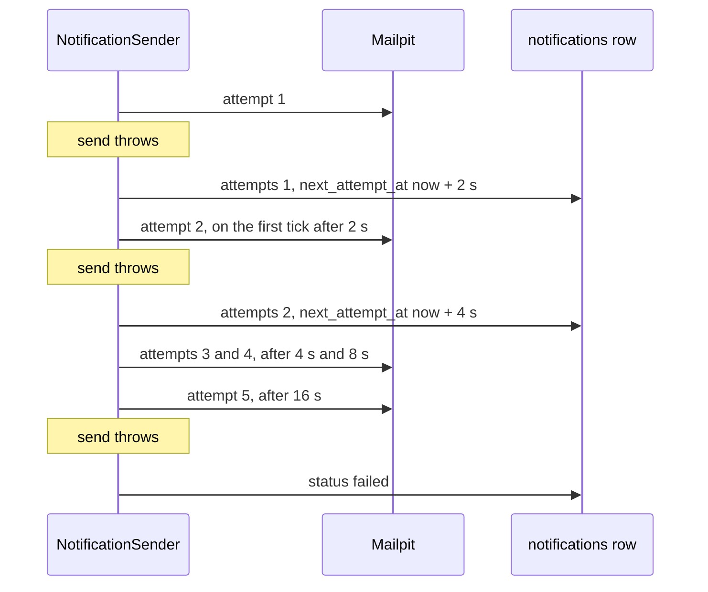

## Before you start

- [[backend.l2.database-job-queue]] — you know each email job is a `pending` row in `notifications`, and `NotificationSender` sends the due rows on each 2-second tick.
- [[backend.l1.structured-logging]] — you know a placeholder such as `{OrderId}` in a log message keeps its value as a separate named field.

## The situation

The mail server stops answering for a minute, after a restart, a full disk or a network problem between two containers. During that minute, customers keep placing orders, and each order saves a `pending` email job. On its next tick, `NotificationSender` takes those rows and tries to send them, and every send throws. If the sender simply marked those rows as done, those customers would never get their emails, for a problem that lasted one minute. If it tried again and again without pause, it would pound a server that is already struggling. What should the sender do with a job whose email just failed?

## Core concepts

- **exponential backoff** — waiting longer before each new retry, here twice as long as the wait before, so a failing job is tried less and less often.
- `attempts` — the column in `notifications` that counts how many sends of that row have failed so far.
- `next_attempt_at` — the column that holds the earliest time the row is due again; the sender only takes `pending` rows whose `next_attempt_at` has passed.
- `failed` — the `status` that means the sender has given up on the row; it is never picked up again automatically.

## How it works



Each tick, the sender takes a batch of due rows; that is one round, and it saves all their changes together at its end. In the situation above, the sender does not drop the job and does not retry on the spot. When a send throws, it keeps the row `pending`, adds one to `attempts`, and moves `next_attempt_at` into the future. The round saves that, and the row waits in the table, simply not due yet.

The wait grows with each failure. After the first failure the row is not due again for 2 seconds, then 4, 8 and 16; the first tick after that takes it. This is exponential backoff: the delay doubles every time. A short outage costs little, because the early retries come quickly. A long outage costs the mail server little, because the sender asks less and less often while it is down.

Compare that with retrying straight away in a loop. A failing server would receive attempt after attempt with no pause between them, all of them likely to fail for the same reason. That load can make it slower to recover, and it keeps the sender busy with one job while others wait.

Backoff alone never ends. So the sender counts: after the fifth failed attempt, it sets `status` to `failed` and stops. The query that takes due rows only asks for `pending` ones, so a `failed` row stays in the table as a record and is never sent automatically.

Each failure also writes a log entry with the notification id and the attempt number as separate fields, and the exception that caused it. That is how a person later finds out why one row ended up `failed`.

## In the Đơn Hàng system

In `SendOneAsync`, the `catch` around the `SendAsync` call hands the exception to `RecordFailure`. At the top of the class, `FirstRetryDelay` is 2 seconds and `MaxAttempts` is `5`:

```csharp file=DonHang.Api/Jobs/NotificationSender.cs tag=stage-2 lines=83-101
    // lesson: backend.l2.retry-with-backoff
    // Keep the row pending and wait twice as long as the time before; after
    // MaxAttempts failures, mark it failed and never pick it up again.
    private void RecordFailure(Notification notification, Exception ex)
    {
        notification.Attempts++;
        if (notification.Attempts >= MaxAttempts)
        {
            notification.Status = "failed";
            logger.LogError(ex, "Notification {NotificationId} failed on attempt {Attempt}; giving up",
                notification.Id, notification.Attempts);
            return;
        }

        var delay = FirstRetryDelay * Math.Pow(2, notification.Attempts - 1);
        notification.NextAttemptAt = DateTimeOffset.UtcNow + delay;
        logger.LogWarning(ex, "Notification {NotificationId} failed on attempt {Attempt}; next attempt in {DelaySeconds} s",
            notification.Id, notification.Attempts, delay.TotalSeconds);
    }
```

Notice what the method does not touch: `Status` stays `pending` unless this was the fifth failure. `Math.Pow(2, notification.Attempts - 1)` gives 1, 2, 4 and 8 for attempts 1 to 4, so the delay is 2, 4, 8 and 16 seconds.

Both log calls pass `ex` first, so the exception travels with the entry, and `{NotificationId}` and `{Attempt}` become named fields. The changed row is saved with the rest of the round, at its end.

The script for "Try it" waits while the row is `pending`, then shows what the sender logged and what the row holds. Earlier lines stop `mailpit`, place the order and keep its notification id in `$notification`; `sql` runs a query in the database.

```bash file=scripts/backend/email-retry.sh tag=stage-2 lines=29-42
# lesson: backend.l2.retry-with-backoff
# Waits of 2, 4, 8 and 16 seconds between the five attempts: about 40 s in all.
for _ in $(seq 60); do
  status=$(sql --command "SELECT status FROM notifications WHERE id = $notification")
  [ "$status" = pending ] || break
  sleep 1
done
echo "== what NotificationSender logged about this notification:"
docker compose logs --no-log-prefix api \
  | grep -oE "Notification $notification failed on attempt [0-9]+; [a-z0-9 ]+" | uniq
echo
echo "== its row now:"
sql --field-separator ' | ' \
    --command "SELECT status, attempts, sent_at IS NULL AS never_sent FROM notifications WHERE id = $notification"
```

```text output=true
mailpit is stopped: every send fails

== POST /api/v1/orders as customer 1
  -> 201

== what NotificationSender logged about this notification:
Notification ... failed on attempt 1; next attempt in 2 s
Notification ... failed on attempt 2; next attempt in 4 s
Notification ... failed on attempt 3; next attempt in 8 s
Notification ... failed on attempt 4; next attempt in 16 s
Notification ... failed on attempt 5; giving up

== its row now:
failed | 5 | t
```

The order still gets `201`: the failing mail server never touches the request. The waits double in the log, and the last line shows the row `failed` after 5 attempts, never sent. Your run shows the notification's id in place of `...`.

## Beginners often think…

- **"If sending fails, the most reliable fix is to retry straight away until it works."** → Actually when the cause is a server that is down or overloaded, it rarely clears within a millisecond, so the next attempt usually fails the same way. Retrying at once only adds load to a server that is already failing, and keeps the sender stuck on one job. You notice this when the log fills with identical failures for the same notification, one right after another.
- **"A job that keeps failing should be retried forever, because giving up loses the email."** → Actually some emails can never be sent, for example to an address the mail server rejects every time. Retrying forever keeps such a row `pending` for ever and hides it among the working ones. Marking it `failed` keeps it in the table, visible, with its reason in the log. You notice this when a query for `status = 'failed'` shows the rows a person must look at, instead of rows stuck at `pending` with a large `attempts`.

## Try it (3 minutes)

1. With the example system running (`scripts/up.sh`), run `scripts/backend/email-retry.sh` from the root folder of the example repository. It stops the `mailpit` container, places an order, waits for the sender to give up, and starts `mailpit` again when it ends.
2. Read the log lines it prints for the notification, then the row at the end.

Expected result: the order still answers `-> 201`. The log shows five lines for the same notification id, with waits of `2 s`, `4 s`, `8 s` and `16 s`, then `failed on attempt 5; giving up`. The row at the end reads `failed | 5 | t`: status `failed`, 5 attempts, never sent. The whole run takes one to two minutes: besides the 30 seconds of waits, each failed send here takes a few seconds before it throws, which the script's "about 40 s" comment leaves out.

## Connections

- [[backend.l2.database-job-queue]] — prerequisite: the queue whose rows this lesson retries.
- [[backend.l1.structured-logging]] — prerequisite: the named fields that let you find every failure of one notification.
- [[backend.l2.at-least-once-jobs]] — the next problem: a retry after a send that only looked failed can deliver the email twice.
- [[backend.l2.hosted-services]] — the loop and tick that carry each retry.

## Five-line summary

1. When a send fails, retry the job later with exponential backoff, and give up after a fixed number of attempts.
2. `RecordFailure` keeps the row `pending`, adds one to `attempts`, and moves `next_attempt_at` later, so a later tick retries it.
3. The wait doubles after each failure, 2, 4, 8 and 16 seconds, sparing a mail server that is already failing.
4. The fifth failure sets `status` to `failed`; the sender only takes `pending` rows, so it is never retried automatically.
5. Each failure is logged with `NotificationId`, `Attempt` and the exception, so a person can find why a row failed.
