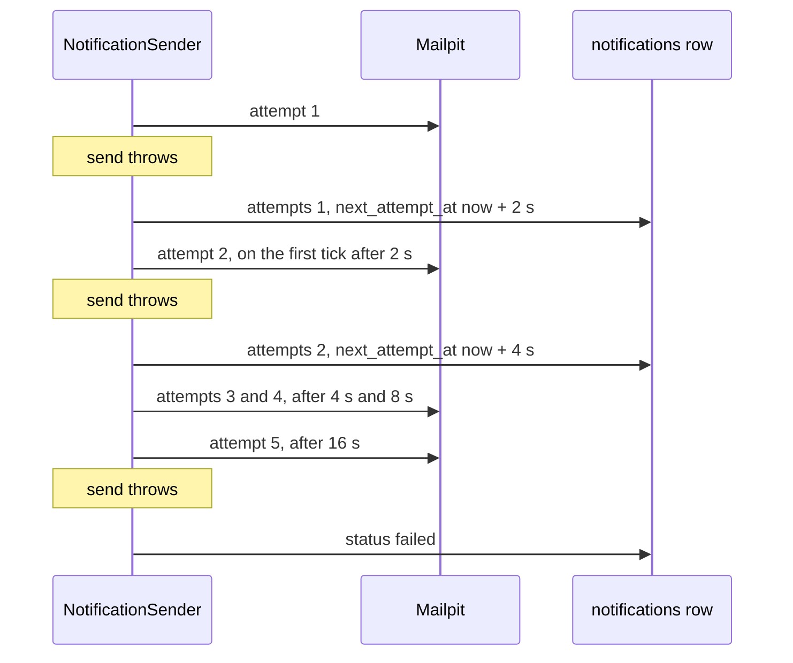

## Bạn cần biết trước

- [[backend.l2.database-job-queue]] — bạn biết mỗi job email là một dòng `pending` trong `notifications`, và `NotificationSender` gửi các dòng đã tới hạn ở mỗi nhịp 2 giây.
- [[backend.l1.structured-logging]] — bạn biết một placeholder như `{OrderId}` trong câu log giữ giá trị của nó thành một trường riêng có tên.

## Tình huống

Mail server ngừng trả lời trong một phút, sau một lần khởi động lại, một lần đầy ổ đĩa hay một sự cố mạng giữa hai container. Trong phút đó, khách vẫn tiếp tục đặt đơn, và mỗi đơn lưu một job email `pending`. Ở nhịp kế tiếp, `NotificationSender` lấy các dòng đó ra và thử gửi, và lần gửi nào cũng ném exception. Nếu bộ gửi cứ thế đánh dấu các dòng đó là xong, những khách này sẽ không bao giờ nhận được email, chỉ vì một sự cố kéo dài một phút. Nếu nó thử đi thử lại không ngừng, nó sẽ dội liên tục vào một server vốn đang chật vật. Bộ gửi nên làm gì với một job vừa gửi email thất bại?

## Khái niệm cốt lõi

- **exponential backoff** (chờ lâu dần trước mỗi lần thử lại, thường gấp đôi thời gian chờ sau mỗi lần thất bại) — mỗi lần thử lại chờ lâu hơn lần trước, ở đây gấp đôi, nên một job đang hỏng được thử ngày càng thưa.
- `attempts` — cột trong `notifications` đếm số lần gửi dòng đó đã thất bại tính tới giờ.
- `next_attempt_at` — cột giữ thời điểm sớm nhất mà dòng lại tới hạn. Bộ gửi chỉ lấy các dòng `pending` có `next_attempt_at` đã qua.
- `failed` — giá trị `status` cho biết bộ gửi đã bỏ cuộc với dòng đó. Nó không bao giờ được tự động lấy ra lại.

## Cơ chế hoạt động



Mỗi nhịp, bộ gửi lấy một lô các dòng đã tới hạn. Đó là một vòng, và vòng đó lưu mọi thay đổi của các dòng này cùng một lúc ở cuối vòng. Trong tình huống trên, bộ gửi không vứt job đi và cũng không thử lại ngay tại chỗ. Khi một lần gửi ném exception, nó giữ dòng ở `pending`, cộng một vào `attempts`, và dời `next_attempt_at` về sau. Vòng đó lưu thay đổi này, và dòng nằm chờ trong bảng, đơn giản là chưa tới hạn.

Thời gian chờ tăng sau mỗi lần thất bại. Sau lần thất bại đầu, dòng chưa tới hạn lại trong 2 giây, rồi 4, 8 và 16. Nhịp đầu tiên sau đó sẽ lấy nó. Đây là exponential backoff: thời gian chờ nhân đôi mỗi lần. Sự cố ngắn thì tốn ít, vì các lần thử lại đầu tiên đến nhanh. Sự cố dài thì mail server chịu ít, vì bộ gửi hỏi ngày càng thưa trong lúc nó sập.

Hãy so với cách thử lại ngay trong một vòng lặp. Server đang hỏng sẽ nhận lần thử này nối lần thử kia, không có khoảng nghỉ nào, và gần như lần nào cũng thất bại vì cùng một lý do. Tải đó có thể làm server hồi phục chậm hơn, và nó giữ bộ gửi bận với một job trong khi các job khác phải chờ.

Riêng backoff thì không bao giờ tự dừng. Vì vậy bộ gửi đếm: sau lần thử thất bại thứ năm, nó đặt `status` thành `failed` và dừng. Câu truy vấn lấy các dòng tới hạn chỉ hỏi dòng `pending`, nên một dòng `failed` nằm lại trong bảng như một bản ghi và không bao giờ được gửi tự động.

Mỗi lần thất bại còn ghi một dòng log với id của notification và số thứ tự lần thử thành các trường riêng, kèm exception gây ra nó. Nhờ vậy, về sau người ta tìm ra được vì sao một dòng lại thành `failed`.

## Trong hệ thống Đơn Hàng

Trong `SendOneAsync`, khối `catch` bao quanh lời gọi `SendAsync` chuyển exception cho `RecordFailure`. Ở đầu class, `FirstRetryDelay` là 2 giây và `MaxAttempts` là `5`:

```csharp file=DonHang.Api/Jobs/NotificationSender.cs tag=stage-2 lines=83-101
    // lesson: backend.l2.retry-with-backoff
    // Keep the row pending and wait twice as long as the time before; after
    // MaxAttempts failures, mark it failed and never pick it up again.
    private void RecordFailure(Notification notification, Exception ex)
    {
        notification.Attempts++;
        if (notification.Attempts >= MaxAttempts)
        {
            notification.Status = "failed";
            logger.LogError(ex, "Notification {NotificationId} failed on attempt {Attempt}; giving up",
                notification.Id, notification.Attempts);
            return;
        }

        var delay = FirstRetryDelay * Math.Pow(2, notification.Attempts - 1);
        notification.NextAttemptAt = DateTimeOffset.UtcNow + delay;
        logger.LogWarning(ex, "Notification {NotificationId} failed on attempt {Attempt}; next attempt in {DelaySeconds} s",
            notification.Id, notification.Attempts, delay.TotalSeconds);
    }
```

Để ý thứ mà method này không đụng tới: `Status` vẫn là `pending`, trừ khi đây là lần thất bại thứ năm. `Math.Pow(2, notification.Attempts - 1)` cho ra 1, 2, 4 và 8 với lần thử 1 tới 4, nên thời gian chờ là 2, 4, 8 và 16 giây.

Cả hai lời gọi log đều truyền `ex` đầu tiên, nên exception đi kèm dòng log, còn `{NotificationId}` và `{Attempt}` thành các trường có tên. Dòng đã đổi được lưu cùng phần còn lại của vòng, ở cuối vòng.

Script dùng cho "Thử ngay" chờ trong lúc dòng còn `pending`, rồi cho xem bộ gửi đã ghi log gì và dòng đó đang chứa gì. Các dòng phía trước của script dừng `mailpit`, đặt đơn và giữ id notification của nó trong `$notification`. Còn `sql` chạy một câu truy vấn trong database.

```bash file=scripts/backend/email-retry.sh tag=stage-2 lines=29-42
# lesson: backend.l2.retry-with-backoff
# Waits of 2, 4, 8 and 16 seconds between the five attempts: about 40 s in all.
for _ in $(seq 60); do
  status=$(sql --command "SELECT status FROM notifications WHERE id = $notification")
  [ "$status" = pending ] || break
  sleep 1
done
echo "== what NotificationSender logged about this notification:"
docker compose logs --no-log-prefix api \
  | grep -oE "Notification $notification failed on attempt [0-9]+; [a-z0-9 ]+" | uniq
echo
echo "== its row now:"
sql --field-separator ' | ' \
    --command "SELECT status, attempts, sent_at IS NULL AS never_sent FROM notifications WHERE id = $notification"
```

```text output=true
mailpit is stopped: every send fails

== POST /api/v1/orders as customer 1
  -> 201

== what NotificationSender logged about this notification:
Notification ... failed on attempt 1; next attempt in 2 s
Notification ... failed on attempt 2; next attempt in 4 s
Notification ... failed on attempt 3; next attempt in 8 s
Notification ... failed on attempt 4; next attempt in 16 s
Notification ... failed on attempt 5; giving up

== its row now:
failed | 5 | t
```

Đơn vẫn nhận `201`: mail server hỏng không hề chạm tới request. Thời gian chờ nhân đôi dần trong log, và dòng cuối cho thấy dòng đó ở `failed` sau 5 lần thử, chưa từng được gửi. Lần chạy của bạn sẽ hiện id của notification ở chỗ `...`.

## Người mới hay nghĩ rằng…

- **"Nếu gửi thất bại, cách chắc ăn nhất là thử lại ngay cho tới khi được."** → Thực ra khi nguyên nhân là server đang sập hay quá tải, nó hiếm khi tự hết trong một mili giây, nên lần thử kế tiếp thường thất bại y như vậy. Thử lại ngay chỉ dồn thêm tải lên một server vốn đang hỏng, và giữ bộ gửi kẹt ở một job. Bạn sẽ nhận ra khi log đầy những lỗi giống hệt nhau cho cùng một notification, lỗi này nối ngay lỗi kia.
- **"Job cứ hỏng mãi thì nên thử lại mãi, vì bỏ cuộc là mất email."** → Thực ra có những email không bao giờ gửi được, chẳng hạn tới một địa chỉ mà mail server lần nào cũng từ chối. Thử lại mãi sẽ giữ dòng đó ở `pending` mãi mãi và giấu nó lẫn giữa các dòng bình thường. Đánh dấu nó `failed` thì nó vẫn nằm trong bảng, nhìn thấy được, với lý do nằm trong log. Bạn sẽ nhận ra khi một câu truy vấn `status = 'failed'` cho ra đúng các dòng cần người xem, thay vì các dòng kẹt ở `pending` với `attempts` rất lớn.

## Thử ngay (3 phút)

1. Khi hệ thống ví dụ đang chạy (`scripts/up.sh`), chạy `scripts/backend/email-retry.sh` từ thư mục gốc của repo ví dụ. Script dừng container `mailpit`, đặt một đơn, chờ bộ gửi bỏ cuộc, rồi bật lại `mailpit` khi kết thúc.
2. Đọc các dòng log nó in ra cho notification đó, rồi tới dòng dữ liệu ở cuối.

Kết quả mong đợi: đơn vẫn trả `-> 201`. Log có năm dòng cho cùng một id notification, với thời gian chờ `2 s`, `4 s`, `8 s` và `16 s`, rồi `failed on attempt 5; giving up`. Dòng dữ liệu ở cuối là `failed | 5 | t`: status `failed`, 5 lần thử, chưa từng được gửi. Cả lượt chạy mất một đến hai phút: ngoài 30 giây chờ, mỗi lần gửi hỏng ở đây còn mất vài giây mới ném exception, điều mà comment "about 40 s" của script không tính tới.

## Liên hệ

- [[backend.l2.database-job-queue]] — điều kiện tiên quyết: hàng đợi có các dòng mà bài này thử lại.
- [[backend.l1.structured-logging]] — điều kiện tiên quyết: các trường có tên giúp bạn tìm mọi lần thất bại của một notification.
- [[backend.l2.at-least-once-jobs]] — vấn đề tiếp theo: thử lại sau một lần gửi chỉ trông như thất bại có thể làm email tới hai lần.
- [[backend.l2.hosted-services]] — vòng lặp và nhịp mang từng lần thử lại.

## Tóm tắt 5 dòng

1. Khi gửi thất bại, hãy thử lại job sau đó bằng exponential backoff, và bỏ cuộc sau một số lần thử cố định.
2. `RecordFailure` giữ dòng ở `pending`, cộng một vào `attempts`, và dời `next_attempt_at` về sau, để một nhịp sau thử lại nó.
3. Thời gian chờ nhân đôi sau mỗi lần thất bại, 2, 4, 8 rồi 16 giây, đỡ cho mail server vốn đang hỏng.
4. Lần thất bại thứ năm đặt `status` thành `failed`. Bộ gửi chỉ lấy dòng `pending`, nên dòng đó không bao giờ được tự động thử lại.
5. Mỗi lần thất bại được ghi log với `NotificationId`, `Attempt` và exception, để người ta tìm được vì sao một dòng thất bại.
