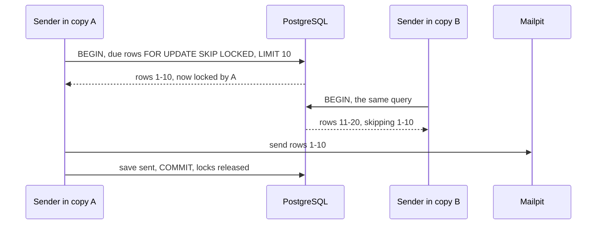

## Bạn cần biết trước

- [[backend.l2.database-job-queue]] — bạn biết mỗi email đơn hàng là một dòng `pending` trong `notifications`, và cứ 2 giây `NotificationSender` đọc các dòng tới hạn, gửi chúng rồi đánh dấu `sent`.
- [[foundation.l1.transaction-intro]] — bạn biết `BEGIN` mở một giao dịch, `COMMIT` giữ lại các thay đổi và cho người khác thấy chúng, còn khi mất kết nối thì không thay đổi nào được ghi.

## Tình huống

Hãy hình dung `NotificationSender` đọc các dòng tới hạn bằng một `SELECT` thường. Đơn hàng tăng lên, và đội chạy thêm một bản `api` thứ hai bên cạnh bản đầu, cả hai cùng dùng một database PostgreSQL. Sáng hôm sau, một khách viết thư phản ánh: chị nhận hai email giống hệt nhau cho đơn 42. Bạn kiểm tra `notifications` và thấy đúng một dòng cho đơn 42, đã `sent`, mà mỗi bản đã gửi một lần. Hai bản thức dậy gần như cùng lúc và cùng đọc dòng đó khi nó còn `pending`. Làm sao để hai bản dùng chung một hàng đợi job mà mỗi dòng chỉ được đúng một bản lấy?

## Khái niệm cốt lõi

- **khóa dòng** (row lock) — dấu mà một giao dịch giữ trên những dòng cụ thể cho tới khi nó kết thúc. Loại khóa do `FOR UPDATE` lấy ngăn các giao dịch khác sửa hay khóa những dòng đó trong lúc ấy.
- `FOR UPDATE` — mệnh đề đặt cuối một `SELECT`, lấy khóa dòng trên mọi dòng mà truy vấn trả về.
- `SKIP LOCKED` — phần thêm vào `FOR UPDATE` để bỏ qua những dòng giao dịch khác đã khóa, thay vì chờ chúng.
- Claim — bước một bản của bộ gửi nhận một lô dòng tới hạn về làm phần của mình, bằng cách khóa chúng.

## Cơ chế hoạt động



Mỗi bản API đang chạy đều có `NotificationSender` riêng. Trong tình huống trên, cả hai bản đọc các dòng `pending` bằng `SELECT` thường. Chừng nào một bản chưa commit `sent`, bản kia vẫn thấy `pending`, nên cả hai đều gửi email của đơn 42.

Cách sửa là biến thao tác lấy một dòng thành thứ chỉ một giao dịch thắng được. Trong một giao dịch, `SELECT ... FOR UPDATE` đặt khóa dòng lên từng dòng nó trả về. Giao dịch khác muốn khóa hay sửa một trong các dòng đó phải chờ tới khi giao dịch đầu commit hoặc rollback.

Chỉ chờ thôi thì chưa đủ: bản thứ hai sẽ đứng không trong lúc bản đầu gửi lô của nó. Thêm `SKIP LOCKED`, truy vấn thứ hai đi qua các dòng đang bị khóa và lấy những dòng tới hạn kế tiếp. Trong sơ đồ, bản A claim dòng 1 tới 10, bản B claim dòng 11 tới 20, nên mỗi bản của bộ gửi làm trên một tập dòng khác nhau.

Khóa kéo dài tới khi giao dịch kết thúc. Vì thế bộ gửi claim một lô nhỏ, gửi nó, lưu `sent` rồi commit, lúc đó các khóa được nhả. Lô nhỏ giữ cho giao dịch đó ngắn. Lô lớn có thể để một bản khóa gần hết các dòng tới hạn trong khi các bản khác không còn gì để claim, và để nhiều dòng phải chờ hơn nếu bản đó dừng. Nếu process dừng trước khi commit, kết nối tới PostgreSQL mất, giao dịch bị rollback, và các dòng vẫn `pending` cho lần claim sau.

Khóa dòng không ẩn gì cả. Một `SELECT` thường không có `FOR UPDATE` vẫn đọc được dòng bị khóa ngay lập tức. Chỉ các bên khác muốn khóa hay ghi mới phải chờ, hoặc với `SKIP LOCKED` thì đi qua nó.

## Trong hệ thống Đơn Hàng

Ở stage-2, bộ gửi đã claim theo cách này. Đây là bước claim và bước commit, đúng như `NotificationSender` dùng trong mỗi vòng:

```csharp file=DonHang.Infrastructure/NotificationQueue.cs tag=stage-2 lines=16-37
    public async Task<List<Notification>> ClaimDueAsync(int batchSize, CancellationToken cancellationToken)
    {
        await db.Database.BeginTransactionAsync(cancellationToken);
        var now = DateTimeOffset.UtcNow;
        return await db.Notifications
            .FromSql($"""
                SELECT * FROM notifications
                WHERE status = 'pending' AND next_attempt_at <= {now}
                ORDER BY next_attempt_at, id
                LIMIT {batchSize}
                FOR UPDATE SKIP LOCKED
                """)
            .Include(n => n.Order!).ThenInclude(o => o.Customer)
            .ToListAsync(cancellationToken);
    }

    // Saves what the sender changed on the claimed rows and releases their locks.
    public async Task CompleteAsync(CancellationToken cancellationToken)
    {
        await db.SaveChangesAsync(cancellationToken);
        await db.Database.CommitTransactionAsync(cancellationToken);
    }
```

`ClaimDueAsync` mở giao dịch trước, rồi chạy câu claim dưới dạng SQL bằng `FromSql`. `NotificationSender` truyền `batchSize` bằng 10. Giữa hai method, nó gửi từng email, nên các khóa được giữ trong đúng một lô. `CompleteAsync` lưu các dòng đã đổi trong chính giao dịch đó rồi commit.

Script của bài chèn bốn dòng demo tới hạn vào năm 2100, những dòng mà bộ gửi của API bỏ qua. Mỗi session trong script là một kết nối riêng tới PostgreSQL: `sql` là hàm trợ giúp định nghĩa phía trên trong script, gửi các câu `--command` của nó qua một kết nối mới. Session A claim hai dòng và giữ khóa trong 3 giây. Trong lúc đó, các session B, C và D lần lượt chạy:

```bash file=scripts/backend/skip-locked.sh tag=stage-2 lines=19-41
# lesson: backend.l2.skip-locked-claiming
# The WHERE, ORDER BY and locking clause of NotificationQueue.ClaimDueAsync;
# each session below sends it in a transaction of its own.
claim="SELECT subject FROM notifications
       WHERE status = 'pending' AND next_attempt_at <= '$due'
       ORDER BY next_attempt_at, id LIMIT 2"

echo "== session A: BEGIN, claim 2 rows FOR UPDATE SKIP LOCKED, hold the locks for 3 s"
session_a=$(mktemp)
sql --command "BEGIN" --command "$claim FOR UPDATE SKIP LOCKED" \
    --command "SELECT pg_sleep(3)" --command "COMMIT" > "$session_a" &
sleep 1
grep -v '^$' "$session_a" | sed 's/^/  A got: /'

echo "== session B, while A holds its locks: the same claim"
sql --command "BEGIN" --command "$claim FOR UPDATE SKIP LOCKED" --command "COMMIT" | sed 's/^/  B got: /'

echo "== session C: the claim without SKIP LOCKED, giving up after 1 s of waiting"
sql --command "SET lock_timeout = '1s'" --command "BEGIN" --command "$claim FOR UPDATE" \
    --command "COMMIT" 2>&1 | sed 's/^/  C: /' || true

echo "== session D: a plain SELECT, no FOR UPDATE: it waits for nothing"
sql --command "SELECT subject FROM notifications WHERE next_attempt_at = '$due' ORDER BY id" | sed 's/^/  D sees: /'
```

Session A đóng vai bản A. Dấu `&` ở cuối cho nó chạy nền, nên sau 1 giây script đi tiếp trong khi A vẫn giữ khóa. Session B đóng vai bản B, có `SKIP LOCKED`. Session C bỏ `SKIP LOCKED` nên phải chờ, và `lock_timeout` làm nó bỏ cuộc sau 1 giây thay vì chờ A. Session D chỉ đọc.

## Người mới hay nghĩ rằng…

- **"Bộ lọc `WHERE status = 'pending'` là đủ: khi một bản đã gửi email, bản kia sẽ không thấy dòng đó nữa."** → Thực ra bản kia đã đọc dòng đó trước khi bản đầu commit `sent`, nên nó đang giữ dòng trong bộ nhớ và cũng gửi luôn. Bạn sẽ nhận ra khi một khách nhận hai email giống hệt nhau trong khi `notifications` chỉ có một dòng cho đơn đó.
- **"Dòng bị khóa sẽ bị ẩn khỏi mọi truy vấn khác cho tới khi giao dịch kết thúc."** → Thực ra khóa dòng chỉ ảnh hưởng tới các giao dịch khác muốn khóa hay sửa dòng đó. Một `SELECT` thường đọc nó ngay. Bạn sẽ nhận ra khi truy vấn `notifications` lúc bộ gửi đang giữa một lô: mọi dòng đã claim vẫn ở đó, vẫn `pending`.

## Thử ngay (3 phút)

1. Khi hệ thống ví dụ đang chạy (`scripts/up.sh`), hãy đoán trước session B, C và D sẽ in gì, rồi chạy `scripts/backend/skip-locked.sh` từ thư mục gốc của repo ví dụ.
2. So các dòng A và B nhận được, rồi đọc dòng của C.

Kết quả mong đợi: khi không có email đơn hàng thật nào đang chờ thử lại (dòng của nó sẽ đứng trước trong thứ tự của câu claim), A nhận `demo job 1` và `demo job 2`, B nhận `demo job 3` và `demo job 4`, C in `ERROR:  canceling statement due to lock timeout` kèm theo một dòng `CONTEXT:`, và D thấy đủ bốn demo job. Script xóa các dòng demo khi kết thúc.

## Liên hệ

- [[backend.l2.database-job-queue]] — bài tiên quyết: hàng đợi mà giờ hai bản của bộ gửi dùng chung.
- [[foundation.l1.transaction-intro]] — bài tiên quyết: giao dịch mà khi kết thúc sẽ nhả mọi khóa dòng.
- [[backend.l2.at-least-once-jobs]] — con đường khác dẫn tới email trùng: sập giữa lúc gửi xong và lúc commit, điều mà khóa dòng không ngăn được.
- [[backend.l2.transactions-in-practice]] — bài sau nói về những gì các giao dịch chạy đồng thời thấy được từ thay đổi của nhau.

## Tóm tắt 5 dòng

1. Claim các dòng job bằng `FOR UPDATE SKIP LOCKED` trong một giao dịch cho phép nhiều bản của bộ gửi dùng chung một hàng đợi mà không lấy trùng dòng.
2. Mỗi bản API chạy `NotificationSender` riêng. Với `SELECT` thường, hai bản có thể cùng đọc và cùng gửi một dòng `pending`.
3. `FOR UPDATE` khóa các dòng trả về, và các bên khác muốn khóa hay ghi phải chờ tới khi giao dịch commit hoặc rollback.
4. `SKIP LOCKED` đi qua các dòng đã bị khóa, nên mỗi bản claim một lô nhỏ khác nhau, gửi nó rồi commit.
5. `SELECT` thường vẫn đọc được dòng bị khóa, và nếu sập trước khi commit, các dòng vẫn `pending` cho lần claim sau.
