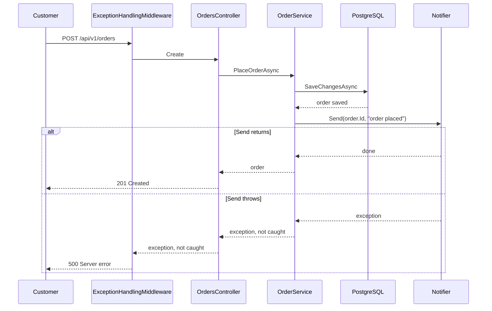

## Before you start

- [[design.l1.the-service-layer]] — you know `OrderService.PlaceOrderAsync` refuses empty orders, has the order saved and then sends a notification.
- [[backend.l1.exception-handling-middleware]] — you know an exception nobody expected reaches `ExceptionHandlingMiddleware`, which logs it and answers a generic `500`.
- [[foundation.l1.threads-and-async-intro]] — you know `await` gives the thread back during a wait but continues only when the wait is over, and that `Task.Run` hands work to another thread.

## The situation

The team wants a real email for every order: "Order placed", sent to the customer's address. At stage-1, the notification is a log line written by `LoggingNotifier`, and it costs almost nothing. The obvious plan is to replace that class with one that talks to a mail server and leave `OrderService` as it is. Then someone asks what happens on a slow morning, when the mail server takes eight seconds to answer, or on a bad one, when it does not answer at all. The customer pressed "Place order" and is looking at a spinner. What exactly is the customer waiting for, and what should happen instead?

## Core concepts

- **background job** — work the application does outside any request, such as sending an email, so that no response has to wait for it.
- `INotifier` — the interface `OrderService` calls to tell someone about an order; at stage-1 the only class behind it is `LoggingNotifier`.
- `ExceptionHandlingMiddleware` — the first middleware in `Program.cs`; it turns an exception nobody expected into a `500` with a generic body.
- Mail server — a separate program, reached over the network, that accepts an email and delivers it; the API has no control over how fast it answers.

## How it works



In the situation above, everything happens inside one request. `OrdersController.Create`, the controller method behind `POST /api/v1/orders`, awaits `PlaceOrderAsync`, and only when that method returns does it answer `201 Created`. Inside the method, `SaveChangesAsync` first writes the order and its items to PostgreSQL, the database Đơn Hàng keeps its orders in. Then `notifier.Send` runs, and only after `Send` returns does the method return the order.

So the response waits for whatever `Send` does. With `LoggingNotifier` that is one log line, which takes almost no time. A class that sends a real email has to open a connection to the mail server and wait for its answer; if that takes eight seconds, the customer's spinner turns for eight seconds longer.

The failure case is worse. By the time `Send` runs, `SaveChangesAsync` has already committed the order. If the mail server cannot be reached and `Send` throws, the exception leaves `PlaceOrderAsync` and the controller, and reaches `ExceptionHandlingMiddleware`. A network error is neither a `KeyNotFoundException` nor an `ArgumentException`, so the generic `catch (Exception)` answers `500`. The customer reads "something went wrong" about an order that exists, and may press the button again and place it twice.

A background job breaks this link. The request only records that an email must be sent and answers; some other code, outside any request, talks to the mail server later. That record has to outlive the process, so the other code can still find it after a restart and try again if the mail server was down. The response no longer depends on the mail server at all, and a failed email is that other code's problem to handle.

## In the Đơn Hàng system

This is `PlaceOrderAsync` at stage-1:

```csharp file=DonHang.Domain/OrderService.cs tag=stage-1 lines=8-23
    public async Task<Order> PlaceOrderAsync(int customerId, List<OrderItem> items)
    {
        if (items.Count == 0) throw new ArgumentException("an order needs at least one item");

        var order = new Order
        {
            CustomerId = customerId,
            PlacedAt = DateTimeOffset.UtcNow,
            Status = "new",
            Items = items,
        };
        await repository.AddAsync(order);
        await repository.SaveChangesAsync();
        notifier.Send(order.Id, "order placed");
        return order;
    }
```

Look at the order of the last three statements. `SaveChangesAsync` comes first, so `order.Id` already has the value PostgreSQL gave the new row when `Send` is called. `Send` comes before `return order`, so the controller cannot answer until `Send` is done. And nothing around `Send` catches an exception: whatever it throws travels up to the middleware. `CancelOrderAsync` in the same file has the same shape, with `"order cancelled"`.

This is everything `Send` does today:

```csharp file=DonHang.Infrastructure/LoggingNotifier.cs tag=stage-1 lines=9-13
public sealed class LoggingNotifier(ILogger<LoggingNotifier> logger) : INotifier
{
    public void Send(int orderId, string subject) =>
        logger.LogInformation("notification for order {OrderId}: {Subject}", orderId, subject);
}
```

One `LogInformation` call, no network, nothing that waits. That is why the design has never hurt anyone. The problem is not in this class; it is in where `Send` is called, and it appears the moment the class behind `INotifier` does real work.

## Beginners often think…

- **"If `Send` becomes async and I `await` it, the customer no longer waits for the email."** → Actually `await` gives the thread back to the server while the mail server is slow, but `PlaceOrderAsync` still continues only after the send finishes, and the controller answers only after that. The thread is free; the customer is not. You notice this when the response time of `POST /api/v1/orders` grows by about the time the send takes.
- **"Starting the email with `Task.Run` and not awaiting it is already a background job."** → Actually that work exists only in the memory of the running process. If the process stops before it ends, during a deploy or a restart, the email is gone and nothing remembers it was due. If it fails, nothing tries it again. You notice this when a customer says the confirmation never arrived and no record anywhere says it should have.
- **"If the email fails, the order was not placed."** → Actually `SaveChangesAsync` committed the order before `Send` ran, so the row is in `orders` whatever happens after. The `500` describes the email, not the order. You notice this when a customer who saw an error places the order again and ends up with two identical orders.

## Try it (3 minutes)

1. Open `DonHang.Domain/OrderService.cs` at stage-1 and read `PlaceOrderAsync` from top to bottom.
2. Imagine `LoggingNotifier` is replaced by a class whose `Send` throws after waiting ten seconds, because the mail server is down. Write down three things: how long the customer waits, which status code they get, and whether a new row is in `orders`.

Expected result: a number of seconds, a status code, and a yes or no for the row, each backed by one line of `PlaceOrderAsync` or `ExceptionHandlingMiddleware`.

<details><summary>Suggested answer</summary>

The customer waits about ten seconds, because the controller cannot answer before `Send` ends. They get `500`, because the exception reaches `ExceptionHandlingMiddleware` and falls to its generic `catch (Exception)`. And the new row is in `orders`, because `SaveChangesAsync` ran before `Send`. A slow or broken mail server has made a successful order look like a failed one.

</details>

## Connections

- [[design.l1.the-service-layer]] — prerequisite: the method whose last steps this lesson questions.
- [[backend.l1.exception-handling-middleware]] — the part that turns a failed email into a `500` for an order that exists.
- [[backend.l2.hosted-services]] — the next step: code that runs beside the requests for the whole life of the app, where the email can be sent instead.
- [[backend.l2.database-job-queue]] — the fix for the `Task.Run` problem: the job is recorded so that a restart does not lose it.

## Five-line summary

1. When the request itself sends the email, the order response waits for the mail server and can fail because of it.
2. At stage-1, `PlaceOrderAsync` saves the order and then calls `notifier.Send`, so the controller answers only after `Send` returns.
3. The order is committed before `Send` runs, so a mail error becomes a `500` for an order that already exists.
4. A background job moves the work outside any request: the request only records that an email is due.
5. A `Task.Run` nobody awaits is not enough: it is lost if the process stops and never tried again.
