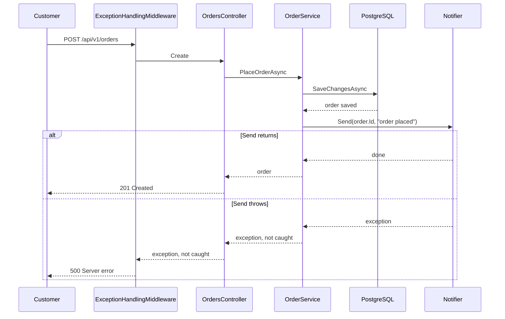

## Bạn cần biết trước

- [[design.l1.the-service-layer]] — bạn biết `OrderService.PlaceOrderAsync` từ chối đơn rỗng, cho lưu đơn rồi gửi thông báo.
- [[backend.l1.exception-handling-middleware]] — bạn biết một exception không ai lường trước sẽ tới `ExceptionHandlingMiddleware`, nơi ghi log rồi trả một `500` chung chung.
- [[foundation.l1.threads-and-async-intro]] — bạn biết `await` trả thread lại trong lúc chờ nhưng chỉ chạy tiếp khi chờ xong, và `Task.Run` giao việc cho một thread khác.

## Tình huống

Đội muốn mỗi đơn hàng có một email thật: "Order placed", gửi tới địa chỉ của khách. Ở stage-1, thông báo chỉ là một dòng log do `LoggingNotifier` ghi, gần như không tốn gì. Kế hoạch dễ thấy nhất là thay class đó bằng một class nói chuyện với mail server, còn `OrderService` để nguyên. Rồi có người hỏi: chuyện gì xảy ra vào một buổi sáng chậm chạp, khi mail server mất tám giây mới trả lời, hay vào một buổi tệ hơn, khi nó không trả lời gì cả? Khách đã bấm "Place order" và đang nhìn vòng xoay chờ. Chính xác thì khách đang chờ cái gì, và đáng lẽ phải xảy ra điều gì?

## Khái niệm cốt lõi

- **background job** (việc ứng dụng tự chạy ngoài mọi request, như gửi email, để không response nào phải chờ nó) — việc ứng dụng làm bên ngoài mọi request, chẳng hạn gửi email, để không response nào phải chờ nó.
- `INotifier` — interface mà `OrderService` gọi để báo cho ai đó về một đơn; ở stage-1, class duy nhất đứng sau nó là `LoggingNotifier`.
- `ExceptionHandlingMiddleware` — middleware đầu tiên trong `Program.cs`; nó biến một exception không ai lường trước thành `500` với body chung chung.
- Mail server — một chương trình riêng, nằm ở đầu kia của mạng, nhận email rồi chuyển nó đi; API không quyết được nó trả lời nhanh hay chậm.

## Cơ chế hoạt động



Trong tình huống trên, mọi thứ diễn ra trong một request. `OrdersController.Create`, method của controller đứng sau `POST /api/v1/orders`, await `PlaceOrderAsync`, và chỉ khi method đó trả về nó mới trả lời `201 Created`. Bên trong method, `SaveChangesAsync` ghi đơn cùng các dòng sản phẩm vào PostgreSQL trước, đó là database nơi Đơn Hàng cất đơn. Sau đó `notifier.Send` chạy, và chỉ khi `Send` trả về thì method mới trả đơn.

Vậy response phải chờ mọi thứ `Send` làm. Với `LoggingNotifier`, đó là một dòng log, gần như không mất thời gian. Một class gửi email thật phải mở kết nối tới mail server và chờ nó trả lời; nếu mất tám giây, vòng xoay chờ của khách quay thêm tám giây.

Trường hợp lỗi còn tệ hơn. Lúc `Send` chạy, `SaveChangesAsync` đã commit đơn rồi. Nếu không kết nối được mail server và `Send` ném exception, exception đó rời `PlaceOrderAsync`, rời controller, rồi tới `ExceptionHandlingMiddleware`. Lỗi mạng không phải `KeyNotFoundException` cũng không phải `ArgumentException`, nên nhánh chung `catch (Exception)` trả `500`. Khách đọc thấy "something went wrong" cho một đơn đang có thật, và có thể bấm lần nữa, đặt đơn hai lần.

Background job cắt đứt mối nối này. Request chỉ ghi lại rằng có một email cần gửi rồi trả lời; một đoạn code khác, nằm ngoài mọi request, nói chuyện với mail server sau. Bản ghi đó phải sống lâu hơn process, để đoạn code kia vẫn tìm thấy nó sau khi khởi động lại và thử lần nữa nếu lúc trước mail server sập. Response không còn phụ thuộc gì vào mail server, và email gửi hỏng là chuyện đoạn code kia phải lo.

## Trong hệ thống Đơn Hàng

Đây là `PlaceOrderAsync` ở stage-1:

```csharp file=DonHang.Domain/OrderService.cs tag=stage-1 lines=8-23
    public async Task<Order> PlaceOrderAsync(int customerId, List<OrderItem> items)
    {
        if (items.Count == 0) throw new ArgumentException("an order needs at least one item");

        var order = new Order
        {
            CustomerId = customerId,
            PlacedAt = DateTimeOffset.UtcNow,
            Status = "new",
            Items = items,
        };
        await repository.AddAsync(order);
        await repository.SaveChangesAsync();
        notifier.Send(order.Id, "order placed");
        return order;
    }
```

Hãy nhìn thứ tự của ba câu lệnh cuối. `SaveChangesAsync` đứng trước, nên khi `Send` được gọi, `order.Id` đã có giá trị PostgreSQL cấp cho dòng mới. `Send` đứng trước `return order`, nên controller không trả lời được cho tới khi `Send` xong. Và không có gì quanh `Send` bắt exception: nó ném gì thì thứ đó đi thẳng lên middleware. `CancelOrderAsync` trong cùng file có đúng hình dạng này, với `"order cancelled"`.

Đây là toàn bộ những gì `Send` làm hiện nay:

```csharp file=DonHang.Infrastructure/LoggingNotifier.cs tag=stage-1 lines=9-13
public sealed class LoggingNotifier(ILogger<LoggingNotifier> logger) : INotifier
{
    public void Send(int orderId, string subject) =>
        logger.LogInformation("notification for order {OrderId}: {Subject}", orderId, subject);
}
```

Một lời gọi `LogInformation`, không mạng, không có gì phải chờ. Vì thế thiết kế này chưa từng làm khổ ai. Vấn đề không nằm trong class này mà nằm ở chỗ `Send` được gọi, và nó lộ ra ngay khi class đứng sau `INotifier` làm việc thật.

## Người mới hay nghĩ rằng…

- **"Nếu `Send` thành async và mình `await` nó, khách sẽ không phải chờ email nữa."** → Thực ra `await` trả thread lại cho server trong lúc mail server chậm, nhưng `PlaceOrderAsync` vẫn chỉ chạy tiếp khi gửi xong, và controller chỉ trả lời sau đó. Thread thì rảnh, còn khách thì không. Bạn sẽ nhận ra khi thời gian trả lời của `POST /api/v1/orders` tăng thêm khoảng đúng thời gian gửi mail.
- **"Khởi động việc gửi email bằng `Task.Run` và không await nó đã là một background job rồi."** → Thực ra việc đó chỉ tồn tại trong bộ nhớ của process đang chạy. Nếu process dừng trước khi nó xong, lúc deploy hay khởi động lại, email mất luôn và không gì nhớ rằng nó còn phải gửi. Nếu nó thất bại, không gì thử lại. Bạn sẽ nhận ra khi một khách báo không bao giờ nhận được email xác nhận, mà không có bản ghi nào cho biết lẽ ra phải có.
- **"Nếu email lỗi thì đơn chưa được đặt."** → Thực ra `SaveChangesAsync` đã commit đơn trước khi `Send` chạy, nên dòng đó nằm trong `orders` dù sau đó có chuyện gì. `500` nói về email, không nói về đơn. Bạn sẽ nhận ra khi một khách thấy lỗi, đặt lại đơn và cuối cùng có hai đơn giống hệt nhau.

## Thử ngay (3 phút)

1. Mở `DonHang.Domain/OrderService.cs` ở stage-1 và đọc `PlaceOrderAsync` từ trên xuống dưới.
2. Hãy hình dung `LoggingNotifier` được thay bằng một class có `Send` chờ mười giây rồi ném exception, vì mail server sập. Ghi ra ba điều: khách chờ bao lâu, khách nhận status code nào, và bảng `orders` có dòng mới hay không.

Kết quả mong đợi: một số giây, một status code, và có hoặc không cho dòng mới, mỗi câu trả lời dựa trên một dòng của `PlaceOrderAsync` hoặc `ExceptionHandlingMiddleware`.

<details><summary>Gợi ý đáp án</summary>

Khách chờ khoảng mười giây, vì controller không trả lời được trước khi `Send` kết thúc. Khách nhận `500`, vì exception tới `ExceptionHandlingMiddleware` và rơi vào nhánh chung `catch (Exception)`. Và bảng `orders` có dòng mới, vì `SaveChangesAsync` chạy trước `Send`. Một mail server chậm hay hỏng đã khiến một đơn đặt thành công trông như đơn thất bại.

</details>

## Liên hệ

- [[design.l1.the-service-layer]] — điều kiện tiên quyết: method mà bài này đặt câu hỏi về mấy bước cuối của nó.
- [[backend.l1.exception-handling-middleware]] — thành phần biến một email gửi hỏng thành `500` cho một đơn đang có thật.
- [[backend.l2.hosted-services]] — bước tiếp theo: code chạy song song với các request suốt đời app, nơi có thể gửi email thay cho request.
- [[backend.l2.database-job-queue]] — lời giải cho vấn đề của `Task.Run`: job được ghi lại để khởi động lại không làm mất nó.

## Tóm tắt 5 dòng

1. Khi chính request gửi email, response đặt đơn phải chờ mail server và có thể lỗi vì nó.
2. Ở stage-1, `PlaceOrderAsync` lưu đơn rồi gọi `notifier.Send`, nên controller chỉ trả lời sau khi `Send` trả về.
3. Đơn được commit trước khi `Send` chạy, nên lỗi gửi mail thành `500` cho một đơn đã có thật.
4. Background job đưa việc ra ngoài mọi request: request chỉ ghi lại rằng có một email cần gửi.
5. Một `Task.Run` không ai await là chưa đủ: process dừng là mất, và không bao giờ được thử lại.
