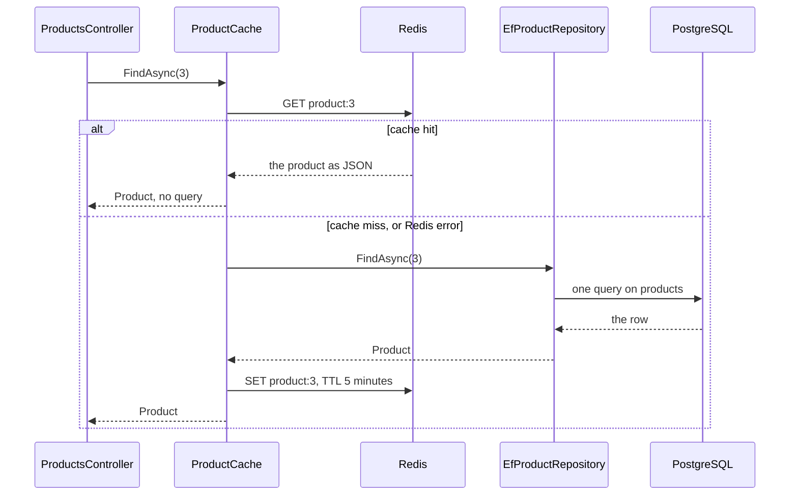

## Before you start

- [[backend.l2.redis-key-value-store]] — you know Redis keeps a value under a key such as `product:3`, removes it when its TTL runs out, and holds only copies of what PostgreSQL has.
- [[backend.l1.get-and-status-codes]] — you know `Get(int id)` looks up one product and answers `200` with it or `404`.
- [[design.l1.service-lifetimes]] — you know a singleton is one object for the whole app, while scoped objects live for one request.

## The situation

In the previous lesson you put `product:3` into Redis by hand with `redis-cli`. Now a customer opens product 3, and `GET /api/v1/products/3` should answer from that copy instead of querying PostgreSQL again. But Redis only answers the key it is asked for: it does not know that `product:3` comes from the `products` table, and it has no copy of a product until someone writes one. Someone has to look in Redis, notice when the copy is missing, read PostgreSQL and store the answer. And Redis can be stopped while customers keep browsing. Who does this work in Đơn Hàng, and what does a customer get when Redis has no copy, or is not running?

## Core concepts

- **cache-aside** — a way of using a cache in which the application asks the cache first and, when the value is missing, reads the database itself and stores the answer in the cache.
- **cache hit** — a read that finds the value in the cache, so the database is not asked.
- **cache miss** — a read that does not find the value in the cache, so the database must be asked.
- `ConnectionMultiplexer` — the object from StackExchange.Redis, the Redis client library `DonHang.Api` uses, that holds the connection to Redis and sends every command over it.

## How it works



In the situation above, the one doing the work is `ProductCache`, a class in `DonHang.Infrastructure`. That is cache-aside: the cache sits beside the application, and the application decides every step. Redis never reads PostgreSQL.

`ProductsController.Get` asks for product 3 through `IProductRepository`, and at stage-2 the object behind that interface is a `ProductCache` holding an `EfProductRepository` inside. `ProductCache` first sends `GET product:3` to Redis.

On a cache hit, Redis returns the product as JSON text. `ProductCache` turns that text back into a `Product` object, and no EF Core query runs at all.

On a cache miss, `ProductCache` calls the `EfProductRepository` inside it, which queries PostgreSQL as before. It then writes the product to Redis as JSON under `product:3`, with a TTL of 5 minutes. Until the key expires, every request for product 3 is a hit, unless the copy is deleted first, which is the subject of a later lesson.

The same path is taken when Redis fails: `ProductCache` treats the error like a miss and reads PostgreSQL. The customer still gets `200` and the product; the request only costs one query more.

All of this talks to Redis through one `ConnectionMultiplexer`, registered as a singleton. StackExchange.Redis is designed for exactly that: one object, shared by every request, instead of a new connection per request.

## In the Đơn Hàng system

The read path is `FindAsync` in `ProductCache`:

```csharp file=DonHang.Infrastructure/ProductCache.cs tag=stage-2 lines=23-44
    // lesson: backend.l2.cache-aside
    // Redis first; only on a miss ask the repository inside, then keep its answer.
    public async Task<Product?> FindAsync(int id)
    {
        var key = $"product:{id}";
        var cached = await GetAsync(key);
        if (cached is not null) return cached; // cache hit: no query

        // lesson: backend.l2.cache-stampede
        // Only one request per key goes on to PostgreSQL; the others wait here.
        var keyLock = Locks.GetOrAdd(key, _ => new SemaphoreSlim(1, 1));
        await keyLock.WaitAsync();
        try
        {
            // While this request waited, the one before it may have filled the key.
            cached = await GetAsync(key);
            if (cached is not null) return cached;

            var product = await inner.FindAsync(id); // cache miss: one query
            if (product is not null) await SetAsync(key, product);
            return product;
        }
```

Read it as the diagram: `GetAsync` asks Redis, a hit returns at once, and a miss calls `inner.FindAsync`, the `EfProductRepository`, then `SetAsync`. The lines marked `backend.l2.cache-stampede` matter only when many requests miss together, which is a later lesson; for a single request they only add one more look in Redis before the query. The block also stops before the `finally` that releases the lock, which belongs to that lesson too. For a product that does not exist, `inner.FindAsync` returns `null`, nothing is written to Redis for that id, and the controller answers `404`.

`GetAsync`, further down the file, turns the text back with `JsonSerializer.Deserialize<Product>` and wraps the Redis call in `catch (Exception ex) when (ex is RedisException or RedisTimeoutException)`. That `catch` logs a warning and returns `null`, which `FindAsync` treats as a miss.

`SetAsync` stores the JSON with `StringSetAsync(key, json, Ttl)`, where `Ttl` is 5 minutes, and catches the same errors, so a failed write does not break the request either.

In `ServiceCollectionExtensions.cs`, `services.AddSingleton<IConnectionMultiplexer>(...)` creates the one `ConnectionMultiplexer`. Its comment explains the rest of the Redis setting: `abortConnect=false` lets `Connect` return a multiplexer even while Redis is down, and the multiplexer keeps trying to connect in the background. `BacklogPolicy.FailFast` makes each Redis command fail at once meanwhile, instead of waiting for the connection to come back. The same file registers `IProductRepository` as a new `ProductCache` built around the registered `EfProductRepository`, so the controller gets the pair without knowing it.

The lesson's script, run from your own terminal, counts the `FROM products` queries EF Core logs for each request. At its top, `redis` runs `redis-cli` inside the `redis` container, and `get_product_3` sends `GET /api/v1/products/3` with `curl`, prints the body and status code, then the number of product queries it cost:

```bash file=scripts/backend/cache-aside.sh tag=stage-2 lines=20-36
redis DEL product:3 >/dev/null # start without a copy in Redis

# lesson: backend.l2.cache-aside
echo "== GET /api/v1/products/3, product:3 not in Redis (a cache miss)"
get_product_3
echo "product:3 in Redis now: $(redis GET product:3)"
echo "seconds left on product:3: $(redis TTL product:3)"
echo
echo "== the same request again (a cache hit)"
get_product_3
echo

echo "== the same request with the redis container stopped"
docker compose stop redis 2>/dev/null
get_product_3
docker compose start redis 2>/dev/null
docker compose up --wait redis 2>/dev/null
```

```text output=true
== GET /api/v1/products/3, product:3 not in Redis (a cache miss)
{"id":3,"name":"Tai nghe","priceVnd":890000}  -> 200
queries PostgreSQL ran for it: 1
product:3 in Redis now: {"id":3,"name":"Tai nghe","priceVnd":890000}
seconds left on product:3: ...

== the same request again (a cache hit)
{"id":3,"name":"Tai nghe","priceVnd":890000}  -> 200
queries PostgreSQL ran for it: 0

== the same request with the redis container stopped
{"id":3,"name":"Tai nghe","priceVnd":890000}  -> 200
queries PostgreSQL ran for it: 1
```

The three answers are identical, and only the query count changes: 1 on the miss, 0 on the hit, and 1 again with Redis stopped. The `...` stands for the seconds left, which differ from run to run.

## Beginners often think…

- **"Redis loads the product from PostgreSQL by itself when the key is missing."** → Actually Redis knows nothing about PostgreSQL; `ProductCache` reads the database and writes the copy. A key appears in Redis only when a program writes it, and in the API that program is `ProductCache`, after a miss. You notice this when the script's first request counts 1 query right after `DEL product:3`: nothing refilled the key in between.
- **"If Redis is down, the product endpoint has to fail as well."** → Actually `ProductCache` catches Redis errors and treats them as a miss, because Redis holds only copies. You notice this in the script's last request: Redis is stopped, yet the answer is `200` with the product, at the price of one query.
- **"Every endpoint should go through the cache, since a cache only makes things faster."** → Actually a miss costs more than no cache at all: Redis `GET`s first, then the query, then a Redis write. A cache pays off when the same thing is read far more often than it changes, and every copy is one more place that can hold an old value. That is why the paged, filtered `List` in `ProductsController` reads `DonHangDbContext` directly and is not cached. You notice this in the script's first request: it costs the same one query a request without a cache would, and `product:3 in Redis now` shows the extra write; the two Redis `GET`s before it are in `FindAsync`.

## Try it (3 minutes)

1. With the example system running (`scripts/up.sh`), run `scripts/backend/cache-aside.sh` from your own terminal, in the root folder of the example repository.
2. Then run `docker compose logs api | grep "Redis read of"` in the same folder.

Expected result: the script prints the three query counts `1`, `0` and `1`, each after `-> 200`. The log search shows warning lines with `Redis read of product:3 failed; reading PostgreSQL instead`, written while Redis was stopped: two for the one request, because `FindAsync` looks in Redis twice on a miss.

## Connections

- [[backend.l2.redis-key-value-store]] — prerequisite: the `SET` with an expiry and the `GET` that `ProductCache` now sends itself.
- [[foundation.l1.http-caching]] — the same idea at the HTTP level, where a browser or proxy keeps the copy instead of the API.
- [[backend.l2.cache-invalidation]] — the next problem: a price changes while the old copy still has minutes left.
- [[backend.l2.cache-stampede]] — what the lines left for later in `FindAsync` are for: many requests missing the same key together.

## Five-line summary

1. With cache-aside the application does the work: it asks Redis first and, on a miss, reads PostgreSQL and stores the answer.
2. `GET /api/v1/products/3` goes through `ProductCache`: the first request is a cache miss with one query, a repeat is a hit.
3. `product:3` holds the product as JSON with a 5-minute TTL, so a hit turns that text back into a `Product` instead of running EF Core.
4. One `ConnectionMultiplexer` is registered as a singleton, because StackExchange.Redis is built to share it across all requests.
5. A Redis error counts as a miss, so Redis being down makes product reads slower, not broken.
