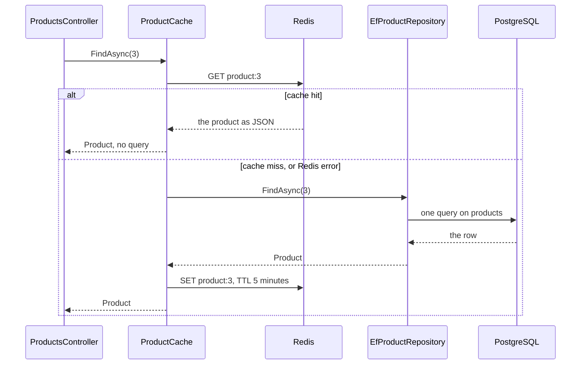

## Bạn cần biết trước

- [[backend.l2.redis-key-value-store]] — bạn biết Redis cất một giá trị dưới một key như `product:3`, tự xóa nó khi TTL hết, và chỉ giữ bản sao của thứ PostgreSQL đã có.
- [[backend.l1.get-and-status-codes]] — bạn biết `Get(int id)` tra một sản phẩm rồi trả `200` kèm sản phẩm đó, hoặc `404`.
- [[design.l1.service-lifetimes]] — bạn biết singleton là một object duy nhất cho cả app, còn object scoped chỉ sống trong một request.

## Tình huống

Ở bài trước, bạn tự tay đặt `product:3` vào Redis bằng `redis-cli`. Giờ một khách mở sản phẩm 3, và `GET /api/v1/products/3` nên trả lời từ bản sao đó thay vì lại truy vấn PostgreSQL. Nhưng Redis chỉ trả lời đúng key được hỏi: nó không biết `product:3` lấy từ bảng `products`, và nó không có bản sao nào của sản phẩm cho tới khi có ai ghi vào. Phải có ai đó xem trong Redis, nhận ra khi bản sao bị thiếu, đọc PostgreSQL rồi cất câu trả lời. Còn Redis thì có thể bị dừng trong lúc khách vẫn đang xem hàng. Trong Đơn Hàng, ai làm việc này, và khách nhận được gì khi Redis không có bản sao, hoặc không chạy?

## Khái niệm cốt lõi

- **cache-aside** (ứng dụng hỏi cache trước; thiếu thì đọc database rồi tự cất kết quả vào cache) — kiểu dùng cache trong đó ứng dụng hỏi cache trước, và khi thiếu giá trị thì tự đọc database rồi cất câu trả lời vào cache.
- **cache hit** (lần đọc tìm thấy giá trị trong cache nên không phải hỏi nguồn gốc) — lần đọc thấy giá trị trong cache, nên không phải hỏi database.
- **cache miss** (lần đọc không thấy giá trị trong cache nên phải hỏi nguồn gốc) — lần đọc không thấy giá trị trong cache, nên phải hỏi database.
- `ConnectionMultiplexer` — object của StackExchange.Redis, thư viện client Redis mà `DonHang.Api` dùng, giữ kết nối tới Redis và gửi mọi lệnh qua kết nối đó.

## Cơ chế hoạt động



Trong tình huống trên, người làm việc là `ProductCache`, một class trong `DonHang.Infrastructure`. Đó chính là cache-aside: cache đứng bên cạnh ứng dụng, và ứng dụng quyết định từng bước. Redis không bao giờ đọc PostgreSQL.

`ProductsController.Get` xin sản phẩm 3 qua `IProductRepository`, và ở stage-2, object đứng sau interface đó là một `ProductCache` bọc một `EfProductRepository` bên trong. `ProductCache` gửi `GET product:3` tới Redis trước tiên.

Khi cache hit, Redis trả về sản phẩm dưới dạng chuỗi JSON. `ProductCache` chuyển chuỗi đó ngược lại thành object `Product`, và không có truy vấn EF Core nào chạy cả.

Khi cache miss, `ProductCache` gọi `EfProductRepository` bên trong nó, và repository này truy vấn PostgreSQL như trước. Sau đó `ProductCache` ghi sản phẩm vào Redis dưới dạng JSON, dưới key `product:3`, với TTL 5 phút. Cho tới khi key hết hạn, mọi request cho sản phẩm 3 đều là hit, trừ khi bản sao bị xóa trước đó, chuyện của một bài sau.

Khi Redis lỗi, đường đi cũng y như vậy: `ProductCache` coi lỗi như một lần miss và đọc PostgreSQL. Khách vẫn nhận `200` kèm sản phẩm, request chỉ tốn thêm một truy vấn.

Toàn bộ những việc này nói chuyện với Redis qua một `ConnectionMultiplexer` duy nhất, đăng ký là singleton. StackExchange.Redis được thiết kế đúng cho cách đó: một object dùng chung cho mọi request, thay vì mỗi request một kết nối mới.

## Trong hệ thống Đơn Hàng

Đường đọc là `FindAsync` trong `ProductCache`:

```csharp file=DonHang.Infrastructure/ProductCache.cs tag=stage-2 lines=23-44
    // lesson: backend.l2.cache-aside
    // Redis first; only on a miss ask the repository inside, then keep its answer.
    public async Task<Product?> FindAsync(int id)
    {
        var key = $"product:{id}";
        var cached = await GetAsync(key);
        if (cached is not null) return cached; // cache hit: no query

        // lesson: backend.l2.cache-stampede
        // Only one request per key goes on to PostgreSQL; the others wait here.
        var keyLock = Locks.GetOrAdd(key, _ => new SemaphoreSlim(1, 1));
        await keyLock.WaitAsync();
        try
        {
            // While this request waited, the one before it may have filled the key.
            cached = await GetAsync(key);
            if (cached is not null) return cached;

            var product = await inner.FindAsync(id); // cache miss: one query
            if (product is not null) await SetAsync(key, product);
            return product;
        }
```

Hãy đọc nó theo sơ đồ: `GetAsync` hỏi Redis, hit thì trả về ngay, còn miss thì gọi `inner.FindAsync`, tức `EfProductRepository`, rồi `SetAsync`. Những dòng đánh dấu `backend.l2.cache-stampede` chỉ quan trọng khi nhiều request cùng miss một lúc, nội dung của một bài sau. Với một request đơn lẻ, chúng chỉ thêm một lần xem Redis nữa trước khi truy vấn. Block cũng dừng trước khối `finally` nhả lock, phần đó cũng thuộc bài kia. Với một sản phẩm không tồn tại, `inner.FindAsync` trả `null`, không có gì được ghi vào Redis cho id đó, và controller trả `404`.

`GetAsync`, nằm phía dưới trong file, chuyển chuỗi ngược lại bằng `JsonSerializer.Deserialize<Product>` và bọc lời gọi Redis trong `catch (Exception ex) when (ex is RedisException or RedisTimeoutException)`. Khối `catch` đó ghi một cảnh báo vào log và trả `null`, thứ mà `FindAsync` coi là miss.

`SetAsync` cất JSON bằng `StringSetAsync(key, json, Ttl)`, với `Ttl` là 5 phút, và cũng bắt đúng các lỗi đó, nên một lần ghi hỏng cũng không làm hỏng request.

Trong `ServiceCollectionExtensions.cs`, `services.AddSingleton<IConnectionMultiplexer>(...)` tạo ra `ConnectionMultiplexer` duy nhất. Comment của nó giải thích phần còn lại của cấu hình Redis: `abortConnect=false` cho `Connect` trả về một multiplexer ngay cả khi Redis đang sập, và multiplexer tiếp tục thử kết nối ở nền. `BacklogPolicy.FailFast` làm mỗi lệnh Redis thất bại ngay trong lúc đó, thay vì chờ kết nối quay lại. Cũng file này đăng ký `IProductRepository` là một `ProductCache` mới dựng quanh `EfProductRepository` đã đăng ký, nên controller nhận cả cặp mà không hề biết.

Script của bài, chạy từ terminal trên máy bạn, đếm các truy vấn `FROM products` mà EF Core ghi log cho mỗi request. Ở đầu script, `redis` chạy `redis-cli` bên trong container `redis`, còn `get_product_3` gửi `GET /api/v1/products/3` bằng `curl`, in body và status code, rồi in số truy vấn sản phẩm mà request đó tốn:

```bash file=scripts/backend/cache-aside.sh tag=stage-2 lines=20-36
redis DEL product:3 >/dev/null # start without a copy in Redis

# lesson: backend.l2.cache-aside
echo "== GET /api/v1/products/3, product:3 not in Redis (a cache miss)"
get_product_3
echo "product:3 in Redis now: $(redis GET product:3)"
echo "seconds left on product:3: $(redis TTL product:3)"
echo
echo "== the same request again (a cache hit)"
get_product_3
echo

echo "== the same request with the redis container stopped"
docker compose stop redis 2>/dev/null
get_product_3
docker compose start redis 2>/dev/null
docker compose up --wait redis 2>/dev/null
```

```text output=true
== GET /api/v1/products/3, product:3 not in Redis (a cache miss)
{"id":3,"name":"Tai nghe","priceVnd":890000}  -> 200
queries PostgreSQL ran for it: 1
product:3 in Redis now: {"id":3,"name":"Tai nghe","priceVnd":890000}
seconds left on product:3: ...

== the same request again (a cache hit)
{"id":3,"name":"Tai nghe","priceVnd":890000}  -> 200
queries PostgreSQL ran for it: 0

== the same request with the redis container stopped
{"id":3,"name":"Tai nghe","priceVnd":890000}  -> 200
queries PostgreSQL ran for it: 1
```

Ba câu trả lời giống hệt nhau, chỉ có số truy vấn thay đổi: 1 khi miss, 0 khi hit, và lại 1 khi Redis bị dừng. Dấu `...` thay cho số giây còn lại, con số này khác nhau giữa các lần chạy.

## Người mới hay nghĩ rằng…

- **"Redis tự nạp sản phẩm từ PostgreSQL khi key bị thiếu."** → Thực ra Redis không biết gì về PostgreSQL, `ProductCache` mới là thứ đọc database và ghi bản sao. Một key chỉ xuất hiện trong Redis khi có chương trình ghi nó, và trong API, chương trình đó là `ProductCache`, sau một lần miss. Bạn sẽ nhận ra khi request đầu tiên của script đếm được 1 truy vấn ngay sau `DEL product:3`: không có gì điền lại key ở giữa.
- **"Nếu Redis sập thì endpoint sản phẩm cũng phải lỗi theo."** → Thực ra `ProductCache` bắt lỗi Redis và coi chúng là miss, vì Redis chỉ giữ bản sao. Bạn sẽ nhận ra ở request cuối của script: Redis đã dừng, vậy mà câu trả lời vẫn là `200` kèm sản phẩm, đổi lại bằng một truy vấn.
- **"Endpoint nào cũng nên đi qua cache, vì cache chỉ làm mọi thứ nhanh hơn."** → Thực ra một lần miss còn tốn hơn cả không có cache: `GET` tới Redis trước, rồi truy vấn, rồi ghi vào Redis. Cache chỉ đáng khi cùng một thứ được đọc nhiều hơn hẳn số lần nó thay đổi, và mỗi bản sao là thêm một nơi có thể giữ giá trị cũ. Vì thế `List` có phân trang và lọc trong `ProductsController` đọc thẳng `DonHangDbContext` và không được cache. Bạn sẽ nhận ra ở request đầu tiên của script: nó tốn đúng một truy vấn như request không có cache, và dòng `product:3 in Redis now` cho thấy lần ghi thêm, còn hai lần `GET` tới Redis trước đó nằm trong `FindAsync`.

## Thử ngay (3 phút)

1. Khi hệ thống ví dụ đang chạy (`scripts/up.sh`), chạy `scripts/backend/cache-aside.sh` từ terminal trên máy bạn, ở thư mục gốc của repo ví dụ.
2. Sau đó chạy `docker compose logs api | grep "Redis read of"` trong cùng thư mục.

Kết quả mong đợi: script in ba số truy vấn `1`, `0` và `1`, mỗi số sau một `-> 200`. Lệnh tìm trong log cho ra các dòng cảnh báo `Redis read of product:3 failed; reading PostgreSQL instead`, được ghi trong lúc Redis bị dừng: hai dòng cho một request, vì `FindAsync` xem Redis hai lần khi miss.

## Liên hệ

- [[backend.l2.redis-key-value-store]] — bài cần học trước: lệnh `SET` có hạn dùng và lệnh `GET` mà giờ `ProductCache` tự gửi.
- [[foundation.l1.http-caching]] — cùng ý tưởng ở tầng HTTP, nơi trình duyệt hoặc proxy giữ bản sao thay cho API.
- [[backend.l2.cache-invalidation]] — vấn đề kế tiếp: giá đổi trong khi bản sao cũ vẫn còn vài phút.
- [[backend.l2.cache-stampede]] — công dụng của những dòng để dành cho sau trong `FindAsync`: nhiều request cùng miss một key.

## Tóm tắt 5 dòng

1. Với cache-aside, ứng dụng tự làm việc: nó hỏi Redis trước, và khi miss thì đọc PostgreSQL rồi cất câu trả lời.
2. `GET /api/v1/products/3` đi qua `ProductCache`: request đầu là cache miss tốn một truy vấn, request lặp lại là hit.
3. `product:3` giữ sản phẩm dưới dạng JSON với TTL 5 phút, nên hit chỉ chuyển chuỗi đó thành `Product` thay vì chạy EF Core.
4. Chỉ một `ConnectionMultiplexer` được đăng ký là singleton, vì StackExchange.Redis được làm ra để mọi request dùng chung nó.
5. Lỗi Redis được tính là miss, nên khi Redis sập, đọc sản phẩm chậm hơn chứ không hỏng.
