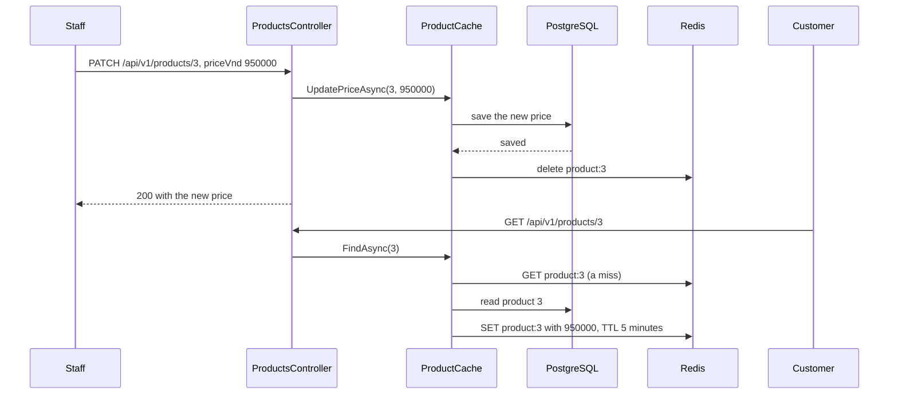

## Before you start

- [[backend.l2.cache-aside]] — you know `GET /api/v1/products/3` goes through `ProductCache`, which answers from `product:3` in Redis and reads PostgreSQL only on a miss, keeping the copy for 5 minutes.
- [[backend.l2.role-based-access]] — you know the `StaffOnly` policy lets a request through only when its access token carries the `staff` role.

## The situation

Product 3, the headphones, costs `890000` VND. A customer has just opened it, so `product:3` sits in Redis with the old price and minutes left on its TTL. Now a staff member raises the price to `950000`, and the new value is saved in the `products` table, but nothing tells Redis. The next customer who opens product 3 is answered from the copy, and the copy still says `890000`. For up to 5 minutes, customers who open product 3 are shown a price the shop no longer asks. How does a change to a price reach customers at once, and what can still go wrong?

## Core concepts

- **cache invalidation** — removing a cached copy when the data it was copied from changes, so the next read is a miss and loads the new value.
- stale copy — a value in the cache that no longer matches PostgreSQL, like `product:3` holding `890000` after the price became `950000`.
- `KeyDeleteAsync` — the StackExchange.Redis method that asks Redis to delete a key and its value.

## How it works



In the situation above, the missing step is cache invalidation: the price was saved, but nothing deleted the copy. The stage-2 code adds that delete to a staff-only `PATCH /api/v1/products/{id}`. The controller calls `UpdatePriceAsync` on its `IProductRepository`, and the DI container hands it a `ProductCache`, which implements that interface around an `EfProductRepository`.

`ProductCache` first lets the `EfProductRepository` save the new price. Only when that save has returned a product does it delete `product:3`, and the controller answers `200`. The next customer `GET` reaches `FindAsync(3)`, which misses, loads `950000` from PostgreSQL and writes a fresh copy.

The order matters. Suppose `ProductCache` deleted the key first and saved second. Between the two steps, a customer read would miss, load the old `890000` from PostgreSQL, since the save has not happened yet, and write it back into Redis for another 5 minutes. The delete would have achieved nothing.

Saving first does not close every gap. Suppose `product:3` is missing just before the save, for example because its TTL has just ended. A customer read then misses and loads `890000`, but reaches Redis later than the `PATCH`. If its write lands after the delete, the old price is back in Redis. The delete itself can also fail while Redis is down. That is why Đơn Hàng keeps the 5-minute TTL: it is the upper limit on how long any stale copy can live, whatever went wrong.

## In the Đơn Hàng system

The write path is `UpdatePriceAsync` in `ProductCache`:

```csharp file=DonHang.Infrastructure/ProductCache.cs tag=stage-2 lines=51-59
    // lesson: backend.l2.cache-invalidation
    // Save first, then delete the copy: the next read is a miss that loads the
    // new price. Deleting before the save would let a read put the old one back.
    public async Task<Product?> UpdatePriceAsync(int id, int priceVnd)
    {
        var product = await inner.UpdatePriceAsync(id, priceVnd);
        if (product is not null) await RemoveAsync($"product:{id}");
        return product;
    }
```

`inner` is the `EfProductRepository`, which finds the product, sets `PriceVnd` and calls `SaveChangesAsync`. If the save throws, the exception leaves `UpdatePriceAsync` before `RemoveAsync` runs, and that is correct: PostgreSQL still has the old price, so the copy is still right. For an id with no product, `inner` returns `null`, nothing is deleted, and the controller answers `404`.

`RemoveAsync`, further down the file, calls `KeyDeleteAsync` and catches the same Redis errors as the read path. When Redis is down, it logs `Redis delete of {Key} failed; the old copy lives until its TTL ends` and the `PATCH` still answers `200`. The comment on `Ttl`, the 5-minute setting at the top of the class (not shown above), says the same: 5 minutes is "the longest a stale copy can live, even if a delete below is missed."

`UpdatePrice` in `ProductsController` carries `[Authorize(Policy = "StaffOnly")]` and only calls `products.UpdatePriceAsync`. It does not know there is a cache at all. Only changes that go through `ProductCache` delete the key; a price changed straight in PostgreSQL, with `psql`, PostgreSQL's command-line client, for example, still waits for the TTL.

The lesson's script signs in as the staff user `lan.do@example.com` through Keycloak, then watches Redis around a price change. `redis` runs `redis-cli`, Redis's command-line client, inside the `redis` container; `set_price` sends the `PATCH` with the staff token; `curl` sends each request to `$base`, the API's `/api/v1` address, and prints the status code after `->`:

```bash file=scripts/backend/cache-invalidation.sh tag=stage-2 lines=19-31
echo "== GET /api/v1/products/3 fills the cache"
curl -sS -w '  -> %{http_code}\n' "$base/products/3"
echo "product:3 in Redis: $(redis GET product:3)"
echo

# lesson: backend.l2.cache-invalidation
echo "== PATCH /api/v1/products/3 as staff, new price 950000"
set_price 950000
echo "is product:3 still in Redis? $(redis EXISTS product:3) (1 = yes, 0 = no)"
echo
echo "== GET /api/v1/products/3 again: a miss that loads the new price"
curl -sS -w '  -> %{http_code}\n' "$base/products/3"
echo "product:3 in Redis: $(redis GET product:3)"
```

```text output=true
== GET /api/v1/products/3 fills the cache
{"id":3,"name":"Tai nghe","priceVnd":890000}  -> 200
product:3 in Redis: {"id":3,"name":"Tai nghe","priceVnd":890000}

== PATCH /api/v1/products/3 as staff, new price 950000
{"id":3,"name":"Tai nghe","priceVnd":950000}  -> 200
is product:3 still in Redis? 0 (1 = yes, 0 = no)

== GET /api/v1/products/3 again: a miss that loads the new price
{"id":3,"name":"Tai nghe","priceVnd":950000}  -> 200
product:3 in Redis: {"id":3,"name":"Tai nghe","priceVnd":950000}
```

Right after the `PATCH`, `EXISTS product:3` prints `0`: the copy is gone well before its TTL would end. The next `GET` refills the key, this time with `950000`. The script's last line, outside the block, sets the price back to `890000`.

## Beginners often think…

- **"Once PostgreSQL has the new price, every customer sees it."** → Actually a read of one product, `GET /api/v1/products/{id}`, asks Redis first, and Redis does not watch the `products` table. Until `product:3` is deleted or expires, customers get the copy. You notice this when you change a price with `psql` and `GET /api/v1/products/3` keeps answering the old one for minutes.
- **"With the key deleted on every update, the TTL is no longer needed."** → Actually a delete can be missed: Redis may be down during the `PATCH`, a slow read may put the old price back after the delete, or the price may change outside the API. The TTL is what ends every one of these cases. You notice this when the API log shows `Redis delete of product:3 failed` and the old price is still served for a few minutes afterwards.
- **"It is safer to delete the cached copy first and update the database afterwards."** → Actually deleting first leaves a window in which a read misses, loads the old price from PostgreSQL and stores it again with a full TTL. Saving first means any read that misses after the delete finds the new price. In code that deletes first, you notice this when a single read lands between the delete and the save: a customer sees the old price although the `PATCH` answered `200` with the new one.

## Try it (3 minutes)

1. With the example system running (`scripts/up.sh`), run `scripts/backend/cache-invalidation.sh` from your own terminal, in the root folder of the example repository.
2. Right after it, run `docker compose exec -T redis redis-cli EXISTS product:3` in the same folder, the same command the script's `redis` helper runs.

Expected result: the script prints `0` after the `PATCH` and `950000` in both the answer and the refilled copy. The second command also prints `0`, as long as nothing read product 3 in between: the script's last line changed the price back to `890000`, and that `PATCH` deleted the copy again.

## Connections

- [[backend.l2.cache-aside]] — prerequisite: the read path that writes the copy this lesson deletes.
- [[backend.l2.role-based-access]] — the `StaffOnly` policy that keeps the price-changing `PATCH` for staff only.
- [[foundation.l1.http-caching]] — the same stale-copy problem one layer out, where the copy sits in a browser or proxy instead of Redis.
- [[backend.l2.cache-stampede]] — the next problem: many reads missing the same key at once, as can happen right after a delete or an expiry.

## Five-line summary

1. When staff change a price through the API, `ProductCache` deletes the cached copy after the save, so the next read loads the new price.
2. At stage-2, staff change a price with `PATCH /api/v1/products/{id}`, and `ProductCache` deletes `product:{id}` after the save.
3. Deleting before the save lets a read put the old price back into Redis for a full TTL.
4. A read that loaded the old price just before the save can still write it after the delete, and a delete can fail.
5. So Đơn Hàng keeps the 5-minute TTL as the upper limit on how long any stale copy can live.
