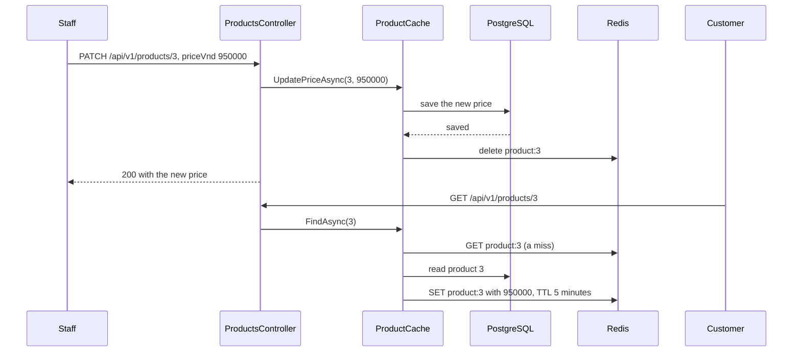

## Bạn cần biết trước

- [[backend.l2.cache-aside]] — bạn biết `GET /api/v1/products/3` đi qua `ProductCache`, thứ trả lời từ `product:3` trong Redis và chỉ đọc PostgreSQL khi miss, rồi giữ bản sao trong 5 phút.
- [[backend.l2.role-based-access]] — bạn biết policy `StaffOnly` chỉ cho request đi qua khi access token của nó mang role `staff`.

## Tình huống

Sản phẩm 3, chiếc tai nghe, có giá `890000` VND. Một khách vừa mở nó, nên `product:3` đang nằm trong Redis với giá cũ và TTL còn vài phút. Giờ một nhân viên nâng giá lên `950000`, và giá mới được lưu vào bảng `products`, nhưng không có gì báo cho Redis. Khách kế tiếp mở sản phẩm 3 được trả lời từ bản sao, mà bản sao vẫn ghi `890000`. Trong tối đa 5 phút, khách mở sản phẩm 3 đều thấy một mức giá cửa hàng không còn bán. Làm sao để một lần đổi giá tới được khách ngay lập tức, và điều gì vẫn có thể trục trặc?

## Khái niệm cốt lõi

- **cache invalidation** (xóa hoặc đánh dấu bỏ bản sao trong cache khi dữ liệu gốc đổi, để lần đọc sau lấy bản mới) — xóa một bản sao trong cache khi dữ liệu gốc của nó thay đổi, để lần đọc kế tiếp là một miss và nạp giá trị mới.
- bản sao cũ — một giá trị trong cache không còn khớp với PostgreSQL, như `product:3` vẫn giữ `890000` sau khi giá đã thành `950000`.
- `KeyDeleteAsync` — method của StackExchange.Redis yêu cầu Redis xóa một key cùng giá trị của nó.

## Cơ chế hoạt động



Trong tình huống trên, bước còn thiếu chính là cache invalidation: giá đã được lưu, nhưng không ai xóa bản sao. Code ở stage-2 thêm bước xóa đó vào `PATCH /api/v1/products/{id}`, endpoint chỉ dành cho nhân viên. Controller gọi `UpdatePriceAsync` trên `IProductRepository` của nó, và DI container đưa cho nó một `ProductCache`, class implement interface đó và bọc quanh một `EfProductRepository`.

`ProductCache` để `EfProductRepository` lưu giá mới trước. Chỉ khi lần lưu đó đã trả về một sản phẩm, nó mới xóa `product:3`, rồi controller trả `200`. Lần `GET` kế tiếp của khách tới `FindAsync(3)`, bị miss, nạp `950000` từ PostgreSQL và ghi một bản sao mới.

Thứ tự ở đây rất quan trọng. Giả sử `ProductCache` xóa key trước rồi mới lưu. Giữa hai bước đó, một lần đọc của khách sẽ bị miss, nạp giá cũ `890000` từ PostgreSQL vì lần lưu chưa xảy ra, rồi ghi nó ngược vào Redis thêm 5 phút nữa. Lần xóa coi như vô ích.

Lưu trước cũng không bịt hết mọi khe hở. Giả sử `product:3` đang vắng ngay trước lúc lưu, chẳng hạn vì TTL của nó vừa hết. Khi đó một lần đọc của khách bị miss và nạp `890000`, nhưng tới Redis muộn hơn `PATCH`. Nếu lần ghi của nó rơi vào sau lần xóa, giá cũ lại nằm trong Redis. Bản thân lần xóa cũng có thể thất bại khi Redis không chạy. Vì thế Đơn Hàng giữ TTL 5 phút: đó là giới hạn trên cho thời gian mọi bản sao cũ còn sống, dù có chuyện gì trục trặc.

## Trong hệ thống Đơn Hàng

Đường ghi là `UpdatePriceAsync` trong `ProductCache`:

```csharp file=DonHang.Infrastructure/ProductCache.cs tag=stage-2 lines=51-59
    // lesson: backend.l2.cache-invalidation
    // Save first, then delete the copy: the next read is a miss that loads the
    // new price. Deleting before the save would let a read put the old one back.
    public async Task<Product?> UpdatePriceAsync(int id, int priceVnd)
    {
        var product = await inner.UpdatePriceAsync(id, priceVnd);
        if (product is not null) await RemoveAsync($"product:{id}");
        return product;
    }
```

`inner` là `EfProductRepository`, thứ tìm sản phẩm, đặt `PriceVnd` rồi gọi `SaveChangesAsync`. Nếu lần lưu ném exception, exception đó rời `UpdatePriceAsync` trước khi `RemoveAsync` kịp chạy, và như vậy là đúng: PostgreSQL vẫn giữ giá cũ, nên bản sao vẫn đúng. Với một id không có sản phẩm nào, `inner` trả `null`, không có gì bị xóa, và controller trả `404`.

`RemoveAsync`, nằm phía dưới trong file, gọi `KeyDeleteAsync` và bắt đúng các lỗi Redis như đường đọc. Khi Redis không chạy, nó ghi log `Redis delete of {Key} failed; the old copy lives until its TTL ends` và `PATCH` vẫn trả `200`. Comment trên `Ttl`, thiết lập 5 phút ở đầu class (không có trong block trên), nói đúng điều đó: 5 phút là "the longest a stale copy can live, even if a delete below is missed."

`UpdatePrice` trong `ProductsController` mang `[Authorize(Policy = "StaffOnly")]` và chỉ gọi `products.UpdatePriceAsync`. Nó hoàn toàn không biết có cache. Chỉ những thay đổi đi qua `ProductCache` mới xóa key, còn giá sửa thẳng trong PostgreSQL, chẳng hạn bằng `psql`, client dòng lệnh của PostgreSQL, vẫn phải chờ TTL.

Script của bài đăng nhập qua Keycloak bằng tài khoản nhân viên `lan.do@example.com`, rồi quan sát Redis quanh một lần đổi giá. `redis` chạy `redis-cli`, client dòng lệnh của Redis, bên trong container `redis`. `set_price` gửi `PATCH` kèm token của nhân viên. `curl` gửi từng request tới `$base`, địa chỉ `/api/v1` của API, và in status code sau `->`:

```bash file=scripts/backend/cache-invalidation.sh tag=stage-2 lines=19-31
echo "== GET /api/v1/products/3 fills the cache"
curl -sS -w '  -> %{http_code}\n' "$base/products/3"
echo "product:3 in Redis: $(redis GET product:3)"
echo

# lesson: backend.l2.cache-invalidation
echo "== PATCH /api/v1/products/3 as staff, new price 950000"
set_price 950000
echo "is product:3 still in Redis? $(redis EXISTS product:3) (1 = yes, 0 = no)"
echo
echo "== GET /api/v1/products/3 again: a miss that loads the new price"
curl -sS -w '  -> %{http_code}\n' "$base/products/3"
echo "product:3 in Redis: $(redis GET product:3)"
```

```text output=true
== GET /api/v1/products/3 fills the cache
{"id":3,"name":"Tai nghe","priceVnd":890000}  -> 200
product:3 in Redis: {"id":3,"name":"Tai nghe","priceVnd":890000}

== PATCH /api/v1/products/3 as staff, new price 950000
{"id":3,"name":"Tai nghe","priceVnd":950000}  -> 200
is product:3 still in Redis? 0 (1 = yes, 0 = no)

== GET /api/v1/products/3 again: a miss that loads the new price
{"id":3,"name":"Tai nghe","priceVnd":950000}  -> 200
product:3 in Redis: {"id":3,"name":"Tai nghe","priceVnd":950000}
```

Ngay sau `PATCH`, `EXISTS product:3` in `0`: bản sao đã biến mất từ lâu trước khi TTL của nó hết. Lần `GET` kế tiếp điền lại key, lần này với `950000`. Dòng cuối của script, nằm ngoài block, đặt giá về lại `890000`.

## Người mới hay nghĩ rằng…

- **"Khi PostgreSQL đã có giá mới thì khách nào cũng thấy giá đó."** → Thực ra lần đọc một sản phẩm, `GET /api/v1/products/{id}`, hỏi Redis trước, và Redis không theo dõi bảng `products`. Cho tới khi `product:3` bị xóa hoặc hết hạn, khách vẫn nhận bản sao. Bạn sẽ nhận ra khi đổi giá bằng `psql` và `GET /api/v1/products/3` vẫn trả giá cũ thêm vài phút.
- **"Key đã bị xóa sau mỗi lần cập nhật thì không cần TTL nữa."** → Thực ra một lần xóa có thể bị lỡ: Redis có thể không chạy lúc `PATCH`, một lần đọc chậm có thể đặt lại giá cũ sau lần xóa, hoặc giá có thể bị đổi ngoài API. TTL là thứ chấm dứt mọi trường hợp đó. Bạn sẽ nhận ra khi log của API có dòng `Redis delete of product:3 failed` và giá cũ vẫn được trả thêm vài phút sau đó.
- **"Xóa bản sao trong cache trước rồi mới cập nhật database thì an toàn hơn."** → Thực ra xóa trước để hở một khoảng trong đó một lần đọc bị miss, nạp giá cũ từ PostgreSQL và cất lại nó với TTL đầy đủ. Lưu trước nghĩa là mọi lần đọc bị miss sau lần xóa đều thấy giá mới. Với code xóa trước, bạn sẽ nhận ra khi chỉ một lần đọc rơi vào giữa lúc xóa và lúc lưu: khách thấy giá cũ dù `PATCH` đã trả `200` kèm giá mới.

## Thử ngay (3 phút)

1. Khi hệ thống ví dụ đang chạy (`scripts/up.sh`), chạy `scripts/backend/cache-invalidation.sh` từ terminal trên máy bạn, ở thư mục gốc của repo ví dụ.
2. Ngay sau đó, chạy `docker compose exec -T redis redis-cli EXISTS product:3` trong cùng thư mục, đúng lệnh mà helper `redis` của script chạy.

Kết quả mong đợi: script in `0` sau `PATCH`, và `950000` ở cả câu trả lời lẫn bản sao được điền lại. Lệnh thứ hai cũng in `0`, miễn là không có gì đọc sản phẩm 3 ở giữa: dòng cuối của script đã đổi giá về `890000`, và `PATCH` đó lại xóa bản sao thêm lần nữa.

## Liên hệ

- [[backend.l2.cache-aside]] — bài cần học trước: đường đọc ghi ra bản sao mà bài này xóa.
- [[backend.l2.role-based-access]] — policy `StaffOnly` giữ `PATCH` đổi giá chỉ cho nhân viên.
- [[foundation.l1.http-caching]] — cùng vấn đề bản sao cũ ở một tầng xa hơn, nơi bản sao nằm trong trình duyệt hoặc proxy thay vì Redis.
- [[backend.l2.cache-stampede]] — vấn đề kế tiếp: nhiều lần đọc cùng miss một key một lúc, chuyện có thể xảy ra ngay sau một lần xóa hoặc hết hạn.

## Tóm tắt 5 dòng

1. Khi nhân viên đổi giá qua API, `ProductCache` xóa bản sao trong cache sau khi lưu, nên lần đọc kế tiếp nạp giá mới.
2. Ở stage-2, nhân viên đổi giá bằng `PATCH /api/v1/products/{id}`, và `ProductCache` xóa `product:{id}` sau khi lưu.
3. Xóa trước khi lưu cho phép một lần đọc đặt lại giá cũ vào Redis trọn một TTL.
4. Một lần đọc đã nạp giá cũ ngay trước khi lưu vẫn có thể ghi nó sau lần xóa, và lần xóa cũng có thể thất bại.
5. Vì thế Đơn Hàng giữ TTL 5 phút làm giới hạn trên cho thời gian mọi bản sao cũ còn sống.
