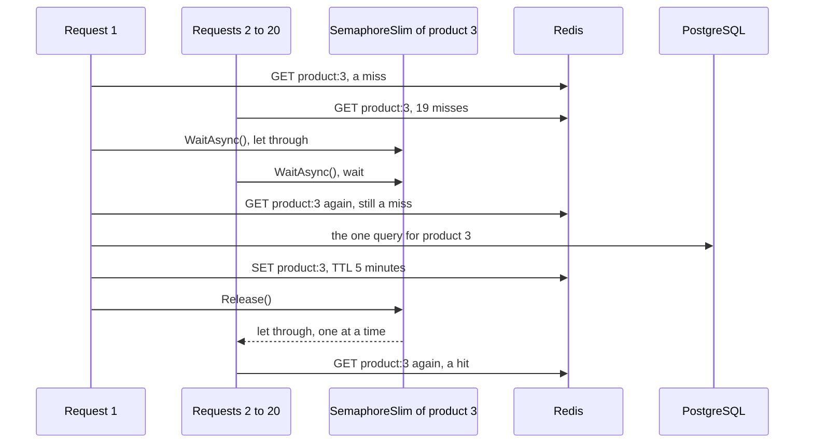

## Before you start

- [[backend.l2.cache-aside]] — you know `ProductCache.FindAsync` asks Redis for `product:3` first and, on a miss, queries PostgreSQL and stores the answer for 5 minutes.
- [[foundation.l1.threads-and-async-intro]] — you know many requests run at the same time in one process, and that `await` gives the thread back while a request waits.

## The situation

Product 3 sits on the shop's front page, and customers open it many times every second. Almost all of those reads are cache hits: PostgreSQL hears nothing about product 3 for minutes at a time. Then the 5 minutes of `product:3` run out, and in the next instant 20 requests for product 3 arrive together. Each one asks Redis, each one finds nothing, and each one is a cache miss. Cache-aside tells every miss to read PostgreSQL and store the answer. How many queries for the same row does PostgreSQL get in that instant, and what in Đơn Hàng keeps that number at one?

## Core concepts

- **cache stampede** — many requests missing the same key at the same moment, usually just after it expired, so each of them sends the same query to the database at once.
- `SemaphoreSlim` — a .NET object that lets a fixed number of callers through at a time; created as `new SemaphoreSlim(1, 1)`, it lets one through, and the others wait until that one calls `Release()`.
- `WaitAsync()` — the call that asks a `SemaphoreSlim` for a turn; used with `await`, the waiting request gives its thread back until its turn comes.

## How it works



Without anything in between, the situation above is a cache stampede. Each of the 20 misses would run the whole cache-aside path: one query on `products` and one write to Redis, 20 of each, all for the same row. The rush comes exactly when the cache stops shielding PostgreSQL. Its size depends on how many requests arrive for that key in that instant, not on how much data the key holds: product 3 is one small row, and 200 requests would mean up to 200 queries. That instant lasts from the moment the key disappears until the first request stores it again; a request arriving after that is an ordinary hit.

`ProductCache` puts a `SemaphoreSlim` in the way, one per key. After the first `GET` misses, every request for `product:3` calls `WaitAsync()` on the same object. Request 1 is let through; requests 2 to 20 wait, holding no thread while they do.

Request 1 looks in Redis once more, still finds nothing, and queries PostgreSQL. It stores the product under `product:3` and calls `Release()`, which lets the next waiting request through.

That request also looks in Redis again before doing anything else, and this second look is what saves the query. Request 1 filled the key while this request waited, so the look is a hit, and the request returns the stored product. The same happens for every request after it. PostgreSQL answers one query instead of 20.

## In the Đơn Hàng system

Here is the whole of `FindAsync`, including the lines the cache-aside lesson left for this one:

```csharp file=DonHang.Infrastructure/ProductCache.cs tag=stage-2 lines=25-49
    public async Task<Product?> FindAsync(int id)
    {
        var key = $"product:{id}";
        var cached = await GetAsync(key);
        if (cached is not null) return cached; // cache hit: no query

        // lesson: backend.l2.cache-stampede
        // Only one request per key goes on to PostgreSQL; the others wait here.
        var keyLock = Locks.GetOrAdd(key, _ => new SemaphoreSlim(1, 1));
        await keyLock.WaitAsync();
        try
        {
            // While this request waited, the one before it may have filled the key.
            cached = await GetAsync(key);
            if (cached is not null) return cached;

            var product = await inner.FindAsync(id); // cache miss: one query
            if (product is not null) await SetAsync(key, product);
            return product;
        }
        finally
        {
            keyLock.Release();
        }
    }
```

A hit returns before any of the waiting code, so the `SemaphoreSlim` matters only on a miss. `inner` is the `EfProductRepository` that `ProductCache` holds, the object that sends the query; it is only called on a miss. The `Release()` sits in `finally`, so it runs whichever way the method leaves the `try`: after a hit on the second look, after the query, or after an error.

`Locks` is declared a few lines above the method as a `static` `ConcurrentDictionary<string, SemaphoreSlim>`, with the comment "One SemaphoreSlim per key, shared by every request in this api process". A new `ProductCache` is made for every request, but because `Locks` is `static`, all of them share it. A `ConcurrentDictionary` is the .NET hash map that many threads can use at the same time without losing changes. So even when two requests call `GetOrAdd` together, both get the same `SemaphoreSlim` for `product:3`: the one the dictionary stored first.

That sharing stops at the edge of the process. Locally, the setup `scripts/up.sh` starts has one `api` container, so for a product that exists (a missing one is never stored, so each waiting request queries in turn), and while Redis answers (if it fails, every second look misses), one query per key is the limit. In the setup described by `deploy/k8s/api.yaml`, Đơn Hàng runs two copies of the API; each copy is a separate process with its own memory, so each has its own `Locks`. When `product:3` expires there, each copy can let one request through, so up to two queries arrive instead of one per request.

The script deletes `product:3`, which is the same moment as its TTL running out, and sends 20 requests at once. `product_queries`, defined at the top of the script, counts the lines containing `FROM products` in the `api` container's log. EF Core writes such a line for every query it sends, because the setup `scripts/up.sh` starts turns on its SQL command log for that container:

```bash file=scripts/backend/cache-stampede.sh tag=stage-2 lines=11-22
redis DEL product:3 >/dev/null # as if its TTL had just run out
before=$(product_queries)

# lesson: backend.l2.cache-stampede
# curl --parallel opens all 20 connections at once: 20 misses arrive together.
requests=()
for _ in $(seq 20); do requests+=(-o /dev/null http://localhost:8080/api/v1/products/3); done
echo "20 requests at once for GET /api/v1/products/3; status codes received:"
curl -sS --parallel --parallel-immediate --parallel-max 20 -w '%{http_code}\n' "${requests[@]}" \
  | sort | uniq -c | sed 's/^ */  /'
sleep 1 # let the api's logger write its entries out first
echo "queries PostgreSQL ran for them: $(( $(product_queries) - before ))"
```

```text output=true
20 requests at once for GET /api/v1/products/3; status codes received:
  20 200
queries PostgreSQL ran for them: 1
```

All 20 requests got `200` with the product, and PostgreSQL ran one query for them. The other 19 answers came from Redis, read on the second look after their wait.

## Beginners often think…

- **"A cache can only take load off the database, never add to it."** → Actually a cache also changes when the load arrives. While `product:3` lives, PostgreSQL gets almost nothing for product 3; the moment it expires, every request in flight misses together, and without the `SemaphoreSlim` each would send its own query and its own Redis write at once. Compared with the minutes before, that is load added all at once, and each miss also costs Redis a look and a write on top of the query it would cost with no cache. You notice this when the database sees a sudden burst of identical queries for one row, right when a popular key's TTL runs out.
- **"A longer TTL fixes a stampede."** → Actually a longer TTL only makes the moment rarer. The key still expires sooner or later, and a delete makes the same moment at any time: `UpdatePriceAsync` removes `product:3` after every price change. The rush depends on how many requests arrive right then, not on how long the key lived before. You notice this in the script: it never waits for a TTL, and a single `DEL` is enough to produce 20 misses at once.

## Try it (3 minutes)

1. With the example system running (`scripts/up.sh`), run `scripts/backend/cache-stampede.sh` from your own terminal, in the root folder of the example repository.
2. Run it a second time.

Expected result: both runs print `20 200` and `queries PostgreSQL ran for them: 1`. The second run counts one query again, because the script deletes `product:3` before it sends the requests.

## Connections

- [[backend.l2.cache-aside]] — prerequisite: the read path whose miss branch this lesson guards, and the lines it left for later.
- [[foundation.l1.threads-and-async-intro]] — the same idea applied: waiting requests use `await`, so 19 of them waiting hold no thread.
- [[backend.l2.cache-invalidation]] — the delete after a price change, which opens the same moment of misses as an expiry.

## Five-line summary

1. When a popular key expires, every request that misses it queries PostgreSQL at once, unless only one per key is let through.
2. The rush comes exactly when the cache stops shielding the database, and it grows with the requests for that key, not the data.
3. `ProductCache` gives each key one `SemaphoreSlim(1, 1)`: one request queries PostgreSQL, the others wait for their turn.
4. A request let through looks in Redis again first, so the waiting requests read the copy the first one stored.
5. `Locks` is shared inside one API process only, so two API copies can send two queries, still far fewer than one per request.
