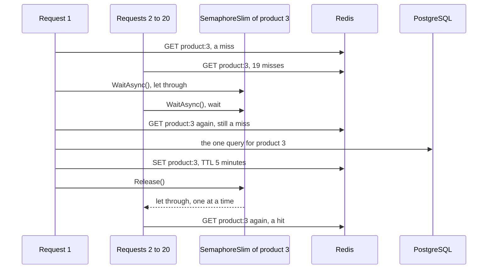

## Bạn cần biết trước

- [[backend.l2.cache-aside]] — bạn biết `ProductCache.FindAsync` hỏi Redis lấy `product:3` trước, và khi miss thì truy vấn PostgreSQL rồi cất câu trả lời trong 5 phút.
- [[foundation.l1.threads-and-async-intro]] — bạn biết nhiều request chạy cùng lúc trong một process, và `await` trả thread lại trong lúc một request chờ.

## Tình huống

Sản phẩm 3 nằm ở trang đầu của cửa hàng, và khách mở nó nhiều lần mỗi giây. Gần như mọi lần đọc đó đều là cache hit: suốt nhiều phút liền, PostgreSQL không nghe gì về sản phẩm 3. Rồi 5 phút của `product:3` hết, và ngay khoảnh khắc sau đó 20 request cho sản phẩm 3 cùng tới. Request nào cũng hỏi Redis, request nào cũng không thấy gì, và request nào cũng là cache miss. Cache-aside bảo mỗi lần miss hãy đọc PostgreSQL rồi cất câu trả lời. Trong khoảnh khắc đó, PostgreSQL nhận bao nhiêu truy vấn cho cùng một dòng, và thứ gì trong Đơn Hàng giữ con số đó ở mức một?

## Khái niệm cốt lõi

- **cache stampede** (nhiều request cùng miss một key vừa hết hạn và cùng lúc đổ truy vấn vào database) — nhiều request cùng miss một key vào cùng một lúc, thường là ngay sau khi key hết hạn, nên request nào cũng gửi cùng một truy vấn tới database cùng lúc.
- `SemaphoreSlim` — object của .NET cho một số lượng cố định bên gọi đi qua mỗi lần. Tạo bằng `new SemaphoreSlim(1, 1)` thì nó cho một bên đi qua, các bên khác chờ tới khi bên đó gọi `Release()`.
- `WaitAsync()` — lời gọi xin `SemaphoreSlim` một lượt. Dùng với `await` thì request đang chờ trả thread lại cho tới khi tới lượt nó.

## Cơ chế hoạt động



Nếu không có gì chen vào giữa, tình huống ở trên chính là cache stampede. Mỗi lần miss trong 20 lần sẽ đi hết đường cache-aside: một truy vấn vào `products` và một lần ghi vào Redis, mỗi thứ 20 lần, tất cả cho cùng một dòng. Đợt dồn đến đúng lúc cache thôi che chắn cho PostgreSQL. Độ lớn của nó tùy vào số request tới cho key đó trong khoảnh khắc ấy, không tùy vào lượng dữ liệu key giữ: sản phẩm 3 chỉ là một dòng nhỏ, còn 200 request có thể thành tới 200 truy vấn. Khoảnh khắc ấy kéo dài từ lúc key biến mất tới khi request đầu tiên cất lại nó, và request tới sau đó là một lần hit bình thường.

`ProductCache` đặt một `SemaphoreSlim` chắn ngang, mỗi key một cái. Sau khi `GET` đầu tiên miss, mọi request cho `product:3` đều gọi `WaitAsync()` trên cùng object đó. Request 1 được cho đi qua. Request 2 tới 20 chờ, và trong lúc chờ không giữ thread nào.

Request 1 xem Redis thêm một lần, vẫn không thấy gì, rồi truy vấn PostgreSQL. Nó cất sản phẩm vào `product:3` rồi gọi `Release()`, và lời gọi này cho request đang chờ kế tiếp đi qua.

Request đó cũng xem lại Redis trước khi làm gì khác, và chính lần xem thứ hai này tiết kiệm được truy vấn. Request 1 đã điền key trong lúc request này chờ, nên lần xem là hit, và request trả về sản phẩm đã cất. Mọi request sau nó cũng vậy. PostgreSQL trả lời một truy vấn thay vì 20.

## Trong hệ thống Đơn Hàng

Đây là toàn bộ `FindAsync`, kể cả những dòng mà bài cache-aside để dành cho bài này:

```csharp file=DonHang.Infrastructure/ProductCache.cs tag=stage-2 lines=25-49
    public async Task<Product?> FindAsync(int id)
    {
        var key = $"product:{id}";
        var cached = await GetAsync(key);
        if (cached is not null) return cached; // cache hit: no query

        // lesson: backend.l2.cache-stampede
        // Only one request per key goes on to PostgreSQL; the others wait here.
        var keyLock = Locks.GetOrAdd(key, _ => new SemaphoreSlim(1, 1));
        await keyLock.WaitAsync();
        try
        {
            // While this request waited, the one before it may have filled the key.
            cached = await GetAsync(key);
            if (cached is not null) return cached;

            var product = await inner.FindAsync(id); // cache miss: one query
            if (product is not null) await SetAsync(key, product);
            return product;
        }
        finally
        {
            keyLock.Release();
        }
    }
```

Một lần hit trả về trước mọi đoạn code chờ, nên `SemaphoreSlim` chỉ có tác dụng khi miss. `inner` là `EfProductRepository` mà `ProductCache` giữ bên trong, object gửi truy vấn, và nó chỉ được gọi khi miss. `Release()` nằm trong `finally`, nên nó chạy dù method rời khỏi `try` theo đường nào: sau lần hit ở lần xem thứ hai, sau truy vấn, hay sau một lỗi.

`Locks` được khai báo vài dòng phía trên method, là một `ConcurrentDictionary<string, SemaphoreSlim>` có `static`, kèm comment "One SemaphoreSlim per key, shared by every request in this api process". Mỗi request có một `ProductCache` mới, nhưng vì `Locks` là `static`, mọi `ProductCache` dùng chung nó. `ConcurrentDictionary` là hash map của .NET mà nhiều thread dùng cùng lúc được mà không mất thay đổi. Nên kể cả khi hai request cùng gọi `GetOrAdd`, cả hai đều nhận cùng một `SemaphoreSlim` cho `product:3`: cái mà dictionary cất vào trước.

Sự dùng chung đó dừng ở ranh giới của process. Trên máy bạn, thứ mà `scripts/up.sh` khởi động có một container `api`, nên với sản phẩm có tồn tại (sản phẩm không tồn tại thì không bao giờ được cất, nên từng request đang chờ lần lượt truy vấn), và khi Redis còn trả lời (nếu Redis lỗi, mọi lần xem thứ hai đều miss), giới hạn là một truy vấn cho mỗi key. Trong cách chạy mà `deploy/k8s/api.yaml` mô tả, Đơn Hàng chạy hai bản API. Mỗi bản là một process riêng với bộ nhớ riêng, nên mỗi bản có `Locks` riêng. Khi `product:3` hết hạn ở đó, mỗi bản có thể cho một request đi qua, nên có tới hai truy vấn thay vì mỗi request một truy vấn.

Script xóa `product:3`, tức là tạo đúng khoảnh khắc TTL của nó vừa hết, rồi gửi 20 request cùng lúc. `product_queries`, định nghĩa ở đầu script, đếm các dòng chứa `FROM products` trong log của container `api`. EF Core ghi một dòng như vậy cho mỗi truy vấn nó gửi, vì thứ mà `scripts/up.sh` khởi động bật log câu lệnh SQL cho container đó:

```bash file=scripts/backend/cache-stampede.sh tag=stage-2 lines=11-22
redis DEL product:3 >/dev/null # as if its TTL had just run out
before=$(product_queries)

# lesson: backend.l2.cache-stampede
# curl --parallel opens all 20 connections at once: 20 misses arrive together.
requests=()
for _ in $(seq 20); do requests+=(-o /dev/null http://localhost:8080/api/v1/products/3); done
echo "20 requests at once for GET /api/v1/products/3; status codes received:"
curl -sS --parallel --parallel-immediate --parallel-max 20 -w '%{http_code}\n' "${requests[@]}" \
  | sort | uniq -c | sed 's/^ */  /'
sleep 1 # let the api's logger write its entries out first
echo "queries PostgreSQL ran for them: $(( $(product_queries) - before ))"
```

```text output=true
20 requests at once for GET /api/v1/products/3; status codes received:
  20 200
queries PostgreSQL ran for them: 1
```

Cả 20 request đều nhận `200` kèm sản phẩm, và PostgreSQL chạy một truy vấn cho chúng. 19 câu trả lời còn lại đến từ Redis, đọc ở lần xem thứ hai sau khi chờ.

## Người mới hay nghĩ rằng…

- **"Cache chỉ có thể giảm tải cho database, không bao giờ thêm tải."** → Thực ra cache còn đổi cả thời điểm tải đến. Trong lúc `product:3` còn sống, PostgreSQL gần như không nhận gì cho sản phẩm 3. Ngay lúc nó hết hạn, mọi request đang tới cùng miss, và nếu không có `SemaphoreSlim` thì request nào cũng gửi truy vấn riêng và ghi Redis riêng cùng một lúc. So với mấy phút trước đó, đó là tải dồn thêm vào cùng một lúc, và mỗi lần miss còn tốn thêm một lần xem và một lần ghi Redis, ngoài truy vấn mà nó vẫn tốn khi không có cache. Bạn sẽ nhận ra khi database đột nhiên thấy một loạt truy vấn giống hệt nhau cho cùng một dòng, đúng lúc TTL của một key hot vừa hết.
- **"TTL dài hơn thì hết cache stampede."** → Thực ra TTL dài hơn chỉ làm khoảnh khắc đó hiếm hơn. Sớm hay muộn key vẫn hết hạn, và một lần xóa tạo ra đúng khoảnh khắc ấy vào bất kỳ lúc nào: `UpdatePriceAsync` xóa `product:3` sau mỗi lần đổi giá. Đợt dồn tùy vào số request tới đúng lúc đó, không tùy vào key đã sống bao lâu trước đó. Bạn sẽ nhận ra điều này ở script: nó không hề chờ TTL, chỉ một lệnh `DEL` là đủ tạo ra 20 lần miss cùng lúc.

## Thử ngay (3 phút)

1. Khi hệ thống ví dụ đang chạy (`scripts/up.sh`), chạy `scripts/backend/cache-stampede.sh` từ terminal trên máy bạn, ở thư mục gốc của repo ví dụ.
2. Chạy nó thêm một lần nữa.

Kết quả mong đợi: cả hai lần đều in `20 200` và `queries PostgreSQL ran for them: 1`. Lần chạy thứ hai lại đếm được một truy vấn, vì script xóa `product:3` trước khi gửi các request.

## Liên hệ

- [[backend.l2.cache-aside]] — bài cần học trước: đường đọc mà bài này canh nhánh miss của nó, cùng những dòng nó để dành cho sau.
- [[foundation.l1.threads-and-async-intro]] — cùng ý tưởng đó, đem ra dùng: request đang chờ dùng `await`, nên 19 request cùng chờ không giữ thread nào.
- [[backend.l2.cache-invalidation]] — lần xóa sau khi đổi giá, thứ mở ra đúng khoảnh khắc miss hàng loạt như lúc hết hạn.

## Tóm tắt 5 dòng

1. Khi một key hot hết hạn, mọi request miss nó cùng lúc truy vấn PostgreSQL, trừ khi mỗi key chỉ cho một request đi qua.
2. Đợt dồn đến đúng lúc cache thôi che chắn cho database, và nó lớn theo số request cho key đó, không theo lượng dữ liệu.
3. `ProductCache` cho mỗi key một `SemaphoreSlim(1, 1)`: một request truy vấn PostgreSQL, các request khác chờ tới lượt.
4. Request được cho qua xem lại Redis trước, nên các request đang chờ đọc bản sao mà request đầu đã cất.
5. `Locks` chỉ dùng chung trong một process API, nên hai bản API có thể gửi hai truy vấn, vẫn ít hơn nhiều so với mỗi request một truy vấn.
