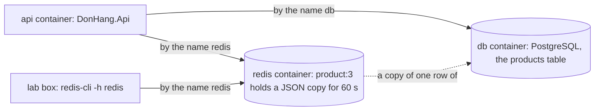

## Before you start

- [[foundation.l1.http-caching]] — you know a cache keeps a copy to answer faster, and pays for it with a copy that can go stale.
- [[foundation.l1.collections-in-practice]] — you know a `Dictionary` files each value under a key and finds it by that key.
- [[devops.l1.compose-for-the-api]] — you know the `api` container reaches PostgreSQL by the service name `db` on the `donhang` network.

## The situation

Customers open product 3, `Tai nghe`, many times a minute, and without a copy each read is one more query to PostgreSQL for the same row. A `Dictionary` inside the API could hold the copy, but the repository also describes a later setup, `deploy/k8s/api.yaml`, that runs two copies of the API side by side, each with its own memory. A restart of the API would also empty that `Dictionary`. The copy must not live forever, or a new price would never show. At stage-2, `docker compose ps` lists a new container, `donhang-redis`. Where can Đơn Hàng keep a copy that every program sees, that outlives a restart of the API, and that disappears by itself once it is old?

## Core concepts

- **Redis** — a server, running as its own process, that keeps values under keys in memory and shares them with every program connected to it.
- **key-value store** — a data store that only puts a value under a key and gets it back by that key, with no tables and no JOIN.
- **TTL** — time to live: the number of seconds after which Redis removes a key by itself.
- `redis-cli` — the command-line program that sends commands to a Redis server and prints its answers; the lab box, the prepared container on the `donhang` network where this lesson's script runs, has it installed.

## How it works



In the situation above, Redis is the `redis` service in `docker-compose.yml`: one more container on the `donhang` network. It is a key-value store. Picture the `Dictionary` from the collections lesson, moved out of the API into a process of its own. A key is a string such as `product:3`. The value under it is whatever text you stored, here the product written as JSON. Redis does not read or check that text.

Because Redis is a separate process, every program connected to it sees the same keys. The API reaches it by the name `redis`, exactly as it reaches PostgreSQL by the name `db`. The lab box does the same with `redis-cli -h redis`. Both copies of the API would read one shared `product:3`, and restarting the API does not touch Redis, so the key is still there when the API comes back.

Any key can carry a TTL. `SET product:3 <value> EX 60` stores the value with 60 seconds to live, and `TTL product:3` answers how many seconds are left. When they run out, Redis removes the key itself, and `GET product:3` finds nothing.

Redis keeps its data in memory, which is what makes its reads fast. Đơn Hàng uses it only for copies: PostgreSQL holds every product, with the rules that keep it correct, and the value under `product:3` is a copy the API can build again from the `products` table at any time.

## In the Đơn Hàng system

The service itself is a few lines in `docker-compose.yml`:

```yaml file=docker-compose.yml tag=stage-2 lines=157-172
  # lesson: backend.l2.redis-key-value-store
  # A key-value store the api reaches as redis:6379 on the donhang network.
  # No port is published: only the api and the lab box talk to it, and
  # nothing in it is the only copy of a fact (PostgreSQL has them all).
  redis:
    image: redis:8.10.2-alpine
    container_name: donhang-redis
    hostname: redis
    networks:
      donhang:
        ipv4_address: 172.28.0.15
    healthcheck:
      test: ["CMD", "redis-cli", "ping"]
      interval: 3s
      timeout: 3s
      retries: 30
```

Look at what is missing: unlike `db`, the service lists no `ports:`, so nothing on your machine reaches it at `localhost:6379`, the way it reaches `db` at `localhost:5432`; the API and the lab box reach it over the `donhang` network. The API's side is one setting further up the file, `ConnectionStrings__Redis`, which starts with `redis:6379`: the name, then the port Redis listens on. The rest of that setting is an option for the Redis client inside the API. The comment states the rule from the section above: PostgreSQL has every fact.

The script for this lesson talks to that service from the lab box:

```bash file=scripts/backend/redis-basics.sh tag=stage-2 lines=4-25
# Everything below runs inside the lab box; this line puts it there.
[ -f /.dockerenv ] || exec "$(dirname "$0")/../lab-run.sh" "$0" "$@"

# lesson: backend.l2.redis-key-value-store
# redis-cli reaches the redis service by its Compose name, as the api does.
# Each command is printed after "redis>", its answer on the next line.
redis() {
  echo "redis> $*"
  redis-cli -h redis "$@"
}

redis SET product:3 '{"id":3,"name":"Tai nghe","priceVnd":890000}' EX 60
redis GET product:3
redis TTL product:3
echo

echo "the same key, now with 2 seconds to live:"
redis SET product:3 '{"id":3,"name":"Tai nghe","priceVnd":890000}' EX 2
sleep 3
echo "(3 seconds later)"
redis TTL product:3
redis GET product:3
```

```text output=true
redis> SET product:3 {"id":3,"name":"Tai nghe","priceVnd":890000} EX 60
OK
redis> GET product:3
{"id":3,"name":"Tai nghe","priceVnd":890000}
redis> TTL product:3
60

the same key, now with 2 seconds to live:
redis> SET product:3 {"id":3,"name":"Tai nghe","priceVnd":890000} EX 2
OK
(3 seconds later)
redis> TTL product:3
-2
redis> GET product:3

```

You start it from your own terminal; its first lines move it into the lab box. The first `SET` stores product 3's JSON with `EX 60`, and `TTL` answers `60` straight after. The second `SET` stores the same key again with `EX 2`: a new `SET` replaces both the value and the old expiry. Three seconds later nobody has deleted anything, yet `TTL` answers `-2`, Redis's answer for a key that does not exist, and `GET` prints an empty line.

## Beginners often think…

- **"Redis is just a faster database, so the products table could move into it."** → Actually, the way Đơn Hàng uses it, Redis holds one text value per key and checks nothing inside it, while PostgreSQL enforces the rules: `products` has a primary key and a rule, `CHECK (price_vnd > 0)`, that refuses any price not above 0, and `order_items` points at it with a foreign key. Đơn Hàng keeps the facts where those rules hold and puts only copies in Redis. You notice this when you picture `SET product:3` with `"priceVnd":-5`: Redis answers `OK`, while PostgreSQL would refuse that price.
- **"A `Dictionary` inside the API does the same job as Redis, only without an extra container."** → Actually a `Dictionary` lives inside one API process: each copy of the API has its own, and a restart empties it. Redis is one separate process that every copy connects to, so they all read the same `product:3`. You notice this when you restart the API with `docker compose restart api`: whatever a `Dictionary` held is gone, while `redis-cli -h redis` in the lab box still finds a key whose TTL has not run out.

## Try it (3 minutes)

1. With the example system running (`scripts/up.sh`), run `scripts/backend/redis-basics.sh` from your own terminal; it moves itself into the lab box.
2. Read the answer printed after each `redis> TTL product:3` line, then the last line of the output.

Expected result: the first `TTL` answers `60`, or `59` if a second went by. The second `TTL` answers `-2`, and the last `GET` prints an empty line, although the script never deletes the key: Redis removed it when its 2 seconds ran out.

## Connections

- [[foundation.l1.http-caching]] — the same trade, speed for a copy that ages, with `max-age` there and `EX` here, now in a store the system runs itself.
- [[foundation.l1.collections-in-practice]] — the same lookup by key as a `Dictionary`, moved out of one process into a server every process shares.
- [[devops.l1.compose-for-the-api]] — the same way of reaching a service by its name that lets `api` find `db`.
- [[backend.l2.cache-aside]] — the next step: how `DonHang.Api` itself reads `product:3` from Redis and fills it from PostgreSQL.

## Five-line summary

1. Redis is a key-value store in its own process, so every program connected to it reads the same keys.
2. In Đơn Hàng, Redis is the `redis` Compose service; the API and the lab box reach it by the name `redis`.
3. `SET key value EX 60` gives a key 60 seconds to live; `TTL` shows what is left, then `GET` finds nothing.
4. Redis serves reads from memory, which makes them fast, and a restart of the API leaves its keys untouched.
5. Đơn Hàng keeps every fact in PostgreSQL; whatever Redis holds is a copy the API can rebuild.
