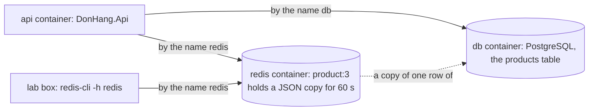

## Bạn cần biết trước

- [[foundation.l1.http-caching]] — bạn biết cache giữ một bản sao để trả lời nhanh hơn, và cái giá là bản sao đó có thể cũ đi.
- [[foundation.l1.collections-in-practice]] — bạn biết `Dictionary` cất mỗi giá trị dưới một key và tìm lại nó bằng chính key đó.
- [[devops.l1.compose-for-the-api]] — bạn biết container `api` tìm tới PostgreSQL bằng tên service `db` trên mạng `donhang`.

## Tình huống

Khách mở sản phẩm 3, `Tai nghe`, nhiều lần trong một phút, và nếu không có bản sao thì mỗi lần đọc lại là thêm một truy vấn tới PostgreSQL cho cùng một dòng. Một `Dictionary` bên trong API có thể giữ bản sao đó. Nhưng repo còn mô tả một kiểu triển khai về sau, `deploy/k8s/api.yaml`, chạy hai bản API song song, mỗi bản có bộ nhớ riêng. Khởi động lại API cũng làm `Dictionary` trống trơn. Bản sao lại không được sống mãi, nếu không giá mới sẽ chẳng bao giờ hiện ra. Ở stage-2, `docker compose ps` liệt kê thêm một container mới, `donhang-redis`. Đơn Hàng có thể giữ bản sao ở đâu để mọi chương trình cùng thấy, để nó còn nguyên sau khi API khởi động lại, và để nó tự biến mất khi đã cũ?

## Khái niệm cốt lõi

- **Redis** (server lưu giá trị theo khóa trong bộ nhớ, nhiều chương trình cùng đọc ghi được) — một server chạy thành process riêng, giữ các giá trị dưới key trong bộ nhớ và chia sẻ chúng cho mọi chương trình kết nối tới nó.
- **kho key-value** (key-value store) — kho dữ liệu chỉ biết cất một giá trị dưới một key và lấy lại bằng key đó, không có bảng, không có JOIN.
- **TTL** (thời gian sống: sau bấy nhiêu giây, giá trị tự bị xóa hoặc không còn được dùng) — time to live, số giây mà sau đó Redis tự xóa key.
- `redis-cli` — chương trình dòng lệnh gửi lệnh tới một Redis server và in câu trả lời ra. Lab box, container chuẩn bị sẵn trên mạng `donhang` nơi script của bài này chạy, đã cài sẵn nó.

## Cơ chế hoạt động



Trong tình huống trên, Redis là service `redis` trong `docker-compose.yml`: thêm một container nữa trên mạng `donhang`. Nó là một kho key-value. Hãy hình dung `Dictionary` ở bài về collection, được chuyển ra khỏi API thành một process riêng. Key là một chuỗi như `product:3`. Giá trị dưới key là bất cứ đoạn text nào bạn đã cất, ở đây là sản phẩm viết dưới dạng JSON. Redis không đọc, cũng không kiểm tra đoạn text đó.

Vì Redis là một process riêng, mọi chương trình kết nối tới nó đều thấy cùng một bộ key. API tìm tới nó bằng tên `redis`, y như cách tìm tới PostgreSQL bằng tên `db`. Lab box cũng vậy, với `redis-cli -h redis`. Cả hai bản API sẽ cùng đọc một `product:3` dùng chung. Khởi động lại API không đụng gì tới Redis, nên key vẫn còn đó khi API chạy lại.

Key nào cũng có thể mang TTL. `SET product:3 <value> EX 60` cất giá trị với 60 giây để sống, còn `TTL product:3` cho biết còn lại bao nhiêu giây. Hết giờ, Redis tự xóa key, và `GET product:3` không tìm thấy gì.

Redis giữ dữ liệu trong bộ nhớ, đó là lý do nó đọc nhanh. Đơn Hàng chỉ dùng nó cho bản sao: PostgreSQL giữ mọi sản phẩm, cùng các quy tắc giữ cho dữ liệu đúng, còn giá trị dưới `product:3` là một bản sao mà API có thể dựng lại từ bảng `products` bất cứ lúc nào.

## Trong hệ thống Đơn Hàng

Bản thân service chỉ là vài dòng trong `docker-compose.yml`:

```yaml file=docker-compose.yml tag=stage-2 lines=157-172
  # lesson: backend.l2.redis-key-value-store
  # A key-value store the api reaches as redis:6379 on the donhang network.
  # No port is published: only the api and the lab box talk to it, and
  # nothing in it is the only copy of a fact (PostgreSQL has them all).
  redis:
    image: redis:8.10.2-alpine
    container_name: donhang-redis
    hostname: redis
    networks:
      donhang:
        ipv4_address: 172.28.0.15
    healthcheck:
      test: ["CMD", "redis-cli", "ping"]
      interval: 3s
      timeout: 3s
      retries: 30
```

Hãy để ý thứ không có ở đây: khác với `db`, service này không khai báo `ports:`, nên từ máy bạn không gì tới được nó qua `localhost:6379`, như cách bạn tới `db` qua `localhost:5432`. API và lab box tới được nó qua mạng `donhang`. Phía API chỉ là một setting ở phía trên trong file, `ConnectionStrings__Redis`, bắt đầu bằng `redis:6379`: tên, rồi tới port mà Redis lắng nghe. Phần còn lại của setting đó là một tùy chọn cho client Redis bên trong API. Comment nhắc lại quy tắc ở phần trước: PostgreSQL giữ mọi dữ kiện.

Script của bài nói chuyện với service đó từ lab box:

```bash file=scripts/backend/redis-basics.sh tag=stage-2 lines=4-25
# Everything below runs inside the lab box; this line puts it there.
[ -f /.dockerenv ] || exec "$(dirname "$0")/../lab-run.sh" "$0" "$@"

# lesson: backend.l2.redis-key-value-store
# redis-cli reaches the redis service by its Compose name, as the api does.
# Each command is printed after "redis>", its answer on the next line.
redis() {
  echo "redis> $*"
  redis-cli -h redis "$@"
}

redis SET product:3 '{"id":3,"name":"Tai nghe","priceVnd":890000}' EX 60
redis GET product:3
redis TTL product:3
echo

echo "the same key, now with 2 seconds to live:"
redis SET product:3 '{"id":3,"name":"Tai nghe","priceVnd":890000}' EX 2
sleep 3
echo "(3 seconds later)"
redis TTL product:3
redis GET product:3
```

```text output=true
redis> SET product:3 {"id":3,"name":"Tai nghe","priceVnd":890000} EX 60
OK
redis> GET product:3
{"id":3,"name":"Tai nghe","priceVnd":890000}
redis> TTL product:3
60

the same key, now with 2 seconds to live:
redis> SET product:3 {"id":3,"name":"Tai nghe","priceVnd":890000} EX 2
OK
(3 seconds later)
redis> TTL product:3
-2
redis> GET product:3

```

Bạn chạy nó từ terminal trên máy mình, những dòng đầu sẽ chuyển nó vào lab box. Lệnh `SET` đầu tiên cất JSON của sản phẩm 3 với `EX 60`, và `TTL` trả lời `60` ngay sau đó. Lệnh `SET` thứ hai cất lại cùng key đó với `EX 2`: một lệnh `SET` mới thay cả giá trị lẫn hạn dùng cũ. Ba giây sau, không ai xóa gì cả, vậy mà `TTL` trả lời `-2`, câu trả lời của Redis cho một key không tồn tại, và `GET` in ra một dòng trống.

## Người mới hay nghĩ rằng…

- **"Redis chỉ là một database nhanh hơn, nên có thể chuyển bảng products sang đó."** → Thực ra, theo cách Đơn Hàng dùng, Redis giữ một giá trị text cho mỗi key và không kiểm tra gì bên trong, còn PostgreSQL mới là nơi áp các quy tắc: `products` có khóa chính và một quy tắc, `CHECK (price_vnd > 0)`, từ chối mọi giá không lớn hơn 0, còn `order_items` trỏ tới nó bằng khóa ngoại. Đơn Hàng giữ dữ kiện ở nơi các quy tắc đó có hiệu lực, và chỉ đặt bản sao vào Redis. Bạn sẽ nhận ra khi hình dung `SET product:3` với `"priceVnd":-5`: Redis trả lời `OK`, còn PostgreSQL sẽ từ chối mức giá đó.
- **"Một `Dictionary` trong API làm được y như Redis, chỉ là không cần thêm container."** → Thực ra `Dictionary` nằm trong một process API: mỗi bản API có một cái riêng, và khởi động lại là mất sạch. Redis là một process riêng mà mọi bản API cùng kết nối tới, nên tất cả đọc cùng một `product:3`. Bạn sẽ nhận ra khi khởi động lại API bằng `docker compose restart api`: những gì `Dictionary` giữ đều mất, còn `redis-cli -h redis` trong lab box vẫn tìm thấy một key chưa hết TTL.

## Thử ngay (3 phút)

1. Khi hệ thống ví dụ đang chạy (`scripts/up.sh`), chạy `scripts/backend/redis-basics.sh` từ terminal trên máy bạn, script sẽ tự chuyển vào lab box.
2. Đọc câu trả lời in ra sau mỗi dòng `redis> TTL product:3`, rồi đọc dòng cuối của output.

Kết quả mong đợi: `TTL` đầu tiên trả lời `60`, hoặc `59` nếu đã trôi qua một giây. `TTL` thứ hai trả lời `-2`, và `GET` cuối cùng in ra một dòng trống, dù script không hề xóa key: Redis đã xóa nó khi 2 giây của nó hết.

## Liên hệ

- [[foundation.l1.http-caching]] — cùng một sự đánh đổi, tốc độ lấy bằng một bản sao sẽ cũ đi, ở đó là `max-age` còn ở đây là `EX`, giờ trong một kho mà hệ thống tự chạy.
- [[foundation.l1.collections-in-practice]] — cùng kiểu tra theo key như `Dictionary`, nhưng chuyển ra khỏi một process thành server mà mọi process dùng chung.
- [[devops.l1.compose-for-the-api]] — cùng cách tìm tới một service bằng tên, thứ giúp `api` tìm thấy `db`.
- [[backend.l2.cache-aside]] — bước tiếp theo: chính `DonHang.Api` đọc `product:3` từ Redis và điền nó từ PostgreSQL ra sao.

## Tóm tắt 5 dòng

1. Redis là một kho key-value chạy trong process riêng, nên mọi chương trình kết nối tới nó đều đọc cùng một bộ key.
2. Trong Đơn Hàng, Redis là service Compose `redis`, và cả API lẫn lab box tìm tới nó bằng tên `redis`.
3. `SET key value EX 60` cho key 60 giây để sống, `TTL` cho biết còn bao nhiêu, và hết giờ thì `GET` không tìm thấy gì.
4. Redis trả lời lệnh đọc từ bộ nhớ nên nhanh, và khởi động lại API không đụng tới key nào của nó.
5. Đơn Hàng giữ mọi dữ kiện trong PostgreSQL, còn thứ Redis giữ chỉ là bản sao mà API dựng lại được.
