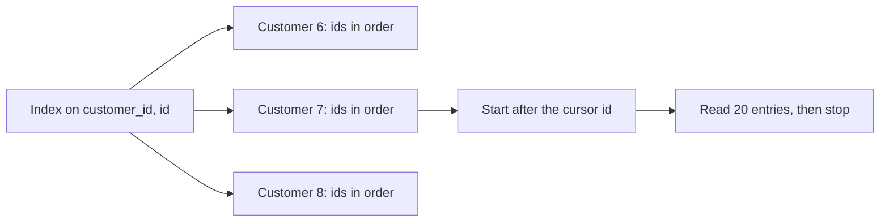

## Before you start

- [[backend.l2.foreign-key-indexes]] — you know EF Core indexed `orders.customer_id` as `IX_orders_customer_id`, and that a foreign key is covered when an index starts with its columns.
- [[backend.l2.cursor-pagination]] — you know one customer's order list asks for the rows after the last id the client saw, in `id` order, 20 at a time.

## The situation

At stage-2, a migration in your pull request drops `IX_orders_customer_id` and creates an index on `customer_id` and `id` together. A reviewer objects: "`orders` already has an index on `customer_id` and the primary key's index on `id`. Why build a third index that repeats both columns? And why `customer_id` first?" You run the next-page query for customer 7 on `donhang_perf`, the large copy of the Đơn Hàng database, with each index in turn. With the old index the plan reads almost 2,000 rows to return 20, and with the new one it reads 20. What does an index on two columns do that two separate indexes cannot?

## Core concepts

- **composite index** — an index on several columns, sorted by the first column and then, among entries with the same first value, by the next column.
- Leading column — the first column of a composite index, the one its entries are sorted by first.
- Index range — a stretch of index entries that sit next to each other in sort order, which a scan can read from start to end without skipping.
- `Sort` step — a plan step that reorders rows after they are read, needed when no index already delivers them in the order the query asks for.

## How it works



In the situation above, the composite index on `(customer_id, id)` keeps its entries sorted like a phone book sorted by family name and then by given name. All of customer 7's entries sit together, and inside that group they are in `id` order.

A condition on `customer_id` narrows the search to one group, the way a family name finds one page of the phone book. A condition on one `customer_id` plus a condition on `id` narrows it further, to one range inside that group. A condition on `id` alone does not narrow it: orders with nearby ids belong to every customer, so they are spread across every group, as a given name is spread across the whole book.

That is why the column order matters. An index on `(id, customer_id)` would be sorted by `id` first, so customer 7's entries would be spread across the whole index.

For one customer's next page, the plan finds customer 7's group, jumps to the first entry after the cursor, and reads entries in `id` order. They already come in the order `ORDER BY o.id` asks for, so there is no `Sort` step, and after 20 entries the `LIMIT` stops the scan.

Two separate indexes cannot do this. The one on `customer_id` finds customer 7's orders but not in `id` order; the one on `id` gives `id` order but mixes all customers. The planner can combine two indexes to find the matching rows, but it then visits those rows in the order they are stored in the table, not in either index's order, so a `Sort` step is still needed.

## In the Đơn Hàng system

At stage-2, `DonHangDbContext` declares the index on the `Order` entity:

```csharp file=DonHang.Infrastructure/DonHangDbContext.cs tag=stage-2 lines=49-53
            // lesson: backend.l2.composite-indexes
            // Sorted by customer, then by id: one customer's page after a cursor
            // is a single range of this index. It starts with customer_id, so it
            // also serves every query IX_orders_customer_id did, and replaces it.
            e.HasIndex(o => new { o.CustomerId, o.Id });
```

The migration generated from this change, `ReplaceOrdersCustomerIdIndex`, drops `IX_orders_customer_id` and creates `IX_orders_customer_id_id`. The new index starts with `customer_id`, so it covers the foreign key and EF Core no longer adds an index of its own for it. And any query the old index narrowed by `customer_id`, the new one narrows the same way, so keeping both would add work to every write for little or no gain: each insert into `orders` must also add an entry to every index on it.

`scripts/backend/composite-index.sh` runs `db/queries/composite-index.sql` on `donhang_perf` with `psql`, PostgreSQL's command-line client, building the database first if it does not exist yet:

```bash file=scripts/backend/composite-index.sh tag=stage-2 lines=13-17
# Unaligned: each plan line prints as it is, without a padded table around it.
psql --host db --username donhang --dbname donhang_perf \
     --no-psqlrc --echo-queries --set ON_ERROR_STOP=on \
     --pset format=unaligned --pset footer=off \
     --file /repo/db/queries/composite-index.sql
```

The file asks for `ANALYZE`, which really runs each query and prints `actual rows`, the rows a step returned, and `loops`, how many times it ran. `COSTS OFF, TIMING OFF, SUMMARY OFF` hide the estimates, the per-step timings and the total times, so the output is the same on every run. `--echo-queries` prints each statement above its result, which is why `ROLLBACK;` is followed by PostgreSQL's reply `ROLLBACK`. A line of its own reading `...` marks output cut here:

```text output=true
...
EXPLAIN (ANALYZE, COSTS OFF, TIMING OFF, SUMMARY OFF)
SELECT o.id, o.customer_id, o.status
FROM orders AS o
WHERE o.customer_id = 7 AND o.id > 120000
ORDER BY o.id
LIMIT 20;
QUERY PLAN
Limit (actual rows=20 loops=1)
  ->  Index Scan using "IX_orders_customer_id_id" on orders o (actual rows=20 loops=1)
        Index Cond: ((customer_id = 7) AND (id > 120000))
EXPLAIN (ANALYZE, COSTS OFF, TIMING OFF, SUMMARY OFF)
SELECT count(*) FROM orders WHERE customer_id = 7;
QUERY PLAN
Aggregate (actual rows=1 loops=1)
  ->  Index Only Scan using "IX_orders_customer_id_id" on orders (actual rows=2000 loops=1)
        Index Cond: (customer_id = 7)
        Heap Fetches: 0
BEGIN;
...
EXPLAIN (ANALYZE, COSTS OFF, TIMING OFF, SUMMARY OFF)
SELECT o.id, o.customer_id, o.status
FROM orders AS o
WHERE o.customer_id = 7 AND o.id > 120000
ORDER BY o.id
LIMIT 20;
QUERY PLAN
Limit (actual rows=20 loops=1)
  ->  Index Scan using "PK_orders" on orders o (actual rows=20 loops=1)
        Index Cond: (id > 120000)
        Filter: (customer_id = 7)
        Rows Removed by Filter: 1966
ROLLBACK;
ROLLBACK
```

Two lines under a scan matter here. `Index Cond` is the condition checked against the index entries; here each one also decides where the scan starts and stops. `Filter` is checked on each row after it is read, and `Rows Removed by Filter` counts the rows that failed it.

The first query is the page from the situation. Both conditions sit in `Index Cond`, so the scan starts at customer 7, order 120000, and returns 20 rows with no `Sort` step above it.

The second query counts customer 7's orders. Its `Index Cond` holds `customer_id` alone, the leading column, and the index still narrows the search to 2,000 entries. `Index Only Scan` means the plan could answer from the index entries; with `Heap Fetches: 0`, as here, it read no table rows at all (heap here means the table's own storage, not .NET memory).

Between `BEGIN` and `ROLLBACK`, cut here, the script drops the composite index and creates the stage-1 `IX_orders_customer_id` again. Now no index gives customer 7's orders in `id` order.

The plan walks `PK_orders` from 120000 and checks each row's customer in `Filter`: it throws away 1,966 other customers' rows to return 20.

The other plan open to it reads all of customer 7's orders through `IX_orders_customer_id` and sorts the ones after the cursor; the planner estimated that would cost more here. The `ROLLBACK` puts the composite index back.

## Beginners often think…

- **"An index on `(customer_id, id)` helps any query that filters on either column."** → Actually it narrows the search only when the condition includes `customer_id`, because entries with nearby ids are spread across every customer; an extra condition on a column outside the index, such as `status`, is checked on the rows found and does not stop that. You notice this when you add `EXPLAIN SELECT * FROM orders WHERE id = 120086;` at the end of `composite-index.sql` and run the script: the plan searches `PK_orders`, the index that starts with `id`.
- **"The order of the columns in an index does not matter."** → Actually the index is sorted by its first column first, so `(id, customer_id)` would scatter customer 7's entries across the whole index. You notice this in the third plan: `PK_orders` is sorted by `id` first, and walking it for customer 7 removes 1,966 rows by `Filter`, because that customer's entries are scattered among everyone else's. An index on `(id, customer_id)` is sorted by `id` first too, so it would scatter them the same way.
- **"Two separate indexes on `customer_id` and on `id` do the same job as one index on both."** → Actually neither one gives one customer's orders in `id` order, so the plan must sort or skip rows. You notice this when the page query, with both `IX_orders_customer_id` and `PK_orders` in place, still removes 1,966 rows by `Filter` to return 20.

## Try it (3 minutes)

1. With the example system running (`scripts/up.sh`), run `scripts/backend/composite-index.sh` from the root folder of the example repository. If `donhang_perf` does not exist yet, the first run builds it and takes longer than the next ones.
2. In `db/queries/composite-index.sql`, change the first query's `LIMIT 20` (line 18) to `LIMIT 100`, run the script again, and compare that plan with the first run. The lab reads the file from your checkout, so the edit applies on the next run. Change the line back afterwards.

Expected result: the first plan is now `Limit (actual rows=100 loops=1)` over `Index Scan using "IX_orders_customer_id_id" on orders o (actual rows=100 loops=1)`, with the same `Index Cond` and still no `Sort` step. The scan reads exactly as many entries as the `LIMIT` asks for, because they already come in `id` order.

## Connections

- [[backend.l2.foreign-key-indexes]] — prerequisite: the single-column index this lesson replaces, and why a leading column covers a foreign key.
- [[backend.l2.cursor-pagination]] — prerequisite: the next-page query that this index is shaped for.
- [[backend.l2.indexes-and-plans]] — how to read the plans above, and why the planner sometimes skips an index.
- [[backend.l2.efcore-generated-sql]] — where the SQL in `composite-index.sql` comes from: the query EF Core sends for `ListByCustomerAsync`, the repository method behind one customer's order list.

## Five-line summary

1. A composite index is sorted by its first column, then by the next, so the column order decides which queries it can narrow.
2. An index on `(customer_id, id)` narrows a search on `customer_id` or on both columns, but not on `id` alone.
3. For one customer's page after a cursor, the plan reads the index from the cursor in `id` order and stops at the `LIMIT`.
4. With only `IX_orders_customer_id`, the plan must sort that customer's orders or walk `orders` by id, discarding other customers' rows.
5. The composite index serves every query the single-column one did, so the stage-2 migration replaces it instead of keeping both.
