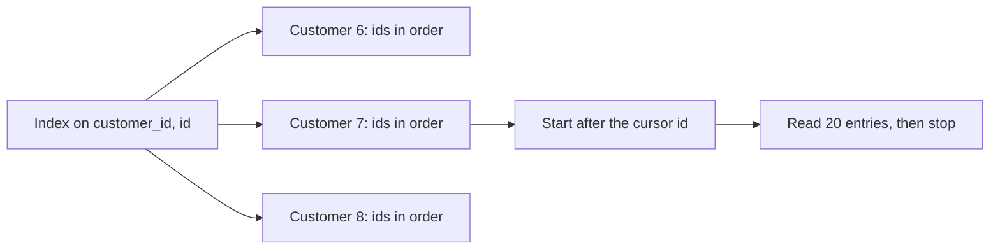

## Bạn cần biết trước

- [[backend.l2.foreign-key-indexes]] — bạn biết EF Core đã tạo index `IX_orders_customer_id` cho `orders.customer_id`, và một khóa ngoại được bao khi có index bắt đầu bằng các cột của nó.
- [[backend.l2.cursor-pagination]] — bạn biết danh sách đơn của một khách lấy các dòng sau id cuối cùng client đã thấy, theo thứ tự `id`, mỗi lần 20 dòng.

## Tình huống

Ở stage-2, một migration trong pull request của bạn xóa `IX_orders_customer_id` và tạo một index trên cả `customer_id` lẫn `id`. Người review phản đối: "`orders` đã có index trên `customer_id` và index của khóa chính trên `id` rồi. Sao phải dựng index thứ ba lặp lại cả hai cột? Mà sao `customer_id` lại đứng trước?" Bạn chạy truy vấn trang kế tiếp của khách 7 trên `donhang_perf`, bản sao lớn của database Đơn Hàng, lần lượt với từng index. Với index cũ, plan đọc gần 2.000 dòng để trả về 20, còn với index mới thì nó chỉ đọc 20. Một index trên hai cột làm được gì mà hai index riêng lẻ không làm được?

## Khái niệm cốt lõi

- **composite index** (index trên nhiều cột, sắp theo cột đầu rồi mới tới cột kế tiếp) — index trên nhiều cột, sắp theo cột đầu tiên, rồi giữa các entry có cùng giá trị cột đầu thì sắp theo cột kế tiếp.
- Cột dẫn đầu (leading column) — cột đầu tiên của một composite index, cột mà các entry được sắp theo trước hết.
- Khoảng trong index — một đoạn entry nằm liền nhau theo thứ tự sắp, mà một lượt quét có thể đọc từ đầu tới cuối không phải nhảy cóc.
- Bước `Sort` — bước trong plan sắp xếp lại các dòng sau khi đã đọc, cần tới khi không index nào trả dòng sẵn theo thứ tự truy vấn yêu cầu.

## Cơ chế hoạt động



Trong tình huống trên, composite index trên `(customer_id, id)` giữ các entry theo thứ tự giống danh bạ sắp theo họ rồi mới theo tên. Mọi entry của khách 7 nằm cạnh nhau, và trong nhóm đó chúng theo thứ tự `id`.

Một điều kiện trên `customer_id` thu hẹp phạm vi tìm về một nhóm, giống như biết họ thì lật ra đúng một trang danh bạ. Một điều kiện trên một `customer_id` cụ thể cộng thêm điều kiện trên `id` thu hẹp tiếp, về một khoảng bên trong nhóm đó. Điều kiện chỉ trên `id` thì không thu hẹp được gì: các đơn có id gần nhau thuộc về đủ mọi khách, nên chúng nằm rải khắp các nhóm, như một cái tên nằm rải khắp cuốn danh bạ.

Đó là lý do thứ tự cột quan trọng. Một index trên `(id, customer_id)` sẽ được sắp theo `id` trước, nên các entry của khách 7 sẽ nằm rải rác khắp index.

Với trang kế tiếp của một khách, plan tìm nhóm của khách 7, nhảy tới entry đầu tiên sau cursor, rồi đọc các entry theo thứ tự `id`. Chúng đã sẵn đúng thứ tự mà `ORDER BY o.id` yêu cầu, nên không có bước `Sort`, và sau 20 entry thì `LIMIT` dừng lượt quét.

Hai index riêng lẻ không làm được như vậy. Index trên `customer_id` tìm được đơn của khách 7 nhưng không theo thứ tự `id`, còn index trên `id` có thứ tự `id` nhưng trộn lẫn mọi khách. Planner có thể ghép hai index để tìm các dòng khớp, nhưng khi đó nó thăm các dòng theo thứ tự chúng được lưu trong bảng, không theo thứ tự của index nào, nên vẫn cần bước `Sort`.

## Trong hệ thống Đơn Hàng

Ở stage-2, `DonHangDbContext` khai báo index trên entity `Order`:

```csharp file=DonHang.Infrastructure/DonHangDbContext.cs tag=stage-2 lines=49-53
            // lesson: backend.l2.composite-indexes
            // Sorted by customer, then by id: one customer's page after a cursor
            // is a single range of this index. It starts with customer_id, so it
            // also serves every query IX_orders_customer_id did, and replaces it.
            e.HasIndex(o => new { o.CustomerId, o.Id });
```

Migration sinh ra từ thay đổi này, `ReplaceOrdersCustomerIdIndex`, xóa `IX_orders_customer_id` và tạo `IX_orders_customer_id_id`. Index mới bắt đầu bằng `customer_id`, nên nó bao khóa ngoại và EF Core không còn tự thêm index riêng cho khóa ngoại đó. Mọi truy vấn mà index cũ thu hẹp theo `customer_id` thì index mới cũng thu hẹp được y như vậy, nên giữ cả hai chỉ làm mỗi lần ghi tốn thêm việc mà gần như không được gì: mỗi lần insert vào `orders` đều phải thêm một entry vào từng index của bảng.

`scripts/backend/composite-index.sh` chạy `db/queries/composite-index.sql` trên `donhang_perf` bằng `psql`, công cụ dòng lệnh của PostgreSQL, và dựng database đó trước nếu nó chưa tồn tại:

```bash file=scripts/backend/composite-index.sh tag=stage-2 lines=13-17
# Unaligned: each plan line prints as it is, without a padded table around it.
psql --host db --username donhang --dbname donhang_perf \
     --no-psqlrc --echo-queries --set ON_ERROR_STOP=on \
     --pset format=unaligned --pset footer=off \
     --file /repo/db/queries/composite-index.sql
```

File này dùng `ANALYZE`, tức chạy thật từng truy vấn và in `actual rows`, số dòng một bước đã trả về, cùng `loops`, số lần bước đó chạy. `COSTS OFF, TIMING OFF, SUMMARY OFF` ẩn các ước lượng, thời gian từng bước và tổng thời gian, nên output lần chạy nào cũng giống nhau. `--echo-queries` in mỗi câu lệnh ngay trên kết quả của nó, vì vậy sau `ROLLBACK;` là câu trả lời `ROLLBACK` của PostgreSQL. Dòng chỉ có `...` đánh dấu chỗ output bị cắt:

```text output=true
...
EXPLAIN (ANALYZE, COSTS OFF, TIMING OFF, SUMMARY OFF)
SELECT o.id, o.customer_id, o.status
FROM orders AS o
WHERE o.customer_id = 7 AND o.id > 120000
ORDER BY o.id
LIMIT 20;
QUERY PLAN
Limit (actual rows=20 loops=1)
  ->  Index Scan using "IX_orders_customer_id_id" on orders o (actual rows=20 loops=1)
        Index Cond: ((customer_id = 7) AND (id > 120000))
EXPLAIN (ANALYZE, COSTS OFF, TIMING OFF, SUMMARY OFF)
SELECT count(*) FROM orders WHERE customer_id = 7;
QUERY PLAN
Aggregate (actual rows=1 loops=1)
  ->  Index Only Scan using "IX_orders_customer_id_id" on orders (actual rows=2000 loops=1)
        Index Cond: (customer_id = 7)
        Heap Fetches: 0
BEGIN;
...
EXPLAIN (ANALYZE, COSTS OFF, TIMING OFF, SUMMARY OFF)
SELECT o.id, o.customer_id, o.status
FROM orders AS o
WHERE o.customer_id = 7 AND o.id > 120000
ORDER BY o.id
LIMIT 20;
QUERY PLAN
Limit (actual rows=20 loops=1)
  ->  Index Scan using "PK_orders" on orders o (actual rows=20 loops=1)
        Index Cond: (id > 120000)
        Filter: (customer_id = 7)
        Rows Removed by Filter: 1966
ROLLBACK;
ROLLBACK
```

Có hai dòng dưới mỗi bước quét cần để ý. `Index Cond` là điều kiện được kiểm trên các entry của index, và ở đây mỗi điều kiện như vậy còn quyết định lượt quét bắt đầu và dừng ở đâu. `Filter` được kiểm trên từng dòng sau khi đã đọc, và `Rows Removed by Filter` đếm số dòng không qua được nó.

Truy vấn đầu tiên là trang trong tình huống. Cả hai điều kiện đều nằm trong `Index Cond`, nên lượt quét bắt đầu ở khách 7, đơn 120000, và trả về 20 dòng mà không có bước `Sort` nào phía trên.

Truy vấn thứ hai đếm đơn của khách 7. `Index Cond` của nó chỉ có `customer_id`, cột dẫn đầu, và index vẫn thu hẹp phạm vi tìm về 2.000 entry. `Index Only Scan` nghĩa là plan có thể trả lời từ chính các entry của index, và với `Heap Fetches: 0` như ở đây, nó không đọc dòng nào của bảng (heap ở đây là vùng lưu trữ của chính bảng, không phải bộ nhớ của .NET).

Giữa `BEGIN` và `ROLLBACK`, phần bị cắt, script xóa composite index và tạo lại `IX_orders_customer_id` của stage-1. Lúc này không index nào trả đơn của khách 7 theo thứ tự `id`.

Plan đi dọc `PK_orders` từ 120000 và kiểm khách của từng dòng trong `Filter`: nó bỏ đi 1.966 dòng của khách khác để trả về 20 dòng.

Plan còn lại mà nó có thể chọn là đọc mọi đơn của khách 7 qua `IX_orders_customer_id` rồi sắp các đơn sau cursor. Planner ước lượng cách đó sẽ tốn hơn trong trường hợp này. `ROLLBACK` trả composite index về chỗ cũ.

## Người mới hay nghĩ rằng…

- **"Index trên `(customer_id, id)` giúp mọi truy vấn lọc theo một trong hai cột."** → Thực ra nó chỉ thu hẹp phạm vi tìm khi điều kiện có `customer_id`, vì các entry có id gần nhau nằm rải khắp mọi khách. Một điều kiện thêm trên cột không có trong index, như `status`, được kiểm trên các dòng tìm ra và không cản việc thu hẹp đó. Bạn sẽ nhận ra khi thêm `EXPLAIN SELECT * FROM orders WHERE id = 120086;` vào cuối `composite-index.sql` rồi chạy script: plan tìm trong `PK_orders`, index bắt đầu bằng `id`.
- **"Thứ tự các cột trong index không quan trọng."** → Thực ra index được sắp theo cột đầu trước, nên `(id, customer_id)` sẽ làm các entry của khách 7 nằm rải khắp index. Bạn sẽ nhận ra ở plan thứ ba: `PK_orders` được sắp theo `id` trước, và đi dọc nó để tìm khách 7 phải bỏ 1.966 dòng qua `Filter`, vì entry của khách này nằm lẫn giữa entry của mọi người khác. Một index trên `(id, customer_id)` cũng sắp theo `id` trước, nên nó cũng làm chúng rải rác y như vậy.
- **"Hai index riêng trên `customer_id` và trên `id` làm cùng việc với một index trên cả hai."** → Thực ra không index nào trong hai cái trả đơn của một khách theo thứ tự `id`, nên plan phải sắp xếp hoặc bỏ qua nhiều dòng. Bạn sẽ nhận ra khi truy vấn trang, dù có cả `IX_orders_customer_id` lẫn `PK_orders`, vẫn bỏ 1.966 dòng qua `Filter` để trả về 20.

## Thử ngay (3 phút)

1. Khi hệ thống ví dụ đang chạy (`scripts/up.sh`), chạy `scripts/backend/composite-index.sh` từ thư mục gốc của repo ví dụ. Nếu `donhang_perf` chưa tồn tại, lần chạy đầu sẽ dựng nó và lâu hơn các lần sau.
2. Trong `db/queries/composite-index.sql`, đổi `LIMIT 20` của truy vấn đầu tiên (dòng 18) thành `LIMIT 100`, chạy lại script, rồi so plan đó với lần chạy đầu. Lab đọc file từ chính thư mục checkout của bạn, nên chỗ sửa có hiệu lực ngay ở lần chạy sau. Sau đó đổi dòng này lại như cũ.

Kết quả mong đợi: plan đầu tiên giờ là `Limit (actual rows=100 loops=1)` phía trên `Index Scan using "IX_orders_customer_id_id" on orders o (actual rows=100 loops=1)`, vẫn `Index Cond` như cũ và vẫn không có bước `Sort`. Lượt quét đọc đúng số entry mà `LIMIT` yêu cầu, vì chúng đã sẵn theo thứ tự `id`.

## Liên hệ

- [[backend.l2.foreign-key-indexes]] — bài cần trước: index một cột mà bài này thay thế, và vì sao cột dẫn đầu bao được khóa ngoại.
- [[backend.l2.cursor-pagination]] — bài cần trước: truy vấn trang kế tiếp mà index này được thiết kế để phục vụ.
- [[backend.l2.indexes-and-plans]] — cách đọc các plan ở trên, và vì sao planner đôi khi bỏ qua một index.
- [[backend.l2.efcore-generated-sql]] — nguồn gốc của câu SQL trong `composite-index.sql`: truy vấn EF Core gửi cho `ListByCustomerAsync`, method của repository đứng sau danh sách đơn của một khách.

## Tóm tắt 5 dòng

1. Composite index được sắp theo cột đầu rồi mới tới cột kế tiếp, nên thứ tự cột quyết định nó thu hẹp được truy vấn nào.
2. Index trên `(customer_id, id)` thu hẹp được việc tìm theo `customer_id` hoặc theo cả hai cột, nhưng không theo riêng `id`.
3. Với trang của một khách sau cursor, plan đọc index từ cursor theo thứ tự `id` và dừng ở `LIMIT`.
4. Chỉ có `IX_orders_customer_id` thì plan phải sắp xếp đơn của khách đó hoặc đi dọc `orders` theo id, bỏ dòng của khách khác.
5. Composite index phục vụ mọi truy vấn mà index một cột từng phục vụ, nên migration của stage-2 thay thế index cũ thay vì giữ cả hai.
