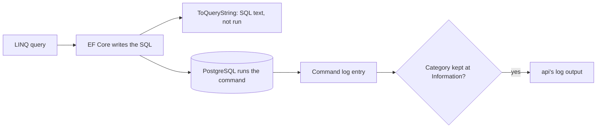

## Before you start

- [[backend.l2.indexes-and-plans]] — you can put `EXPLAIN ANALYZE` in front of a statement and read the plan PostgreSQL chose for it.
- [[backend.l1.structured-logging]] — you know a log entry carries named fields, not only a sentence, so a script can pick one entry out of many.
- [[backend.l1.querying-with-linq]] — you know EF Core turns a whole LINQ chain into one SQL statement when something like `ToListAsync()` runs it.

## The situation

A customer with many orders says the order list in the app loads slowly. The list comes from `GET /api/v1/orders`, and the data from `ListByCustomerAsync` in `EfOrderRepository`. One teammate wants to rewrite its LINQ. Another wants to run `EXPLAIN ANALYZE`, as you did in the previous lesson, but on what? Nobody on the team wrote the SQL for this list; EF Core did, from the LINQ, each time the endpoint runs. Before anyone changes code, you want to know: what SQL does EF Core really send for this list, and where can you read it?

## Core concepts

- Log category — the name a log entry is filed under, such as `Microsoft.EntityFrameworkCore.Database.Command`; configuration decides, per category, which entries are kept.
- Command log entry — the entry EF Core writes under `Microsoft.EntityFrameworkCore.Database.Command` after sending a command: how long it took, its parameters, then the SQL.
- Parameter — a placeholder in the SQL, such as `@customerId`, whose value travels to PostgreSQL next to the SQL text rather than inside it.
- Sensitive data logging — an EF Core option that writes parameter values into the log instead of hiding them.
- `ToQueryString()` — a method on a LINQ query that returns, as a string, a debugging view of the SQL EF Core would send for it, without running it.

## How it works



In the situation above, the LINQ query is the one in `ListByCustomerAsync`. When `ToListAsync()` runs it, EF Core writes one SQL command and sends it. After the command has run, EF Core writes a command log entry under the category `Microsoft.EntityFrameworkCore.Database.Command`, at `Information`. The entry says how long the command took, lists its parameters, and then prints the SQL itself.

Whether you ever see that entry depends on configuration. Each entry has a severity, and `Information` is less severe than `Warning`, so a category set to `Warning` drops `Information` entries. `Logging:LogLevel` in `appsettings.json` maps category names to the least severe entries they keep. A name there matches every category whose name starts with it, and when several names match, the longest one wins, so a setting for `Microsoft.EntityFrameworkCore.Database.Command` beats one for `Microsoft.EntityFrameworkCore`.

The parameters show up with `?` where their values would be. The values were sent; EF Core leaves them out of logs by default because they can hold personal data, such as a customer's email. Sensitive data logging puts them in, which is why it belongs on a developer's machine only.

`ToQueryString()`, the branch in the diagram that stops before PostgreSQL, is the other way to see the SQL. Called on a query instead of running it, it returns a debugging view of the SQL EF Core would send, with each parameter and its value listed in comment lines above it. Nothing reaches PostgreSQL; you print or log the string yourself.

Either way, the SQL you get is what you hand to `EXPLAIN ANALYZE`, after replacing each parameter with a real value.

## In the Đơn Hàng system

`DonHang.Api/appsettings.json` sets `"Microsoft.EntityFrameworkCore": "Warning"`, so the api keeps no command log entries by default. The `api` entry of the lab's `docker-compose.yml` raises only the command category, through an environment variable:

```yaml file=docker-compose.yml tag=stage-2 lines=124-127
      # lesson: backend.l2.efcore-generated-sql
      # appsettings.json keeps Microsoft.EntityFrameworkCore at Warning; the lab
      # raises only the category that logs each SQL command EF Core sends.
      Logging__LogLevel__Microsoft.EntityFrameworkCore.Database.Command: "Information"
```

In an environment variable name, `__` stands for the `:` of a configuration key, so this is `Logging:LogLevel:Microsoft.EntityFrameworkCore.Database.Command`. It is the longer matching name, so it wins over the `Warning` from `appsettings.json` for this one category. The rest of EF Core stays at `Warning`.

`scripts/backend/efcore-sql.sh` signs in as customer 3, asks for one page of orders with `after=5&limit=20`, then reads the api's log:

```bash file=scripts/backend/efcore-sql.sh tag=stage-2 lines=16-25
# lesson: backend.l2.efcore-generated-sql
# Each command EF Core sends is one log entry under this category: how long
# it took, its parameters (their values hidden as '?'), then the SQL itself.
echo "what EF Core logged for it:"
sleep 1 # let the api's logger write the entry out first
# From stage-2 the api logs one JSON object per line (devops.l2.json-logs);
# jq, from the lab box, prints the entry's level, category and message.
docker compose logs --no-log-prefix --since 1m api \
  | grep '"Category":"Microsoft.EntityFrameworkCore.Database.Command"' | grep 'FROM orders' | tail -n 1 \
  | docker compose exec -T lab jq -r '"\(.LogLevel): \(.Category)[\(.EventId)]\n\(.Message)"'
```

It keeps the last command entry that mentions `FROM orders` and prints its category and message through jq, a tool in the lab's container that picks fields out of a JSON line; the lab is the set of containers `scripts/up.sh` starts. The duration, masked as `...` here, changes on every run:

```text output=true
GET /api/v1/orders?after=5&limit=20 as customer 3:
[{"id":6,"status":"new","customerName":"Lê Quốc Dũng"},{"id":7,"status":"shipped","customerName":"Lê Quốc Dũng"}]

what EF Core logged for it:
Information: Microsoft.EntityFrameworkCore.Database.Command[20101]
Executed DbCommand (...ms) [Parameters=[@customerId='?' (DbType = Int32), @afterId='?' (DbType = Int32), @p='?' (DbType = Int32)], CommandType='Text', CommandTimeout='30']
SELECT o0.id, o0.status, c.full_name
FROM (
    SELECT o.id, o.customer_id, o.status
    FROM orders AS o
    WHERE o.customer_id = @customerId AND o.id > @afterId
    ORDER BY o.id
    LIMIT @p
) AS o0
INNER JOIN customers AS c ON o0.customer_id = c.id
ORDER BY o0.id
```

`Executed DbCommand (...ms)` is the time the command took. Three parameters follow, each `'?'`, and then the SQL; the number 20101, each `DbType`, `CommandType` and `CommandTimeout` can be left aside here. It is not the query most people would type for "customer 3's orders with their name": EF Core pages `orders` in an inner query and joins `customers` to that page outside it.

To see how PostgreSQL plans it, replace `@customerId` with 3, `@afterId` with 5 and `@p` with 20, the values from the request, and run the result after `EXPLAIN ANALYZE` in psql, PostgreSQL's command-line client, on the `donhang` database the api uses: `docker compose exec lab psql --host db --username donhang --dbname donhang` opens it from the root folder of the example repository. The plan you read is then for the query your code sends, not one you guessed.

## Beginners often think…

- **"When a LINQ query is slow, the problem is in the C# code, so the API is the place to look first."** → Actually a LINQ query runs in PostgreSQL as SQL that EF Core wrote, and the command log says how long that part took, so read the SQL and its time before changing the C#. You notice this when the `Executed DbCommand` time in the log accounts for most of a slow request.
- **"The `?` in the logged SQL means EF Core sent the query without the values."** → Actually the values travel with the command and only the log hides them, because they can be personal data. You notice this when the response holds exactly the orders the request asked for, while every parameter in the log still reads `'?'`.
- **"EF Core sends exactly the SQL I would have written by hand for the same LINQ."** → Actually EF Core chooses its own shape and short names, such as the inner query it calls `o0` above. You notice this when the plan shows steps for a query you never wrote, and only the logged SQL explains them.

## Try it (3 minutes)

1. With the example system running (`scripts/up.sh`), run `scripts/backend/efcore-sql.sh` from the root folder of the example repository.
2. In the script, change `limit=20` to `limit=1` in both lines that mention `orders?after=5&limit=20`, the `echo` and the `curl`, run it again, and compare the two log entries. Change the lines back afterwards.

Expected result: the second response holds one order, `{"id":6,"status":"new","customerName":"Lê Quốc Dũng"}`, yet the logged SQL is the same text as before and the parameters still read `@customerId='?'`, `@afterId='?'` and `@p='?'`. The value 1 reached PostgreSQL as a parameter; only the log left it out.

## Connections

- [[backend.l2.indexes-and-plans]] — prerequisite: the logged SQL, with its values filled in, is what you put after `EXPLAIN ANALYZE`.
- [[backend.l1.efcore-n-plus-one]] — the command log is also how N+1 shows itself: many entries for one request where you expected one.
- [[backend.l2.no-tracking-queries]] — next: a change that saves work inside the API while the logged SQL stays the same.
- [[backend.l2.projection-queries]] — how `ListByCustomerAsync` came to select only the three columns in this SQL.

## Five-line summary

1. Before guessing why an EF Core query is slow, read the SQL it really sends.
2. EF Core logs each command, with its duration, parameters and SQL, under `Microsoft.EntityFrameworkCore.Database.Command` at `Information`.
3. Đơn Hàng keeps EF Core at `Warning` in `appsettings.json`; the lab's `docker-compose.yml` raises only that category for the `api`.
4. Parameter values show as `?` unless sensitive data logging is on, because they can hold personal data.
5. `ToQueryString()` returns a query's SQL without running it; filled-in SQL goes to `EXPLAIN ANALYZE`.
