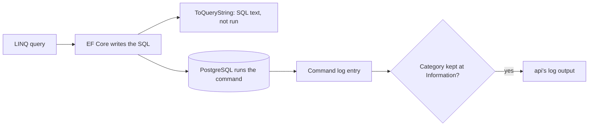

## Bạn cần biết trước

- [[backend.l2.indexes-and-plans]] — bạn biết đặt `EXPLAIN ANALYZE` trước một câu lệnh và đọc plan mà PostgreSQL chọn cho nó.
- [[backend.l1.structured-logging]] — bạn biết một entry log mang các trường có tên chứ không chỉ một câu văn, nên script có thể nhặt ra đúng một entry giữa rất nhiều entry.
- [[backend.l1.querying-with-linq]] — bạn biết EF Core biến cả chuỗi LINQ thành một câu SQL khi có thứ gì đó như `ToListAsync()` chạy nó.

## Tình huống

Một khách có nhiều đơn phàn nàn rằng danh sách đơn trong app tải chậm. Danh sách lấy từ `GET /api/v1/orders`, còn dữ liệu thì từ `ListByCustomerAsync` trong `EfOrderRepository`. Một đồng đội muốn viết lại đoạn LINQ của nó. Người khác muốn chạy `EXPLAIN ANALYZE` như bạn đã làm ở bài trước, nhưng chạy trên câu nào? Không ai trong đội viết SQL cho danh sách này. EF Core viết, từ đoạn LINQ, mỗi lần endpoint chạy. Trước khi ai sửa code, bạn muốn biết: EF Core thật sự gửi câu SQL nào cho danh sách này, và đọc nó ở đâu?

## Khái niệm cốt lõi

- Category của log — cái tên mà một entry log được xếp vào, ví dụ `Microsoft.EntityFrameworkCore.Database.Command`. Cấu hình quyết định, theo từng category, entry nào được giữ lại.
- Entry log lệnh — entry mà EF Core ghi dưới `Microsoft.EntityFrameworkCore.Database.Command` sau khi gửi một lệnh: lệnh mất bao lâu, các tham số của nó, rồi tới câu SQL.
- Tham số — một chỗ giữ chỗ trong câu SQL, như `@customerId`, có giá trị đi tới PostgreSQL bên cạnh câu SQL chứ không nằm trong câu.
- Sensitive data logging — một tùy chọn của EF Core ghi giá trị tham số vào log thay vì giấu đi.
- `ToQueryString()` — method trên một truy vấn LINQ, trả về dưới dạng chuỗi một bản xem để debug câu SQL mà EF Core sẽ gửi cho truy vấn đó, mà không chạy nó.

## Cơ chế hoạt động



Trong tình huống trên, truy vấn LINQ là truy vấn trong `ListByCustomerAsync`. Khi `ToListAsync()` chạy nó, EF Core viết một lệnh SQL rồi gửi đi. Sau khi lệnh chạy xong, EF Core ghi một entry log lệnh dưới category `Microsoft.EntityFrameworkCore.Database.Command`, ở mức `Information`. Entry cho biết lệnh mất bao lâu, liệt kê các tham số, rồi in chính câu SQL.

Bạn có thấy entry đó hay không là do cấu hình. Mỗi entry có một mức nghiêm trọng, và `Information` nhẹ hơn `Warning`, nên category đặt ở `Warning` sẽ bỏ các entry `Information`. `Logging:LogLevel` trong `appsettings.json` gán cho mỗi tên category mức nhẹ nhất mà nó còn giữ. Một tên ở đó khớp với mọi category có tên bắt đầu bằng nó, và khi nhiều tên cùng khớp thì tên dài nhất thắng. Vì vậy cài đặt cho `Microsoft.EntityFrameworkCore.Database.Command` thắng cài đặt cho `Microsoft.EntityFrameworkCore`.

Các tham số hiện ra với `?` ở chỗ lẽ ra là giá trị. Giá trị vẫn được gửi đi. EF Core mặc định để chúng ra ngoài log vì chúng có thể chứa dữ liệu cá nhân, như email của khách. Sensitive data logging đưa chúng vào log, nên chỉ nên bật nó trên máy của developer.

`ToQueryString()`, nhánh trong sơ đồ dừng lại trước PostgreSQL, là cách thứ hai để xem câu SQL. Gọi nó trên một truy vấn thay vì chạy truy vấn, nó trả về một bản xem để debug câu SQL mà EF Core sẽ gửi, với từng tham số và giá trị của nó nằm trong các dòng comment phía trên. Không có gì tới PostgreSQL. Bạn tự in hoặc tự log chuỗi đó.

Cách nào thì câu SQL bạn lấy được cũng là thứ đưa cho `EXPLAIN ANALYZE`, sau khi thay mỗi tham số bằng một giá trị thật.

## Trong hệ thống Đơn Hàng

`DonHang.Api/appsettings.json` đặt `"Microsoft.EntityFrameworkCore": "Warning"`, nên mặc định api không giữ entry log lệnh nào. Phần `api` trong `docker-compose.yml` của lab chỉ nâng riêng category của lệnh, bằng một biến môi trường:

```yaml file=docker-compose.yml tag=stage-2 lines=124-127
      # lesson: backend.l2.efcore-generated-sql
      # appsettings.json keeps Microsoft.EntityFrameworkCore at Warning; the lab
      # raises only the category that logs each SQL command EF Core sends.
      Logging__LogLevel__Microsoft.EntityFrameworkCore.Database.Command: "Information"
```

Trong tên biến môi trường, `__` thay cho dấu `:` của khóa cấu hình, nên đây là `Logging:LogLevel:Microsoft.EntityFrameworkCore.Database.Command`. Đó là tên khớp dài hơn, nên nó thắng mức `Warning` từ `appsettings.json` cho riêng category này. Phần còn lại của EF Core vẫn ở `Warning`.

`scripts/backend/efcore-sql.sh` đăng nhập là khách 3, xin một trang đơn với `after=5&limit=20`, rồi đọc log của api:

```bash file=scripts/backend/efcore-sql.sh tag=stage-2 lines=16-25
# lesson: backend.l2.efcore-generated-sql
# Each command EF Core sends is one log entry under this category: how long
# it took, its parameters (their values hidden as '?'), then the SQL itself.
echo "what EF Core logged for it:"
sleep 1 # let the api's logger write the entry out first
# From stage-2 the api logs one JSON object per line (devops.l2.json-logs);
# jq, from the lab box, prints the entry's level, category and message.
docker compose logs --no-log-prefix --since 1m api \
  | grep '"Category":"Microsoft.EntityFrameworkCore.Database.Command"' | grep 'FROM orders' | tail -n 1 \
  | docker compose exec -T lab jq -r '"\(.LogLevel): \(.Category)[\(.EventId)]\n\(.Message)"'
```

Script giữ entry lệnh cuối cùng có nhắc tới `FROM orders` và in category cùng nội dung của nó qua jq, một công cụ trong container của lab dùng để nhặt các trường ra khỏi một dòng JSON (lab là nhóm container mà `scripts/up.sh` khởi động). Thời lượng, ở đây bị che bằng `...`, đổi sau mỗi lần chạy:

```text output=true
GET /api/v1/orders?after=5&limit=20 as customer 3:
[{"id":6,"status":"new","customerName":"Lê Quốc Dũng"},{"id":7,"status":"shipped","customerName":"Lê Quốc Dũng"}]

what EF Core logged for it:
Information: Microsoft.EntityFrameworkCore.Database.Command[20101]
Executed DbCommand (...ms) [Parameters=[@customerId='?' (DbType = Int32), @afterId='?' (DbType = Int32), @p='?' (DbType = Int32)], CommandType='Text', CommandTimeout='30']
SELECT o0.id, o0.status, c.full_name
FROM (
    SELECT o.id, o.customer_id, o.status
    FROM orders AS o
    WHERE o.customer_id = @customerId AND o.id > @afterId
    ORDER BY o.id
    LIMIT @p
) AS o0
INNER JOIN customers AS c ON o0.customer_id = c.id
ORDER BY o0.id
```

`Executed DbCommand (...ms)` là thời gian lệnh đã chạy. Tiếp theo là ba tham số, cái nào cũng `'?'`, rồi tới câu SQL. Con số 20101, từng `DbType`, `CommandType` và `CommandTimeout` có thể tạm bỏ qua ở bài này. Đây không phải câu mà phần đông mọi người sẽ gõ cho "các đơn của khách 3 kèm tên khách": EF Core chia trang `orders` trong một truy vấn con, rồi JOIN `customers` với trang đó ở bên ngoài.

Để xem PostgreSQL lập plan cho nó ra sao, thay `@customerId` bằng 3, `@afterId` bằng 5 và `@p` bằng 20, đúng các giá trị của request, rồi chạy kết quả sau `EXPLAIN ANALYZE` trong psql, client dòng lệnh của PostgreSQL, trên database `donhang` mà api dùng. Lệnh `docker compose exec lab psql --host db --username donhang --dbname donhang` mở psql từ thư mục gốc của repo ví dụ. Plan bạn đọc khi đó là plan của truy vấn mà code thật sự gửi, không phải một câu bạn đoán.

## Người mới hay nghĩ rằng…

- **"Khi một truy vấn LINQ chậm, vấn đề nằm ở code C#, nên API là chỗ cần xem trước."** → Thực ra một truy vấn LINQ chạy trong PostgreSQL dưới dạng câu SQL do EF Core viết, và log lệnh cho biết phần đó mất bao lâu, nên hãy đọc câu SQL và thời gian của nó trước khi sửa C#. Bạn sẽ nhận ra khi thời gian `Executed DbCommand` trong log chiếm gần hết một request chậm.
- **"Dấu `?` trong câu SQL của log nghĩa là EF Core gửi truy vấn mà không kèm giá trị."** → Thực ra giá trị đi cùng lệnh, chỉ có log giấu chúng đi, vì chúng có thể là dữ liệu cá nhân. Bạn sẽ nhận ra khi response trả đúng những đơn mà request hỏi, trong khi mọi tham số trong log vẫn là `'?'`.
- **"EF Core gửi đúng câu SQL mà tôi sẽ tự viết tay cho cùng đoạn LINQ."** → Thực ra EF Core tự chọn hình dạng và tên ngắn của nó, như truy vấn con mà nó gọi là `o0` ở trên. Bạn sẽ nhận ra khi plan có những bước cho một truy vấn bạn chưa từng viết, và chỉ câu SQL trong log mới giải thích được chúng.

## Thử ngay (3 phút)

1. Khi hệ thống ví dụ đang chạy (`scripts/up.sh`), chạy `scripts/backend/efcore-sql.sh` từ thư mục gốc của repo ví dụ.
2. Trong script, đổi `limit=20` thành `limit=1` ở cả hai dòng có nhắc tới `orders?after=5&limit=20`, tức dòng `echo` và dòng `curl`, chạy lại rồi so hai entry log. Sau đó đổi các dòng về như cũ.

Kết quả mong đợi: response lần hai chỉ có một đơn, `{"id":6,"status":"new","customerName":"Lê Quốc Dũng"}`, vậy mà câu SQL trong log vẫn y hệt lần trước và các tham số vẫn là `@customerId='?'`, `@afterId='?'` và `@p='?'`. Giá trị 1 đã tới PostgreSQL dưới dạng tham số, chỉ có log là bỏ nó ra.

## Liên hệ

- [[backend.l2.indexes-and-plans]] — bài tiên quyết: câu SQL trong log, sau khi điền giá trị, chính là thứ bạn đặt sau `EXPLAIN ANALYZE`.
- [[backend.l1.efcore-n-plus-one]] — log lệnh cũng là nơi N+1 tự lộ ra: nhiều entry cho một request trong khi bạn chỉ chờ một.
- [[backend.l2.no-tracking-queries]] — bài tiếp theo: một thay đổi giúp API bớt việc bên trong nó, trong khi câu SQL trong log vẫn như cũ.
- [[backend.l2.projection-queries]] — vì sao `ListByCustomerAsync` chỉ chọn đúng ba cột trong câu SQL này.

## Tóm tắt 5 dòng

1. Trước khi đoán vì sao một truy vấn EF Core chậm, hãy đọc câu SQL mà nó thật sự gửi.
2. EF Core log mỗi lệnh, kèm thời gian, tham số và câu SQL, dưới `Microsoft.EntityFrameworkCore.Database.Command` ở mức `Information`.
3. Đơn Hàng giữ EF Core ở `Warning` trong `appsettings.json`, còn `docker-compose.yml` của lab chỉ nâng riêng category đó cho `api`.
4. Giá trị tham số hiện thành `?` trừ khi bật sensitive data logging, vì chúng có thể chứa dữ liệu cá nhân.
5. `ToQueryString()` trả về câu SQL của truy vấn mà không chạy nó, còn câu SQL đã điền giá trị thì đưa cho `EXPLAIN ANALYZE`.
