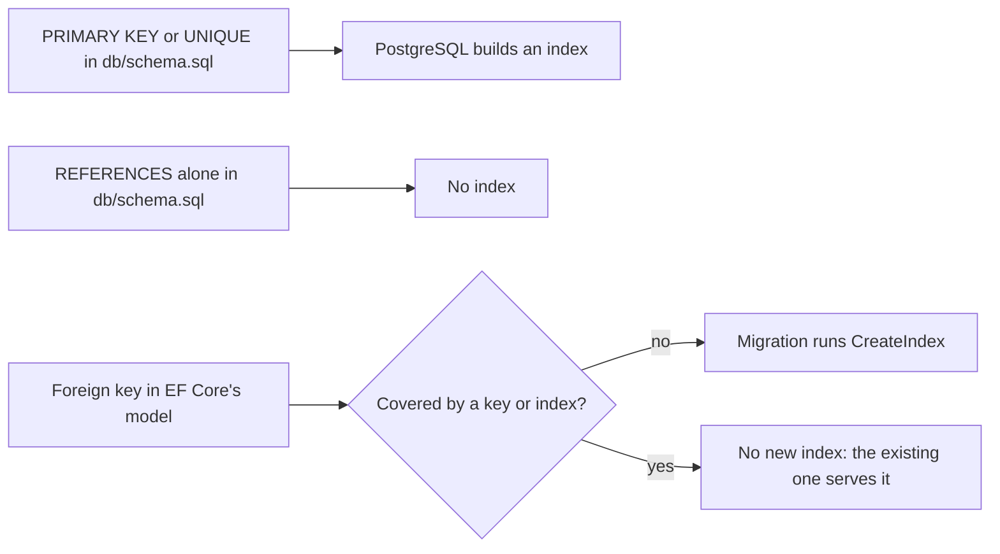

## Before you start

- [[backend.l2.indexes-and-plans]] — you can read a plan and see whether a step searched an index or read the whole table.
- [[backend.l1.migrations]] — you know `db/schema.sql` built Đơn Hàng's tables once, and every schema change since is a migration that `Migrate()` applies.
- [[backend.l1.efcore-n-plus-one]] — you met `.Include(o => o.Customer)`, which only works because `Order.Customer` is mapped as a relationship.

## The situation

You are adding a page that lists the payments of one order, so the new query filters `payments` by `order_id`. In review, a teammate writes: "`order_id` is a foreign key, so it already has an index." Another teammate disagrees: `db/schema.sql` never says `CREATE INDEX`, so nothing in Đơn Hàng has an index except the primary keys. Yet the migrations folder holds a file that creates `IX_orders_customer_id`, a name nobody on the team typed. Both teammates sound sure, and they cannot both be right. Which of Đơn Hàng's foreign keys have an index, and what created each one?

## Core concepts

- Index on a foreign key — an index whose columns are the referencing columns, such as `orders.customer_id`; it lets PostgreSQL find the rows that point at one parent row without reading the whole table.
- EF Core's model — what EF Core knows about the classes it maps to tables, called entities, and about their keys and relationships; it is built from those classes and from `OnModelCreating` in `DonHangDbContext`, the class that holds Đơn Hàng's mapping, and migrations are generated from it.
- Convention — a rule EF Core applies to the model on its own, without a line of configuration asking for it.
- Covered — a foreign key is covered when an existing key or index already starts with the foreign key's columns, so another index would add nothing. An index is sorted by its first column first, so it can find rows by that column; why its later columns do not count the same way is the next lesson's subject.

## How it works



In the situation above, the indexes come from two places, and neither is "every foreign key gets one".

The first place is PostgreSQL itself. When a table declares a `PRIMARY KEY` or a `UNIQUE` constraint, a rule that no two rows share a value, PostgreSQL creates a unique index, one that refuses duplicate values, to enforce it. A `REFERENCES` clause is different: PostgreSQL checks the foreign key, but it does not create an index on the referencing columns. Indexing them is left to you, because not every foreign key needs one: every index adds work to writes on its table, which an index that is rarely searched may not pay back.

The second place is EF Core. By convention, EF Core adds an index to its model for the columns of each foreign key it knows about. When you add a migration, EF Core compares the model with the previous one and writes a `CreateIndex` call for that new index. EF Core skips the index when the foreign key is covered, for example when the table's primary key already starts with the foreign key's column.

The convention only sees the model. A foreign key that exists in the database but not in EF Core's model gets no index from EF Core, and PostgreSQL adds none either. So the C# code does not list every index the database has, and it does not list every foreign key either.

## In the Đơn Hàng system

Three of the tables in `db/schema.sql` that reference another table:

```sql file=db/schema.sql tag=stage-1 lines=18-40
CREATE TABLE orders (
    id          integer GENERATED BY DEFAULT AS IDENTITY PRIMARY KEY,
    customer_id integer NOT NULL REFERENCES customers (id),
    placed_at   timestamptz NOT NULL,
    status      text NOT NULL
                CHECK (status IN ('new', 'paid', 'shipped', 'cancelled'))
);

CREATE TABLE order_items (
    order_id       integer NOT NULL REFERENCES orders (id),
    product_id     integer NOT NULL REFERENCES products (id),
    quantity       integer NOT NULL CHECK (quantity > 0),
    unit_price_vnd integer NOT NULL CHECK (unit_price_vnd > 0),
    PRIMARY KEY (order_id, product_id)
);

CREATE TABLE payments (
    id         integer GENERATED BY DEFAULT AS IDENTITY PRIMARY KEY,
    order_id   integer NOT NULL REFERENCES orders (id),
    paid_at    timestamptz NOT NULL,
    amount_vnd integer NOT NULL CHECK (amount_vnd > 0),
    method     text NOT NULL CHECK (method IN ('card', 'bank_transfer', 'cod'))
);
```

From this file alone, PostgreSQL built one index per `PRIMARY KEY`, including `(order_id, product_id)` for `order_items`, and one for `customers.email`, declared `UNIQUE` above this excerpt. The `REFERENCES` clauses on `orders.customer_id`, `order_items.order_id`, `order_items.product_id` and `payments.order_id` built none. So when `db/schema.sql` ran, `orders.customer_id` had no index.

At stage-1, its index came from a migration. `Order.Customer` is a navigation, a property that holds the related object. When it was mapped with `HasOne(o => o.Customer)` in `DonHangDbContext`, the foreign key entered EF Core's model; `HasOne` and `HasMany` are the calls there that tell EF Core two entities are related through a foreign key. The `AddOrderCustomerNavigation` migration that `migrations add` then wrote contains this call:

```csharp file=DonHang.Infrastructure/Migrations/20260924092625_AddOrderCustomerNavigation.cs tag=stage-1 lines=13-16
            migrationBuilder.CreateIndex(
                name: "IX_orders_customer_id",
                table: "orders",
                column: "customer_id");
```

Nobody wrote `HasIndex` for `CustomerId`; the only `HasIndex` in `DonHangDbContext` at this tag is the unique one on `Email`. The `CreateIndex` above is the convention at work, and `IX_orders_customer_id` is the name EF Core gives it: `IX_`, the table, then the column.

`order_items` shows the skip. In `InitialCreate`, the `order_items` table gets its composite key `(order_id, product_id)` and a foreign key from `order_id` to `orders`, and no `CreateIndex` for `order_id` follows. The key already starts with `order_id`, so EF Core counts the foreign key as covered. `InitialCreate` never ran against the example system's database, since `MigrationBaseline` only marked it applied, but it still records what EF Core's model held.

`payments.order_id` shows the gap. The `Payment` class has an `OrderId` property, but no navigation and no `HasOne` or `HasMany` connects it to `Order`. For EF Core it is a plain integer column, not a foreign key, so no migration indexes it. The foreign key lives only in `db/schema.sql`, and the payments query from the situation starts with no index to use.

## Beginners often think…

- **"`orders.customer_id` has had an index since stage-0, because it is a foreign key."** → Actually the `REFERENCES` clause in `db/schema.sql` created only the foreign key; the index arrived at stage-1 with the `AddOrderCustomerNavigation` migration. You notice this when you search `db/schema.sql` for `INDEX` and find nothing, although the `AddOrderCustomerNavigation` migration creates `IX_orders_customer_id`.
- **"EF Core only creates the indexes I write with `HasIndex`."** → Actually EF Core also adds an index for each foreign key in its model by convention. You notice this when `migrations add` for a new navigation writes a `CreateIndex` that no `HasIndex` asked for, as in `AddOrderCustomerNavigation`.
- **"`order_items` needs its own index on `order_id`, since every foreign key needs one."** → Actually the primary key's index on `(order_id, product_id)` already starts with `order_id`, so EF Core treats the foreign key as covered. You notice this when `InitialCreate` declares the `order_items` foreign key and no `CreateIndex` for it, and the database lists only the key's index for that table.

## Try it (3 minutes)

1. From the Đơn Hàng project's root folder, with the example system running (`scripts/up.sh`), list the indexes of two tables: `docker exec donhang-db psql -U donhang -d donhang -c "SELECT indexname, indexdef FROM pg_indexes WHERE tablename IN ('order_items', 'payments') ORDER BY indexname;"`. `pg_indexes` is a view, a stored query PostgreSQL lets you read like a table, with one row per index.
2. For each foreign key column in the `order_items` and `payments` tables of `db/schema.sql`, decide which listed index, if any, starts with it.

Expected result: two rows. `order_items_pkey` is a unique index on `(order_id, product_id)`, and `payments_pkey` is a unique index on `(id)`. Both came from a `PRIMARY KEY`. `order_items.order_id` starts the first one; `order_items.product_id` is only its second column, and `payments.order_id` starts none, so a query that filters `payments` by `order_id` has no index to search.

## Connections

- [[backend.l2.indexes-and-plans]] — prerequisite: how to see in a plan whether a query used an index.
- [[backend.l1.migrations]] — prerequisite: where `CreateIndex` calls come from and how they reach the database.
- [[backend.l1.efcore-n-plus-one]] — the `Order.Customer` navigation whose mapping brought `IX_orders_customer_id` with it.
- [[backend.l2.composite-indexes]] — next: why an index's first column decides what it can serve, and the index that replaces `IX_orders_customer_id`.

## Five-line summary

1. PostgreSQL never indexes a foreign key for you; EF Core indexes each foreign key in its model unless a key or index covers it.
2. PostgreSQL creates a unique index for every `PRIMARY KEY` and `UNIQUE` constraint and none for `REFERENCES`, so `db/schema.sql` left `orders.customer_id` unindexed.
3. Mapping `Order.Customer` put the foreign key in EF Core's model, and its migration created `IX_orders_customer_id` by convention.
4. EF Core skips the index when a key or index already starts with the foreign key's columns, as `order_items`' key does.
5. `payments.order_id` is a foreign key only in `db/schema.sql`, so no migration indexed it; C# code does not list every index.
